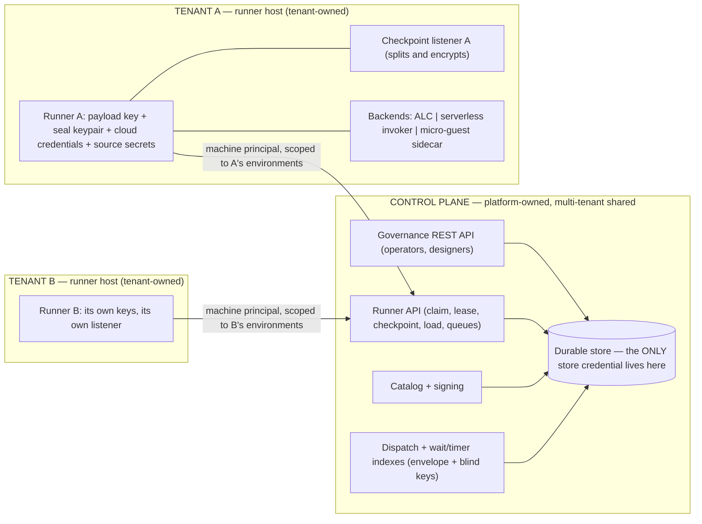
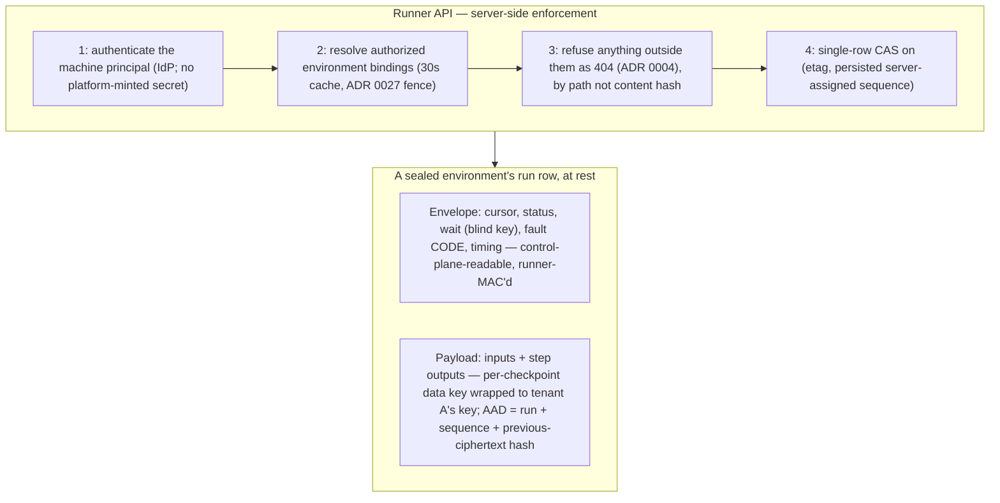

# ADR 0065. The control plane owns the store and fronts all checkpointing; runners encrypt the checkpoint payload

Date: 2026-08-01 (rewritten twice the same day: the first version sealed whole checkpoints away from the control plane, which broke governance and was reverted before release; this version was then revised against an adversarial security review, whose findings are folded into the decisions and recorded at the end). Status: **Accepted**. Scope: the trust model between the control plane and runners in a multi-tenant deployment — who owns the durable store, how runners reach it, what each party can read and forge, and how tenants are separated on shared control-plane infrastructure. Revises the two-process shared-store topology ([ADR 0023](0023-two-process-store-as-queue.md)) and the checkpoint-listener deployment shape ([ADR 0062](0062-authenticated-serverless-checkpoint-callbacks.md)); builds on fail-closed non-disclosing enforcement ([ADR 0004](0004-fail-closed-non-disclosing-enforcement.md)), the security-posture enum ([ADR 0016](0016-control-plane-security-mode.md)), the resume-mode taxonomy ([ADR 0022](0022-resume-mode-taxonomy.md)), runner-to-environment binding ([ADR 0027](0027-runner-environment-binding.md)), and the runner-as-secure-boundary model ([ADR 0059](0059-serverless-deploy-runs-on-the-runner-as-the-secure-boundary.md)).

## Context

A security review of the store seam (2026-08-01) found the implemented model assumed one trust domain around the shared durability store, which is wrong for the intended deployment: **runners are owned by tenants**, checkpoints carry tenant data, and yet the control plane and every runner held full store credentials under one shared at-rest key, with the environment fences enforced by store-layer code running inside each runner's own process — real against bugs, voluntary against a hostile runner. One hostile runner credential could read every environment's run state, tamper with any run, rewrite another environment's deployment records, and forge registry rows.

Two principles must hold at once:

1. **Tenant run data is isolated absolutely** — unreadable by platform operators, by backups, and by other tenants, through key custody rather than policy code.
2. **The control plane governs every run.** Detail, cancel, resume, faulted-resume, purge, and audit are control-plane verbs over *all* runs. A design that blinds the control plane to run structure breaks the product; the first cut of this ADR did exactly that and was reverted.

The reconciliation splits on what each party needs. The control plane needs the run's *management structure* — where the run is, what it awaits, how it failed, when it moved. It does not need the tenant's *data* — the values flowing through the workflow. The runner needs both and already holds the tenant's keys for everything else.

## Decision

**1. The control plane owns the durable store exclusively; runners hold no store credentials.** ADR 0023's "two processes sharing the store" is revised: the store-as-queue survives, but inside the control plane's boundary. Everything a runner did against the store — claim, lease renew and release, checkpoint save and load, timer and message queries, registry heartbeat, catalog artifact pull, deployment queue — becomes an operation on a **runner API** the control plane serves, deployed as a separately scalable component sharing the store with the governance API (preserving ADR 0023's real point: execution load never rides the governance request path). Every checkpoint pays a runner-to-control-plane round trip; the write already crossed a network, and interim writes stay fire-and-forget with the terminal write awaited.

**2. Runners authenticate as their own machine principals; separation is enforced server-side.** No new bearer credential is minted. A runner authenticates with the machine principal it already has (client-credentials, private-key JWT, or mTLS through the deployment's IdP), so there is no long-lived platform-issued secret to steal from a decommissioned host; environment bindings are resolved per request and re-checked with a bounded cache (≤30 seconds), so the ADR 0027 revocation fence takes effect within that window. Registration hardens accordingly: `runners:register` is reach-scoped **per environment** (never the system context), an authorization row must exist before any registry row is written — so a foreign principal cannot squat a victim's runner id and lock them out of registering — and pre-authorization binds an expected principal or a short-TTL one-time enrolment token rather than a bare, guessable id.

**3. Refusals are non-disclosing (ADR 0004).** An operation naming a run, artifact, or row outside the runner's bindings returns `404`, indistinguishable from a nonexistent one; only a capability failure returns `403`. Catalog artifacts are authorized **by path** (bound environment → deployment → version → package), never by bare content hash — a content-addressed pull would otherwise let any runner read a colliding package and probe whether another tenant runs a given workflow. Per-tenant aggregate quotas bound abuse (a registered-runner cap per environment, per-runner sub-limits, a checkpoint body-size cap, and a checkpoints-per-run-per-minute cap, since that path is guest-driven).

**4. The checkpoint is one row with a clear envelope and an encrypted payload, written under a single compare-and-swap.** The **envelope** is run-management structure: cursor, status, wait, fault *classification*, retry counters, sequencing, timing, and the journal skeleton. The **payload** is tenant data: run inputs, step outputs, extracted values, and the journal's data content. Envelope and payload are never separate writes — one row, one CAS on (etag, persisted sequence) — so a control-plane envelope mutation can never interleave with a runner payload write and leave the two inconsistent, and the sole-writer invariant rests on the store's CAS plus a server-side lease check rather than on any process-local serialization in a horizontally scaled API.

The envelope's contents are constrained so it cannot become a data channel:

- **Fault**: a closed-vocabulary classification code plus `stepId` and `attempt`. The free-text failure description and any provider error body are payload. A conformance test rejects any envelope field that is not a controlled-vocabulary token, an identifier, or a timestamp.
- **Waits**: the stored match key is a **blind index** — `HMAC-SHA256(HKDF(payloadKey, "wait-index" ‖ keyId), channel ‖ correlationId)` — written *and queried* by runners (both sides hold the environment key, so there is no bootstrapping problem). The plaintext correlation id lives in the payload. Correlation ids are business keys — order id, case id, customer reference — and treating them as envelope was a real leak in the old model.
- **Tags and security tags** stay platform-visible by construction; the guides say so plainly, so tenants do not put business data in them.

**5. Payload encryption is envelope encryption under a per-checkpoint data key.** The environment's payload key is a **wrapping** key, never a direct AES-GCM key: each checkpoint generates a fresh data key, encrypts the payload with it, and stores the wrapped key alongside (the existing `EnvelopeCheckpointProtector` framing). A long-lived symmetric key used directly, written concurrently by every runner bound to an environment, would approach the GCM birthday bound — and a single nonce reuse forfeits the authentication key that the entire anti-forgery argument rests on.

**6. Freshness is a persisted, server-assigned sequence plus a payload hash chain.** AAD binding alone is not freshness: serving an old checkpoint together with its own matching envelope verifies perfectly. Therefore the sequence is **assigned and persisted server-side** (returned to the runner on acceptance; a guest-supplied sequence header is advisory only, and no nonce is ever derived from a guest-influenced value), it is part of the CAS predicate, and it is never an in-memory authority. Each payload's AAD binds `(runId, sequence, previousPayloadCiphertextHash)` — a chain, not a position — and the runner refuses to open a checkpoint whose chain parent it did not just write. Binding position through the chain rather than the cursor also means an operator rewind (ADR 0022) does not detonate the payload. **Residual, stated plainly**: a control plane that rolls the whole row back is *detected* at the runner's next open, not prevented; prevention needs a tenant-side chain-tip anchor, which is deferred and tracked.

**7. Runner-authored envelope state is authenticated; control-plane writes are requests, not authority.** The runner emits a detached MAC over the canonicalized runner-authored region of the envelope under a subkey of the payload key, and verifies it on every open. Control-plane-authored fields — cancel, resume request, purge marker, and the runner-mediated resume verbs below — are *requests* the runner validates against its own MAC'd state. Without this, a compromised control plane could clear retry counters or release a wait and force duplicate execution of non-idempotent steps against the tenant's own systems: that reaches into tenant production, and calling it "metadata" would be wrong.

**8. Resume modes split by who can touch payload (ADR 0022).** Faulted-step retry and rewind remain control-plane verbs over the envelope. State-patch and skip-with-outputs mutate run inputs and step outputs, which are payload: for a sealed environment the control plane records the requested mutation in the envelope and the environment's runner applies it inside its own boundary at next claim, re-encrypting. The operator experience stays on one surface; the application becomes asynchronous, and the console says so.

**9. Run-start inputs are sealed by the initiator, not by the control plane.** The initiating client (CLI, designer, or trigger host) fetches the environment's public seal key, **pins its fingerprint** (trust-on-first-use plus an operator-visible fingerprint the tenant verifies out of band), seals the inputs client-side, and submits ciphertext — so the control plane never holds plaintext inputs, in transit or at rest. Only the holder of the private half (the environment's runner) may register or rotate a seal key, and it re-asserts the current key id and fingerprint on every registration heartbeat, faulting loudly on mismatch; a runner refuses to open sealed inputs whose key id is not in its own ring. Without this, the control plane would both hold the plaintext and own the registry entry naming the key it seals to — it could substitute its own key, keep the plaintext, and re-seal to the genuine key with nothing detectable downstream.

**10. Sealing is decided runner-side and required in multi-tenant mode.** If a runner holds a payload key for an environment it always encrypts, whatever the environment record says; and the runner API refuses a cleartext payload for any environment whose record is sealed — the two checks fail closed in both directions, so clearing the record cannot silently downgrade an environment to plaintext harvesting. Un-sealing requires the same tenant-side proof as registering a key and is an audited event. Per ADR 0016's insecure-by-omission rule, under the multi-tenant production posture creating an environment **without** a registered payload-key id and seal key fails at creation; other postures allow unsealed environments but badge them as such on every environment and run view. The platform's own `system` environment (the control plane's governance workflows) is explicitly never sealed and its runner authorization is not reachable through the ordinary registration path: its runs are platform data, not tenant data.

**11. The checkpoint listener is tenant-owned runner infrastructure.** The serverless checkpoint listener terminates the guest's plaintext checkpoint, so it holds the payload key, performs the split-and-encrypt, and speaks the runner API — it never holds a store credential. ADR 0062's platform-shaped Container Apps deployment recipe is the pre-0065 topology; re-platforming the listener is phase-A work, because it is the one place a plaintext payload could otherwise cross into platform-operated infrastructure.

**12. Key lifecycle is defined, and purge is described accurately.** Rotation registers a new key id; payloads name the id they were written under and the runner's ring opens prior generations. A runner-driven **re-key sweep** (claim, open under the old id, re-seal under the new id at the current chain tip) retires a compromised generation, and a maximum generation lifetime is configured per environment. Purge removes the row including its payload; it does **not** erase what was never encrypted — the operator documentation states exactly which envelope and index fields survive, so purge is never presented as complete erasure of tenant data for a compliance request.

**13. Sequencing.** Phase A: the runner API, machine-principal authentication, non-disclosing refusals, the persisted server-assigned sequence and single-row CAS, the listener re-platforming, and the retirement of runner store credentials — landed seam by seam, each with conformance coverage proving foreign and revoked principals are refused indistinguishably from absent. Phase B: the envelope/payload split, envelope-encrypted payloads with the hash chain, the runner-authored MAC, blind wait indexes, client-side input sealing, and the runner-mediated resume verbs. Phase C, tracked separately: executor provenance under mutual distrust (tenant countersignature over authored content).

## Ownership



The control plane owns the store, the APIs, the catalog, dispatch, and every index — and holds no key that opens tenant data. Each tenant owns its runner host, its checkpoint listener, and every secret on them. The only path from a runner to durable state is the runner API.

## Tenant separation on shared infrastructure



Separation is layered, and each layer holds if the one above fails: a tenant's runner has no store credential to abuse; the API refuses cross-environment operations server-side and non-disclosingly; the payload is AEAD ciphertext under a key that never left its owner's custody; and the runner-authored envelope region is MAC'd, so platform tampering with orchestration state is detected rather than silently obeyed.

## The anatomy of an advance

```mermaid
sequenceDiagram
  participant I as Initiator (CLI / designer / trigger)
  participant CP as Control plane (runner API + store)
  participant R as Tenant runner + listener
  participant G as Guest (backend)
  participant S as Tenant source API
  I->>I: fetch and pin the environment seal-key fingerprint, seal inputs client-side
  I->>CP: start run (ciphertext inputs)
  R->>CP: claim (machine principal + environment authorization)
  R->>G: invoke (ALC call, function URL, or micro-VM restore)
  G->>S: source call(s)
  G->>R: checkpoint back (Model B, ADR 0062 — to the TENANT's listener)
  R->>R: split, encrypt payload (fresh data key, AAD chains to the previous ciphertext), MAC the envelope region
  R->>CP: save (server assigns and persists the sequence; single-row CAS)
  Note over CP: governance reads and acts on the ENVELOPE of every run; payload-touching resume verbs are recorded as requests the runner applies
```

## Adversarial security review

An independent review attacked the previous draft; every finding is either fixed in the decisions above or recorded here as an accepted residue. Fixed: checkpoint rollback through AAD-without-freshness (6), GCM nonce reuse under a long-lived directly-used key (5), seal-key substitution at registration (9), the nonexistent and squattable runner credential (2), payload-touching resume verbs claimed as working (8), correlation ids as clear envelope (4), free-text `errorType` as envelope (4), unauthenticated envelope enabling forced re-execution against tenant systems (7), seal downgrade by clearing the registration (10), the store-credentialed public checkpoint listener (11), guest-chosen and restarting sequences (6), `403`-versus-`404` existence oracles (3), content-hash catalog pulls as a cross-tenant read (3), process-local multi-writer serialization in a scaled API (4, 6), key re-keying and purge honesty (12), insecure-by-omission sealing (10), the `system` environment as a privilege boundary (10), and per-runner-only quotas (3).

Accepted residues, stated so nobody has to rediscover them:

- **Envelope metadata is visible to the platform, and for data-dependent workflows that includes the decision, not merely the shape.** A journal skeleton showing which branch ran discloses the outcome; retry counts disclose which dependency failed; step durations and payload ciphertext length disclose result sizes. Mitigations are opt-in for sealed environments (a reduced journal replacing step identity with an index into an encrypted step map, and length-bucket padding of payload ciphertext); governance degrades to counts, status, and timing when they are on.
- **Blind wait indexes still leak equality and frequency**: a deterministic MAC reveals that two runs await the same key, and how often a key recurs.
- **Rollback is detected, not prevented**, until a tenant-side chain-tip anchor exists.
- **The control plane remains trusted for orchestration integrity and for honest issuance of environment bindings.** It cannot forge payload or runner-authored envelope state, but it decides who is bound to what.
- **Availability inverts relative to ADR 0023.** The control plane is now on the hot path of every checkpoint of every tenant: an outage stalls all execution and expires leases. The runner API must therefore be scaled and available ahead of governance, leases must survive a blip without a mass re-claim storm, and — because interim saves are fire-and-forget over an *authenticated* hop — any non-2xx on an interim save fails the advance rather than being dropped, with credential refresh strictly ahead of expiry. Silent durable regression is not acceptable.

## Consequences

- The control plane governs every run with full envelope access — no verb is lost, though two resume modes become runner-applied for sealed environments — while tenant data stays confidential against the platform, other tenants, and backups by key custody.
- Runners lose their store credentials entirely, which dissolves the per-runner-database-role and row-level-security problem of the first design: there is no credential left to scope.
- ADR 0023 is revised, not discarded: the store stays the queue and the two-process split stays, but the runner's half speaks a versioned API — the new explicit seam, with a conformance isolation class exercising foreign, revoked, and cross-environment access.
- ADR 0062's deployment recipe is superseded for the listener's ownership; the listener moves inside the tenant boundary.
- Every advance pays a runner-to-control-plane hop per checkpoint. The execution-backend trade-offs guide's checkpoint-locality story changes for all backends uniformly (the micro-guest keeps only its guest-to-runner locality), and task #222's instrumentation measures the real cost.
- The checkpoint serialization gains the envelope/payload split and the chain, gated behind the environment's registration; unsealed environments stay byte-compatible with today, except that multi-tenant-mode deployments can no longer create one.
- The demo topology changes visibly: runners stop opening the shared database, and the AppHost wires runner-API addresses and machine-principal credentials instead of a connection string.