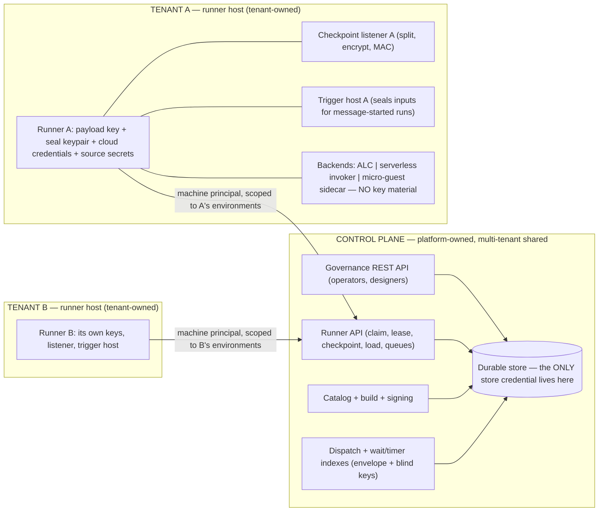
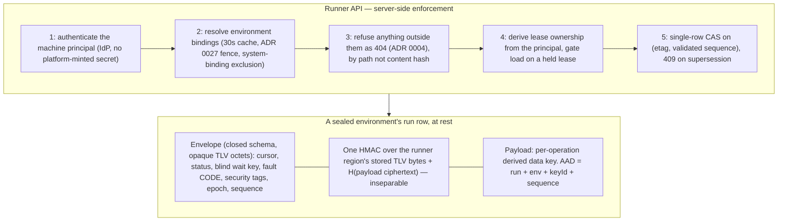
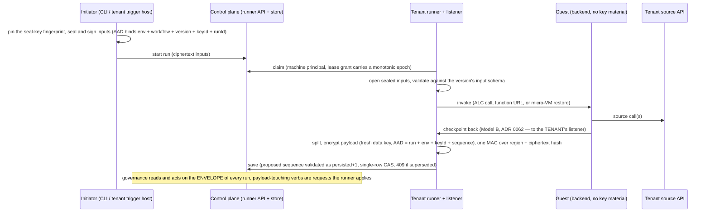

# ADR 0065. The control plane owns the store and fronts all checkpointing; runners encrypt the checkpoint payload

Date: 2026-08-01. Status: **Accepted**. Scope: the trust model between the control plane and runners in a multi-tenant deployment — who owns the durable store, how runners reach it, what each party can read and forge, and how tenants are separated on shared control-plane infrastructure. Revises the two-process shared-store topology ([ADR 0023](0023-two-process-store-as-queue.md)) and the checkpoint-listener deployment shape ([ADR 0062](0062-authenticated-serverless-checkpoint-callbacks.md)); builds on fail-closed non-disclosing enforcement ([ADR 0004](0004-fail-closed-non-disclosing-enforcement.md)), the security-posture enum ([ADR 0016](0016-control-plane-security-mode.md)), the resume-mode taxonomy ([ADR 0022](0022-resume-mode-taxonomy.md)), runner-to-environment binding ([ADR 0027](0027-runner-environment-binding.md)), canonical JSON ([ADR 0031](0031-content-hash-over-rfc8785-canonical.md)), and the runner-as-secure-boundary model ([ADR 0059](0059-serverless-deploy-runs-on-the-runner-as-the-secure-boundary.md)).

*Revision history: the first version sealed whole checkpoints away from the control plane, which broke governance and was reverted before release. The second inverted the topology as decided here. Five rounds of adversarial security review followed — each attacking the previous round's fixes as well as the design — and their findings are folded into the decisions below. What remains unfixed is listed as an accepted residue rather than left implicit.*

## Context

A security review of the store seam found the implemented model assumed one trust domain around the shared durability store, which is wrong for the intended deployment: **runners are owned by tenants**, checkpoints carry tenant data, and yet the control plane and every runner held full store credentials under one shared at-rest key, with the environment fences enforced by store-layer code running inside each runner's own process — real against bugs, voluntary against a hostile runner.

Two principles must hold at once:

1. **Tenant run data is isolated** — not readable by platform operators, backups, or other tenants, through key custody rather than policy code.
2. **The control plane governs every run.** Detail, cancel, resume, faulted-resume, purge, and audit are control-plane verbs over *all* runs. A design that blinds the control plane to run structure breaks the product; the first cut of this ADR did exactly that and was reverted.

The reconciliation splits on what each party needs. The control plane needs the run's *management structure* — where the run is, what it awaits, how it failed, when it moved. It does not need the tenant's *data* — the values flowing through the workflow. The runner needs both and already holds the tenant's keys for everything else.

**Nothing is shipped.** There is no deployed installation, no tenant data at rest, and no external consumer of the current wire or storage formats. This decision therefore carries no migration obligation and no compatibility hedge: the target design is built directly, the phases below are our own delivery sequencing rather than an upgrade path, and where an existing component contradicts this ADR (the checkpoint listener's deployment shape, the runner's store connection, the in-process draft runner) it is corrected rather than deprecated.

## Decision

**1. The control plane owns the durable store exclusively; runners hold no store credentials.** ADR 0023's "two processes sharing the store" is revised: the store-as-queue survives, but inside the control plane's boundary. Everything a runner did against the store — claim, lease renew and release, checkpoint save and load, timer and message queries, registry heartbeat, catalog artifact pull, deployment queue — becomes an operation on a **runner API** the control plane serves, deployed as a separately scalable component sharing the store with the governance API (preserving ADR 0023's real point: execution load never rides the governance request path). Interim checkpoint writes stay fire-and-forget with the terminal write awaited.

**2. Runners authenticate as their own machine principals; separation and lease ownership are enforced server-side.** No new bearer credential is minted: a runner authenticates with the machine principal it already has (client-credentials, private-key JWT, or mTLS through the deployment's IdP), so there is no long-lived platform-issued secret to steal from a decommissioned host. Environment bindings are resolved per request with a bounded cache (≤30 seconds), so the ADR 0027 revocation fence takes effect within that window. **Lease ownership derives from the authenticated principal** — a client-supplied owner string is rejected, every mutating operation presents its lease token, and revocation expires leases by principal, not by a self-asserted name a compromised runner could change. Registration hardens accordingly: `runners:register` is reach-scoped per environment (never the system context), an authorization row must exist before any registry row is written (so a foreign principal cannot squat a victim's runner id), and pre-authorization binds an expected principal or a short-TTL enrolment token rather than a bare, guessable id. **No principal may hold a `system` binding and a tenant binding simultaneously** — enforced when a binding is written and re-checked per request, because a principal holding both is a laundering route out of a sealed environment into the never-sealed platform one.

**3. Refusals are non-disclosing, and quotas are per tenant (ADR 0004).** An operation naming a run, artifact, or row outside the runner's bindings returns `404`, indistinguishable from a nonexistent one; only a capability failure returns `403`. The one exception is a runner holding a non-terminal anchor entry for the run it asked about: there, a `404` means the row was deleted or is being withheld, and the runner faults rather than treating it as a benign miss. Catalog artifacts are authorized **by path** (bound environment → deployment → version → package), never by bare content hash. Quotas are aggregate per tenant, not only per runner: a registered-runner cap per environment, a per-environment checkpoint rate, a total payload-bytes quota, a run-count cap, a parked-wait cap (blind index rows are high-entropy and undeduplicable), per-runner sub-limits, and a body-size cap. A quota rejection is a distinguishable retryable signal (`429`, runner-side hold and backoff) **exempt** from the fail-the-advance rule below, so a chatty legitimate workflow is not faulted mid-advance after its external calls have landed — but the exemption is **bounded** (a total hold time and an attempt cap per advance, after which the advance fails like any other non-2xx), and the `429` body names the quota and its counter. An unbounded exemption would be a silent, targeted stall primitive: a fabricated `429` is indistinguishable from a real one to the runner, the background renewer keeps the run's lease so it never fails over or faults, and the run sits holding external side effects it never checkpointed, with no audit event because a quota hold is routine.

**4. The checkpoint is one row: a clear envelope and an encrypted payload, verified as a whole.** The **envelope** is run-management structure — cursor, status, wait, fault classification, retry counters, sequencing, timing, journal skeleton, and security tags. The **payload** is tenant data — run inputs, step outputs, extracted values, journal data content. The envelope's runner-authored region and the payload are **cryptographically inseparable**: the runner computes one HMAC (under the `envelope-mac` subkey) over the runner-authored region's bytes *concatenated with the hash of the payload ciphertext*. A checkpoint verifies only as a whole — an envelope region from checkpoint *i* spliced onto the payload of checkpoint *j* fails the HMAC — and nothing else is needed for that property. (An earlier draft additionally had the payload's AEAD bind the tag, which is circular: the tag is a function of the ciphertext, so the ciphertext cannot be a function of the tag.)

The MAC input is the region's **stored bytes** under deterministic TLV framing, not a canonical re-serialization: the runner writes the region once in fixed property order and MACs exactly those bytes. There is no per-backend alternative — a MAC input that varies by backend would not survive the backend migration this ADR itself contemplates.

The envelope is a closed schema that rejects unknown members, and its contents are constrained so it cannot become a data channel:

- **Fault**: a closed-vocabulary classification code plus `attempt` and, for a sealed environment, the step-map index rather than the tenant-authored `stepId` (the same reason the journal uses one — an identifier is otherwise an unbounded free-text channel, and a fault is envelope data the control plane reads on every faulted run). Free-text failure descriptions and provider error bodies are payload.
- **Correlation**: *both* the wait match key and the run-level correlation id are blinded, under the `wait-index` subkey of the decision-5 table (which includes `environmentId` — without it, one tenant registering the same `keyId` in two environments derives one subkey and a message delivered to `staging` wakes a `prod` run, defeating environment pinning; the runner-side re-check does not catch that, because the index genuinely matches). The MAC input is length-framed — `len(channel) ‖ channel ‖ len(correlationId) ‖ correlationId` — so `("orders","123")` and `("order","s123")` cannot collide. Plaintext correlation ids live in the payload. A channel-only (wildcard) wait uses an explicit sentinel and is documented as leaking a per-channel constant; a sealed environment may forbid them. The store keys the index by `(environmentId, keyId, index)` so both generations match during a re-key roll, and the runner verifies that a run returned for a query actually carries the queried index in its MAC'd region before delivering a message to it.
- **Security tags** are stamped from the catalog version at run start and live in the runner-MAC'd region: the control plane reads them (they drive the ADR 0004 reach gate) but cannot rewrite a run into another operator group's reach without failing verification.
- **Identifiers** are length- and charset-bounded, and for a sealed environment the journal records an index into an encrypted step map rather than the tenant-authored `stepId` — mandatory, not opt-in, because an identifier is otherwise an unbounded free-text channel.
- **The AEAD algorithm id and key id** are inside the MAC'd region and the AEAD's own AAD. An unauthenticated algorithm selector is a downgrade primitive the moment a second algorithm exists, and answering "unsupported algorithm" differently from "authentication failed" is an oracle on an otherwise non-disclosing surface: both fault identically.

The **stored region is opaque octets**. No backend may parse, patch, or re-emit it — server-side JSON rewriting of the kind used elsewhere in this codebase (jsonb_set, JSON_MODIFY, a document store's own re-serialization) would silently destroy a byte-exact MAC. The runner submits only its own region and the crypto regions; the control-plane region is held and written by the server, joined at read time, and excluded from the MAC by construction rather than by convention, so neither party can rewrite the other's bytes.

**5. Payload encryption is envelope encryption under a per-encryption data key.** The environment's payload key is a **derivation** key, never a direct AES-GCM key: each encryption derives a fresh data key (see the table below), and the salt occupies the row region a wrapped key would. Wrapping survives only for a deployment whose payload key is non-exportable in an HSM, where the runner unwraps a per-run intermediate directly against the HSM into a `wrappedKey` row region; every wrap and unwrap there carries an encryption context of `(environmentId, runId, keyId)`, enforced by the protector conformance suite. The three per-generation subkeys are **always** derived from the environment payload key and never from a per-run intermediate, so an HSM deployment that cannot derive them is not a supported sealed-environment configuration.

Derivation is specified once, normatively, because four scattered statements of it in an earlier draft disagreed with each other. Every field is length-framed and every label is distinct; **`environmentId` is present in all five**, so two environments of one tenant that register the same `keyId` never collide:

| Label | Info |
|---|---|
| `data-key` | `len‖"data-key" ‖ len‖environmentId ‖ len‖keyId ‖ len‖runId ‖ uint64(sequence) ‖ salt` |
| `envelope-mac` | `len‖"envelope-mac" ‖ len‖environmentId ‖ len‖keyId` |
| `wait-index` | `len‖"wait-index" ‖ len‖environmentId ‖ len‖keyId` |
| `checkpoint-token` | `len‖"checkpoint-token" ‖ len‖environmentId ‖ len‖keyId` |

Without framing, `(keyId "k1", runId "0abc")` and `(keyId "k10", runId "abc")` derive the *same* key — and with a counter nonce that is a repeated `(key, nonce)` pair over different plaintexts, which yields the GCM authentication subkey and hence payload forgery. The three subkeys that omit `runId` are derived once per key generation and cached; only `data-key` is per encryption. The wait index is stored keyed by `(environmentId, keyId, index)`.

**A fresh 32-byte salt for every *encryption operation*, never per logical checkpoint and never per retry.** Re-encrypting after a `409` with a cached salt restarts the counter nonce under the same derived key: same trap, same break. A counter nonce is permitted only because this rule holds.

**6. Freshness is a validated sequence, a server-minted lease epoch, and a tenant-held anchor.** AAD binding alone is not freshness: an old checkpoint served with its own matching envelope verifies perfectly. Three mechanisms carry it, and a fourth from an earlier draft — a hash chain over the previous payload ciphertext — is **deliberately deleted**. There is one row per run, so the previous ciphertext no longer exists to check against; splicing is already caught by the unified MAC and rollback by the anchor, so the chain contributed no property while causing the re-encryption-on-`409` problem, the re-key sweep's tip hazard, and a genesis-link construction. The payload AAD is `(runId, environmentId, keyId, uint64(sequence))`.

- **Sequence**: the runner proposes `n`, the server accepts only `persisted + 1`, and the CAS predicate is `(etag, persistedSequence)`. The server *validates* rather than assigns, so the value is predictable to the writer at encryption time and authoritative in the store. The runner-authored region carries `n` inside the MAC, so a server that lies about acceptance is caught. A superseded save answers `409` with the accepted sequence — never a `204` indistinguishable from a durable write. **A retry is a byte-identical resend**: the runner retains the exact transmitted bytes for the in-flight sequence and resends them, because a fresh salt would otherwise produce different ciphertext for the same logical checkpoint. The row buffer is owned by the in-flight save and returned to the pool only once that sequence is acknowledged, superseded, or abandoned; at most one save per run is in flight, which the `persisted + 1` rule already guarantees.
- **Epoch**: the lease grant carries a **monotonic epoch the control plane can only increment**, minted server-side per grant, written by the runner into the MAC'd region, and combined with the store's **incarnation id** — a value advanced out of band on every restore or migration and never itself restored, without which a restore silently re-issues spent epochs. Two asymmetric rules use it: refuse a checkpoint whose epoch is *above* the current lease grant (a stale holder writing under a superseded grant), and refuse one *below* the run's high-water epoch (a rollback). The incarnation appears only here — not in key derivation, where a fresh per-operation salt already guarantees uniqueness.
- **Anchor**: the high-water mark must live where the control plane cannot rewrite it, so the tenant keeps one. It is a **tenant-owned, environment-scoped, replicated key-value record** — not runner-host-local, because leases fail over between hosts and a host-local anchor would brick every run its host was carrying — holding `runId → { epochHighWater, committed(epoch, sequence, digest), pending?(epoch, sequence, digest) }`, written under compare-and-swap over the whole record. **Every writer of a checkpoint writes it**: the runner, the tenant's checkpoint listener, the trigger host, and the re-key sweep.

  **The digest is what makes the anchor a commitment to a checkpoint rather than to a number.** An earlier draft deleted the payload hash chain and kept only `(epoch, sequence)`, which loses checkpoint *identity*: a save that is dispatched, reaches the control plane, and is answered `500` leaves the runner to discard its `pending` and re-execute, producing a second genuine row at the *same* `(epoch, sequence)` — and a control plane holding both can substitute the abandoned branch for the committed one, passing the MAC, the AEAD, and every ordering rule. That is a lateral substitution, invisible in a coordinate system made only of numbers.

  The digest is defined once, normatively, because it is now a checkpoint's identity: `digest = SHA-256(len‖"checkpoint-digest" ‖ runner region bytes ‖ MAC)` — computed over exactly the bytes the runner submits, never over the server-owned control-plane region (which is joined at read time and is not the runner's to commit to), and asserted by the protector conformance suite. An implementer who chose a narrower extent than the MAC input would reintroduce lateral substitution over the excluded bytes.

  **Anchor writes are gated on the lease.** The listener, the trigger host, and the re-key sweep write through the lease holder or present its lease token, and the record's CAS refuses any write whose `pending` or `committed` epoch is below `epochHighWater`, or whose `pending.sequence` is not `committed.sequence + 1`. Without that, a displaced holder can overwrite a newer holder's `pending` and drive the next open into a hard fault — a control-plane-triggerable brick. The single-flight property the write-ahead log depends on is a **client-side** rule (one undispatched save per run, per decision 1's coalescing), not the server's `persisted + 1` acceptance rule, which bounds what is *accepted* rather than what is *dispatched* — which is exactly why a `409` path exists.

  The record is a write-ahead log, and its states are what make honest failure recoverable rather than fatal:

  | Anchor | Store | Meaning | Action |
  |---|---|---|---|
  | `committed(e, n, d)`, no `pending` | at `n`, digest `d` | normal | proceed |
  | `pending(e, n+1, d')` | at `n+1`, digest `d'`, epoch `e` | the save landed, the acknowledgement was lost | promote `pending`, proceed |
  | `pending(e, n+1, d')` | at `n`, digest `d` | the save did not land | discard `pending`, proceed from `n` |
  | any | sequence below `committed`, or equal with a different digest | **rollback or substitution** | hard fault |
  | any | sequence above `committed` with no matching `pending` | anchor lost a write, or an unknown writer | hard fault |
  | `committed(e, n, d)` | row absent, or `404` | rollback to nothing, or purge of a live run | hard fault |
  | missing | beyond genesis | anchor lost | hard fault |

  In the steady state a promote follows the save's acknowledgement; at recovery time (table row 2) it requires the stored row to *match* the pending record on epoch **and** digest, so an acknowledgement that diverged from what was actually stored is caught at the next open by row 4. A promote never lowers `epochHighWater` — otherwise a runner could promote its own lower epoch over a higher-epoch row written by a second holder, re-opening the window the epoch exists to close. A missing entry is a fault rather than a licence to trust the row; trusting the row on a cold open is exactly what removes the detection.

  **Re-anchor** is the single recovery path, for a lost anchor and for a restore (where the store legitimately moves below every anchor). It is an operation, not a permission: the tenant operator is shown `(anchor committed, store epoch, store sequence, store digest, incarnation, and whether the store is below, lateral to, or above the anchor)`, signs that exact tuple with the operator key of decision 8, and the anchor is set to it. **A detected rollback or substitution within the same incarnation is not re-anchorable** — signing it away is blessing the attack, and a control plane that rolls a run back must not be able to make signing the only route back to liveness. Re-anchors are rate-limited and audited per run rather than capped at one per incarnation, so a second honest anchor incident is still recoverable.

  **The incarnation is tenant-attested, not control-plane-asserted.** The rule above turns on whether the store moved because of a restore or because of an attack, and the incarnation is the discriminator — so a control plane that could simply advance it would manufacture the rollback and then supply the excuse that makes it signable. The tenant's anchor store therefore holds the last-observed incarnation as an environment-scoped value, an incarnation change is a separate once-per-environment operator-attested event signed out of band, and a per-run re-anchor citing an incarnation the tenant has not attested is refused.

  Anchor entries may be garbage-collected once a run is terminal: anti-replay rests on the control-plane tombstone, not on the anchor.

**7. Control-plane envelope writes are requests, and they do not collide with runner saves.** Cancel, resume request, and purge marker are control-plane-authored fields the runner validates against its own MAC'd state. They carry their own CAS predicate, distinct from the runner's `payloadSequence`, so a control-plane envelope write cannot invalidate an in-flight runner save — otherwise merely touching the envelope becomes a liveness weapon that faults an advance whose external effects have already landed, and the retry repeats them.

**8. Payload-mutating resume is a custody control, not an integrity control (ADR 0022).** Only faulted-step retry *at the current cursor* is envelope-only. State-patch, skip-with-outputs, **and rewind** all mutate payload: a rewind moves the cursor back and re-runs forward, overwriting the re-executed steps' outputs and repeating their external side effects, so classifying it as envelope-only would have left the control plane an unauthorized forced-re-execution verb. For a sealed environment the control plane records any of them as a request and the environment's runner applies it inside its own boundary. **This must not be mistaken for protection**: the patch content is still authored by the control plane, and a runner cannot judge whether rewriting a payment amount was legitimate. For a sealed environment such a mutation therefore requires a tenant-side authorization — a signature from a tenant-held operator key **whose public half is pinned in the runner's own configuration alongside the allowlist** (registering it in the control plane would let the control plane register its own and reduce the control to nothing) — and the applied patch is recorded in the encrypted journal so the tenant can audit it.

**9. Run-start inputs are sealed by an initiator the tenant controls, and the initiator names the run.** The initiator fetches the environment's public seal key, pins its fingerprint, seals the inputs, and submits ciphertext, so the control plane never holds plaintext inputs. **The initiator chooses the run id** and the seal's AAD binds `(environmentId, baseWorkflowId, versionNumber, sealKeyId, runId)`; the control plane must use that id. A replay then collides on the primary key — which is what makes the anti-replay property durable, where an unbounded, forever-lived nonce set spanning every runner host of the tenant would not be. Two constraints make that safe now that the id is caller-supplied:

- **The primary key is `(environmentId, runId)`**, at every ingress and in every backend — the implemented stores key runs by run id alone, globally, with environment as a nullable column, which would make a caller-chosen id a cross-tenant handle. Collision is therefore evaluated only within the caller's authorized environment, and a collision outside it is invisible (ADR 0004), so neither collision branch becomes an existence oracle over another tenant's runs.
- **The grammar is exactly 32 lowercase hex characters** (128 bits), validated at every ingress before any store touch. A 128-bit blinded value is deliberately exempt from the 32-byte rule that governs the blind *index*: this is a primary key within an environment, not a lookup index whose collisions would silently merge unrelated waits. Entropy becomes structurally provable rather than asserted, every backend's key, path, blob-name, and document-id constraint is satisfied by construction, and the covert-channel width is bounded to the id's own entropy.
- **An idempotent start collides on purpose.** For the idempotency-key path the id is the initiator-computed blinded value under the tenant's key, and a collision **returns the existing run** rather than refusing — a client retrying after a timeout is honest input. Only a non-idempotent start refuses on collision. The current publicly-computable derivation (a plain hash of workflow id and idempotency key) is retired: it lets anyone who can guess the pair pre-create the run and have the legitimate start deduplicated onto their row.

**Sealing gives confidentiality, not authenticity.** The seal key's public half is published by the control plane and the AAD holds no secret, so anyone — the control plane included — can seal valid inputs for a run of their choosing. A hostile control plane thereby obtains, with no signature, the capability decision 8 requires a tenant operator signature for: attacker-chosen data executing inside the tenant's boundary, against the tenant's sources, with the tenant's credentials. The sealed start therefore carries an **initiator signature** over the AAD and the ciphertext, verified against an initiator public key pinned in the runner's own configuration alongside the operator key and the allowlist. Where a deployment defers that, run injection is an accepted residue and is listed as one.

Three further consequences must be stated rather than assumed:

- **Browser-served initiators cannot provide this property.** The designer and console are served by the control plane, which could serve code that skips the pin or posts plaintext. Sealed-environment starts are therefore restricted to initiators whose code the tenant controls (the CLI, a tenant-hosted trigger host); a browser-initiated start is badged as control-plane-trusted on the run record and in the console rather than silently claimed as sealed.
- **Every ingress that carries inputs or business keys is in scope**: HTTP start, schedule create, run-schedule-now, message triggers, and the dispatcher workflow. A dispatcher *workflow* cannot start a sealed run (a workflow step is an ordinary HTTP call with no sealing machinery), so message-triggered starts for a sealed environment go through a runner-side trigger host that holds the seal key. Idempotency keys are blinded with the wait-index construction; a schedule's target inputs are sealed and never re-read by the control plane.
- **Input-schema validation moves to the runner** at first claim, since the control plane sees only ciphertext: the documented `422` becomes a fault classification, and decrypt or schema failures are rate-limited and counted against the environment's start quota so they cannot be used as an amplifier.

**10. Sealing is decided runner-side against a default-deny allowlist, fails closed on key unavailability, and is required in multi-tenant mode.** A runner's configuration is an **allowlist of `(environmentId, sealKeyFingerprint, sealed)` entries** naming the environments it will serve at all: a binding the control plane writes for an environment not on the list is refused at claim, as is one whose advertised seal-key fingerprint does not match the pinned entry. A bare id would not do — the id is minted by the party the allowlist defends against, and cannot by itself express "this environment must be sealed". The entry also carries a **minimum key generation**, taken from the runner's own key ring rather than from anything the control plane advertises: a claim or write naming a generation below it is refused. Without that, retiring a compromised generation is enforced only at claim time by the control plane, so a continuously-leased run — or a colluding control plane that keeps advertising the retired generation — checkpoints under a compromised key indefinitely. A pinned seal fingerprint advances only on presentation of decision 12's predecessor-signed rotation proof chaining to the pinned value, so legitimate rotation is not an outage requiring every config file to be edited. The listener and trigger host enforce the identical allowlist, minimum generation, and cleartext refusal. Otherwise the rule "if a payload key is configured, enforce" is fail-*open* for any environment the runner has no entry for — a hostile control plane creates one, binds the tenant's runner to it, and harvests plaintext from runs executed with the tenant's own credentials. For an allowlisted environment, a missing or unresolvable payload key is a fault, never a cleartext write. The runner API independently refuses a cleartext payload for any environment whose record is sealed. The same rule governs the residue mitigations: a runner configured for a sealed environment **always** emits the reduced journal and pads the payload **plaintext** to length buckets before encryption (with the pad length inside the authenticated plaintext — padding applied to ciphertext is either strippable framing or breaks the AEAD), and the API refuses an unpadded or full-journal envelope — otherwise those mitigations are flags on a record the platform owns and can clear. Per ADR 0016, creating an environment without a key registration fails in the multi-tenant production posture; other postures badge unsealed environments on every view. The platform's own `system` environment is never sealed and its runs are platform data.

**11. Tenant-side execution infrastructure, and no key material in guests.** The serverless checkpoint listener terminates the guest's plaintext checkpoint, so it holds the payload key, performs the split-encrypt-MAC, and speaks the runner API; it never holds a store credential (the Container Apps recipe built for ADR 0062's live proofs gave it one, and that shape is corrected in phase A). Its **load path is a decryption oracle** — it serves plaintext for any run in the environment — so it authenticates with the platform's native workload identity in addition to the ADR 0062 token, the token secret is derived per `(environmentId, keyId)` from the payload key rather than a standalone shared secret, the token carries its key id so a rotation does not silently invalidate every in-flight token mid-invocation, token lifetime is capped validator-side, and a listener compromise is recorded below as yielding the environment's plaintext.

**No key material, nonce, salt, monotonic counter, or other unique value originates inside a micro-guest or serverless guest** — the listener supplies the guest's ordering token per invocation. ADR 0064's snapshot-after-warm-up restores the guest CSPRNG to its snapshotted state, so a guest generating keys or nonces would repeat them on every advance of every run — forfeiting the authentication key the anti-forgery argument rests on. Encryption happens in the runner or listener process only.

**12. Key lifecycle, and an accurate account of purge.** Rotation registers a new key id (signed by the outgoing private key, so a pinned initiator accepts a successor automatically and an unsigned change is a hard fault; registration and rotation carry a proof of possession over `(environmentId, newKeyId, predecessorKeyId, server challenge)`). The first registration in a multi-tenant production environment blocks run starts until a tenant operator records an explicit fingerprint confirmation. A runner-driven **re-key sweep** re-seals payloads *and* re-derives wait indexes under the new id, retiring a compromised generation; a maximum generation lifetime is configured per environment. The sweep takes a run's lease **only when it is free — it never preempts a live holder**, and defers held runs to a later pass; a generation's retirement is enforced by refusing new claims under it, not by taking work away from a runner mid-advance, which would be a forced-duplicate-execution primitive fired by routine rotation. Because the sweep writes a new checkpoint, it **writes the anchor** `(epoch, sequence, digest)` for every run it re-seals, under the run's lease, exactly as any other writer does.

**Deleting an environment** requires that no live runs or leases remain, cascades to its bindings and index rows, records the key generation as crypto-shredded, and is CAS-conditional. An environment id is never reusable — the id is the derivation and blind-index scope, so delete-then-recreate would otherwise reset a sealed environment to unsealed and strand ciphertext whose key registration is gone.

Purge is described by enumeration, because a compliance reader needs precision: it removes the run row (envelope and payload together) and its wait and timer index rows, while **retaining a run-id tombstone** — the id and its creation time, no envelope, no payload — for the environment's lifetime. An idempotent start that collides with a tombstone creates nothing and answers a distinguishable terminal signal (`410`, and only to a caller already authorized for that environment), rather than returning a run that no longer exists. Because the idempotent id is a deterministic function of the idempotency key, this makes a business key single-use for the environment's lifetime unless the initiator binds a generation counter into the derivation — which it may, so a deliberate re-run under the same business key mints a distinct id. Without the tombstone the primary-key collision that decision 9 relies on for anti-replay expires with retention, and a captured sealed-input start becomes replayable. It does **not** reach governance-audit and telemetry records keyed by run and workflow id, nor store backups — which hold envelopes in the clear. Because payloads are envelope-encrypted, **crypto-shredding** (destroying a key generation, or wrapping per-run data keys under a per-run key) is the mechanism that makes payload erasure verifiable where row deletion cannot reach.

**13. Sequencing, and what each phase does and does not deliver.** Phase A: the runner API, machine-principal authentication and principal-derived leases, non-disclosing refusals and quotas, the validated sequence and single-row CAS with `409` on supersession, the listener re-platforming, and the retirement of runner store credentials. Phase B: the envelope/payload split, envelope-encrypted payloads with the epoch and the tenant anchor, the unified MAC, blind indexes, client-side input sealing, and runner-mediated payload resume. Phase C: executor provenance under mutual distrust.

**Phase A carries no cryptography, so it leaves the control plane the sole custodian of every tenant's plaintext** — with runners stripped of even the distributed custody they had. The gate against deploying on phase A alone cannot be a startup flag, because multi-tenancy is emergent from the data rather than declared in configuration: a deployment that legitimately runs single-tenant and later onboards a second tenant does so long after construction. It is therefore a **write-time data invariant** — creating an environment or a binding belonging to a second distinct owner group is refused while any **tenant-owned** environment lacks a registered payload key. The platform's own `system` environment is excluded from that count, since decision 10 makes it permanently unsealed: counting it would refuse every second-tenant onboarding forever. The invariant applies in every mode that admits more than one owner group, including the mode documented as single-tenant — otherwise a second owner group there gets neither reach isolation nor the encryption gate.

## Ownership

The control plane owns the store, the APIs, the catalog and build pipeline, dispatch, and every index — and holds no key that opens tenant data. Each tenant owns its runner host, listener, and trigger host, and every secret on them. The only path from a runner to durable state is the runner API.

## Tenant separation on shared infrastructure

Separation is layered, and each layer holds if the one above fails: a tenant's runner has no store credential to abuse; the API refuses cross-environment operations server-side and non-disclosingly; the payload is AEAD ciphertext under a key that never left its owner's custody; and the runner-authored region is MAC'd together with the payload, so platform tampering is detected rather than silently obeyed.

## The anatomy of an advance

## Tenant-side data minimization (outside this platform's scope)

A tenant with strict governance obligations — GDPR and comparable regimes for personal data, or sector rules that forbid regulated values leaving a system of record — has an option stronger than any platform control: **design the workflow so the sensitive values never enter it.** Pass handles rather than values and let the tenant's own service resolve them; proxy third-party calls through a tenant-owned facade that injects regulated fields inside the tenant's boundary; return decisions rather than the records they were computed from; keep a regulated sub-process entirely tenant-side and report only its outcome.

This composes with the encryption design rather than replacing it, and it is the technique that most reduces the residues below — but it does **not** eliminate them, and the previous draft overclaimed here. A handle used as a correlation or idempotency key is still subject to blind-index equality and frequency analysis; run existence and rate, workflow and version identity, environment, source identity, step timing, and ciphertext length remain visible; and minimization does nothing about binding issuance or executor provenance, so it is no defence against a malicious control plane. Its real force is narrower and still valuable: it keeps the platform from being a processor of the regulated data at all.

The platform's obligations are to make this practical and to be accurate about what it holds: step data stays opaque, the documentation states exactly which fields are platform-visible so tenants can design around them, and no guidance suggests putting regulated values in tags, correlation ids, or workflow identifiers.

## Accepted residues

Five rounds of adversarial review shaped the decisions above. What remains, stated so nobody has to rediscover it:

- **Until phase C, this is confidentiality against passive platform operators, backups, and other tenants — not against a malicious control plane.** The platform code-generates, compiles, signs, and delivers the executor that holds the payload key and decrypts the data; a malicious control plane could bake an exfiltrating executor whose signature chain validates. Phase C (tenant countersignature) closes it; the cheap partial available sooner is a tenant-held allowlist the runner refuses to load outside of — pinning the executor manifest's **assembly digest** (ADR 0025), not the ADR 0031 package content hash. The content hash is over the logical `{workflow, sources}` and is explicitly unchanged by a repack that bakes in a recompiled executor, so an allowlist of content hashes would pass exactly the substitution it is meant to catch.
- **The environment is the blast radius.** Bindings, the payload key, and API authorization are per environment, so a compromised runner host reads and rewrites every run in its environments, including runs it never executed. Load is gated on a held lease — but because claim *returns* the row (the optimization that collapses three round trips into one), reading is how a lease is acquired, so **claim-with-row is itself a bulk read path**: it is batch-capped, per-tenant rate-limited, and audited exactly like the re-key sweep, and it burns an epoch on every run it touches, which is also a lease-denial primitive against the tenant's own other runners. In phase A, before any encryption exists, that path exports plaintext.
- **The index projection is not authenticated.** The reach gate filters on projected columns (security tags, environment, workflow id), which sit outside the MAC'd region, so tampering with a column changes reach immediately regardless of the blob. The runner re-derives the projection from the MAC'd envelope and compares on every open, but the control plane — the only party that reads the projection for governance — structurally cannot verify a MAC under a key it does not hold.
- **A run that reaches a terminal state is never re-opened**, so envelope tampering on completed runs is never detected unless the tenant runs a periodic verification sweep or keeps a terminal-state digest.
- **A listener compromise yields the environment's plaintext**, because the listener's load path decrypts.
- **Envelope metadata is visible to the platform, and for data-dependent workflows that includes the decision, not merely the shape.** The mandatory reduced journal and length-bucket padding blunt this; retry counts, status, and timing still disclose control flow.
- **Blind indexes leak equality and frequency**, and a wildcard wait leaks a per-channel constant.
- **Rollback is detected, not prevented**, and only because the tenant-side anchor of decision 6 exists — the row's own epoch and sequence are self-consistent after a rollback, so nothing in the control plane's own state can catch it.
- **Forced duplicate execution remains possible without forgery**: the control plane can expire a lease mid-advance and grant it elsewhere; the epoch makes the second holder detectable, but the external side effects of both advances have already landed.
- **Payload-mutating resume is custody, not integrity** (decision 8), and the tenant-side authorization is what makes it a control at all.
- **For sealed environments some read surfaces degrade to envelope-only**: the step-journal read, the outputs disclosure tier, and any schedule surface that reads a spec from run payload. "No verb is lost" applies to the mutating verbs, not to payload reads — and any future convenience that has the runner push a decrypted journal to the console reverses this entire decision.
- **Restore and migration are a reset of every freshness mechanism**, mitigated by the incarnation id but requiring the operational discipline that the id is advanced out of band and never restored from the backup it invalidates — and requiring an audited re-anchor per run, so a restore is a tenant-visible rollback window rather than a transparent event.
- **The tenant anchor is on the checkpoint hot path and is a tenant-side availability dependency**: its unavailability stalls checkpointing, and its loss faults the affected runs until an audited re-anchor. It is the price of having a high-water mark the control plane cannot rewrite.
- **A message delivered with no correlation id no longer broadcasts to every run on the channel.** Today's predicate treats a null on either side as a wildcard; a blind index cannot represent the delivered-null direction, so such a message matches only the channel-only sentinel.
- **Availability inverts relative to ADR 0023.** The control plane is on the hot path of every checkpoint of every tenant: an outage stalls execution and expires leases. The runner API is scaled and available ahead of governance, leases survive a blip without a mass re-claim storm, and any non-2xx on an interim save (other than a `429` quota hold) fails the advance rather than being dropped.

## Consequences

- The control plane governs every run with full envelope access — every mutating verb survives, two of them runner-applied — while tenant data is confidential against the platform's operators, other tenants, and backups by key custody.
- Runners lose their store credentials entirely, which dissolves the per-runner-database-role and row-level-security problem of the first design: there is no credential left to scope.
- ADR 0023 is revised, not discarded: the store stays the queue and the two-process split stays, but the runner's half speaks a versioned API — the new explicit seam, with a conformance isolation class exercising foreign, revoked, and cross-environment access, and protector conformance covering the derivation framing and encryption context.
- **Not every current backend can host a sealed environment.** Two capabilities become conformance requirements rather than nice-to-haves: expiring leases by principal (the revocation fence — implemented today only by the in-memory, Postgres, and SQLite stores), and a single atomic row-plus-index compare-and-swap (a backend that writes the row and the wait index non-atomically can acknowledge a durable checkpoint whose blind wait row is missing, and once the plaintext channel column is gone there is nothing left to recover the wait from). A backend lacking either is not a supported sealed-environment backend, and the conformance suite says so.
- The in-process draft runner, the in-process simulator, and the draft-run trace store execute tenant code and persist plaintext step outputs inside the control-plane process. A runner bound to a sealed environment refuses draft runs, the runner API refuses draft-run and trace writes for one, and supplying those components to a control plane in the multi-tenant production posture fails construction.
- Every advance pays a runner-to-control-plane hop per checkpoint; task #222's instrumentation measures it, and the execution-backend trade-offs guide's checkpoint-locality story is rewritten for all backends uniformly. A performance review of this design produced [implementing secure checkpointing without paying for it twice](../guides/secure-checkpointing-performance.md), which is binding on the implementation: it sets the per-checkpoint budget (crypto under 5 µs, zero allocation, one round trip, zero KMS calls), specifies the optimizations that preserve each decision's property, names the costs that are unavoidable because they *are* the security design, and names the plausible-looking optimizations that would be security regressions.
- The checkpoint serialization is the envelope/payload split, built directly — nothing is deployed, so there is no legacy shape. An unsealed environment writes the same structure with its payload clear, and a multi-tenant-mode deployment cannot create one.
- The demo topology changes visibly: runners stop opening the shared database, and the AppHost wires runner-API addresses and machine-principal credentials instead of a connection string.