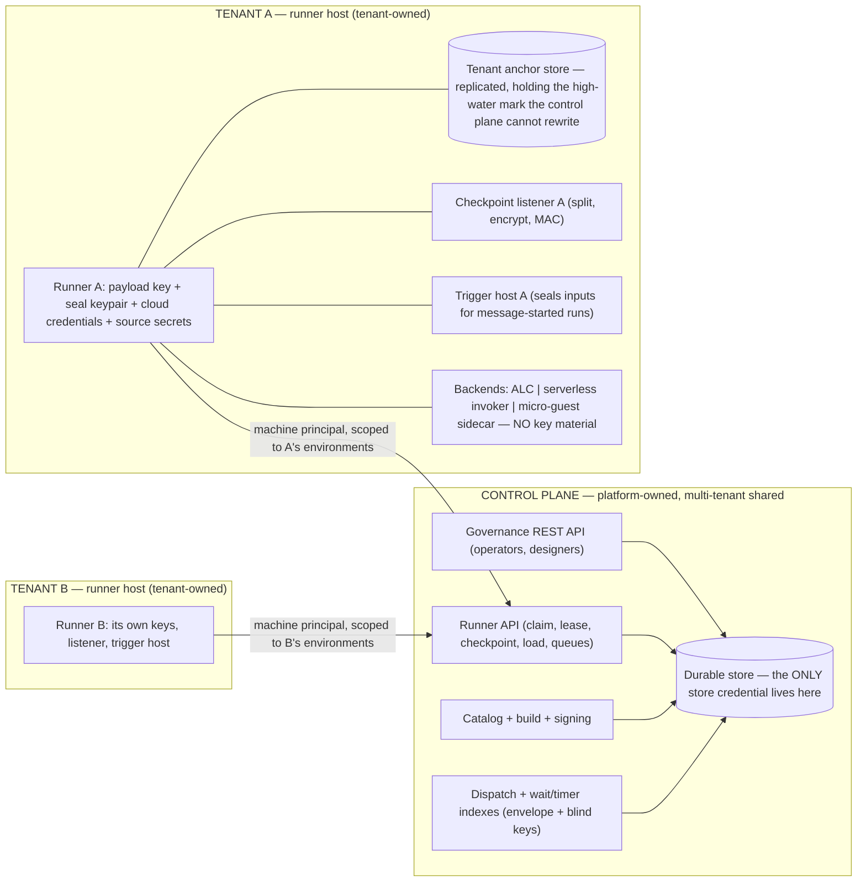
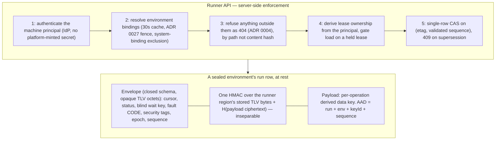
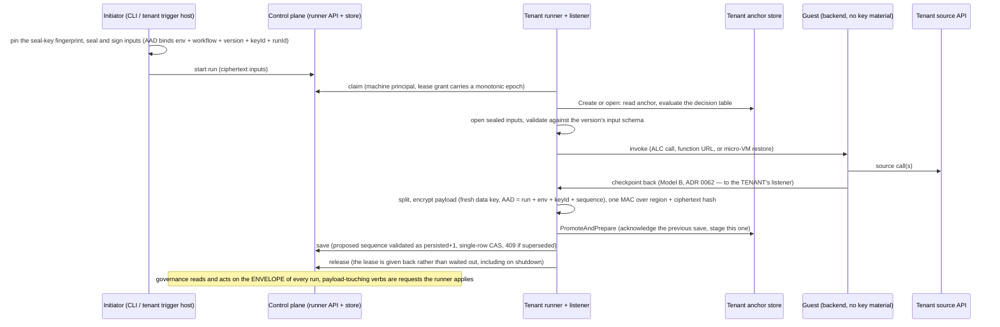

# ADR 0065. The control plane owns the store and fronts all checkpointing; runners encrypt the checkpoint payload

Date: 2026-08-01. Revised 2026-09-26: decision 12's re-key sweep as built (the clear wait inside the payload, the runner API's `claimForRekey`, the runner client's sweep re-sealing resting runs under the write generation and re-parking blinded waits, the run detail's generation, the demo's provisioned successor and live rotation). Revised 2026-09-26: decision 12's rotation chain and the multi-generation ring as built (a registration into an environment that holds a generation carries the predecessor's signature over the rotation tuple, the link is stored and advertised, a runner holds several generations and writes under the newest active one that reaches its pinned fingerprint along verified links, a pinned initiator seals to such a successor on its own). Revised 2026-09-26: decision 10's allowlist as built (the ring is a default-deny allowlist with clear and sealed entries, the pinned seal-key fingerprint checked against what the runner API advertises, the minimum generation recorded as the generation held until decision 12's re-key). Revised 2026-09-25: decision 9's sealed start as built (the HPKE seal to the registered key, the initiator signature pinned on the runner, the sealed genesis row and its digest under the genesis label, the open and the input-schema validation at first claim, the start faults, the control-plane sealed-start endpoint, the CLI as the initiator with a required fingerprint pin, and the demo's provisioning of the seal and initiator keys). Revised 2026-09-24: decision 4's blind wait index as built (the index in the runner region and the channel column, the sentinel for a channel-only wait, the index claim, the delivery re-check), decision 6's tenant anchor as built (the genesis row at sequence 0, the record created at the first save, the promote fused mid-advance and immediate when the run rests, the hard fault as the runner handles it), and decision 5's encryption as built (the AEAD's nonce, associated data and salt), and decision 4's MAC input is the framed header, key id, runner region and payload digest, as built. Revised 2026-09-22: the tenancy invariant refuses a second owner group in every authenticating mode until phase B encrypts under the registered key. Revised 2026-09-07: a version is made available, scheduled and run only in an environment its own owner group holds, and the platform environment admits only versions carrying none (the counting residual of ADR 0066). Status: **Accepted**. Implementation: **partly: phase A on the server side; phase B has the row split, the control-plane region, the MAC, the payload encryption, the tenant anchor and the blind wait index; phase C not started**. Verified against the code 2026-09-24. Built: the runner API and its client, leases derived from the authenticated principal, non-disclosing refusals, the checkpoint sequence rule with the header checked against the body, the composite run key and run-id grammar, the keyed idempotent start, environment key registration, the tenancy ledger, and, since 2026-09-23, the first piece of decision 4: the checkpoint is the framed row of decision 6 (header, runner region, the salt, nonce, tag, ciphertext and MAC regions, and the control-plane region), the runner region and the payload are separate closed-schema documents, the runner writes its lease epoch into its region and the runner API checks it against the grant, and the control plane writes only its own region (a cancellation, a budget fault, a resume request, a pause, the budget): the runner submits only its own bytes, the server joins them with the region it holds, and either writer that finds the row moved re-applies over the other's newer bytes (decision 7). Since 2026-09-24, the unified MAC of decision 4 and the payload encryption of decision 5: the runner holds a key ring of its own (since 2026-09-26 decision 10's default-deny allowlist: clear and sealed entries, key generations oldest first, payload key references, pinned seal-key fingerprint, and decision 12's write generation selected among them along the rotation chain), and for every environment on it encrypts the payload of every row it saves under a data key derived for that one operation, seals the row, and on every load verifies the MAC and opens the payload, refusing a clear row for an environment it serves sealed unless it is the genesis row (the one the control plane writes before any runner has claimed, told by its missing lease epoch). The runner API, and the control plane's own serverless checkpoint surface, refuse a submission for a sealed environment (a tenant environment with an active key generation) that is not encrypted and MAC'd under one of its active generations. The serverless checkpoint listener and the serverless runner host carry a key ring of their own and seal what they terminate (decision 11's first half). A reader without the key gets a sealed row's envelope alone: the step journal reports its steps and says the payload is sealed, and a re-run of a sealed run is refused, since its inputs cannot be read. Since 2026-09-24 the blind wait index of decision 4 is built for every environment on the runner's key ring: a run parks on `{keyId}.{base64url(HMAC)}` under the `wait-index` subkey over the framed channel and correlation id (a sentinel for a channel-only wait), the row and the index column carry that and no channel, the runner API takes a message claim by index and never sweeps a sealed environment by channel, the delivering runner queries its own index and the channel-only index and hands a run back when the wait in its region is not one it queried. The run-level correlation id is not yet blinded: it is the control plane's own trace id until an initiator supplies a business correlation at a sealed start. Since 2026-09-25 the platform half of decision 9 is built: an initiator seals a run's inputs to the environment's registered P-256 seal key (RFC 9180 HPKE, base mode, DHKEM(P-256, HKDF-SHA256), HKDF-SHA256, AES-256-GCM, checked against the RFC's vector) under a binding of the environment, base workflow id, version, generation and the run id it chose, and signs the binding and the seal with ES256; the control plane writes the seal as the sealed genesis row (`SealedGenesis`: the generation as key id, the encapsulated key in the salt region, the initiator signature in the MAC region) and reads none of it; the runner key ring names the private seal half and the pinned initiator keys, together or not at all; the sealing store opens the row at first claim under the binding re-derived from the address and the envelope, the anchor's create commits to the genesis digest, the runner client validates the opened inputs against the version's inputs schema (the same builder the control plane uses) and faults the run at its start, sealed, as `sealed-start-inputs-invalid` or `sealed-start-unopenable`, so it is never claimed again; every later save says the run started sealed inside the MAC'd region. The sealed-start ingress is the control plane's `startSealedCatalogWorkflowRun`, through the same admission chain as a plain start with the inputs check replaced by an active-generation check, and the CLI's `start --sealed` is the initiator, refusing a published seal key whose fingerprint is not the one pinned on the command line; the demo provisions production's seal pair and the operator's initiator pair per boot, registers the public seal half, seeds the private half into the production runner's Vault, pins the initiator on that runner and hands the operator the initiator key and the fingerprint. Not yet built of decision 9: the runner-side trigger host for sealed schedules and message triggers, the start quota, and the run-level correlation id's blinding (an initiator holds no key to blind it under; a business correlation travels inside the sealed inputs). A plain start into a sealed environment is still admitted and its genesis row is clear, badged by the absence of the sealed-start mark. Not yet built of phase B: the reduced journal and length-bucket padding, the listener's workload identity and derived token secret of decision 11, and runner-mediated payload resume: a remediation still rewrites the cursor and the payload directly on a clear row, and refuses a sealed one, so a sealed environment's faulted run cannot yet be remediated. Since 2026-09-24 the tenant anchor of decision 6 is built: a tenant-owned anchor store (`ITenantAnchorStore`, in memory and on the tenant's own PostgreSQL) enforces exactly the acceptance predicate by delegating to `AnchorAcceptance.Classify` under a whole-record compare-and-swap, holds the environment's attested incarnation, and the runner's sealing store, given one, evaluates `AnchorOpen.Evaluate` on every load and stages every save with the tenant before dispatching it; the runner region carries the incarnation beside the epoch; a hard fault, a refused claim and a rejected write are one exception the runner client answers by giving the lease back and carrying on with its sweep. Not yet built of the anchor: the runner's verification and application of an operator-signed re-anchor or abandon (the store admits both by the predicate; the pinned operator key of decision 8 that would verify them is not built, so a hard-faulted run is the operator's to cancel envelope-only until then), a control-plane-advertised incarnation, and anchoring of a listener-terminated environment. Rollback and replay of a whole row by the control plane are therefore detected for an anchored environment and remain undetected for an unanchored one, and the control plane holds every unsealed environment's plaintext. Two divergences follow. The tenancy gate refuses a second owner group in every authenticating mode since 2026-09-22; it used to admit one once every environment had a registered key that nothing encrypted under. Both sample runners and the checkpoint listener open the shared store with the control plane's at-rest key, against "runners hold no store credentials". The store write is conditioned on the etag, with the persisted sequence held in memory for each coordinator. Scope: the trust model between the control plane and runners in a multi-tenant deployment — who owns the durable store, how runners reach it, what each party can read and forge, and how tenants are separated on shared control-plane infrastructure. Revises the two-process shared-store topology ([ADR 0023](0023-two-process-store-as-queue.md)) and the checkpoint-listener deployment shape ([ADR 0062](0062-authenticated-serverless-checkpoint-callbacks.md)); builds on fail-closed non-disclosing enforcement ([ADR 0004](0004-fail-closed-non-disclosing-enforcement.md)), the security-posture enum ([ADR 0016](0016-control-plane-security-mode.md)), the resume-mode taxonomy ([ADR 0022](0022-resume-mode-taxonomy.md)), runner-to-environment binding ([ADR 0027](0027-runner-environment-binding.md)), canonical JSON ([ADR 0031](0031-content-hash-over-rfc8785-canonical.md)), and the runner-as-secure-boundary model ([ADR 0059](0059-serverless-deploy-runs-on-the-runner-as-the-secure-boundary.md)).

*Revision history: the first version sealed whole checkpoints away from the control plane, which broke governance and was reverted before release. The second inverted the topology as decided here. Seven rounds of adversarial security review followed — each attacking the previous round's fixes as well as the design — and their findings are folded into the decisions below. What remains unfixed is listed as an accepted residue rather than left implicit.*

## Context

A security review of the store seam found the implemented model assumed one trust domain around the shared durability store, which is wrong for the intended deployment: **runners are owned by tenants**, checkpoints carry tenant data, and yet the control plane and every runner held full store credentials under one shared at-rest key, with the environment fences enforced by store-layer code running inside each runner's own process — real against bugs, voluntary against a hostile runner.

Two principles must hold at once:

1. **Tenant run data is isolated** — not readable by platform operators, backups, or other tenants, through key custody rather than policy code.
2. **The control plane governs every run.** Detail, cancel, resume, faulted-resume, purge, and audit are control-plane verbs over *all* runs. A design that blinds the control plane to run structure breaks the product; the first cut of this ADR did exactly that and was reverted.

The reconciliation splits on what each party needs. The control plane needs the run's *management structure* — where the run is, what it awaits, how it failed, when it moved. It does not need the tenant's *data* — the values flowing through the workflow. The runner needs both and already holds the tenant's keys for everything else.

**Nothing is shipped.** There is no deployed installation, no tenant data at rest, and no external consumer of the current wire or storage formats. This decision therefore carries no migration obligation and no compatibility hedge: the target design is built directly, the phases below are our own delivery sequencing rather than an upgrade path, and where an existing component contradicts this ADR (the checkpoint listener's deployment shape, the runner's store connection, the in-process draft runner) it is corrected rather than deprecated.

## Decision

**1. The control plane owns the durable store exclusively; runners hold no store credentials.** ADR 0023's "two processes sharing the store" is revised: the store-as-queue survives, but inside the control plane's boundary. Everything a runner did against the store — claim, lease renew and release, checkpoint save and load, timer and message queries, registry heartbeat, catalog artifact pull, deployment queue — becomes an operation on a **runner API** the control plane serves, deployed as a separately scalable component sharing the store with the governance API (preserving ADR 0023's real point: execution load never rides the governance request path). Interim checkpoint writes stay fire-and-forget with the terminal write awaited.

**2. Runners authenticate as their own machine principals; separation and lease ownership are enforced server-side.** No new bearer credential is minted: a runner authenticates with the machine principal it already has (client-credentials, private-key JWT, or mTLS through the deployment's IdP), so there is no long-lived platform-issued secret to steal from a decommissioned host. Environment bindings are resolved per request with a bounded cache (at most 5 seconds), and each authorization decision is announced to it, so the ADR 0027 revocation fence takes effect at once on the replica that handled the revocation and within that window on any other. **Lease ownership derives from the authenticated principal** — a client-supplied owner string is rejected, every mutating operation presents its lease token, and revocation expires leases by principal, not by a self-asserted name a compromised runner could change. Registration hardens accordingly: `runners:register` is reach-scoped per environment (never the system context), an authorization row must exist before any registry row is written (so a foreign principal cannot squat a victim's runner id), and pre-authorization binds an expected principal or a short-TTL enrolment token rather than a bare, guessable id. **No principal may hold a `system` binding and a tenant binding simultaneously** — enforced when a binding is written and re-checked per request, because a principal holding both is a laundering route out of a sealed environment into the never-sealed platform one.

**3. Refusals are non-disclosing, and quotas are per tenant (ADR 0004).** An operation naming a run, artifact, or row outside the runner's bindings is refused indistinguishably from one naming something that does not exist; only a capability failure returns `403`. Implementing this found that the refusal is not always a `404`, and that saying so precisely matters more than fixing one status code. Every operation over a run presents its lease, and the lease check is reached first: a run outside the bindings, a run held by another principal, and a run that does not exist all fail it identically and answer `409`, which is the property this decision requires. `404` is therefore reserved for the narrower and more serious case of a run the principal *does* hold whose row is nonetheless absent — the row was deleted or is being withheld, and the runner holding a non-terminal anchor entry for it faults rather than treating it as a benign miss. Operations that do not name a run (a claim) keep the plain rule. Catalog artifacts are authorized **by path** (bound environment → deployment → version → package), never by bare content hash. Quotas are aggregate per tenant, not only per runner: a registered-runner cap per environment, a per-environment checkpoint rate, a total payload-bytes quota, a run-count cap, a parked-wait cap (blind index rows are high-entropy and undeduplicable), per-runner sub-limits, and a body-size cap. A quota rejection is a distinguishable retryable signal (`429`, runner-side hold and backoff) **exempt** from the fail-the-advance rule below, so a chatty legitimate workflow is not faulted mid-advance after its external calls have landed — but the exemption is **bounded** (a total hold time and an attempt cap per advance, after which the advance fails like any other non-2xx), and the `429` body names the quota and its counter. An unbounded exemption would be a silent, targeted stall primitive: a fabricated `429` is indistinguishable from a real one to the runner, the background renewer keeps the run's lease so it never fails over or faults, and the run sits holding external side effects it never checkpointed, with no audit event because a quota hold is routine.

**4. The checkpoint is one row: a clear envelope and an encrypted payload, verified as a whole.** The **envelope** is run-management structure — cursor, status, wait, fault classification, retry counters, sequencing, timing, journal skeleton, and security tags. The **payload** is tenant data — run inputs, step outputs, extracted values, journal data content. The envelope's runner-authored region and the payload are **cryptographically inseparable**: the runner computes one HMAC (under the `envelope-mac` subkey) over the runner-authored region's bytes *concatenated with the hash of the payload ciphertext*. A checkpoint verifies only as a whole — an envelope region from checkpoint *i* spliced onto the payload of checkpoint *j* fails the HMAC — and nothing else is needed for that property. (An earlier draft additionally had the payload's AEAD bind the tag, which is circular: the tag is a function of the ciphertext, so the ciphertext cannot be a function of the tag.)

The MAC input is the region's **stored bytes** under deterministic TLV framing, not a canonical re-serialization: the runner writes the region once in fixed property order and MACs exactly those bytes. There is no per-backend alternative — a MAC input that varies by backend would not survive the backend migration this ADR itself contemplates. As built, the message is `len‖header ‖ len‖keyId ‖ len‖runnerRegion ‖ len‖SHA256(payloadRegion)`, HMAC-SHA256 under the `envelope-mac` subkey, written into the row's MAC region: the two-byte header is inside the coverage so the algorithm selector is authenticated, the key id is inside it so a row cannot be re-pointed at another generation, and the payload region is covered through its digest whether it is ciphertext or, until encryption lands, clear. The key id and MAC regions come together or not at all; a row with one and not the other is malformed rather than clear. The runner verifies on every load, since only it holds the key; the runner API, holding none, requires a MAC under an active generation for a sealed environment and cannot check it.

The envelope is a closed schema that rejects unknown members, and its contents are constrained so it cannot become a data channel:

- **Fault**: a closed-vocabulary classification code plus `attempt` and, for a sealed environment, the step-map index rather than the tenant-authored `stepId` (the same reason the journal uses one — an identifier is otherwise an unbounded free-text channel, and a fault is envelope data the control plane reads on every faulted run). Free-text failure descriptions and provider error bodies are payload.
- **Correlation**: *both* the wait match key and the run-level correlation id are blinded (the wait match key since 2026-09-24; the run-level correlation id once an initiator supplies a business one at a sealed start, since until then it is the control plane's own trace id), under the `wait-index` subkey of the decision-5 table (which includes `environmentId` — without it, one tenant registering the same `keyId` in two environments derives one subkey and a message delivered to `staging` wakes a `prod` run, defeating environment pinning; the runner-side re-check does not catch that, because the index genuinely matches). The MAC input is length-framed — `len(channel) ‖ channel ‖ len(correlationId) ‖ correlationId` — so `("orders","123")` and `("order","s123")` cannot collide. Plaintext correlation ids live in the payload. A channel-only (wildcard) wait uses an explicit sentinel and is documented as leaking a per-channel constant; a sealed environment may forbid them. The store keys the index by `(environmentId, keyId, index)` so both generations match during a re-key roll, and the runner verifies that a run returned for a query actually carries the queried index in its MAC'd region before delivering a message to it.
- **Security tags** are stamped from the catalog version at run start and live in the runner-MAC'd region: the control plane reads them (they drive the ADR 0004 reach gate) but cannot rewrite a run into another operator group's reach without failing verification.
- **Identifiers** are length- and charset-bounded, and for a sealed environment the journal records an index into an encrypted step map rather than the tenant-authored `stepId` — mandatory, not opt-in, because an identifier is otherwise an unbounded free-text channel.
- **The AEAD algorithm id and key id** are inside the MAC'd region, and therefore authenticated; they are not in the AEAD's AAD, which is exactly `(runId, environmentId, keyId, uint64(sequence))` and nothing else. An unauthenticated algorithm selector is a downgrade primitive the moment a second algorithm exists, and answering "unsupported algorithm" differently from "authentication failed" is an oracle on an otherwise non-disclosing surface: both fault identically.

The **stored region is opaque octets**. No backend may parse, patch, or re-emit it — server-side JSON rewriting of the kind used elsewhere in this codebase (jsonb_set, JSON_MODIFY, a document store's own re-serialization) would silently destroy a byte-exact MAC. The runner submits only its own region and the crypto regions; the control-plane region is held and written by the server, joined at read time, and excluded from the MAC by construction rather than by convention, so neither party can rewrite the other's bytes.

**5. Payload encryption is envelope encryption under a per-encryption data key.** The environment's payload key is a **derivation** key, never a direct AES-GCM key: each encryption derives a fresh data key (see the table below), and the salt occupies the row region a wrapped key would. Wrapping survives only for a deployment whose payload key is non-exportable in an HSM, where the runner unwraps a per-run intermediate directly against the HSM into a `wrappedKey` row region; every wrap and unwrap there carries an encryption context of `(environmentId, runId, keyId)`, enforced by the protector conformance suite. The three per-generation subkeys are **always** derived from the environment payload key and never from a per-run intermediate, so an HSM deployment that cannot derive them is not a supported sealed-environment configuration.

Derivation is specified once, normatively, because four scattered statements of it in an earlier draft disagreed with each other. Every field is length-framed and every label is distinct; **`environmentId` is present in all four**, so two environments of one tenant that register the same `keyId` never collide:

| Label | Info |
|---|---|
| `data-key` | `len‖"data-key" ‖ len‖environmentId ‖ len‖keyId ‖ len‖runId ‖ uint64(sequence) ‖ salt` |
| `envelope-mac` | `len‖"envelope-mac" ‖ len‖environmentId ‖ len‖keyId` |
| `wait-index` | `len‖"wait-index" ‖ len‖environmentId ‖ len‖keyId` |
| `checkpoint-token` | `len‖"checkpoint-token" ‖ len‖environmentId ‖ len‖keyId` |

Without framing, `(keyId "k1", runId "0abc")` and `(keyId "k10", runId "abc")` derive the *same* key — and with a counter nonce that is a repeated `(key, nonce)` pair over different plaintexts, which yields the GCM authentication subkey and hence payload forgery. The three subkeys that omit `runId` are derived once per key generation and cached; only `data-key` is per encryption. The wait index is stored keyed by `(environmentId, keyId, index)`. `keyId` is tenant-registered and therefore arrives from outside the runner's trust boundary, so registration bounds its length (256 characters), as does the derivation itself. The derivation buffer is sized from these identifiers, and an unbounded one turns a malformed registration into a stack overflow, which kills the process rather than failing the write.

**A fresh 32-byte salt for every *encryption operation*, never per logical checkpoint and never per retry.** Re-encrypting after a `409` with a cached salt restarts the counter nonce under the same derived key: same trap, same break. A counter nonce is permitted only because this rule holds.

As built, the cipher is AES-256-GCM with a 128-bit tag. The salt is drawn inside the encryption and never supplied by a caller, so no retry can reuse one; the nonce is the counter's first value, twelve zero bytes, carried in the row's nonce region so the row describes itself under the framing; the associated data is `len‖runId ‖ len‖environmentId ‖ len‖keyId ‖ uint64(sequence)` and nothing else, with the algorithm id and key id authenticated by the row's MAC rather than here; and a wrong key, a moved payload and a tampered ciphertext or tag fault identically, as does a MAC that does not verify, so the runner's one integrity fault says nothing about which check failed. The runner's sealing store encrypts the payload, computes the MAC over the framed header, key id, runner region and ciphertext digest, and writes the row in one allocation; on load it verifies, opens and hands the run a clear row, so the run itself stays crypto-free. A row that comes back through that store for a control-plane-region write is a clear row by then and is encrypted again under a fresh salt. The listener that terminates a function's checkpoint does the same over its own store, so the function never holds a key.

**6. Freshness is a validated sequence, a server-minted lease epoch, and a tenant-held anchor.** AAD binding alone is not freshness: an old checkpoint served with its own matching envelope verifies perfectly. Three mechanisms carry it, and a fourth from an earlier draft — a hash chain over the previous payload ciphertext — is **deliberately deleted**. There is one row per run, so the previous ciphertext no longer exists to check against; splicing is already caught by the unified MAC and rollback by the anchor, so the chain contributed no property while causing the re-encryption-on-`409` problem, the re-key sweep's tip hazard, and a genesis-link construction. The payload AAD is `(runId, environmentId, keyId, uint64(sequence))`.

- **Sequence**: the runner proposes `n`, the server accepts only `persisted + 1`, and the CAS predicate is `(etag, persistedSequence)`. The server *validates* rather than assigns, so the value is predictable to the writer at encryption time and authoritative in the store. The runner-authored region carries `n` inside the MAC, so a server that lies about acceptance is caught. A superseded save answers `409` with the accepted sequence — never a `204` indistinguishable from a durable write. **A retry is a byte-identical resend**: the runner retains the exact transmitted bytes for the in-flight sequence and resends them, because a fresh salt would otherwise produce different ciphertext for the same logical checkpoint. The row buffer is owned by the in-flight save and returned to the pool only once that sequence is acknowledged, superseded, or abandoned. **At most one save per run is in flight, and the interlock is per run, not per component.** The runner and the listener both author checkpoints for the same run — the listener terminates guest checkpoints, the runner authors fault and terminal ones — so a lock held per component would let two honest tenant components dispatch concurrently and manufacture the divergence above. The **lease holder is the single dispatcher and the single anchor writer for a run**: the listener and the trigger host write through it rather than racing it. That is the interlock; it is not the server's `persisted + 1` acceptance rule, which bounds what is *accepted* rather than what is *dispatched* (which is why a `409` path exists), and it is not decision 1's coalescing, which is per-environment and off by default. The server's `persisted + 1` rule does not provide this: it bounds what is *accepted*, not what is *dispatched*, which is why a `409` path exists at all.
- **Epoch**: the lease grant carries a **monotonic epoch the control plane can only increment**, minted server-side per grant, written by the runner into the MAC'd region, and combined with the store's **incarnation id** — a value advanced out of band on every restore or migration and never itself restored, without which a restore silently re-issues spent epochs. Two asymmetric rules use it: refuse a checkpoint whose epoch is *above* the current lease grant (a row minted under a grant this holder never held), and refuse one *below* the run's high-water epoch (a rollback). Neither fences a *displaced* holder whose epoch equals the high-water mark — that is the lease token's job (decision 2). A displaced holder's save landing after the new holder has written its own `pending` produces a stored digest differing from the anchor's pending at the same sequence. That is indistinguishable from substitution by inspection, so it **hard-faults**; what distinguishes it is that it is **re-anchorable**, unlike a rollback detected within an incarnation. The table's divergence row carries that distinction, and the single-flight rule below is what makes the race rare rather than routine. The incarnation appears only here — not in key derivation, where a fresh per-operation salt already guarantees uniqueness.
- **Anchor**: the high-water mark must live where the control plane cannot rewrite it, so the tenant keeps one. It is a **tenant-owned, environment-scoped, replicated key-value record** — not runner-host-local, because leases fail over between hosts and a host-local anchor would brick every run its host was carrying — holding `runId → { epochHighWater, committed(epoch, sequence, digest), pending?(epoch, sequence, digest) }`, written under compare-and-swap over the whole record. **The run's lease holder is its sole anchor writer**; the listener, the trigger host, and the re-key sweep write through it.

  **The digest is what makes the anchor a commitment to a checkpoint rather than to a number.** An earlier draft deleted the payload hash chain and kept only `(epoch, sequence)`, which loses checkpoint *identity*: a save that is dispatched, reaches the control plane, and is answered `500` leaves the runner to discard its `pending` and re-execute, producing a second genuine row at the *same* `(epoch, sequence)` — and a control plane holding both can substitute the abandoned branch for the committed one, passing the MAC, the AEAD, and every ordering rule. That is a lateral substitution, invisible in a coordinate system made only of numbers.

  The digest is defined once, normatively, because it is a byte-exact contract between five code paths (the runner, listener, trigger host, and re-key sweep all write it; every open compares it) and a disagreement surfaces as an unrecoverable fault:

  ```
  digest = SHA-256( len‖"checkpoint-digest" ‖ len‖submittedBytes )
  ```

  where `submittedBytes` is **everything the runner submits, concatenated in stored order**. The stored row layout is pinned here, once, because three components write it and every open parses it:

  ```
  [header][runner region][salt][nonce][tag][ciphertext][MAC][control-plane region]
  ```

  `submittedBytes` is `header ‖ runner region ‖ salt ‖ nonce ‖ tag ‖ ciphertext ‖ MAC` — every region the runner writes, in that order.

  **At sequence 0 there is no runner region**: the genesis row is written by the control plane from the initiator's sealed, signed inputs, before any runner has claimed. Its digest is therefore taken over that row's own authenticated bytes — `digest₀ = SHA-256(len‖"checkpoint-digest-genesis" ‖ len‖ciphertext ‖ len‖signature)` — the initiator signature being the only tenant-side authenticator that exists at genesis. Conformance covers six writers, not five: the five checkpoint authors plus the genesis row. The **header is inside the MAC'd region's coverage and inside `submittedBytes`**: it carries the framing version and the AEAD algorithm id, and an algorithm selector outside the MAC would be exactly the downgrade primitive decision 4 forbids, arriving with the second algorithm that makes it exploitable. The control-plane region is last and is in neither: it is joined at read time and is not the runner's to commit to. The wide extent is deliberate — it makes a salt or nonce substitution a digest mismatch at promote rather than an opaque decryption failure later. Every variable-length field is length-framed, including the submitted bytes themselves, and the whole construction is asserted by the protector conformance suite.

  `runId` is part of the runner-authored region, so the MAC and the digest are run-identifying on their own rather than relying on the AEAD's AAD and the anchor key alone.

  **The anchor store enforces exactly one thing: the CAS predicate.** It is a tenant-owned replicated key-value store, not a policy engine — it cannot verify a control-plane-minted lease token or an operator signature, and nothing here requires it to. The predicate has three rules: refuse any write whose `pending` or `committed` ordering key is below `epochHighWater`; require `pending.sequence` to be `committed.sequence + 1`; and **allow `committed` to advance only by promoting a `pending` already present at the identical `(orderingKey, sequence, digest)`**. Without the third rule a single write of `committed(currentKey, n+1, anything)` with no `pending` destroys a run permanently — the next open sees the store below `committed`, which is the non-re-anchorable fault row — a stronger primitive than the adversary the anchor exists to fence possesses. The ordering key is `(incarnation, epoch)` lexicographically, never a bare epoch: an incarnation change resets the control plane's epoch counter, so bare epochs are not comparable across one. **The incarnation component is read from the tenant's own attested value, never from what the control plane advertises.** A control plane advertising `incarnation + 1` would otherwise have the tenant's own runners raise `epochHighWater` to a fabricated key, after which every honest write at the true incarnation is refused by the floor — an environment-wide stall from an advertised integer. A control-plane-advertised incarnation that differs from the attested one faults the open, which is the correct reading of an unattested restore. `epochHighWater` is raised by any accepted write to the ordering key it carries, and is lowered only by a re-anchor.

  A **signed re-anchor replaces the whole record**, `epochHighWater` included, and is the one write exempt from the floor — without that exemption the CAS would refuse precisely the operation that recovers from a restore, since a restored store's ordering key is necessarily below the mark. The re-anchor record carries the operator signature, and the *runner* verifies it at open against the operator key pinned in its own configuration (decision 8), which is where signature checking belongs. Without that, a displaced holder can overwrite a newer holder's `pending` and drive the next open into a hard fault — a control-plane-triggerable brick. The single-flight property the write-ahead log depends on is a **client-side** rule (one undispatched save per run, per decision 1's coalescing), not the server's `persisted + 1` acceptance rule, which bounds what is *accepted* rather than what is *dispatched* — which is exactly why a `409` path exists.

  The record is a write-ahead log. The prose below conveys the intent; the schema, the acceptance predicate, the exhaustive decision table, and the transitions are specified normatively in [the tenant-anchor specification](#normative-specification-the-tenant-anchor) later in this document, which governs where the two differ.

  | Anchor | Store | Meaning | Action |
  |---|---|---|---|
  | `committed(e, n, d)`, no `pending` | at `n`, digest `d` | normal | proceed |
  | `pending(e, n+1, d')` | at `n+1`, digest `d'`, epoch `e` | the save landed, the acknowledgement was lost | promote `pending`, proceed |
  | `pending(e, n+1, d')` | at `n`, digest `d` | the save did not land | discard `pending`, proceed from `n` |
  | any | sequence below `committed`, or equal with a different digest | **rollback or substitution** | hard fault |
  | any | sequence above `committed` with no matching `pending` | anchor lost a write, or an unknown writer | hard fault |
  | `committed(e, n, d)` | row absent, or `404` | rollback to nothing | hard fault |
  | `terminal` | any | the run finished | refuse to claim |
  | missing | store beyond genesis | anchor lost, or a completed run replayed | hard fault |

  Rows are evaluated **in order** — `terminal` first, then `missing`, then the `committed`/`pending` predicates — so a terminal run whose store row was re-presented is a routine refusal rather than a security incident on every claim attempt. In the steady state a promote follows the save's acknowledgement; at recovery time (table row 2) it requires the stored row to *match* the pending record on epoch **and** digest, so an acknowledgement that diverged from what was actually stored is caught at the next open by row 4. A promote never lowers `epochHighWater` — otherwise a runner could promote its own lower epoch over a higher-epoch row written by a second holder, re-opening the window the epoch exists to close. A missing entry is a fault rather than a licence to trust the row; trusting the row on a cold open is exactly what removes the detection.

  **Re-anchor** is the single recovery path, for a lost anchor and for a restore (where the store legitimately moves below every anchor). It is an operation, not a permission: the tenant operator is shown `(anchor committed, store epoch, store sequence, store digest, incarnation, and whether the store is below, lateral to, or above the anchor)`, signs that exact tuple — length-framed like every other authenticated structure here, naming `runId` and `environmentId`, and including a **strictly monotonic per-run re-anchor counter** — with the operator key of decision 8, and the anchor is set to it. The runner refuses a re-anchor whose counter is not above the last it accepted: without it, two validly-signed records for the same run at the same incarnation both verify forever, and replaying the older one rolls the anchor back under an operator's own signature. **A detected rollback or substitution within the same incarnation is not re-anchorable** — signing it away is blessing the attack, and a control plane that rolls a run back must not be able to make signing the only route back to liveness. Re-anchors are rate-limited and audited per run rather than capped at one per incarnation, so a second honest anchor incident is still recoverable.

  **The incarnation is tenant-attested, not control-plane-asserted.** The rule above turns on whether the store moved because of a restore or because of an attack, and the incarnation is the discriminator — so a control plane that could simply advance it would manufacture the rollback and then supply the excuse that makes it signable. The tenant's anchor store holds the current incarnation as an environment-scoped value, and three rules govern it:

  - A re-anchor must cite an incarnation **equal to the tenant's current attested value**. Set membership would not do: a control plane could roll the store back to a state whose incarnation was attested *previously*, and the operator would then be shown exactly the signature of a legitimate restore.
  - Attestation is **strictly monotonic**, one per incarnation change, environment-scoped rather than per run — not once per environment lifetime, which would make a second legitimate restore unrecoverable.
  - The **first attestation happens at environment creation**, with run starts blocked until it is recorded, bound to the same gate decision 12 applies to the first key registration's fingerprint confirmation. Lazily populating it on first observation would have the tenant record whatever the control plane asserts, and one such attestation unlocks re-anchoring for every run in the environment.

  What attestation cannot do is give the operator evidence: they have no tenant-side signal that a restore actually occurred, so this converts an automatic bypass into one that needs a plausible story. That is an improvement, not a proof, and it is listed among the residues as such.

  A terminal run's anchor entry collapses to a compact **terminal marker**, retained for the same period as the control plane's run-id tombstone. It is not deleted outright: an absent entry with a store row at genesis would otherwise read as a fresh run, and a control plane that kept a copy of the genesis row — which it wrote, from initiator-signed ciphertext that re-verifies unchanged under the same `runId` — could re-present a completed run as claimable and have every external side effect executed again, with nothing tenant-side left to dissent. Delegating that to the control plane's own tombstone is the exact trust the anchor exists to remove.

  As built, the anchor follows this specification with these particulars. The genesis row is the row the control plane writes at sequence 0 before any runner has claimed, told apart by its missing lease epoch: for a sealed start it is the sealed genesis row of decision 9, digested over the sealed inputs and the initiator signature under the genesis label, and for a plain start it is a clear row, digested over its submitted bytes under the ordinary `checkpoint-digest` label, since it has no sealed inputs and no initiator signature. The runner decides the first claim at open and writes the `Create` immediately before its first save, which is the first moment it holds the ordering key the record commits to; the ordering key is the grant's epoch with the incarnation the runner read from the tenant's own attestation, and the runner writes both into its region so the MAC and the digest cover them. A save made mid-advance stays staged once acknowledged and the next save promotes it in the same write that stages its own mark; a save that rests the run (a wait, a fault) is promoted as soon as it is acknowledged, so the committed mark is the last checkpoint before the run rests and a control plane that rolls that one back meets row 13 rather than row 11; a save that finishes or cancels the run is promoted and then finalized. A faulted run stays live, because a retry at its cursor is an advance of the same run. A save whose dispatch failed stays staged, and a save staged over an unacknowledged one is refused before dispatch. A row whose MAC does not verify is, for an anchored environment, row 5. The runner client answers every anchor refusal the same way: the run is not advanced, its lease goes back, the refusal is counted, and the sweep continues with its other claims; the run is left as it is for the operator to cancel envelope-only. The operator-signed writes, `ReAnchor` and `Abandon`, are admitted by the store and applied by nothing yet, for want of decision 8's pinned operator key.

  The anchor entry is created by **the runner, at first claim**. An earlier draft had the initiator create it at run start, which gave every operator workstation write access to the tenant's integrity record, required a digest over bytes that do not exist before the first advance, and left an orphan entry behind every start that was refused, rate-limited, or lost to a crash. None of that is needed: the replay it was defending against is already closed by the terminal marker, since a completed run's anchor entry is `terminal` rather than missing. A genuinely fresh run legitimately has no anchor entry, and the table's `missing` row applies only where the store is beyond genesis.

**7. Control-plane writes go to a region of their own, and they do not collide with runner saves.** Cancel, a budget fault, a resume request, a debugger pause and the resolved budget are control-plane-authored fields, held in the row's control-plane region, which the runner reads and validates against its own state but never authors: a runner submits only its own bytes, and the server joins them with the region it holds. The two writers share one row and one compare-and-swap, and the server merges rather than refuses: a runner save that finds the row moved re-reads it, and if the persisted sequence is still the one the save follows, the row moved by a control-plane write, so the same submitted bytes are joined with the newer region and saved again; a control-plane write that finds the row moved re-applies its decision over the runner's newer bytes. A conflict that moved the sequence is a peer writer and is surfaced as one. So a control-plane write can delay an in-flight runner save by a retry but cannot invalidate it, which is the property that matters: otherwise merely touching the envelope becomes a liveness weapon that faults an advance whose external effects have already landed, and the retry repeats them. (An earlier form of this decision gave the two parts independent CAS predicates; that either lets the last writer clobber the projected index the queries filter on, or splits the index into two owners with an effective-status expression in every query, and the merge gives the same guarantee without either.)

**8. Payload-mutating resume is a custody control, not an integrity control (ADR 0022).** Only faulted-step retry *at the current cursor* is envelope-only. State-patch, skip-with-outputs, **and rewind** all mutate payload: a rewind moves the cursor back and re-runs forward, overwriting the re-executed steps' outputs and repeating their external side effects, so classifying it as envelope-only would have left the control plane an unauthorized forced-re-execution verb. For a sealed environment the control plane records any of them as a request and the environment's runner applies it inside its own boundary. **This must not be mistaken for protection**: the patch content is still authored by the control plane, and a runner cannot judge whether rewriting a payment amount was legitimate. For a sealed environment such a mutation therefore requires a tenant-side authorization — a signature from a tenant-held operator key **whose public half is pinned in the runner's own configuration alongside the allowlist** (registering it in the control plane would let the control plane register its own and reduce the control to nothing) — and the applied patch is recorded in the encrypted journal so the tenant can audit it.

**9. Run-start inputs are sealed by an initiator the tenant controls, and the initiator names the run.** The initiator fetches the environment's public seal key, pins its fingerprint, seals the inputs, and submits ciphertext, so the control plane never holds plaintext inputs. **The initiator chooses the run id** and the seal's AAD binds `(environmentId, baseWorkflowId, versionNumber, sealKeyId, runId)`; the control plane must use that id. A replay then collides on the primary key — which is what makes the anti-replay property durable, where an unbounded, forever-lived nonce set spanning every runner host of the tenant would not be. Two constraints make that safe now that the id is caller-supplied:

- **The primary key is `(environmentId, runId)`**, at every ingress and in every backend (now implemented, see the H18 closure). Keyed by run id alone, a caller-chosen id would be a cross-tenant handle. Collision is therefore evaluated only within the caller's authorized environment, and a collision outside it is invisible (ADR 0004), so neither collision branch becomes an existence oracle over another tenant's runs. (The deployment-global schedule-id namespace is the one deliberate exception, booked as threat-model AR-18.)
- **The grammar is exactly 32 lowercase hex characters** (128 bits), validated at every ingress before any store touch. A 128-bit blinded value is deliberately exempt from the 32-byte rule that governs the blind *index*: this is a primary key within an environment, not a lookup index whose collisions would silently merge unrelated waits. Entropy becomes structurally provable rather than asserted, every backend's key, path, blob-name, and document-id constraint is satisfied by construction, and the covert-channel width is bounded to the id's own entropy.
- **An idempotent start collides on purpose.** For the idempotency-key path the id is the initiator-computed blinded value under the tenant's key, and a collision **returns the existing run** rather than refusing — a client retrying after a timeout is honest input. Only a non-idempotent start refuses on collision. The current publicly-computable derivation (a plain hash of workflow id and idempotency key) is retired: it lets anyone who can guess the pair pre-create the run and have the legitimate start deduplicated onto their row.

**Sealing gives confidentiality, not authenticity.** The seal key's public half is published by the control plane and the AAD holds no secret, so anyone — the control plane included — can seal valid inputs for a run of their choosing. A hostile control plane thereby obtains, with no signature, the capability decision 8 requires a tenant operator signature for: attacker-chosen data executing inside the tenant's boundary, against the tenant's sources, with the tenant's credentials. The sealed start therefore carries an **initiator signature** over the AAD and the ciphertext, verified against an initiator public key pinned in the runner's own configuration alongside the operator key and the allowlist. Where a deployment defers that, run injection is an accepted residue and is listed as one.

Three further consequences must be stated rather than assumed:

- **Browser-served initiators cannot provide this property.** The designer and console are served by the control plane, which could serve code that skips the pin or posts plaintext. Sealed-environment starts are therefore restricted to initiators whose code the tenant controls (the CLI, a tenant-hosted trigger host); a browser-initiated start is badged as control-plane-trusted on the run record and in the console rather than silently claimed as sealed.
- **Every ingress that carries inputs or business keys is in scope**: HTTP start, schedule create, run-schedule-now, message triggers, and the dispatcher workflow. A dispatcher *workflow* cannot start a sealed run (a workflow step is an ordinary HTTP call with no sealing machinery), so message-triggered starts for a sealed environment go through a runner-side trigger host that holds the seal key. Idempotency keys are blinded with the wait-index construction; a schedule's target inputs are sealed and never re-read by the control plane.
- **Input-schema validation moves to the runner** at first claim, since the control plane sees only ciphertext: the documented `422` becomes a fault classification, and decrypt or schema failures are rate-limited and counted against the environment's start quota so they cannot be used as an amplifier.

As built (2026-09-25). The seal is RFC 9180 HPKE in base mode with DHKEM(P-256, HKDF-SHA256), HKDF-SHA256 and AES-256-GCM, single shot, to the registered ES256 key, which serves as the recipient key and as the signing key for registration proofs (joint use of one P-256 key for ECDSA and ECDH, accepted); the info is a fixed label and the associated data is the length-framed `(environmentId, baseWorkflowId, uint32(versionNumber), sealKeyId, runId)`. The initiator signature is ES256 over `len‖"arazzo-sealed-start" ‖ len‖binding ‖ len‖enc ‖ len‖ciphertext`, verified against any one of the initiator public keys pinned, as full SubjectPublicKeyInfo, on the runner's key-ring entry beside the private seal half; an entry with one and not the other does not build, and the residue of a deployment that defers the signature is not built. The sealed genesis row uses the framed row's own regions (`SealedGenesis`: generation as key id, encapsulated key as salt, empty nonce and tag, sealed inputs as payload, signature as MAC), so every reader parses it and every keyless one sees the envelope. At first claim the runner re-derives the binding from the address it claimed, the workflow id its envelope names and the generation it holds, verifies the signature, opens the seal, validates the inputs against the version's inputs schema built from the version's own workflow document (one builder shared with the control plane's clear-start validation) and, when the start does not open or does not validate, faults the run at its start under `sealed-start-unopenable` or `sealed-start-inputs-invalid` as a sealed save at sequence 1, counted on the refusals counter, so the run rests Faulted and is never claimed again rather than being re-offered on every sweep; the fault's detail is not recorded on the run. The start quota is not built (rate limiting is GAP-3). The initiator names the run at random or as its own system derives it; the idempotent blinded derivation is not built, so a deliberate business-key start is the initiator's derivation. The control plane's sealed-start endpoint runs the same admission chain as a plain start, with the inputs check replaced by a check that the generation is active for the environment; the CLI is the initiator, and pins the seal key by fingerprint before it seals, so a control plane publishing a key of its own gets nothing; a tenant trigger host uses the same `RunStartInitiator`. A plain start into a sealed environment is admitted as before, with a clear genesis row, and the absence of the sealed-start mark is its control-plane-trusted badge. The run-level correlation id is not blinded: an initiator holds no key to blind it under.

**10. Sealing is decided runner-side against a default-deny allowlist, fails closed on key unavailability, and is required in multi-tenant mode.** A runner's configuration is an **allowlist of `(environmentId, sealKeyFingerprint, sealed)` entries** naming the environments it will serve at all: a binding the control plane writes for an environment not on the list is refused at claim, as is one whose advertised seal-key fingerprint does not match the pinned entry. A bare id would not do — the id is minted by the party the allowlist defends against, and cannot by itself express "this environment must be sealed". The entry also carries a **minimum key generation**, taken from the runner's own key ring rather than from anything the control plane advertises: a claim or write naming a generation below it is refused. Without that, retiring a compromised generation is enforced only at claim time by the control plane, so a continuously-leased run — or a colluding control plane that keeps advertising the retired generation — checkpoints under a compromised key indefinitely. A pinned seal fingerprint advances only on presentation of decision 12's predecessor-signed rotation proof chaining to the pinned value, so legitimate rotation is not an outage requiring every config file to be edited. The listener and trigger host enforce the identical allowlist, minimum generation, and cleartext refusal. Otherwise the rule "if a payload key is configured, enforce" is fail-*open* for any environment the runner has no entry for — a hostile control plane creates one, binds the tenant's runner to it, and harvests plaintext from runs executed with the tenant's own credentials. For an allowlisted environment, a missing or unresolvable payload key is a fault, never a cleartext write. The runner API independently refuses a cleartext payload for any environment whose record is sealed. The same rule governs the residue mitigations: a runner configured for a sealed environment **always** emits the reduced journal and pads the payload **plaintext** to length buckets before encryption (with the pad length inside the authenticated plaintext — padding applied to ciphertext is either strippable framing or breaks the AEAD), and the API refuses an unpadded or full-journal envelope — otherwise those mitigations are flags on a record the platform owns and can clear. Per ADR 0016, creating an environment without a key registration fails in the multi-tenant production posture; other postures badge unsealed environments on every view. The platform's own `system` environment is never sealed and its runs are platform data.

As built (2026-09-26). The runner's key ring is the allowlist, and it is default deny: `RunnerKeyRing` admits exactly the environments its entries name, an entry is clear (the environment alone, served clear) or keyed (generation, payload key reference, pinned seal-key fingerprint, and optionally the private seal half with pinned initiators), and a runner built with no entries admits nothing. The runner client hands back a claim for an environment it does not admit before loading a byte, releases the lease and counts the refusal; the sealing store, which the runner client, the serverless checkpoint listener and the serverless runner host all sit behind, neither loads nor saves a checkpoint for an environment the ring does not admit (`CheckpointEnvironmentNotAdmittedException`). The pinned fingerprint is the base64 SHA-256 of the registered seal key's SubjectPublicKeyInfo; the runner API's `getEnvironmentSealKey` advertises a bound environment's generations and public seal keys, and the runner client checks the generation it holds against the pin at most once a minute per environment, suspending the environment (claims handed back, counted `seal-key-mismatch`, `generation-not-active` or `seal-key-unavailable`) until a later check passes. A keyed entry without a pin does not build. The listener and the serverless runner pin by the same field and check nothing over the wire, since they hold no runner API client. A keyed entry holds one generation or several, listed oldest first (decision 12); its minimum generation names one of them, the oldest by default, and a row under a held generation older than the minimum is refused like one never held, so an operator retires a generation in two steps, first the minimum, then the secret. The pinned fingerprint is any one generation's; the runner writes under the newest generation it holds that the runner API advertises active under the pinned key or under one reaching it along rotation links the predecessors signed, re-selected at each check, so a rotation the tenant registers is followed with no configuration edit and no restart. The reduced journal and length-bucket padding of this decision are not built.

**11. Tenant-side execution infrastructure, and no key material in guests.** The serverless checkpoint listener terminates the guest's plaintext checkpoint, so it holds the payload key, performs the split-encrypt-MAC, and speaks the runner API; it never holds a store credential (the Container Apps recipe built for ADR 0062's live proofs gave it one, and that shape is corrected in phase A). Its **load path is a decryption oracle** — it serves plaintext for any run in the environment — so it authenticates with the platform's native workload identity in addition to the ADR 0062 token, the token secret is derived per `(environmentId, keyId)` from the payload key rather than a standalone shared secret, the token carries its key id so a rotation does not silently invalidate every in-flight token mid-invocation, token lifetime is capped validator-side, and a listener compromise is recorded below as yielding the environment's plaintext.

**No key material, nonce, salt, monotonic counter, or other unique value originates inside a micro-guest or serverless guest** — the listener supplies the guest's ordering token per invocation. ADR 0064's snapshot-after-warm-up restores the guest CSPRNG to its snapshotted state, so a guest generating keys or nonces would repeat them on every advance of every run — forfeiting the authentication key the anti-forgery argument rests on. Encryption happens in the runner or listener process only.

**12. Key lifecycle, and an accurate account of purge.** Rotation registers a new key id (signed by the outgoing private key, so a pinned initiator accepts a successor automatically and an unsigned change is a hard fault; registration and rotation carry a proof of possession over `(environmentId, newKeyId, predecessorKeyId, server challenge)`). The first registration in a multi-tenant production environment blocks run starts until a tenant operator records an explicit fingerprint confirmation. A runner-driven **re-key sweep** re-seals payloads *and* re-derives wait indexes under the new id, retiring a compromised generation; a maximum generation lifetime is configured per environment. The sweep takes a run's lease **only when it is free — it never preempts a live holder**, and defers held runs to a later pass; a generation's retirement is enforced by refusing new claims under it, not by taking work away from a runner mid-advance, which would be a forced-duplicate-execution primitive fired by routine rotation. Because the sweep writes a new checkpoint, it **writes the anchor** `(epoch, sequence, digest)` for every run it re-seals, under the run's lease, exactly as any other writer does.

As built (2026-09-26, the rotation chain and the ring). A registration into an environment that already holds a generation, active or retired, is a rotation: it names its predecessor and carries the predecessor's ES256 signature over the framed tuple `("environment-key-rotation", environment, predecessorKeyId, keyId, sealPublicKey)`, made with the outgoing private seal half, beside the new key's own proof of possession; without a verifying link the control plane refuses it (`environment-key-rotation`), a first generation carries none, a retired predecessor still hands over (a compromised generation is retired and its successor registered in either order), and a replay names the generation that exists. The link is a fact of the generation for its life, stored on the environment record and advertised by `listEnvironmentKeys` and the runner API's `getEnvironmentSealKey`, and every pinned party verifies it for itself (`EnvironmentKeyChain`): a candidate generation reaches a pinned fingerprint when it is the pinned key or its links verify, under each predecessor's advertised key, all the way back to it, bounded in depth and refusing self-reference. The runner key ring holds several generations of an environment, oldest first, each with its own payload key and subkeys and optionally its own private seal half; every row under a held generation at or above the entry's minimum opens under that generation's keys, a sealed start made to any held generation opens under that generation's seal half, and every save goes out under the write generation, which the runner client selects at its once-a-minute check as the newest held generation the runner API advertises active that reaches the pin, so registering a chained successor moves every runner holding its secrets to it without a restart, and a successor the outgoing key did not sign for is never written under. A delivery queries the blind wait index under every held generation, so a run parked under an older one wakes before it has been re-keyed. The CLI initiator, pinned on one fingerprint, seals to the farthest active generation whose links reach it and refuses one that does not. The tuple carries no server challenge and no instant: the registration that presents it is fresh by its own proof of possession, and a replayed link re-registers the identical successor. The re-key sweep is built. A blinded message wait keeps its clear channel and correlation id inside the payload (ciphertext to the store; the region carries the index alone), so a run can be re-parked under another generation. The runner API's `claimForRekey` takes, from the principal's sealed environments, resting runs whose stored row is sealed under the named generation (read from the clear header) and whose lease is free, terminal runs excluded, a page at a time from a token the runner passes back, bounded by the claim candidate cap and the sweep bound, under the claim quota like every other claim; the visibility query gained an environment filter on every backend for it. The runner client's `RunnerRekeySweep`, one pass per poll of the dispatch service, claims for each held generation older than the write generation, resumes each run through the sealing store (opened under the old generation), re-seals it as a new checkpoint at the same cursor and status under the write generation with a blinded wait re-derived under the current blinder, so the anchor advances under the run's lease as for any save, and releases it; a held run is skipped and picked up by a later pass, never preempted. The run detail carries `keyGeneration`, the row's clear header, so an operator sees a generation empty before retiring it. Retirement is the control plane's `retireEnvironmentKey` as before: the runner API refuses saves under a retired generation, a runner whose write generation is retired is suspended until a chained successor it holds is active, and a retired prior generation stays openable so the sweep can finish moving its rows, after which the operator drops its secret. The demo provisions a successor generation beside the current one (both in runner-production's Vault, both on its ring, the successor unregistered) and hands the operator the seal pairs; the live composition test registers the successor with the outgoing key's signature, watches a parked run's generation move, and completes a start sealed to the successor under the old pin. Not built: the maximum generation lifetime, the first-registration operator confirmation in multi-tenant production; the listener and the serverless runner select no write generation over the wire, write under the newest generation configured and run no sweep; a finished run is never re-sealed, so its payload stays under the generation it finished under until it is purged or the generation is crypto-shredded.

A run whose open hard-faults cannot be advanced, so cancel and purge for it proceed **envelope-only** — no decrypt, no anchor advance, driven by the control plane and recorded — otherwise a faulted run is permanently non-terminal, permanently un-purgeable, and its payload erasable only by crypto-shredding the environment's whole key generation.

**Deleting an environment** requires that no live runs or leases remain, cascades to its bindings and index rows, records the key generation as crypto-shredded, and is CAS-conditional. An environment id is never reusable — the id is the derivation and blind-index scope, so delete-then-recreate would otherwise reset a sealed environment to unsealed and strand ciphertext whose key registration is gone.

Purge is described by enumeration, because a compliance reader needs precision: it requires the run to be terminal or cancelled first (driven there through the lease holder, exactly as environment deletion requires), then removes the run row (envelope and payload together) and its wait and timer index rows, while **retaining a run-id tombstone** — the id and its creation time, no envelope, no payload — for the environment's lifetime. An idempotent start that collides with a tombstone creates nothing and answers a distinguishable terminal signal (`410`, and only to a caller already authorized for that environment), rather than returning a run that no longer exists. Because the idempotent id is a deterministic function of the idempotency key, this makes a business key single-use for the environment's lifetime unless the initiator binds a generation counter into the derivation — which it may, so a deliberate re-run under the same business key mints a distinct id. Without the tombstone the primary-key collision that decision 9 relies on for anti-replay expires with retention, and a captured sealed-input start becomes replayable. It does **not** reach governance-audit and telemetry records keyed by run and workflow id, nor store backups — which hold envelopes in the clear. Because payloads are envelope-encrypted, **crypto-shredding** (destroying a key generation, or wrapping per-run data keys under a per-run key) is the mechanism that makes payload erasure verifiable where row deletion cannot reach.

**13. Sequencing, and what each phase does and does not deliver.** Phase A: the runner API, machine-principal authentication and principal-derived leases, non-disclosing refusals and quotas, the validated sequence and single-row CAS with `409` on supersession, the listener re-platforming, the retirement of runner store credentials, and the environment key registration and tenancy invariant below. Phase B: the envelope/payload split, envelope-encrypted payloads with the epoch and the tenant anchor, the unified MAC, blind indexes, client-side input sealing, and runner-mediated payload resume. Phase C: executor provenance under mutual distrust.

**Phase A carries no cryptography, so it leaves the control plane the sole custodian of every tenant's plaintext**, with runners stripped of even the distributed custody they had. The gate against deploying on phase A alone cannot be a startup flag, because multi-tenancy is emergent from the data rather than declared in configuration. A deployment that legitimately runs single-tenant and later onboards a second tenant does so long after construction. It is therefore a **write-time data invariant** on the writes that introduce an owner group.

This decision named two such writes, environment creation and runner-to-environment binding creation. Implementing it found that only the first can be one. The owner-group population is the set of distinct owner tags across environments, and a runner-to-environment binding carries no management tags at all: it holds the environment, the runner id, and the verified machine principal, and it targets an environment whose owner group already exists and already passed the gate. Gating that path would evaluate the same predicate over data it cannot have changed, which is a second gate in appearance only. **The invariant is enforced at environment creation**, and a binding is governed by reach and by the runner-authorization rules instead. Should a binding ever come to carry an owner group of its own, it becomes an introducing write and this has to be revisited.

**Ownership is stamped independently of the reach policy.** An earlier form of this decision rested on the internal tenant tag that `ControlPlaneRowSecurityPolicy` derives, which is unavailable in precisely the ADR 0016 modes that forbid a row-security policy (`Open` and `ScopesOnly`). The rule was therefore unevaluable in the one mode it named explicitly, which is how it read as a gate while gating nothing. Ownership and reach are different questions, so the deployment stamps the creator's owner group from the authenticated principal whether or not a reach policy is configured. The claim carrying it is a trust boundary and takes the same unforgeable internal prefix the reach policy already applies, since whoever can mint that claim could otherwise choose to be an existing owner group.

Reserving the prefix is only half of that, and implementing this found the other half missing. A create body carries operator-supplied management labels, and the validator refusing the reserved keyspace in those labels was supplied by the row-security policy. With no policy it did not run, so a client could put `sys:tenant=<someone else>` straight into the request. The reach-enforcing modes caught it incidentally, because a tag outside your own reach is refused anyway; `ScopesOnly` grants unrestricted reach and caught nothing. **The reserved keyspace is refused independently of the policy**, and the policy-supplied default now refuses it rather than accepting everything. A deployment permits writes into its own keyspace by overriding deliberately, not by configuring no policy.

**A principal carrying no owner-group claim stamps no owner group**, and every such principal is therefore in the same one. This is the deliberate reading of a deployment that authenticates but publishes nothing to tell owner groups apart: it has one, because it cannot see more. The alternative considered was falling back to the subject claim, which fails closed but makes every individual user its own tenant and refuses the second person to create an environment. The residual risk is that real tenants exist and the deployment does not model them, which no data invariant can see. A deployment names the claim to make the count real.

**The rule then differs by whether the mode isolates reach**, because the gate's premise is that encryption compensates for shared infrastructure, and that premise holds only where reach isolation already prevents a cross-owner read through the API.

- `Scoped` and `RowSecurityOnly` isolate reach, and encryption would be a meaningful compensation there. It is not built. Until phase B lands, creating an environment for a second distinct owner group is refused in these modes too, and a registered key does not open the gate. Before 2026-09-22 the gate admitted a second group once every **tenant-owned** environment held an active registered key, which credited a barrier that did not exist, since registering a key is metadata and nothing encrypted under it (V-38 of the 2026-08-07 audit). When phase B encrypts under the registered key, the rule here becomes the conditional one: refused while any tenant-owned environment lacks an active generation.
- `ScopesOnly` grants unrestricted reach, so a second owner group reads the first's runs through the governance API whatever is encrypted at rest. Encryption still withholds payload plaintext, but the envelope carries cursor, status, wait, fault classification, retry counters, timing, and the journal skeleton, and cross-owner disclosure of those is not what the residues below account for. A second owner group is refused outright there rather than gated on keys.
- `Open` has no authentication, so there is no owner group to distinguish and the invariant is vacuous by construction. It remains a loudly-logged development posture.

The platform's own `system` environment is excluded from the count, since decision 10 makes it permanently unsealed and counting it would refuse every second-tenant onboarding forever. It is identified by an unforgeable internal marker and never by name. A name is minted by the party the exclusion defends against, which is the argument decision 10 already makes about environment ids, and an environment named `system` under a second owner group would otherwise evade the count.

Five further properties are load-bearing. Each closes a way the invariant reads as a gate while admitting the thing it refuses.

- **Registration proves possession.** Phase A carries no checkpoint cryptography, so "has a registered payload key" is otherwise satisfiable by writing a string, and the gate passes while nothing whatever is protected. The registration carries a public seal key, so the registrant signs a challenge with the private half. Verifying a signature on a registration request is not checkpoint cryptography and belongs in phase A. The seal key and signature are carried as `contentEncoding: base64` and **not** as `format: byte`: these documents are JSON Schema 2020-12, where `byte` is the numeric format rather than OpenAPI 3.0's base64, so the generated validator parsed the base64 text as a number and asserted it fit `0-255`. That refused roughly one legitimate registration in twelve, at random, and asserted nothing at all about the other eleven.
- **The predicate is at least one *active* generation.** An environment whose only generation is retired otherwise satisfies it, which makes retirement part of this decision rather than a phase B detail.
- **Retirement is refused symmetrically.** The invariant is write-time on creation, so without this an operator registers a key, onboards the second owner group, and then retires the key. Retiring the last active generation is refused while more than one owner group exists.
- **The check is serialized.** Two concurrent creates introducing two different owner groups would otherwise both pass and both commit, and a gate that two simultaneous requests bypass is not a gate. The distinct owner groups are held in one row, the **tenancy ledger**, and a create that would introduce a group commits it there by compare-and-swap against the state it read. At most one of two simultaneous introductions lands. The loser is not merely retried. It decides again against the state the winner left behind, which is what turns the second create into the sequential case the rule already refuses. The row is a member of `IEnvironmentStore` rather than a store of its own, so a durable deployment cannot be wired with a ledger that is not durable. A separate store would have to be passed in alongside the environment store, and a deployment that forgot to pass it would get a gate that serialized nothing while reporting success.
- **The ledger is append-only, and that is the direction to be wrong in.** Deleting the last environment of an owner group does not remove it. A removal would have to prove absence by a scan and commit by a compare-and-swap, and those are not one operation, so a concurrent create slips between them. The cost is over-refusal. A deployment that once held a group is still counted as holding it. The benefit is that the failure mode is a refusal an operator can see rather than an admission nobody can. Admission is likewise committed before the environment is written, so a create that then fails leaves a group admitted with nothing behind it. That is safe only because being in the ledger is not a standing exemption. The rule runs on every governed write, including one from a group already present, so a stale entry buys its owner nothing.
- **The retirement gate reads the ledger but does not take the interlock.** Reading it refuses earlier than a scan does. A create that has admitted its group but not yet written its environment row is invisible to a scan and present in the ledger, so a retirement racing it now sees the second group. The remaining window is a retirement that reads the ledger before that admission commits. Closing it would need the sealing half of the predicate in the row too, and sealing state changes with every key registration, retirement, and environment create. A counter maintained by four writers drifts into a wrong answer that no read can detect, which is a worse failure than the window it would close.
- **The owner group is immutable after create.** A mutable one lets an environment change hands after passing the gate. This is asserted by test rather than assumed from the schema's documentation.
- **A version is made available, scheduled and run only in an environment its own owner group holds.** A catalog version is stamped with its creator's owner group and every run of it inherits that stamp, while the environment a run is pinned to carries the owner group its capacity is charged to (ADR 0066). Without this rule the two can differ: an operator with cross-owner reach makes one owner group's version available in another's environment, and the run is counted against the version's group while the environment's group is charged, so neither bound is the population it claims to bound. Promotion, a promotion request at submit and at approval, schedule creation, schedule run-now and run start all refuse a mismatch with the same problem type (`tenancy-mismatch`) and the same audit outcome, where carrying no owner group agrees only with carrying none. The platform environment carries none, so it admits only versions carrying none: it is shared infrastructure where the system runners live, and a tenant's workflow has no business executing there. Run start re-checks rather than trusting the promotion gate, because an availability entry can be written outside the API, and run-now re-checks rather than trusting create, because an environment deleted and re-created under another owner group keeps its name while changing hands.

An owner group stamped in a mode that does not enforce reach is never presented as an isolation boundary. In `ScopesOnly` the tag is provenance and nothing further, so the mode's posture overrides it wherever the tag is surfaced.

## Normative specification: the tenant anchor

Decision 6 describes the anchor in prose. Eight rounds of adversarial review found every remaining blocker in that prose — not because the mechanism is wrong, but because a concurrent state machine described in English acquires a contradiction with each edit. This section is the anchor's normative form: schema, invariants, a single acceptance predicate, an exhaustive decision table, and the transitions. Where this section and the prose differ, **this section governs**, and it is the artefact the conformance suite executes.

### Types

```
OrderingKey = (incarnation: uint64, epoch: uint64)      -- compared lexicographically
Mark        = { key: OrderingKey, seq: uint64, digest: byte[32] }

AnchorRecord = {
  runId:            RunId,          -- 32 lowercase hex
  environmentId:    EnvironmentId,
  state:            Live | Terminal,
  disposition:      None | Completed | Abandoned,   -- None while Live
  epochHighWater:   OrderingKey,
  committed:        Mark,
  pending:          Mark | none,
  reanchorCounter:  uint64
}
```

Environment-scoped, in the same tenant store: `attestedIncarnation: uint64`, written only by the operator-attested event of decision 6.

The **runner-authored region** carries, at minimum and in fixed order: `runId`, `sequence`, the ordering key `(incarnation, epoch)`, `keyId`, the AEAD algorithm id, the cursor, status, blind wait key, fault code, retry counters, timing, the journal skeleton, and the security tags. Pinning the field set matters because the digest covers the region: it is what makes the table's digest-only tests carry the epoch and the sequence, so a conforming implementation cannot omit them and silently weaken row 9.

### Invariants

Every stored record satisfies:

- **A1** `committed.seq ≥ 0` and `committed.key ≤ epochHighWater`.
- **A2** `pending ≠ none ⟹ pending.seq = committed.seq + 1`.
- **A3** `pending ≠ none ⟹ committed.key ≤ pending.key ≤ epochHighWater`.
- **A4** `state = Terminal ⟹ pending = none`.
- **A5** `committed.key.incarnation ≤ attestedIncarnation` and likewise for `pending`.

### Acceptance predicate

A write `W` against stored record `R` is accepted if and only if exactly one of the following holds. This is the whole of what the anchor store enforces: a key-value store with compare-and-swap over the whole record, not a policy engine. Every clause additionally requires `W.runId = R.runId` and `W.environmentId = R.environmentId` (the record identity is immutable, and every clause is a whole-record replace).

```
Create(W, R)   ≡  R = absent                        -- create-if-absent
                ∧ W.committed.seq = 0
                ∧ W.committed.key.incarnation = attestedIncarnation
                ∧ W.epochHighWater = W.committed.key
                ∧ W.pending = none
                ∧ W.state = Live
                ∧ W.reanchorCounter = 0

Prepare(W, R)  ≡  W.committed = R.committed
                ∧ W.pending ≠ none
                ∧ W.pending.seq = R.committed.seq + 1
                ∧ W.pending.key ≥ R.epochHighWater
                ∧ W.pending.key.incarnation = attestedIncarnation
                ∧ W.epochHighWater = W.pending.key
                ∧ W.state = R.state = Live
                ∧ W.reanchorCounter = R.reanchorCounter

Promote(W, R)  ≡  R.pending ≠ none
                ∧ W.committed = R.pending          -- key, seq AND digest, all three
                ∧ W.pending = none
                ∧ W.epochHighWater = R.epochHighWater
                ∧ W.state = R.state = Live
                ∧ W.reanchorCounter = R.reanchorCounter

PromoteAndPrepare(W, R)
               ≡  R.pending ≠ none                 -- the fused steady-state write
                ∧ W.committed = R.pending
                ∧ W.pending ≠ none
                ∧ W.pending.seq = R.pending.seq + 1
                ∧ W.pending.key ≥ R.epochHighWater
                ∧ W.pending.key.incarnation = attestedIncarnation
                ∧ W.epochHighWater = W.pending.key
                ∧ W.state = R.state = Live
                ∧ W.reanchorCounter = R.reanchorCounter

Discard(W, R)  ≡  R.pending ≠ none
                ∧ W.committed = R.committed
                ∧ W.pending = none
                ∧ W.epochHighWater = R.epochHighWater
                ∧ W.state = R.state = Live
                ∧ W.reanchorCounter = R.reanchorCounter

Finalize(W, R) ≡  R.pending = none                 -- promote first if one is outstanding
                ∧ W.state = Terminal
                ∧ W.disposition = Completed
                ∧ W.committed = R.committed
                ∧ W.pending = none
                ∧ W.epochHighWater = R.epochHighWater
                ∧ W.reanchorCounter = R.reanchorCounter

Abandon(W, R)  ≡  R.pending ≠ none                 -- Finalize's counterpart for a faulted run
                ∧ R.state = Live
                ∧ W.state = Terminal
                ∧ W.disposition = Abandoned        -- see below: this is what makes it distinguishable
                ∧ W.committed = R.committed
                ∧ W.pending = none
                ∧ W.epochHighWater = R.epochHighWater
                ∧ W.reanchorCounter = R.reanchorCounter
                -- Finalize requires no outstanding pending, but the fault rows that
                -- motivate Abandon (10 and 12) all carry one, and a same-incarnation
                -- row 12 is deliberately not re-anchorable — so without this clause no
                -- legal write could ever clear it, and the record would stay Live
                -- forever, which is the outcome Abandon exists to prevent.

ReAnchor(W, R) ≡  (R = absent ∨ R.state = Live)     -- a LOST anchor is the primary case
                ∧ W.state = Live
                ∧ W.reanchorCounter = (R = absent ? 0 : R.reanchorCounter + 1)
                ∧ W.committed.key = (attestedIncarnation, 0)
                ∧ W.epochHighWater = W.committed.key
                ∧ W.pending = none
                -- the sole write exempt from the epochHighWater floor. The operator
                -- signature over W is verified by the RUNNER before it applies the
                -- write; the store cannot verify signatures.
```

**Two discriminators exist because writing the conformance suite proved they had to.** `Abandon` and a `Finalize` issued over an outstanding `pending` produce the *same record shape*, and a store that could not tell them apart would let a writer silently drop an in-flight save by calling it a completion — the hole `Finalize`'s `R.pending = none` conjunct was added to close. The `disposition` field separates them, and makes an abandonment visible and auditable rather than inferable. Likewise `Create` and a `ReAnchor` recovering a *lost* record both write against `R = absent`: they are separated by the counter (a create pins 0, a recovery pins 1) and by the sequence (row 3 covers a missing anchor at genesis, so a recovery applies only beyond it), rather than by inferring intent.

Note what the counter cannot do in that second case: the record that held it is the thing that was lost, so it fences nothing. The fence for a lost-anchor recovery is the operator attestation itself — rate-limited and audited — and the specification says so rather than implying a protection that is not there.

`committed` therefore advances only by `Promote` or `PromoteAndPrepare` of a `pending` that matches in key, sequence, **and** digest, or by `Create` on an absent record with `seq = 0`. No single write can advance `committed` to an arbitrary value, which is the primitive that would otherwise destroy a run.

`ReAnchor` pins the epoch component to `0` because an incarnation change resets the control plane's epoch counter: carrying the pre-restore epoch forward would floor the run above every grant the post-restore control plane can issue, and no later `Prepare` would ever be accepted.

**Enforcement of A5 and the incarnation bound.** `attestedIncarnation` is a second key in the same tenant store, and requiring the store to read it atomically with a whole-record CAS would make it a policy engine. The clauses above are therefore written as the *writer's* obligation: the runner reads `attestedIncarnation` and constructs a conforming write, and the store enforces only the single-record conjuncts. Where the tenant's store does support a two-key conditional write, it enforces the incarnation conjuncts too; where it does not, a violation is caught at the next open by table row 5a. Without that row the backstop would not exist: a record whose incarnation exceeds the attested value would match the steady-state row and proceed, while its high-water mark sat above every ordering key an honest `Prepare` could construct — a permanent per-run stall.

### Decision table at open

**The genesis row is the one exception to everything below.** It is written by the control plane from the initiator's sealed, signed inputs, before any runner has claimed, so it has no runner region and *cannot* have a runner MAC — the `envelope-mac` subkey derives from the environment payload key, which the control plane does not hold. Its layout is `[header][sealed inputs ciphertext][initiator signature]`, its authenticator is the initiator signature verified against the key pinned in the runner's own configuration, and its sequence is 0 by definition rather than by being read out of a region. Row 5 therefore does not apply at `S.seq = 0`: "no runner MAC" is the genesis row's correct state, not a failure.

For every other row, `S` is read as: parse the row, verify the runner MAC, take the sequence and ordering key **from the MAC-verified region** (never from the server-supplied projection, which is unauthenticated and would otherwise let the control plane relabel an honest row onto a fault), then compute `digest(S)`. Evaluate the rows **in order** and take the first match. `genesis` means `S.seq = 0`.

`restored` abbreviates `A.committed.key.incarnation < attestedIncarnation` — a restore has been attested since this anchor was last written, so a store that has moved backwards is explained.

| # | `A` | `S` | Outcome |
|---|---|---|---|
| 1 | `state = Terminal` | any | **RefuseClaim** — the run finished |
| 2 | missing | absent | **NotFound** — benign; no such run |
| 3 | missing | at `genesis` | **Create** — first claim; the runner writes `committed = (leaseKey, 0, digest(S))` |
| 4 | missing | `seq > 0` | **HardFault(AnchorLost)** — re-anchorable |
| 5 | any | unparseable, or (beyond genesis) runner MAC invalid | **HardFault(Unreadable)** — re-anchorable (an older runner meeting a newer framing version is an honest cause) |
| 5a | `committed.key.incarnation > attestedIncarnation`, or `S`'s region incarnation ≠ `attestedIncarnation` | any | **HardFault(UnattestedIncarnation)** — re-anchorable |
| 6 | present | absent | **HardFault(RollbackToNothing)** — re-anchorable iff `restored` |
| 7 | `pending = none` | `seq = committed.seq`, digest matches | **Proceed** |
| 8 | `pending = none` | `seq = committed.seq`, digest differs | **HardFault(Substitution)** — re-anchorable iff `restored` |
| 9 | `pending ≠ none` | `seq = pending.seq`, digest matches | **Promote**, then Proceed |
| 10 | `pending ≠ none` | `seq = pending.seq`, digest differs | **HardFault(Divergence)** — re-anchorable |
| 11 | `pending ≠ none` | `seq = committed.seq`, digest matches | **Discard**, then Proceed |
| 12 | `pending ≠ none` | `seq = committed.seq`, digest differs | **HardFault(Substitution)** — re-anchorable iff `restored` |
| 13 | present | `seq < committed.seq` | **HardFault(Rollback)** — re-anchorable iff `restored` |
| 14 | present | `seq > (pending ? pending.seq : committed.seq)` | **HardFault(AnchorLostWrite)** — re-anchorable |

The `restored` qualifier is what makes an attested restore recoverable: after one, every run legitimately lands on row 6, 8, 12, or 13, and without the qualifier the governing table would declare the environment permanently unrecoverable. Within a single incarnation those four rows have no honest cause and stay closed, which is the property decision 6 requires.

### Transitions

| Transition | Writer | Precondition | When |
|---|---|---|---|
| `Create` | lease holder | table row 3 | first claim of a run |
| `Prepare` | lease holder | `Prepare(W, R)` | before dispatching a save, when no `pending` is outstanding |
| `PromoteAndPrepare` | lease holder | `PromoteAndPrepare(W, R)` | the steady state: acknowledge the previous save and stage the next in one write |
| `Promote` | lease holder | `Promote(W, R)` | a save acknowledged with no successor staged, or at open by table row 9 |
| `Discard` | lease holder | `Discard(W, R)` | at open by table row 11 only |
| `Finalize` | lease holder | `Finalize(W, R)` | after the terminal checkpoint's promote (two writes; a crash between them lands on row 7) |
| `Abandon` | operator, applied by the lease holder | `Abandon(W, R)` plus a valid operator signature | disposal of a run whose open hard-faults, as part of decision 12's envelope-only cancel and purge |
| `ReAnchor` | operator, applied by the lease holder | `ReAnchor(W, R)` plus a valid operator signature over the decision-6 tuple | recovery from a re-anchorable fault, or an attested restore |

**`PromoteAndPrepare` and `Prepare` carry writer obligations the store cannot check.** Neither has a store-side conjunct, because the anchor store cannot see the run row: a `PromoteAndPrepare` issued before the staged save is acknowledged as persisted is *accepted*, and leaves `committed` one ahead of the store — table row 13, which is not re-anchorable within an incarnation, so an honest writer bug becomes a permanently dead run. Promote only on acknowledgement. `Prepare` additionally requires `R.pending = none` at the writer, since re-preparing over an outstanding save replaces the record of what is in flight and drives the next open to row 10.

**A `409` is not an abandonment.** A superseded save forces a re-open and a fresh evaluation of the table, which lands on row 9 when the runner's own resend was the write that persisted. Treating it as abandonment and issuing `Discard` would leave the store one ahead of the anchor — row 14, a hard fault on a merely dropped acknowledgement, which is exactly what the byte-identical-resend rule exists to prevent. `Discard` has no store-side conjunct and the anchor store cannot see the run row, so an erroneous `Discard` is *accepted*: it is permitted only from table row 11.

**`Abandon` exists because the control plane cannot write the tenant's anchor.** Decision 12 disposes of a hard-faulted run envelope-only, with no anchor advance — which would strand the record `Live` forever, and at `committed.seq = 0` would let the control plane re-present the retained genesis row and match row 11, replaying the whole run. The tenant closes the record instead.

**The lease holder is the sole writer in every row**, and is also the run's sole dispatcher; that pairing is the per-run single-flight interlock. The anchor store cannot verify a lease token, so this is an obligation on the tenant's own processes rather than something the store enforces: what actually fences a displaced holder is `Prepare`'s `≥ R.epochHighWater` floor, together with the control plane's lease check on the save.

### What the conformance suite asserts

Each of these is mechanical, and together they are the anchor's acceptance criteria:

1. All eight acceptance clauses, each with accepting and rejecting cases, including that `Finalize` and `Abandon` are distinguishable and that `Create` and a lost-anchor `ReAnchor` are, including that a bare `committed` advance and an out-of-order `pending` are both rejected.
2. Invariants A1–A4 hold after every accepted write, over a randomized operation sequence; A5 holds for every write a conforming *writer* constructs, and a record violating it is caught at the next open by the table's incarnation test.
3. Every `(A, S)` pair in the product above matches at least one table row, and the first match yields the specified outcome. (Rows overlap by construction — a `Terminal` record satisfies `pending = none` — so first-match, not uniqueness, is the property.)
4. The digest is computed over the pinned `submittedBytes` layout and nothing else, byte-for-byte, across the five checkpoint writers; and the genesis digest over its own pinned layout, making six writers in total.
5. A replayed `ReAnchor` (a previously valid signed record) is rejected on the counter, and a `ReAnchor` over a `Terminal` record is rejected outright.
6. A `409` on a byte-identical resend leads to a re-open that resolves on row 9, never to a `Discard`.
7. A crash injected between `Create` and the first `Prepare`, between `Prepare` and dispatch, between dispatch and acknowledgement, between acknowledgement and `Promote`, between `PromoteAndPrepare` and dispatch, between `Promote` and `Finalize`, and during `ReAnchor` each leaves a state the table resolves without a hard fault.

### The executable form

The acceptance predicate, the decision table, and the derivation table are not only specified here. They exist as pure functions in `Corvus.Text.Json.Arazzo.Durability/Anchoring` (`AnchorAcceptance.Classify`, `AnchorOpen.Evaluate`, `CheckpointDerivation`, and `CheckpointDigest`), with the assertions above as `AnchorSpecificationConformanceTests` and `CheckpointDerivationConformanceTests`. A store binding conforms by delegating to them rather than by reimplementing the prose, which is what keeps the five checkpoint writers byte-identical.

Writing that form found two defects in this specification that ten rounds of adversarial review had not. Both were ambiguities that only became visible once the states had to be *distinguished by a machine* rather than described.

- `Abandon` and a `Finalize` issued over an outstanding `pending` produced identical records, so no store could tell the two apart, and a writer could silently drop an in-flight save while appearing to close the run cleanly. `AnchorDisposition` now separates them.
- `Create` and a lost-anchor `ReAnchor` both write against an absent record, so the clause admitting one admitted the other, and a replayed create could masquerade as recovery. They are now separated by the re-anchor counter (0 against 1) together with `committed.seq > 0`.

Both are corrected above. The general lesson is recorded because it will recur. Prose review converges on *plausibility*, and a concurrent state machine can be entirely plausible while still holding two states it cannot tell apart. Only an implementation is forced to decide.

## Ownership



The control plane owns the store, the APIs, the catalog and build pipeline, dispatch, and every index — and holds no key that opens tenant data. Each tenant owns its runner host, listener, and trigger host, and every secret on them. The only path from a runner to durable state is the runner API.

## Tenant separation on shared infrastructure



Separation is layered, and each layer holds if the one above fails: a tenant's runner has no store credential to abuse; the API refuses cross-environment operations server-side and non-disclosingly; the payload is AEAD ciphertext under a key that never left its owner's custody; and the runner-authored region is MAC'd together with the payload, so platform tampering is detected rather than silently obeyed.

## The anatomy of an advance



## Tenant-side data minimization (outside this platform's scope)

A tenant with strict governance obligations — GDPR and comparable regimes for personal data, or sector rules that forbid regulated values leaving a system of record — has an option stronger than any platform control: **design the workflow so the sensitive values never enter it.** Pass handles rather than values and let the tenant's own service resolve them; proxy third-party calls through a tenant-owned facade that injects regulated fields inside the tenant's boundary; return decisions rather than the records they were computed from; keep a regulated sub-process entirely tenant-side and report only its outcome.

This composes with the encryption design rather than replacing it, and it is the technique that most reduces the residues below — but it does **not** eliminate them, and the previous draft overclaimed here. A handle used as a correlation or idempotency key is still subject to blind-index equality and frequency analysis; run existence and rate, workflow and version identity, environment, source identity, step timing, and ciphertext length remain visible; and minimization does nothing about binding issuance or executor provenance, so it is no defence against a malicious control plane. Its real force is narrower and still valuable: it keeps the platform from being a processor of the regulated data at all.

The platform's obligations are to make this practical and to be accurate about what it holds: step data stays opaque, the documentation states exactly which fields are platform-visible so tenants can design around them, and no guidance suggests putting regulated values in tags, correlation ids, or workflow identifiers.

## Accepted residues

Seven rounds of adversarial review shaped the decisions above. What remains, stated so nobody has to rediscover it:

- **Until phase C, this is confidentiality against passive platform operators, backups, and other tenants — not against a malicious control plane.** The platform code-generates, compiles, signs, and delivers the executor that holds the payload key and decrypts the data; a malicious control plane could bake an exfiltrating executor whose signature chain validates. Phase C (tenant countersignature) closes it; the cheap partial available sooner is a tenant-held allowlist the runner refuses to load outside of — pinning the executor manifest's **assembly digest** (ADR 0025), not the ADR 0031 package content hash. The content hash is over the logical `{workflow, sources}` and is explicitly unchanged by a repack that bakes in a recompiled executor, so an allowlist of content hashes would pass exactly the substitution it is meant to catch.
- **The environment is the blast radius.** Bindings, the payload key, and API authorization are per environment, so a compromised runner host reads and rewrites every run in its environments, including runs it never executed. Load is gated on a held lease — but because claim *returns* the row (the optimization that collapses three round trips into one), reading is how a lease is acquired, so **claim-with-row is itself a bulk read path**: it is batch-capped, per-tenant rate-limited, and audited exactly like the re-key sweep, and it burns an epoch on every run it touches, which is also a lease-denial primitive against the tenant's own other runners. In phase A, before any encryption exists, that path exports plaintext.
- **The index projection is not authenticated.** The reach gate filters on projected columns (security tags, environment, workflow id), which sit outside the MAC'd region, so tampering with a column changes reach immediately regardless of the blob. The runner re-derives the projection from the MAC'd envelope and compares on every open, but the control plane — the only party that reads the projection for governance — structurally cannot verify a MAC under a key it does not hold.
- **A run that reaches a terminal state is never re-opened**, so envelope tampering on completed runs is never detected unless the tenant runs a periodic verification sweep or keeps a terminal-state digest.
- **A listener compromise yields the environment's plaintext**, because the listener's load path decrypts.
- **Envelope metadata is visible to the platform, and for data-dependent workflows that includes the decision, not merely the shape.** The mandatory reduced journal and length-bucket padding blunt this; retry counts, status, and timing still disclose control flow.
- **Blind indexes leak equality and frequency**, and a wildcard wait leaks a per-channel constant. As built, the sentinel is a kind byte after the channel saying whether a correlation id follows at all, so absence is its own value under the framing and no correlation id can spell it, and every channel-only wait on one channel in an environment shares one index; a correlated delivery queries that index too, so such waiters still wake, at the cost of one extra claim.
- **Rollback is detected, not prevented**, and only for an anchored environment, because the tenant-side anchor of decision 6 exists — the row's own epoch and sequence are self-consistent after a rollback, so nothing in the control plane's own state can catch it.
- **Forced duplicate execution remains possible without forgery**: the control plane can expire a lease mid-advance and grant it elsewhere; the epoch makes the second holder detectable, but the external side effects of both advances have already landed.
- **Payload-mutating resume is custody, not integrity** (decision 8), and the tenant-side authorization is what makes it a control at all.
- **For sealed environments some read surfaces degrade to envelope-only**: the step-journal read, the outputs disclosure tier, any schedule surface that reads a spec from run payload, and a re-run, which needs the original inputs and is refused. "No verb is lost" applies to the mutating verbs, not to payload reads — and any future convenience that has the runner push a decrypted journal to the console reverses this entire decision.
- **A plain start's genesis row is clear**, so a run started by the console, a schedule or a trigger in a sealed environment has inputs the control plane can read from the start of the run until the first runner save encrypts them, and such a run that never claims keeps them in the clear. Only a sealed start closes this, and a sealed start comes only from an initiator the tenant controls.
- **Restore and migration are a reset of every freshness mechanism**, mitigated by the incarnation id but requiring the operational discipline that the id is advanced out of band and never restored from the backup it invalidates — and requiring an audited re-anchor per run, so a restore is a tenant-visible rollback window rather than a transparent event.
- **The tenant anchor is on the checkpoint hot path and is a tenant-side availability dependency**: its unavailability stalls checkpointing, and its loss faults the affected runs until an audited re-anchor, which no runner can yet apply, so today such a run is the operator's to cancel envelope-only. It is the price of having a high-water mark the control plane cannot rewrite.
- **The re-anchorability split is adversary-selectable.** A digest mismatch at `pending.seq` is recoverable while one at `committed.seq` is not, and a `pending` is outstanding on essentially every in-flight checkpoint — so a control plane holding two genuine branches substitutes at the recoverable coordinate and presents the operator with an opaque digest to sign. A runner that still holds the bytes it dispatched can say which branch is its own; across a crash or a handover it cannot.
- **Incarnation attestation is procedural, not evidentiary.** The operator attesting a restore has no tenant-side proof one occurred; the control converts an automatic rollback bypass into one requiring a plausible operational story.
- **A message delivered with no correlation id no longer broadcasts to every run on the channel.** Today's predicate treats a null on either side as a wildcard; a blind index cannot represent the delivered-null direction, so such a message matches only the channel-only sentinel.
- **Availability inverts relative to ADR 0023.** The control plane is on the hot path of every checkpoint of every tenant: an outage stalls execution and expires leases. The runner API is scaled and available ahead of governance, leases survive a blip without a mass re-claim storm, and any non-2xx on an interim save (other than a `429` quota hold) fails the advance rather than being dropped.

## Consequences

- The control plane governs every run with full envelope access — every mutating verb survives, two of them runner-applied — while tenant data is confidential against the platform's operators, other tenants, and backups by key custody.
- Runners lose their store credentials entirely, which dissolves the per-runner-database-role and row-level-security problem of the first design: there is no credential left to scope.
- ADR 0023 is revised, not discarded: the store stays the queue and the two-process split stays, but the runner's half speaks a versioned API — the new explicit seam, with a conformance isolation class exercising foreign, revoked, and cross-environment access, and protector conformance covering the derivation framing and encryption context.
- **Not every current backend can host a sealed environment.** Two capabilities become conformance requirements rather than nice-to-haves: expiring leases by principal (the revocation fence — now implemented by every backend store), and a single atomic row-plus-index compare-and-swap (a backend that writes the row and the wait index non-atomically can acknowledge a durable checkpoint whose blind wait row is missing, and once the plaintext channel column is gone there is nothing left to recover the wait from). A backend lacking either is not a supported sealed-environment backend, and the conformance suite says so.
- The in-process draft runner, the in-process simulator, and the draft-run trace store execute tenant code and persist plaintext step outputs inside the control-plane process. A runner bound to a sealed environment refuses draft runs, the runner API refuses draft-run and trace writes for one, and supplying those components to a control plane in the multi-tenant production posture fails construction.
- Every advance pays a runner-to-control-plane hop per checkpoint; task #222's instrumentation measures it, and the execution-backend trade-offs guide's checkpoint-locality story is rewritten for all backends uniformly. A performance review of this design produced [implementing secure checkpointing without paying for it twice](../guides/secure-checkpointing-performance.md), which is binding on the implementation: it sets the per-checkpoint budget (crypto under 5 µs, zero allocation, one round trip, zero KMS calls), specifies the optimizations that preserve each decision's property, names the costs that are unavoidable because they *are* the security design, and names the plausible-looking optimizations that would be security regressions.
- The checkpoint serialization is the envelope/payload split, built directly — nothing is deployed, so there is no legacy shape. An unsealed environment writes the same structure with its payload clear, and a multi-tenant-mode deployment cannot create one.
- The demo topology changes visibly: runners stop opening the shared database, and the AppHost wires runner-API addresses and machine-principal credentials instead of a connection string.