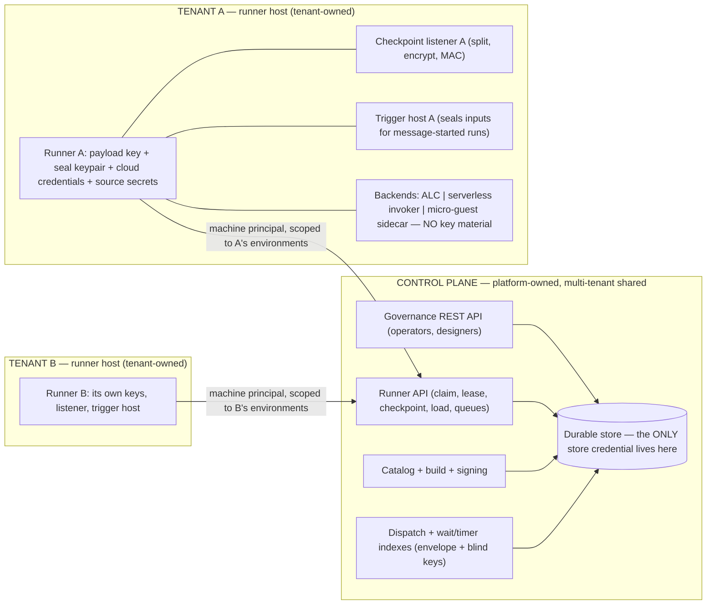
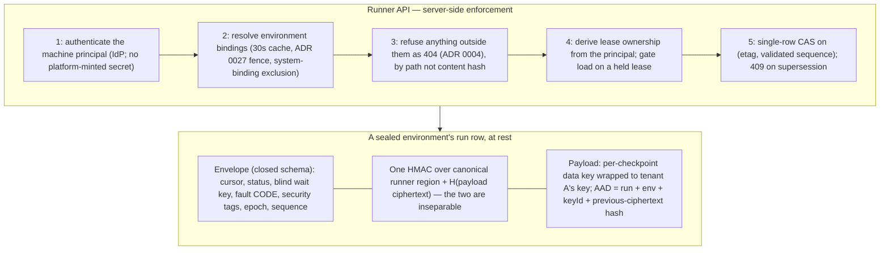

# ADR 0065. The control plane owns the store and fronts all checkpointing; runners encrypt the checkpoint payload

Date: 2026-08-01. Status: **Accepted**. Scope: the trust model between the control plane and runners in a multi-tenant deployment — who owns the durable store, how runners reach it, what each party can read and forge, and how tenants are separated on shared control-plane infrastructure. Revises the two-process shared-store topology ([ADR 0023](0023-two-process-store-as-queue.md)) and the checkpoint-listener deployment shape ([ADR 0062](0062-authenticated-serverless-checkpoint-callbacks.md)); builds on fail-closed non-disclosing enforcement ([ADR 0004](0004-fail-closed-non-disclosing-enforcement.md)), the security-posture enum ([ADR 0016](0016-control-plane-security-mode.md)), the resume-mode taxonomy ([ADR 0022](0022-resume-mode-taxonomy.md)), runner-to-environment binding ([ADR 0027](0027-runner-environment-binding.md)), canonical JSON ([ADR 0031](0031-content-hash-over-rfc8785-canonical.md)), and the runner-as-secure-boundary model ([ADR 0059](0059-serverless-deploy-runs-on-the-runner-as-the-secure-boundary.md)).

*Revision history: the first version sealed whole checkpoints away from the control plane, which broke governance and was reverted before release. The second inverted the topology as decided here. Two rounds of adversarial security review followed; both rounds' findings are folded into the decisions below, and what remains unfixed is listed as an accepted residue rather than left implicit.*

## Context

A security review of the store seam found the implemented model assumed one trust domain around the shared durability store, which is wrong for the intended deployment: **runners are owned by tenants**, checkpoints carry tenant data, and yet the control plane and every runner held full store credentials under one shared at-rest key, with the environment fences enforced by store-layer code running inside each runner's own process — real against bugs, voluntary against a hostile runner.

Two principles must hold at once:

1. **Tenant run data is isolated** — not readable by platform operators, backups, or other tenants, through key custody rather than policy code.
2. **The control plane governs every run.** Detail, cancel, resume, faulted-resume, purge, and audit are control-plane verbs over *all* runs. A design that blinds the control plane to run structure breaks the product; the first cut of this ADR did exactly that and was reverted.

The reconciliation splits on what each party needs. The control plane needs the run's *management structure* — where the run is, what it awaits, how it failed, when it moved. It does not need the tenant's *data* — the values flowing through the workflow. The runner needs both and already holds the tenant's keys for everything else.

**Nothing is shipped.** There is no deployed installation, no tenant data at rest, and no external consumer of the current wire or storage formats. This decision therefore carries no migration obligation and no compatibility hedge: the target design is built directly, the phases below are our own delivery sequencing rather than an upgrade path, and where an existing component contradicts this ADR (the checkpoint listener's deployment shape, the runner's store connection, the in-process draft runner) it is corrected rather than deprecated.

## Decision

**1. The control plane owns the durable store exclusively; runners hold no store credentials.** ADR 0023's "two processes sharing the store" is revised: the store-as-queue survives, but inside the control plane's boundary. Everything a runner did against the store — claim, lease renew and release, checkpoint save and load, timer and message queries, registry heartbeat, catalog artifact pull, deployment queue — becomes an operation on a **runner API** the control plane serves, deployed as a separately scalable component sharing the store with the governance API (preserving ADR 0023's real point: execution load never rides the governance request path). Interim checkpoint writes stay fire-and-forget with the terminal write awaited.

**2. Runners authenticate as their own machine principals; separation and lease ownership are enforced server-side.** No new bearer credential is minted: a runner authenticates with the machine principal it already has (client-credentials, private-key JWT, or mTLS through the deployment's IdP), so there is no long-lived platform-issued secret to steal from a decommissioned host. Environment bindings are resolved per request with a bounded cache (≤30 seconds), so the ADR 0027 revocation fence takes effect within that window. **Lease ownership derives from the authenticated principal** — a client-supplied owner string is rejected, every mutating operation presents its lease token, and revocation expires leases by principal, not by a self-asserted name a compromised runner could change. Registration hardens accordingly: `runners:register` is reach-scoped per environment (never the system context), an authorization row must exist before any registry row is written (so a foreign principal cannot squat a victim's runner id), and pre-authorization binds an expected principal or a short-TTL enrolment token rather than a bare, guessable id. **No principal may hold a `system` binding and a tenant binding simultaneously** — enforced when a binding is written and re-checked per request, because a principal holding both is a laundering route out of a sealed environment into the never-sealed platform one.

**3. Refusals are non-disclosing, and quotas are per tenant (ADR 0004).** An operation naming a run, artifact, or row outside the runner's bindings returns `404`, indistinguishable from a nonexistent one; only a capability failure returns `403`. Catalog artifacts are authorized **by path** (bound environment → deployment → version → package), never by bare content hash. Quotas are aggregate per tenant, not only per runner: a registered-runner cap per environment, a per-environment checkpoint rate, a total payload-bytes quota, a run-count cap, a parked-wait cap (blind index rows are high-entropy and undeduplicable), per-runner sub-limits, and a body-size cap. A quota rejection is a distinguishable retryable signal (`429`, runner-side hold and backoff) explicitly **exempt** from the fail-the-advance rule below, so a chatty legitimate workflow cannot be faulted mid-advance after its external calls have landed.

**4. The checkpoint is one row: a clear envelope and an encrypted payload, verified as a whole.** The **envelope** is run-management structure — cursor, status, wait, fault classification, retry counters, sequencing, timing, journal skeleton, and security tags. The **payload** is tenant data — run inputs, step outputs, extracted values, journal data content. The envelope's runner-authored region and the payload are **cryptographically inseparable**: the runner computes one HMAC (under an HKDF-derived subkey) over the RFC 8785 canonical form (ADR 0031) of the runner-authored region *concatenated with the hash of the payload ciphertext*, and the payload's AEAD binds that tag. A checkpoint verifies only as a whole; an envelope region from checkpoint *i* spliced onto the payload of checkpoint *j* fails, which the two independent authentications of the previous draft allowed.

The envelope is a closed schema that rejects unknown members, and its contents are constrained so it cannot become a data channel:

- **Fault**: a closed-vocabulary classification code plus `stepId` and `attempt`. Free-text failure descriptions and provider error bodies are payload.
- **Correlation**: *both* the wait match key and the run-level correlation id are blinded — `HMAC-SHA256(HKDF(payloadKey, "wait-index" ‖ keyId), len(channel) ‖ channel ‖ len(correlationId) ‖ correlationId)`, length-framed so `("orders","123")` and `("order","s123")` cannot collide — computed and queried by runners. Plaintext correlation ids live in the payload. A channel-only (wildcard) wait uses an explicit sentinel and is documented as leaking a per-channel constant; a sealed environment may forbid them. The store keys the index by `(keyId, index)` so both generations match during a re-key roll, and the runner verifies that a run returned for a query actually carries the queried index in its MAC'd region before delivering a message to it.
- **Security tags** are stamped from the catalog version at run start and live in the runner-MAC'd region: the control plane reads them (they drive the ADR 0004 reach gate) but cannot rewrite a run into another operator group's reach without failing verification.
- **Identifiers** are length- and charset-bounded, and for a sealed environment the journal records an index into an encrypted step map rather than the tenant-authored `stepId` — mandatory, not opt-in, because an identifier is otherwise an unbounded free-text channel.

**5. Payload encryption is envelope encryption under a per-checkpoint data key.** The environment's payload key is a **wrapping** key, never a direct AES-GCM key: each checkpoint generates a fresh data key, encrypts the payload with it, and stores the wrapped key alongside. Every wrap and unwrap carries an encryption context of `(environmentId, runId, keyId)`, enforced by the protector conformance suite, so a wrapped key is bound to the environment it was written for and a KMS audit trail can tell legitimate unwraps from foreign ones. Subkeys (`wrap`, `envelope-mac`, `wait-index`) come from HKDF-Expand with distinct length-framed info labels; the payload key is never used directly.

**6. Freshness is a validated monotonic sequence, a payload chain, and a server-minted lease epoch.** AAD binding alone is not freshness: an old checkpoint served with its own matching envelope verifies perfectly. The mechanism has three parts, and the previous draft's version of it was unimplementable — a runner must fix its AAD at encryption time, so the AAD cannot contain a value the server assigns afterwards:

- **Sequence**: the runner proposes `n`, the server accepts only `persisted + 1`, and the CAS predicate is `(etag, persistedSequence)`. The server *validates* rather than assigns, so the value is predictable to the writer and authoritative in the store. The runner-authored region carries `n` (inside the MAC), so a server that lies about acceptance is caught. A save that is superseded or dropped answers `409` with the accepted sequence and chain tip — never a `204` indistinguishable from a durable write — and a runner whose acknowledged tip differs from its own faults rather than chaining onto bytes that were never persisted.
- **Chain**: the payload AAD is `(runId, environmentId, keyId, previousPayloadCiphertextHash)`; the genesis link is `H(runId ‖ environmentId ‖ keyId ‖ sealed-inputs-ciphertext)`, unique per run, so rollback-to-genesis is not a free re-run.
- **Epoch**: the previous draft required a runner to remember writing the parent, which is unsatisfiable after a restart, across a lease handover between two of a tenant's own runners, when a run moves between backends, and always for a scale-to-zero listener — and the control plane decides when handover happens. Instead the control plane's lease grant carries a **monotonic epoch it can only increment**, minted server-side per grant and written by the runner into the MAC'd region. A runner refuses to open a checkpoint whose epoch is greater than or equal to one it has already observed for that run, and refuses any epoch above the one its current lease grants. Rollback is then detectable by state carried in the row rather than by process memory.

**7. Control-plane envelope writes are requests, and they do not collide with runner saves.** Cancel, resume request, and purge marker are control-plane-authored fields the runner validates against its own MAC'd state. They carry their own CAS predicate, distinct from the runner's `payloadSequence`, so a control-plane envelope write cannot invalidate an in-flight runner save — otherwise merely touching the envelope becomes a liveness weapon that faults an advance whose external effects have already landed, and the retry repeats them.

**8. Payload-mutating resume is a custody control, not an integrity control (ADR 0022).** Faulted-step retry and rewind stay control-plane verbs over the envelope. State-patch and skip-with-outputs mutate run inputs and step outputs, so for a sealed environment the control plane records the request and the environment's runner applies it inside its own boundary. **This must not be mistaken for protection**: the patch content is still authored by the control plane, and a runner cannot judge whether rewriting a payment amount was legitimate. For a sealed environment such a mutation therefore requires a tenant-side authorization — a signature from a tenant-held operator key, or an explicit confirmation at the runner — and the applied patch is recorded in the encrypted journal so the tenant can audit it.

**9. Run-start inputs are sealed by an initiator the tenant controls.** The initiator fetches the environment's public seal key, pins its fingerprint, seals the inputs, and submits ciphertext, so the control plane never holds plaintext inputs. The seal's AAD binds `(environmentId, baseWorkflowId, versionNumber, sealKeyId, initiatorNonce)` and the runner refuses a blob whose AAD does not match the run it is starting, or a nonce it has already seen — otherwise a sealed blob is a reusable capability the control plane can replay into unlimited fresh runs whose side effects land on tenant systems without it ever reading them.

Three consequences of this must be stated rather than assumed:

- **Browser-served initiators cannot provide this property.** The designer and console are served by the control plane, which could serve code that skips the pin or posts plaintext. Sealed-environment starts are therefore restricted to initiators whose code the tenant controls (the CLI, a tenant-hosted trigger host); a browser-initiated start is badged as control-plane-trusted on the run record and in the console rather than silently claimed as sealed.
- **Every ingress that carries inputs or business keys is in scope**: HTTP start, schedule create, run-schedule-now, message triggers, and the dispatcher workflow. A dispatcher *workflow* cannot start a sealed run (a workflow step is an ordinary HTTP call with no sealing machinery), so message-triggered starts for a sealed environment go through a runner-side trigger host that holds the seal key. Idempotency keys are blinded with the wait-index construction; a schedule's target inputs are sealed and never re-read by the control plane.
- **Input-schema validation moves to the runner** at first claim, since the control plane sees only ciphertext: the documented `422` becomes a fault classification, and decrypt or schema failures are rate-limited and counted against the environment's start quota so they cannot be used as an amplifier.

**10. Sealing is decided runner-side, fails closed on key unavailability, and is required in multi-tenant mode.** A runner's view of "this environment is sealed" comes from **its own configuration**, not the environment record: if a payload key is configured for a bound environment, the runner refuses to claim, advance, save, or serve a load when it cannot resolve that key — a key-resolution failure is a fault, never a cleartext write. The runner API independently refuses a cleartext payload for any environment whose record is sealed. The same rule governs the residue mitigations: a runner configured for a sealed environment **always** emits the reduced journal and pads payload ciphertext to length buckets, and the API refuses an unpadded or full-journal envelope — otherwise those mitigations are flags on a record the platform owns and can clear. Per ADR 0016, creating an environment without a key registration fails in the multi-tenant production posture; other postures badge unsealed environments on every view. The platform's own `system` environment is never sealed and its runs are platform data.

**11. Tenant-side execution infrastructure, and no key material in guests.** The serverless checkpoint listener terminates the guest's plaintext checkpoint, so it holds the payload key, performs the split-encrypt-MAC, and speaks the runner API; it never holds a store credential (the Container Apps recipe built for ADR 0062's live proofs gave it one, and that shape is corrected in phase A). Its **load path is a decryption oracle** — it serves plaintext for any run in the environment — so it authenticates with the platform's native workload identity in addition to the ADR 0062 token, the token secret is derived per `(environment, keyId)` from the payload key rather than a standalone shared secret, token lifetime is capped validator-side, and a listener compromise is recorded below as yielding the environment's plaintext.

**No payload key material, data-key generation, or nonce generation ever happens inside a micro-guest or serverless guest.** ADR 0064's snapshot-after-warm-up restores the guest CSPRNG to its snapshotted state, so a guest generating keys or nonces would repeat them on every advance of every run — forfeiting the authentication key the anti-forgery argument rests on. Encryption happens in the runner or listener process only.

**12. Key lifecycle, and an accurate account of purge.** Rotation registers a new key id (signed by the outgoing private key, so a pinned initiator accepts a successor automatically and an unsigned change is a hard fault; registration and rotation carry a proof of possession over `(environmentId, newKeyId, predecessorKeyId, server challenge)`). The first registration in a multi-tenant production environment blocks run starts until a tenant operator records an explicit fingerprint confirmation. A runner-driven **re-key sweep** re-seals payloads *and* re-derives wait indexes under the new id, retiring a compromised generation; a maximum generation lifetime is configured per environment.

Purge is described by enumeration, because a compliance reader needs precision: it removes the run row (envelope and payload together) and its wait and timer index rows. It does **not** reach governance-audit and telemetry records keyed by run and workflow id, nor store backups — which hold envelopes in the clear. Because payloads are envelope-encrypted, **crypto-shredding** (destroying a key generation, or wrapping per-run data keys under a per-run key) is the mechanism that makes payload erasure verifiable where row deletion cannot reach.

**13. Sequencing, and what each phase does and does not deliver.** Phase A: the runner API, machine-principal authentication and principal-derived leases, non-disclosing refusals and quotas, the validated sequence and single-row CAS with `409` on supersession, the listener re-platforming, and the retirement of runner store credentials. Phase B: the envelope/payload split, envelope-encrypted payloads with the chain and epoch, the unified MAC, blind indexes, client-side input sealing, and runner-mediated payload resume. Phase C: executor provenance under mutual distrust.

**Phase A carries no cryptography, so it leaves the control plane the sole custodian of every tenant's plaintext** — with runners stripped of even the distributed custody they had. The multi-tenant production posture therefore **fails construction** (ADR 0016 style, not a warning) until phase B is complete.

## Ownership



The control plane owns the store, the APIs, the catalog and build pipeline, dispatch, and every index — and holds no key that opens tenant data. Each tenant owns its runner host, listener, and trigger host, and every secret on them. The only path from a runner to durable state is the runner API.

## Tenant separation on shared infrastructure



Separation is layered, and each layer holds if the one above fails: a tenant's runner has no store credential to abuse; the API refuses cross-environment operations server-side and non-disclosingly; the payload is AEAD ciphertext under a key that never left its owner's custody; and the runner-authored region is MAC'd together with the payload, so platform tampering is detected rather than silently obeyed.

## The anatomy of an advance

```mermaid
sequenceDiagram
  participant I as Initiator (CLI / tenant trigger host)
  participant CP as Control plane (runner API + store)
  participant R as Tenant runner + listener
  participant G as Guest (backend, no key material)
  participant S as Tenant source API
  I->>I: pin the environment seal-key fingerprint, seal inputs (AAD binds env + workflow + version + nonce)
  I->>CP: start run (ciphertext inputs)
  R->>CP: claim (machine principal; lease grant carries a monotonic epoch)
  R->>R: open sealed inputs, validate against the version's input schema
  R->>G: invoke (ALC call, function URL, or micro-VM restore)
  G->>S: source call(s)
  G->>R: checkpoint back (Model B, ADR 0062 — to the TENANT's listener)
  R->>R: split; encrypt payload (fresh data key, AAD chains to previous ciphertext); one MAC over region + ciphertext hash
  R->>CP: save (proposed sequence validated as persisted+1; single-row CAS; 409 if superseded)
  Note over CP: governance reads and acts on the ENVELOPE of every run; payload-touching verbs are requests the runner applies
```

## Tenant-side data minimization (outside this platform's scope)

A tenant with strict governance obligations — GDPR and comparable regimes for personal data, or sector rules that forbid regulated values leaving a system of record — has an option stronger than any platform control: **design the workflow so the sensitive values never enter it.** Pass handles rather than values and let the tenant's own service resolve them; proxy third-party calls through a tenant-owned facade that injects regulated fields inside the tenant's boundary; return decisions rather than the records they were computed from; keep a regulated sub-process entirely tenant-side and report only its outcome.

This composes with the encryption design rather than replacing it, and it is the technique that most reduces the residues below — but it does **not** eliminate them, and the previous draft overclaimed here. A handle used as a correlation or idempotency key is still subject to blind-index equality and frequency analysis; run existence and rate, workflow and version identity, environment, source identity, step timing, and ciphertext length remain visible; and minimization does nothing about binding issuance or executor provenance, so it is no defence against a malicious control plane. Its real force is narrower and still valuable: it keeps the platform from being a processor of the regulated data at all.

The platform's obligations are to make this practical and to be accurate about what it holds: step data stays opaque, the documentation states exactly which fields are platform-visible so tenants can design around them, and no guidance suggests putting regulated values in tags, correlation ids, or workflow identifiers.

## Accepted residues

Two rounds of adversarial review shaped the decisions above. What remains, stated so nobody has to rediscover it:

- **Until phase C, this is confidentiality against passive platform operators, backups, and other tenants — not against a malicious control plane.** The platform code-generates, compiles, signs, and delivers the executor that holds the payload key and decrypts the data; a malicious control plane could bake an exfiltrating executor whose signature chain validates. Phase C (tenant countersignature) closes it; the cheap partial available sooner is a tenant-held allowlist of promoted content hashes that the runner refuses to load outside of.
- **The environment is the blast radius.** Bindings, the payload key, and API authorization are per environment, so a compromised runner host reads and rewrites every run in its environments, including runs it never executed. Checkpoint load is gated on a currently-held lease, with a separate audited, rate-limited bulk path for the re-key sweep, so bulk exfiltration is not an ordinary API loop.
- **A listener compromise yields the environment's plaintext**, because the listener's load path decrypts.
- **Envelope metadata is visible to the platform, and for data-dependent workflows that includes the decision, not merely the shape.** The mandatory reduced journal and length-bucket padding blunt this; retry counts, status, and timing still disclose control flow.
- **Blind indexes leak equality and frequency**, and a wildcard wait leaks a per-channel constant.
- **Rollback is detected at the next open, not prevented**, until a tenant-side chain-tip anchor exists.
- **Forced duplicate execution remains possible without forgery**: the control plane can expire a lease mid-advance and grant it elsewhere; the epoch makes the second holder detectable, but the external side effects of both advances have already landed.
- **Payload-mutating resume is custody, not integrity** (decision 8), and the tenant-side authorization is what makes it a control at all.
- **For sealed environments some read surfaces degrade to envelope-only**: the step-journal read, the outputs disclosure tier, and any schedule surface that reads a spec from run payload. "No verb is lost" applies to the mutating verbs, not to payload reads — and any future convenience that has the runner push a decrypted journal to the console reverses this entire decision.
- **Availability inverts relative to ADR 0023.** The control plane is on the hot path of every checkpoint of every tenant: an outage stalls execution and expires leases. The runner API is scaled and available ahead of governance, leases survive a blip without a mass re-claim storm, and any non-2xx on an interim save (other than a `429` quota hold) fails the advance rather than being dropped.

## Consequences

- The control plane governs every run with full envelope access — every mutating verb survives, two of them runner-applied — while tenant data is confidential against the platform's operators, other tenants, and backups by key custody.
- Runners lose their store credentials entirely, which dissolves the per-runner-database-role and row-level-security problem of the first design: there is no credential left to scope.
- ADR 0023 is revised, not discarded: the store stays the queue and the two-process split stays, but the runner's half speaks a versioned API — the new explicit seam, with a conformance isolation class exercising foreign, revoked, and cross-environment access, and protector conformance covering the encryption context.
- The in-process draft runner, the in-process simulator, and the draft-run trace store execute tenant code and persist plaintext step outputs inside the control-plane process. A runner bound to a sealed environment refuses draft runs, the runner API refuses draft-run and trace writes for one, and supplying those components to a control plane in the multi-tenant production posture fails construction.
- Every advance pays a runner-to-control-plane hop per checkpoint; task #222's instrumentation measures it, and the execution-backend trade-offs guide's checkpoint-locality story is rewritten for all backends uniformly. A performance review of this design produced [implementing secure checkpointing without paying for it twice](../guides/secure-checkpointing-performance.md), which is binding on the implementation: it sets the per-checkpoint budget (crypto under 5 µs, zero allocation, one round trip, zero KMS calls), specifies the optimizations that preserve each decision's property, names the costs that are unavoidable because they *are* the security design, and names the plausible-looking optimizations that would be security regressions.
- The checkpoint serialization is the envelope/payload split with the chain, built directly — nothing is deployed, so there is no legacy shape. An unsealed environment writes the same structure with its payload clear, and a multi-tenant-mode deployment cannot create one.
- The demo topology changes visibly: runners stop opening the shared database, and the AppHost wires runner-API addresses and machine-principal credentials instead of a connection string.