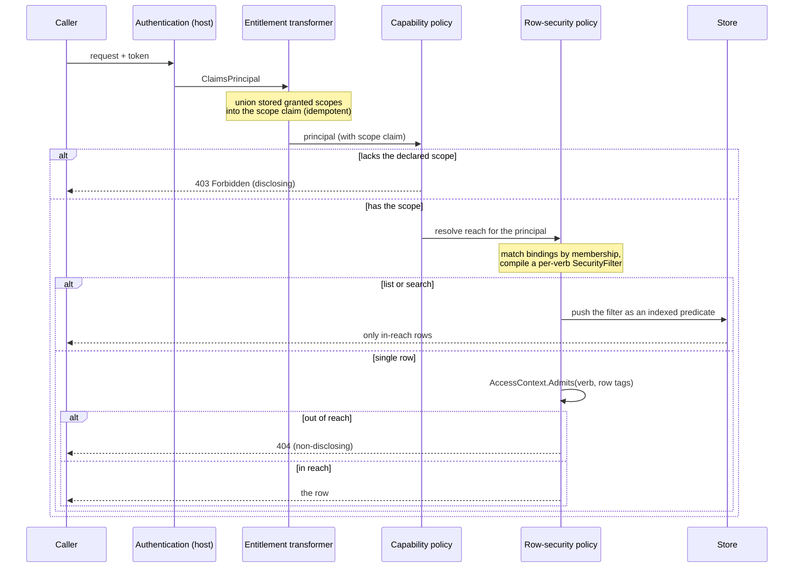
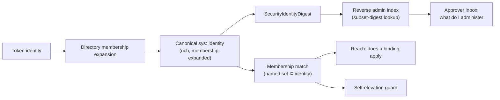
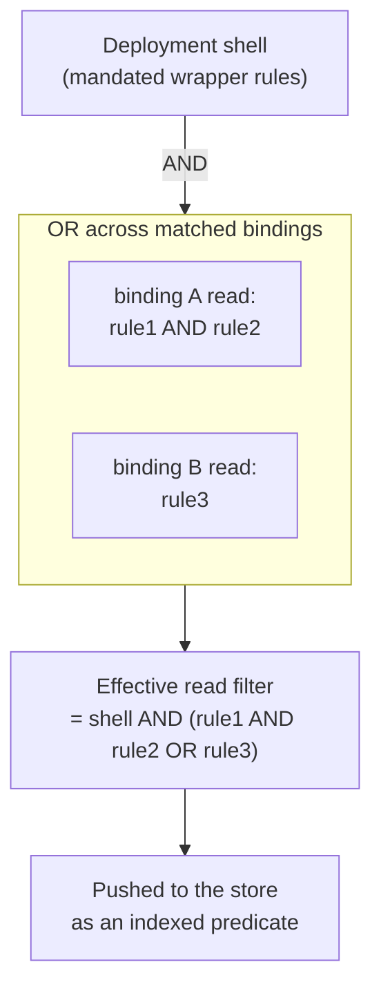
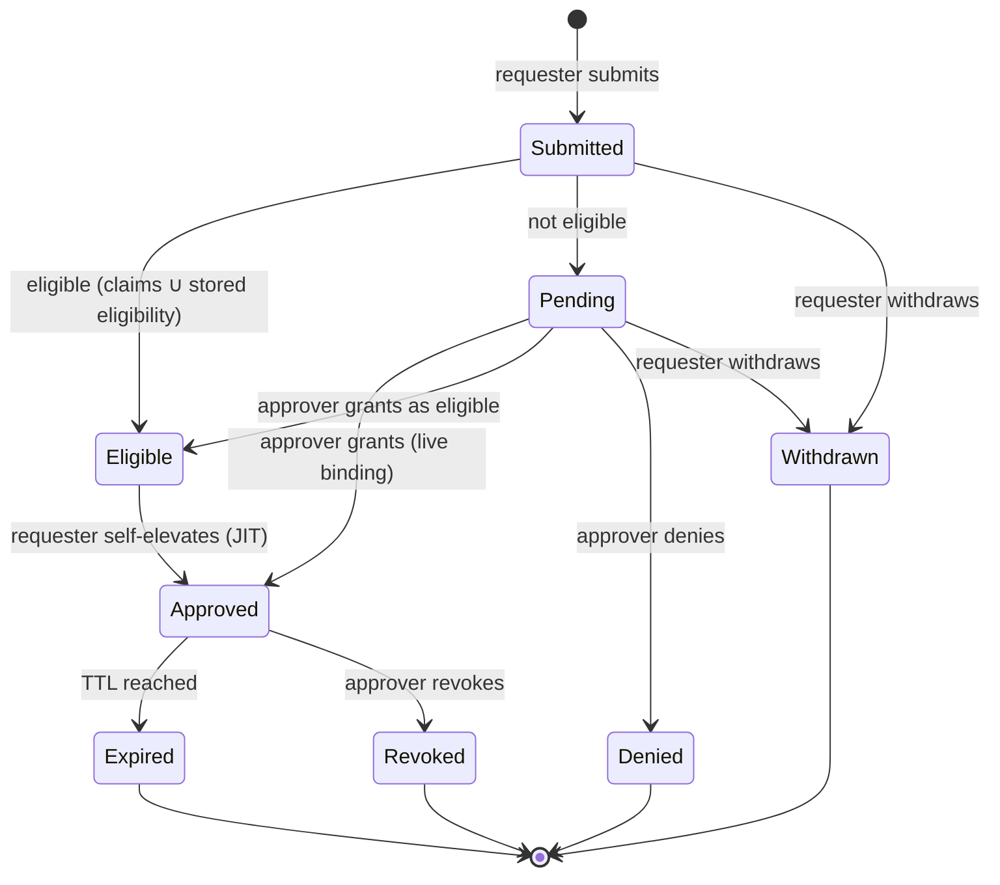

# Authentication and authorization

This guide explains how the Arazzo control plane decides whether a request is allowed, and how to configure and
author that policy. It is the how-to companion to the access-model ADRs. Where a decision needs its rationale,
the guide links to the ADR that records it; the ADRs are under [`../adr/`](../adr/README.md).

## Overview: two planes

Every request is decided on two independent planes, and both must pass ([ADR 0001](../adr/0001-two-plane-access-model.md)).

- **Capability** answers *what may the principal do*. It is coarse, per-operation, and carried as token
  `scope` claims. A capability failure is a `403 Forbidden`: the operation exists, you may not invoke it.
- **Reach** answers *which rows may the principal touch*. It is fine, per-row, and authored as grant bindings
  and rules over row security tags. A reach failure is non-disclosing: an out-of-reach row is `404`,
  indistinguishable from a row that does not exist ([ADR 0004](../adr/0004-fail-closed-non-disclosing-enforcement.md)).

The verbs on a grant (`read`, `write`, `purge`) are reach levels, never capability scopes
([ADR 0002](../adr/0002-grant-verbs-are-reach-not-scopes.md)). Capability governs whether you may call an
operation at all; reach governs which of the rows behind it are yours.

## Choosing a security posture

A deployment names its posture with one required `ControlPlaneSecurityMode`. There is no default, so a
deployment can never end up open, or scoped without reach, by omission ([ADR 0016](../adr/0016-control-plane-security-mode.md)).

| Mode | Authentication | Capability | Reach | Use |
|------|:---:|:---:|:---:|-----|
| `Open` | no | no | none (System) | Local development and trusted networks only. Logged loudly at startup. |
| `Scoped` | yes | yes | policy | The production posture. A policy is required. |
| `ScopesOnly` | yes | yes | none (System) | A single-tenant deployment wanting capability gating without row security. |
| `RowSecurityOnly` | yes | yes for reach | policy | Every authenticated principal may invoke every operation, restricted only by row reach. |

A mode that requires a policy fails construction if none is supplied, and a mode that forbids one fails if one
is, so a contradictory configuration is a startup error, not a silent misconfiguration.

## Wiring authentication

The control plane does not embed an identity provider. The host owns authentication with any ASP.NET
authentication scheme (OpenID Connect, JWT bearer, mTLS, or a bespoke scheme), and the control plane keys
entirely on the resulting `ClaimsPrincipal`. How the claims are acquired is the host's concern.

Capability scopes ride the token as the `scope` claim. Some capability grants originate inside the control
plane (an access-request approval writes one), and those are unioned into the `scope` claim at authentication
time by `ControlPlaneEntitlementClaimsTransformer`, an `IClaimsTransformation`. The identity provider is never
written ([ADR 0005](../adr/0005-entitlement-scopes-union-into-claims.md)). A principal with no stored grant is
returned unchanged, so the common path allocates nothing.

## The enforcement flow

A request passes through the two planes in order. Capability is checked first, then reach is resolved and
applied.

The steps map to code as follows. Authentication is the host's scheme. The entitlement transformer is
`ControlPlaneEntitlementClaimsTransformer`. The capability check is the declared-scope authorization
convention (`ControlPlaneAuthorization`). Reach resolution is `ControlPlaneAccess.Current()` calling
`PersistentRowSecurityPolicy.Resolve`, producing an `AccessContext` with a `SecurityFilter?` per verb. A list
pushes the filter into the store (`SecurityFilter.ToSqlPredicate`); a single row gates through
`AccessContext.Admits`.

Reach fails closed at every gate: an empty rule set admits nothing, an untagged row is invisible to a scoped
principal, an unranked ordered comparison denies, and a policy that has not yet loaded denies everything
([ADR 0004](../adr/0004-fail-closed-non-disclosing-enforcement.md)). The only ways enforcement admits without a
matching rule are the named operator and system cases (a null reach, or `AccessContext.System`).

## Identity, tags, and the shell

A principal has an identity: an unforgeable, deployment-stamped set of `{key, value}` tags, held as a
`SecurityTagSet`. Reserved tags carry the `sys:` prefix (`sys:tenant`, `sys:sub`, `sys:iss`, `sys:group`), and
are deployment-owned. A user may not author a `sys:` tag, and `sys:` tags are stripped from client responses,
so internal identity dimensions can be neither forged nor observed
([ADR 0006](../adr/0006-deployment-access-control-shell.md)).

Every authorization facet matches a principal against a named identity by **membership**: the named tag set is
a subset of the principal's identity ([ADR 0003](../adr/0003-membership-matching-over-canonical-identity.md)).
A binding keyed on `team=payments` applies to any principal whose identity contains that tag, whatever else
they are.

The identity is resolved once, including membership expansion by the directory adapters, then every facet
(reach, administration, self-elevation, usable-credential) uses the same subset test. The deployment's
**access-control shell** wraps every principal's reach in mandated rules that a user grant can only narrow
within, never widen past, so a tenant boundary holds regardless of the grants authored
([ADR 0006](../adr/0006-deployment-access-control-shell.md)).

## Authoring reach: rules and grants

Reach is authored in two layers.

- A **rule** is a reusable named row-filter expression over row tags and principal claims. Rule expressions
  reuse the Arazzo `simple`-criterion grammar (equality, `&&` / `||` / `!`, grouping, `in (...)`, ordered
  comparisons against configured label orderings, and `$claim.<name>` claim operands). Rules are managed on
  their own surface (`/security/rules`), and the label orderings they compare against are configured and
  served at `/security/orderings`.
- A **grant binding** maps `claim -> {read, write, purge}`, where each verb is either unrestricted (every row)
  or a set of named rules. The claim is the binding's key (a resolved grantee identity,
  [ADR 0008](../adr/0008-resolved-grantee-resolution.md)); the additional clauses form a tag-set selector.

Composition has one fixed direction ([ADR 0002](../adr/0002-grant-verbs-are-reach-not-scopes.md)): rules
conjoin within a verb (adding a rule narrows), bindings union across matches (matching another binding
widens), and the shell conjoins around the whole result.

An either-or intent ("this claim or that claim") is expressed as two bindings whose reaches union, never as an
`OR` inside a rule. A must-hold-both intent is expressed as rules conjoined within one binding.

Grantees are always resolved to an exact identity before a binding stores them, from the observed-identity
typeahead or a configured directory, never authored as a free-form tuple the system later guesses at
([ADR 0008](../adr/0008-resolved-grantee-resolution.md)). That is what makes membership matching safe from
coarse over-reach.

## Administration

Some rights follow the resource rather than a capability scope. Publishing a further version of a workflow,
and managing who administers it, belong to that workflow's administrators, a set of resolved identities. A
caller administers a target when their stamped identity contains one of the target's administrator identities
([ADR 0007](../adr/0007-administrator-resolved-identity-digest-keyed.md)). Environments use the same model,
which is why promoting a version into an environment is gated on that environment's administrator set.

The set is keyed by each identity's canonical digest, and a reverse index answers the approver's question
("which workflows do I administer") as an indexed subset-digest lookup rather than a scan, so the approver
inbox is cheap.

## The entitlement lifecycle

Capability and reach can be authored directly (a `security:write` grant) or reached through a request. The
authoring path is split by binding type ([ADR 0014](../adr/0014-direct-grant-versus-request-only.md)): standing
group or policy bindings may be granted directly, while granting one named person elevated access goes through
the request-and-approve flow, so it always involves a second party. A server-side self-elevation guard refuses
any binding, direct or requested, that would grant the caller itself elevated write or purge reach.

An access request grants a ceiling-bounded, subject-pinned slice of access
([ADR 0010](../adr/0010-access-requests-ceiling-bounded.md)): at most the requested scopes intersected with a
run-access allowlist, fixed to the requester, pinned to the target workflow, and capped at the deployment
maximum TTL. Security, purge, administration, and escalation are out of reach of the request path.

A request is never decided by its own requester, even an administrator (the independent-decision rule,
[ADR 0009](../adr/0009-eligible-versus-active-self-elevation.md)). An eligibility confers nothing at rest: the
reach resolver excludes `eligibleOnly` bindings, so a person holds the access only after activating it.

How the decision is reached is a replaceable strategy ([ADR 0011](../adr/0011-approval-is-a-strategy-seam.md)).
The built-in strategy is a synchronous single approver. The workflow-backed strategy makes the decision an
ordinary Arazzo workflow, with the approver's decision delivered over a channel rather than a bespoke call
([ADR 0012](../adr/0012-approval-decision-delivery.md)). Every strategy grants through the same ceiling, so the
seam changes how a decision is reached, never what it may grant.

## Reading effective access

The "who can do what, where" overview for one grantee (capabilities, matching reach bindings, administered
workflows and environments, usable credentials) is computed on the server, against the same identity
resolution and prefix handling that enforcement uses
([ADR 0015](../adr/0015-access-overview-server-aggregated.md)). Because the overview runs the resolver's match,
it cannot disagree with what the server enforces. The client fetches the aggregate and renders it. The bounded
summary is one call; the unbounded lists (reach, administered, credentials) are keyset-paged sub-resources.

## Disclosure tiers

Reading that a run exists is `runs:read`. Reading its step outputs is a stronger, separate grant,
`runs:outputs:read`, ANDed above the read scope ([ADR 0013](../adr/0013-step-output-disclosure-tier.md)). A
workflow version carries an output-sensitivity classification; a sensitive version's outputs are redacted from
a caller who holds `runs:read` but not `runs:outputs:read`, and every read across the boundary is audited with
a `workflow.journal.read` span recording whether the payloads were returned in full, redacted, or refused.

## See also

- The access-model ADRs, [`../adr/README.md`](../adr/README.md), for the rationale behind each decision here.
- The execution-host design specification for the exhaustive behaviour of the security shell, administration,
  and the entitlement lifecycle.
