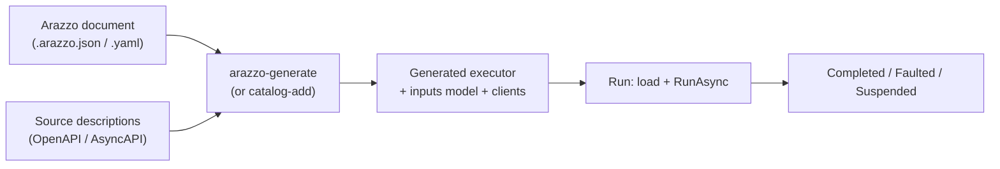

# Authoring, generating, and running a workflow

This guide walks the Arazzo pipeline end to end: write a workflow document, generate a typed executor from it,
and run that executor. It is the how-to companion to the engine ADRs under [`../adr/`](../adr/README.md); where
a design choice needs its rationale, the guide links to the ADR that records it.

## Overview

Arazzo is a specification for describing a workflow as a sequence of steps that call operations, pass data
between them, and branch on criteria. Corvus compiles an Arazzo document ahead of time into a strongly-typed
executor, rather than interpreting the document at run time
([ADR 0017](../adr/0017-code-generate-the-executor.md)). The pipeline has three stages.



## Authoring a workflow

A workflow document is OAI Arazzo `1.1.0`, written in JSON or YAML (YAML is converted on load). It names the
source descriptions it orchestrates, and one or more workflows. Each workflow declares typed `inputs` (a JSON
Schema), and an ordered list of steps. A step calls an operation on a source (by `operationId` or
`operationPath`), supplies its request from inputs and earlier steps' outputs, checks success criteria, and
extracts outputs that later steps read.

```json
{
  "arazzo": "1.1.0",
  "info": { "title": "Onboard customer", "version": "1.0.0" },
  "sourceDescriptions": [
    { "name": "onboarding", "url": "./onboarding.openapi.json", "type": "openapi" },
    { "name": "kyc", "url": "./kyc.openapi.json", "type": "openapi" }
  ],
  "workflows": [
    {
      "workflowId": "onboard-customer",
      "inputs": {
        "type": "object",
        "required": ["email"],
        "properties": {
          "email": { "type": "string", "format": "email" },
          "fullName": { "type": "string" },
          "plan": { "type": "string", "enum": ["free", "pro"] }
        }
      },
      "steps": [
        {
          "stepId": "createAccount",
          "operationId": "createAccount",
          "requestBody": {
            "payload": { "email": "$inputs.email", "fullName": "$inputs.fullName" }
          },
          "outputs": { "accountId": "$response.body#/accountId" }
        },
        {
          "stepId": "verifyIdentity",
          "operationId": "verifyIdentity",
          "parameters": [
            { "name": "accountId", "in": "path", "value": "$steps.createAccount.outputs.accountId" }
          ],
          "successCriteria": [
            { "condition": "$statusCode == 200" },
            { "condition": "$response.body#/score >= 0.8" }
          ]
        }
      ],
      "outputs": { "accountId": "$steps.createAccount.outputs.accountId" }
    }
  ]
}
```

This workflow exercises the common building blocks: typed inputs, a request assembled from `$inputs.*`, an
output extracted with `$response.body#/...`, a later step chained on an earlier step's output through
`$steps.<id>.outputs`, and success criteria. A step can also declare `onSuccess` and `onFailure` actions
(`end`, `goto`, `retry`), which turn the generated executor from a straight line into a labelled loop; and an
AsyncAPI source lets a step send or receive a message on a channel. The runnable samples under
`samples/arazzo/*/specs/` show these in full.

## Generating an executor

The `arazzo-generate` command compiles a document into a typed executor, its inputs model, and filtered
clients for the referenced sources.

```
corvusjson arazzo-generate ./onboard-customer.arazzo.json \
  --rootNamespace MyApp.Workflows \
  --outputPath ./Generated \
  --durable
```

The options are:

| Option | Meaning |
|--------|---------|
| (argument) | The Arazzo document to generate from. |
| `--rootNamespace` | The namespace for the generated workflows, models, and clients (default `GeneratedWorkflows`). |
| `--outputPath` | Where to write the generated files (default `./Generated`). |
| `--clientName` | A client-name prefix for the generated OpenAPI clients. |
| `--durable` | Generate durable executors that checkpoint and resume ([ADR 0020](../adr/0020-durability-is-opt-in-codegen.md)). |
| `--force` | Regenerate even when the lock file says nothing changed. |

The generator emits **only the operations the workflow references**, and the schema models those operations
reach, not a full client per source ([ADR 0018](../adr/0018-generate-only-what-is-used.md)). It writes a
`corvusjson-arazzo.lock` lock file recording the document and every resolved source pinned by content hash, so
a re-run regenerates only when something changed. The companion `arazzo-show` command prints the source,
workflow, and step tree without generating.

For each workflow the generator emits an inputs model (under `Models/<Workflow>/`) and an executor class
(under `Workflows/`): a static `ExecuteAsync` that runs the steps, plus a non-generic `IHostedWorkflow` adapter
so a host runs the workflow without referencing the generated types
([ADR 0017](../adr/0017-code-generate-the-executor.md)).

### Generating at catalog-add

When a package is added to the control-plane catalog, the executor is generated and compiled in memory rather
than checked in. `WorkflowExecutorProvider.BuildExecutor` generates the clients and executor, compiles them
into a single assembly, and emits a manifest binding the assembly digest and package hash to the version, so
the catalogued package is immediately runnable. A package that cannot be compiled is still catalogued, marked
not-runnable.

## Running the executor

A host runs a workflow through the non-generic `IHostedWorkflow` adapter. The shape of the call is:

```csharp
WorkflowRunResultKind result = await workflow.RunAsync(
    apiTransports,       // IReadOnlyDictionary<string, IApiTransport>, keyed by source-description name
    messageTransport,    // IMessageTransport?, null when the workflow needs no messaging
    workspace,           // JsonWorkspace the built outputs go into (caller-owned)
    inputs,              // JsonElement: the workflow inputs
    run,                 // IWorkflowRun: the durability seam (a no-op run for the in-process case)
    cancellationToken);
```

Inputs arrive as an opaque `JsonElement`; the adapter parses them to the generated inputs type. Each OpenAPI
operation step calls through `apiTransports`, keyed by the source-description name it belongs to. AsyncAPI send
and receive steps use `messageTransport`, which is `null` when `WorkflowDescriptor.NeedsMessageTransport` is
false. The built values (step outputs and workflow outputs) go into the caller-owned `JsonWorkspace`. The
result is tri-state: `Completed`, `Faulted`, or `Suspended`.

### Loading a compiled executor

Where the executor was compiled into an assembly (the catalog case), a host loads it through
`WorkflowExecutorLoader.Load`, which verifies integrity (the assembly digest matches the manifest, the package
hash matches the expected content hash, and the target framework matches), optionally verifies a detached
signature against a trust store, loads the assembly into a collectible `AssemblyLoadContext` keyed by
`(baseWorkflowId, versionNumber)`, and caches it. Unloading a version disposes its load context so an obsoleted
version evicts, while in-flight runs keep it alive.

## Durability

Durability is opt-in at generation ([ADR 0020](../adr/0020-durability-is-opt-in-codegen.md)). A non-durable
executor runs as plain typed code with no per-step write. A durable executor threads an `IWorkflowRun` and
checkpoints after each step, so a crash can resume from where it stopped.

The resumable state is the run's step outputs plus a scalar cursor: the products the executor already built
are the checkpoint ([ADR 0019](../adr/0019-products-are-the-checkpoint.md)). A fresh run has `Cursor == 0` and
empty outputs, and the generated `while`/`switch` executor jumps straight to the cursor, so a fresh run and a
resumed run enter the same code the same way.

```mermaid
sequenceDiagram
    participant E as Executor
    participant R as IWorkflowRun
    participant S as State store
    loop each step, starting at Cursor
        E->>E: run step (build its output)
        E->>R: CheckpointAsync(cursor)
        R->>S: persist outputs + cursor
    end
    alt suspends (timer or message)
        E->>R: SuspendForTimerAsync / SuspendForMessageAsync
        R->>S: persist wait
        Note over S: woken later; re-enter at Cursor
    else completes
        E->>R: CompleteAsync(outputs)
    else faults
        E->>R: FaultAsync(stepId, attempt, error)
    end
```

A durable run persists its checkpoint through `IWorkflowStateStore`, and a run that suspends (a durable timer
or a correlated receive) uses the optional `IWorkflowWaitIndex`
([ADR 0021](../adr/0021-state-store-abstraction.md)). A faulted run is recovered by one of the four resume
modes, retry, rewind, skip, or state-patch ([ADR 0022](../adr/0022-resume-mode-taxonomy.md)).

## In-process versus a runner

A workflow runs in one of two places, cooperating only through the shared durability store.

- **In-process.** A host calls `RunAsync` directly. This suits short workflows and the non-durable case.
- **A runner.** A separate runner process claims durable runs from the store through the run lease and advances
  each one, loading the version's compiled executor into a collectible load context on first use. The control
  plane and the runner never call each other on the hot path; they cooperate through the store. The runner and
  execution-host guide covers deploying and operating a runner.

## See also

- The engine and durability ADRs, [`../adr/README.md`](../adr/README.md), for the rationale behind each choice
  here.
- The runnable samples under `samples/arazzo/*/specs/` for complete Arazzo documents, including retry, async
  message, and multi-source workflows.
