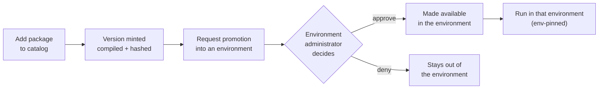

# The catalog: packaging, publishing, and promotion

This guide covers how a workflow is packaged, published to the catalog, and promoted across environments. It
is the how-to companion to the catalog ADRs under [`../adr/`](../adr/README.md).

## The package

A catalogued workflow version is a self-contained package: the Arazzo workflow document, every OpenAPI and
AsyncAPI source it references, optional precomputed schema metadata, and the compiled executor, bundled into
one artifact ([ADR 0030](../adr/0030-immutable-content-hashed-versioned-packages.md)). The container is a
small, deterministic length-prefixed (TLV) framing with the magic `"AWP"`, not a ZIP, so it packs and unpacks
with spans over a single buffer ([ADR 0032](../adr/0032-awp-deterministic-tlv-container.md)).

A version is immutable and content-addressed. Its identity is the SHA-256 of the RFC 8785 canonical form of its
logical `{ workflow, sources }` content, independent of how the bytes are framed
([ADR 0031](../adr/0031-content-hash-over-rfc8785-canonical.md)). The same logical content is the same version,
whether it was packed once or repacked, and a client can reproduce the hash from the content alone.

## Publishing a version

Adding a package to the catalog mints a version. The store assigns the next version number for the base
workflow id, rewrites the workflow id to `{baseWorkflowId}-v{versionNumber}`, generates and compiles the
executor, bakes the assembly and its manifest into the package, hashes the canonical content, and persists it
([ADR 0030](../adr/0030-immutable-content-hashed-versioned-packages.md),
[ADR 0033](../adr/0033-compile-at-catalog-add.md)). The submitter provides the base id; the store owns
versioning, so a submission that already carries a `-vN` suffix is rejected.

Because the executor is compiled at add, a version is runnable the moment it is published, and a runner needs
only to load the baked assembly rather than compile one. A package that cannot compile is still catalogued,
marked not-runnable, so the catalogue records it while the runtime declines to run it. Publishing a further
version of a workflow requires being one of its administrators
([ADR 0007](../adr/0007-administrator-resolved-identity-digest-keyed.md)).

## Running a published version

A published version is run through the control plane's run-start endpoint,
`POST /catalog/{baseWorkflowId}/versions/{versionNumber}/runs`. It validates the inputs against the version's
baked schema, gates on `runs:write`, pins the version in the path, creates a durable run, and returns `202`
([ADR 0026](../adr/0026-triggers-async-by-default.md)). This endpoint is the "publish the workflow at a
configured, secured HTTP endpoint" capability, which is why a separate hosting service is not required
([ADR 0034](../adr/0034-standalone-hosting-not-required.md)).

## Promotion across environments

Cataloguing a version does not by itself make it runnable in a given environment. A version is **made
available** in an environment through `IAvailabilityStore.MakeAvailableAsync`, and promotion into an
environment is governed by that environment's administrators.

A version's **readiness** for an environment reflects whether the sources it references have credentials in
that environment: a version whose sources are not credentialed there is not ready to run, even if it is
catalogued. An administrator of an environment either makes a ready version available directly, or acts on a
promotion request from someone who is not an environment administrator. Promotion is gated on
`availability:write`, which is authorized by the target environment's administrator set
([ADR 0027](../adr/0027-runner-environment-binding.md)), and a run is pinned to its environment, so it executes
only on a runner authorized for that environment.

## See also

- The catalog ADRs, [`../adr/README.md`](../adr/README.md), for the rationale behind the packaging and
  publishing decisions.
- The [runner guide](running-a-runner.md) for how an environment-pinned run is claimed and executed.
- The [auth and authorization guide](auth-and-authorization.md) for administration and the request-and-approve
  flow that governs promotion.
