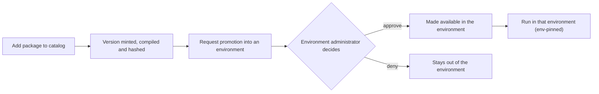

# The workflow catalog: packaging, publishing, and promotion

A governance and usability service in the control plane: an immutable, content-hashed, versioned store of
**workflow packages** (an Arazzo workflow plus the OpenAPI and AsyncAPI documents it references), with search, a
governance owner, referential integrity against runs, and an obsolete-then-purge lifecycle.

The decisions behind it are the catalog ADRs, [0030](../adr/0030-immutable-content-hashed-versioned-packages.md)
(immutable content-hashed packages), [0031](../adr/0031-content-hash-over-rfc8785-canonical.md) (the content
hash), [0032](../adr/0032-awp-deterministic-tlv-container.md) (the `.awp` container),
[0033](../adr/0033-compile-at-catalog-add.md) (compile at add), and
[0034](../adr/0034-standalone-hosting-not-required.md) (no standalone hosting service). This guide covers the
data model, the operation surface, the store, publishing, and promotion across environments, the exhaustive
detail those ADRs do not carry.

## Data model

A catalog **version** is the unit; versions of one logical workflow share a `baseWorkflowId`. Immutability and
content-addressing are [ADR 0030](../adr/0030-immutable-content-hashed-versioned-packages.md).

**Immutable** (fixed when the version is added; these define the content hash):

| Field | Source |
|-------|--------|
| `baseWorkflowId` | the submitted workflow id (must have no `-vN` suffix) |
| `versionNumber` | assigned by the store, (current max for the base id) + 1 |
| `workflowId` | `{baseWorkflowId}-v{versionNumber}`, the stored id runs execute under |
| `hash` | SHA-256 over the RFC 8785 canonical form of the logical `{ workflow, sources }` content ([ADR 0031](../adr/0031-content-hash-over-rfc8785-canonical.md)) |
| `title`, `description` | from the workflow's `info.title` / `info.description` (fallback `info.summary`) |
| `sources` | the list of `{ name, type }` from the workflow's `sourceDescriptions`, so a client knows which documents are addressable |
| `createdBy`, `createdAt` | the authenticated actor and time of the add |

**Mutable governance metadata** (every change stamps `lastUpdatedBy` and `lastUpdatedAt`):

| Field | Notes |
|-------|-------|
| `owner` | `{ name, email, team?, url? }`, the accountable owner |
| `tags` | free-form string set, AND-matched for filtering |
| `status` | `Active` or `Obsolete` |
| `securityTags` | the version's reach labels (§14.2 security campaign) |
| `outputsSensitivity` | the step-output disclosure classification ([ADR 0013](../adr/0013-step-output-disclosure-tier.md)) |
| `obsoletedBy`, `obsoletedAt` | the actor and time the version was marked `Obsolete` (null while Active) |

Audit is fields-on-the-record (`createdBy` / `lastUpdatedBy` / `obsoletedBy` plus timestamps) for governance
visibility; the forensic trail is OpenTelemetry, not a separate audit-log entity. The package never changes; a
"new version" is a new version record, and only governance metadata is mutable.

### Package format

A package (`.awp`) is a self-contained, length-prefixed **binary TLV container**, moved as a file and stored
verbatim, not a ZIP ([ADR 0032](../adr/0032-awp-deterministic-tlv-container.md)). It is implemented by
`WorkflowPackage` (`PackPooled` / `Open`) in `Corvus.Text.Json.Arazzo.Durability`. The framing (all multi-byte
integers little-endian):

| Part | Layout |
|------|--------|
| header | magic `AWP` (3 bytes), `formatVersion` (1 byte), `entryCount` (uint32) |
| entry | `nameLen` (uint16), name (UTF-8), `encoding` (1 byte, 0 = stored), `dataLen` (uint32), data |

Entries are written in a deterministic **fixed bucket order** (the workflow document first, then the source
documents sorted by name, then the metadata entries), so identical content yields identical bytes. The logical
entries:

| Entry | Contents |
|-------|----------|
| `workflow.json` | the Arazzo workflow document |
| `sources/<name>.json` | each referenced source document (name = a `sourceDescriptions[].name`) |
| `metadata/schemas.json` | precomputed schema metadata |
| `metadata/executor.dll` | the compiled workflow executor assembly (binary) |
| `metadata/executor-manifest.json` | the executor manifest (target framework, integrity binding, entry type) |
| `metadata/executor-manifest.sig` | the optional detached executor-manifest signature ([ADR 0025](../adr/0025-integrity-binding-optional-signature.md)) |
| `metadata/scenarios.json` | the version's scenarios |
| `metadata/evidence.json` | the promotion-readiness evidence document |

The `encoding` byte is `0` (stored) today; non-zero is reserved for a future per-entry compression without a
format break. The content hash is over the logical `{ workflow, sources }` only, independent of the container
framing, so it is stable across repacks, property ordering, and whitespace
([ADR 0031](../adr/0031-content-hash-over-rfc8785-canonical.md)). `WorkflowPackage`, the CLI's `pack` /
`unpack` / `verify`, and the zero-dependency browser builder (`web/arazzo-control-plane-ui/src/workflow-package.js`)
produce and consume it.

### Workflow-id rewrite

On add, the store reads the submitted workflow id and rejects (`400`) an id already matching `-v\d+$`, computes
`versionNumber` and the versioned id, and rewrites the workflow document's `workflowId` to the versioned form
before hashing and storing, so the persisted package and any run created from it agree on the id
(`CatalogPackage.Project`).

## API

Metadata is JSON; the package is uploaded as a file (multipart) and its documents are downloaded by addressable
endpoint. The surface is 18 operations, all under the `catalog` tag except the run trigger. The contract
([`../../reference/control-plane-rest-api.md`](../reference/control-plane-rest-api.md)) is authoritative for
the request and response schemas.

| HTTP | Path | operationId | Scope | Purpose |
|------|------|-------------|-------|---------|
| `POST` | `/catalog` | `addCatalogVersion` | `catalog:write` | Upload a new version (`multipart/form-data`: a `package` file part plus `owner` and `tags`). |
| `GET` | `/catalog` | `searchCatalog` | `catalog:read` | Search (filters `q`, `baseWorkflowId`, `workflowIdPrefix`, `tag` repeatable AND, `status`, `owner`, `distinctWorkflows`; keyset paged). |
| `GET` | `/catalog/count` | `countCatalog` | `catalog:read` | The bounded count for a search ([ADR 0036](../adr/0036-bounded-count-contract.md)). |
| `GET` | `/catalog/{baseWorkflowId}` | `listCatalogVersions` | `catalog:read` | List the versions of a base id. |
| `GET` | `/catalog/{baseWorkflowId}/versions/{n}` | `getCatalogVersion` | `catalog:read` | A version's metadata (no documents embedded). |
| `GET` | `.../package` | `getCatalogPackage` | `catalog:read` | Download the whole `.awp` (streamed `application/octet-stream`). |
| `GET` | `.../workflow` | `getCatalogWorkflow` | `catalog:read` | Just the Arazzo document (`application/json`). |
| `GET` | `.../sources/{name}` | `getCatalogSource` | `catalog:read` | One referenced source document by `sourceDescriptions` name. |
| `GET` | `.../schemas` | `getCatalogWorkflowSchemas` | `catalog:read` | The precomputed schema metadata. |
| `GET` | `.../executor` | `getCatalogExecutor` | `catalog:read` | The compiled executor assembly (present only on a runnable version). |
| `GET` | `.../executorManifest` | `getCatalogExecutorManifest` | `catalog:read` | The executor manifest. |
| `GET` | `.../evidence` | `getCatalogEvidence` | `catalog:read` | The promotion-readiness evidence document. |
| `POST` | `.../validate` | `validateCatalogValue` | `catalog:read` | Validate a value against one of the version's baked schemas. |
| `POST` | `.../simulate` | `simulateCatalogVersion` | `catalog:read` | Simulate the version against a scenario. |
| `POST` | `.../runs` | `startCatalogWorkflowRun` | `runs:write` | Trigger a run of a runnable version (validates inputs, `202 Accepted`; `409` if not runnable, `422` if inputs invalid). |
| `PATCH` | `/catalog/{baseWorkflowId}/versions/{n}` | `updateCatalogVersion` | `catalog:write` | Update governance metadata (`owner`, `tags`, `status`, `securityTags`, `outputsSensitivity`). |
| `DELETE` | `/catalog/{baseWorkflowId}/versions/{n}` | `deleteCatalogVersion` | `catalog:purge` | Delete one version (`409` if any run references its `workflowId`). |
| `PURGE` | `/catalog` | `purgeCatalog` | `catalog:purge` | Bulk-reap obsolete versions with no referencing runs. |

### Package transfer

The package is uploaded as a file (a `format: binary` multipart part), keeping the large envelope out of a JSON
body. The whole-package and executor downloads use the generator's raw byte-stream response path (streamed
verbatim, not re-serialised through a JSON writer); the JS client reads them as a `Blob`
(`getCatalogPackage`, `arazzo-client.js`). The package is stored so its constituents are individually
retrievable, so a UI can fetch just the workflow (`.../workflow`) or one source (`.../sources/{name}`) without
downloading the whole package.

### Referential integrity

A run references a version by its exact `WorkflowId` (`nightly-reconcile-v4`), already an indexed exact-match
query. `DELETE` and `PURGE` consult the run store: a version with a referencing run cannot be deleted, and
`PURGE` only reaps `Obsolete` versions whose `workflowId` matches no run.

## Store

`IWorkflowCatalogStore` in `Corvus.Text.Json.Arazzo.Durability` is implemented inside each existing backend
project (in-memory reference plus Sqlite, Postgres, SQL Server, MySQL, Mongo, Cosmos, Redis, NATS, Azure
Storage), with a shared `WorkflowCatalogStoreConformance` suite. It returns pooled documents (bytes-native,
[ADR 0037](../adr/0037-bytes-native-seams.md)) rather than bare values:

```csharp
public interface IWorkflowCatalogStore
{
    ValueTask<ParsedJsonDocument<CatalogVersion>> AddAsync(string baseWorkflowId, ReadOnlyMemory<byte> packageUtf8, CatalogMetadata metadata, CancellationToken cancellationToken);
    ValueTask<ParsedJsonDocument<CatalogVersion>?> GetAsync(string baseWorkflowId, int versionNumber, CancellationToken cancellationToken);
    ValueTask<ReadOnlyMemory<byte>?> GetPackageAsync(string baseWorkflowId, int versionNumber, CancellationToken cancellationToken);
    ValueTask<ReadOnlyMemory<byte>?> GetDocumentAsync(string baseWorkflowId, int versionNumber, string documentName, CancellationToken cancellationToken);
    ValueTask<CatalogPage> QueryAsync(CatalogQuery query, CancellationToken cancellationToken);
    ValueTask<(int Count, bool Capped)> CountAsync(CatalogQuery query, int cap, CancellationToken cancellationToken);
    ValueTask<ParsedJsonDocument<CatalogVersion>?> UpdateMetadataAsync(string baseWorkflowId, int versionNumber, CatalogMetadataPatch patch, CancellationToken cancellationToken);
    ValueTask<bool> DeleteAsync(string baseWorkflowId, int versionNumber, CancellationToken cancellationToken);
    ValueTask<IReadOnlyList<CatalogVersionRef>> ListObsoleteAsync(CancellationToken cancellationToken);
    ValueTask DeleteManyAsync(IReadOnlyList<CatalogVersionRef> versions, CancellationToken cancellationToken);
}
```

The persisted, searchable entity is the generated `CatalogVersion` model (there is no separate index-entry
type): `QueryAsync` projects and filters over it (title and description search is `contains`, tags are
contains-all) without loading documents, the same authoritative-store-with-index pattern the run store uses.
The handler does not call the store directly; it goes through `SecuredWorkflowCatalog` (`ISecuredWorkflowCatalog`),
the wrapper that applies the administrator and reach enforcement before the store.

### Response links

The version-metadata responses carry OpenAPI `links` (a `package` link and a `workflow` link, parameters
resolved from `$response.body#/baseWorkflowId` and `#/versionNumber`) so a client navigates without constructing
URLs. Per-source links cannot be static (the source name is dynamic), so the metadata lists `sources` and the UI
composes the `.../sources/{name}` URL. This reuses the `links` mechanism the `/runs` responses use.

## Code generation and execution

The package is a complete, self-contained input to code generation, so on add the store hands it to an
`IWorkflowExecutorProvider` that runs the generators and compiles the result in memory, writing the executor
assembly and manifest into the package ([ADR 0033](../adr/0033-compile-at-catalog-add.md); a package that
cannot compile is still catalogued, just not runnable). A runnable version exposes a `runnable` flag, its
assembly and manifest are downloadable, and a run is triggered from it (`startCatalogWorkflowRun`).

`WorkflowExecutorLoader` (`Corvus.Text.Json.Arazzo.Execution`) loads the assembly into a collectible
`AssemblyLoadContext` per version and verifies integrity before use: the assembly digest must match the
manifest's `assemblyDigest` (`sha256:<hex>`) and the manifest's `packageHash` must match the version's content
hash ([ADR 0025](../adr/0025-integrity-binding-optional-signature.md)), which binds the assembly to the exact
version. An optional detached ECDSA signature (custody split, control plane signs and the runner verifies) rides
alongside the content binding. A dedicated standalone hosting service is deliberately not required
([ADR 0034](../adr/0034-standalone-hosting-not-required.md)); the control plane's run trigger and the runner
already serve and execute a catalogued version.

## Publishing and running a version

Adding a package mints a version: the store assigns the next version number for the base id, rewrites the
workflow id, generates and compiles the executor, bakes the assembly and manifest into the package, hashes the
canonical content, and persists it ([ADR 0033](../adr/0033-compile-at-catalog-add.md)). Because the executor is
compiled at add, a version is runnable the moment it is published, and a runner needs only to load the baked
assembly rather than compile one. Publishing a further version requires being one of the workflow's
administrators ([ADR 0007](../adr/0007-administrator-resolved-identity-digest-keyed.md)).

A published version is run through the run-start endpoint,
`POST /catalog/{baseWorkflowId}/versions/{versionNumber}/runs`: it validates the inputs against the version's
baked schema, gates on `runs:write`, pins the version in the path, creates a durable run, and returns `202`
([ADR 0026](../adr/0026-triggers-async-by-default.md)). This is the "publish the workflow at a configured,
secured HTTP endpoint" capability, which is why a standalone hosting service is not required
([ADR 0034](../adr/0034-standalone-hosting-not-required.md)).

## Promotion across environments

Cataloguing a version does not by itself make it runnable in a given environment. A version is **made available**
in an environment through `IAvailabilityStore.MakeAvailableAsync`, governed by that environment's administrators.



A version's **readiness** for an environment reflects whether the sources it references have credentials in that
environment: a version whose sources are not credentialed there is not ready to run, even if it is catalogued.
An administrator of an environment either makes a ready version available directly, or acts on a promotion
request from someone who is not an environment administrator. Promotion is gated on `availability:write`,
authorized by the target environment's administrator set
([ADR 0027](../adr/0027-runner-environment-binding.md)), and a run is pinned to its environment, so it executes
only on a runner authorized for that environment.

## UI

A catalog view in the web kit: a searchable, filterable version list; a version detail showing the package,
hash, owner, and governance attribution; and write actions (add, edit metadata, obsolete, delete) gated by the
`catalog:*` scopes. See the catalog components in the
[UX component catalog](ux-component-catalog.md#catalog).

## See also

- The [runner guide](running-a-runner.md) for how an environment-pinned run is claimed and executed.
- The [auth and authorization guide](auth-and-authorization.md) for administration and the request-and-approve
  flow that governs promotion.
