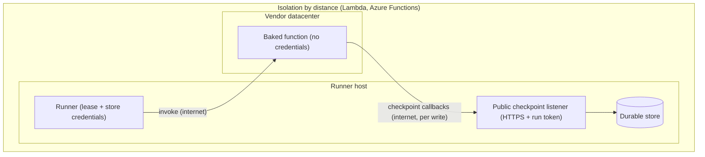
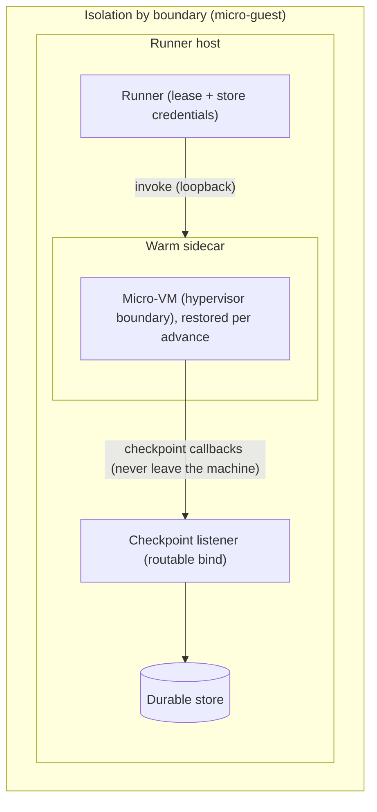
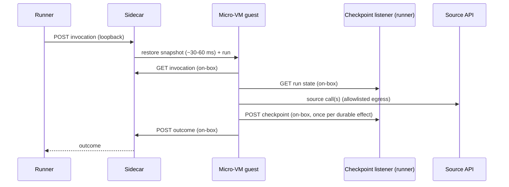

# Execution backend trade-offs

Every execution backend runs the same signed executor under the same run semantics: dispatch claims a run under a lease, an advance moves it one step, and every durable effect is a checkpoint the runner commits to the store. What differs between backends is *where* the code executes, *what isolates it*, and *what each advance costs*. This guide lays those trade-offs out side by side; the decisions behind them are in ADRs [0055](../adr/0055-serverless-backend-aot-from-signed-executor.md), [0058](../adr/0058-run-isolation-governed-by-environment-matched-at-start.md), [0059](../adr/0059-serverless-deploy-runs-on-the-runner-as-the-secure-boundary.md), [0062](../adr/0062-authenticated-serverless-checkpoint-callbacks.md), [0063](../adr/0063-microguest-backend-hyperlight-unikraft-warm-snapshot.md), and [0064](../adr/0064-microguest-snapshots-after-warmup-init-run-split.md).

## The backends at a glance

| | In-process | AWS Lambda | Azure Functions | Micro-guest |
|---|---|---|---|---|
| Advertised isolation (ADR 0058) | `InProcess` | `Isolated` | `Isolated` | `Isolated` |
| Where the code runs | The runner's own process (a collectible ALC per version) | The vendor's datacenter (`provided.al2023`) | The vendor's datacenter (`dotnet-isolated` worker) | A Hyperlight micro-VM on the runner's own machine |
| Artifact | Signed `executor.dll`, loaded | Native-AOT `bootstrap` from the signed IL | ReadyToRun isolated-worker app from the signed IL | Fully static Native-AOT musl `guest` from the signed IL |
| What isolates a run | Process trust + ALC unload | The vendor's sandbox, far away | The vendor's sandbox, far away | A hypervisor boundary per advance, restored from a snapshot |
| Host requirements | None beyond the runner | Cloud account + routable checkpoint listener | Cloud account + routable checkpoint listener | A hypervisor (`/dev/kvm`) + the sidecar |
| Per-run cloud spend | None | Per invocation | Per invocation | None |

## Isolation by distance, isolation by boundary

The run's durable state is owned by the lease-holding runner, and a deployed function holds no store credentials by design (ADR 0059: the runner is the secure boundary). Every checkpoint therefore travels from wherever the code executes back to the runner. That single constraint shapes both topologies:





The cloud backends isolate by *distance*: the untrusted code runs in someone else's sandbox, far from the runner, and pays an internet round-trip for every checkpoint. The micro-guest isolates by *boundary*: the hypervisor makes it safe to run the same untrusted code on the runner's own machine, so the identical checkpoint call (same `HttpWorkflowStateStore`, same contract, same durable write at the runner) crosses the VM boundary onto the same host and never leaves it. The guest's network is host-proxied — the host opens every connection, pinned by the sandbox's per-(environment, version) egress allowlist — which is also a tighter egress posture than either cloud target.

Nothing short of handing the function store credentials (breaking the secure-boundary model) or relocating the runner into the vendor's network makes a cloud checkpoint local; the asymmetry is architectural, not a platform limitation.

## The anatomy of an advance

```mermaid
sequenceDiagram
  participant R as Runner
  participant F as Cloud function
  participant L as Checkpoint listener (runner)
  participant S as Source API
  Note over R,F: warm path; a cold start adds init before this
  R->>F: POST invocation (internet)
  F->>L: GET run state (internet)
  F->>S: source call(s)
  F->>L: POST checkpoint (internet, once per durable effect)
  F-->>R: outcome
```



The structural difference: a warm cloud function *reuses a live process* across invocations — that is where its low warm overhead comes from, and it means successive runs share process state. The micro-guest refuses process reuse: every advance starts from a pristine snapshot restore, and today that includes the .NET runtime starting from scratch inside the restored VM.

## What each advance costs

| | Micro-guest (measured, 2026-07-31) | AWS Lambda, Native AOT (platform-typical) | Azure Functions, R2R worker (platform-typical) |
|---|---|---|---|
| One-time cost | Evolve at deploy, ~0.3 s | First-invoke cold start, ~200–500 ms | First-invoke cold start, ~1–3 s |
| Per-advance overhead | 0.4–0.8 s: ~30–60 ms restore + full app start every advance | ~10–50 ms warm (process reused) | ~10–100 ms warm (process reused) |
| Each checkpoint write | Machine-local, sub-millisecond | Internet round-trip | Internet round-trip |
| State between advances | None (hermetic restore) | Warm instances share a live process | Warm instances share a live process |

Read the table with two caveats. First, **only the micro-guest column is measured in this repository**; the cloud figures are platform-typical orders of magnitude, and replacing them with numbers from this repository's own live gates is tracked work (see below). Second, the comparison narrows or inverts for real advances: a genuine advance makes several checkpoint writes, each an internet round-trip on the cloud paths and sub-millisecond on the micro-guest, so a chatty multi-step advance can spend more on checkpoint round-trips in a cloud function than the micro-guest spends restarting its whole app.

ADR 0064 records the accepted next step for the micro-guest column: snapshot *after* guest warm-up (`init` once, restore-and-`run` per advance), which targets a restore-dominated advance of roughly tens of milliseconds — below warm cloud overhead, with the hypervisor boundary and the local checkpoint path intact.

## Choosing a backend

- **Governance chooses isolation, not the caller.** An environment's `requiredIsolation` is matched against what its runners advertise at the start gate (ADR 0058); picking a backend is an operator decision about the environment, and dispatch, leases, and the operator surface are identical across all of them.
- **Choose in-process** for development and for trusted, latency-sensitive workloads where process-level isolation suffices.
- **Choose a cloud backend** when execution should scale independently of the runner, when the operational base is already that cloud, or when isolation-by-distance is itself the requirement. Budget for per-invoke spend, cold starts, and a public HTTPS checkpoint listener with run-scoped tokens (ADR 0062).
- **Choose the micro-guest** for `Isolated` execution without a cloud dependency: per-advance hypervisor isolation at local latency, the tightest egress posture, and no per-run spend — at the price of a hypervisor requirement on the runner host and, until ADR 0064 lands, an app start per advance.