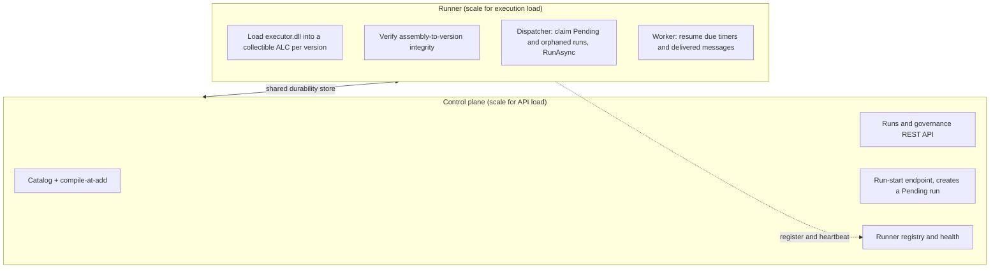

# Arazzo workflow execution host: design

How a catalogued workflow becomes a compiled assembly stored with the catalog, and how a hosting service loads
and runs it. The build side and the runner have shipped; only the pluggable out-of-process backends (§ below)
remain design intent.

The decisions are the engine and runner ADRs, [0017](../adr/0017-code-generate-the-executor.md) (generate
the executor), [0023](../adr/0023-two-process-store-as-queue.md) (two processes sharing the store),
[0024](../adr/0024-collectible-assembly-per-version.md) (collectible assembly per version),
[0025](../adr/0025-integrity-binding-optional-signature.md) (integrity binding),
[0026](../adr/0026-triggers-async-by-default.md) (triggers async by default),
[0027](../adr/0027-runner-environment-binding.md) (runner-to-environment binding),
[0028](../adr/0028-pluggable-execution-backends.md) (pluggable backends, Proposed), and
[0029](../adr/0029-native-heartbeat-partial-update.md) (the heartbeat). The task-oriented companions are the
[authoring, generating, and running guide](authoring-generating-running.md) and the
[running a runner guide](running-a-runner.md). This guide is the seam shapes, the packaging, the
load and isolation model, and the trigger surface.

## Topology

Two independently-scaled processes share the durability store
([ADR 0023](../adr/0023-two-process-store-as-queue.md)): the **control plane** (catalog, the compile-at-add,
the runs and governance REST API, the run-start endpoint, the runner registry) and the **execution host, the
"runner"** (loads workflow assemblies, owns the transports and scheduler, runs workflows and resumes them,
checkpointing to the store). They never call each other on the hot path: the control plane creates a `Pending`
run in the store, and a runner hosting that version claims and executes it (store-as-queue). The control plane
learns what each runner hosts, and whether it is live, only through the registry and heartbeats.



## Build side: compile the executor at catalog-add

At catalog-add the control plane generates the workflow's executor and clients and compiles a single release
assembly, stored in the version's package ([ADR 0017](../adr/0017-code-generate-the-executor.md),
[ADR 0033](../adr/0033-compile-at-catalog-add.md)). The seam is `IWorkflowExecutorProvider`, in the runtime
project so the catalog depends only on an abstraction and treats the output as opaque bytes:

```csharp
public interface IWorkflowExecutorProvider
{
    WorkflowExecutorArtifact? BuildExecutor(
        ReadOnlyMemory<byte> workflowUtf8,
        IReadOnlyList<KeyValuePair<string, byte[]>> sources,
        string packageHash);
}
```

`CatalogPackage.Project` calls it where it builds the schemas, and `WorkflowPackage.PackPooled` writes the
assembly and manifest into the package. From the package alone (reproducible, tied to the content-hashed
version) the provider runs the OpenAPI and AsyncAPI client generators and the executor emitter, plus a generated
non-generic adapter (the key to running a workflow without compile-time knowledge of its types), and compiles
them into one assembly whose load-time closure is just the stable Corvus runtime, no per-workflow NuGet restore.
Compilation reuses `DynamicCompiler.CompileToAssemblyBytes` (which is why a build-side host sets
`<PreserveCompilationContext>true</PreserveCompilationContext>`).

**The manifest** (`metadata/executor-manifest.json`) records the fields a runner needs:
`formatVersion`, `targetFramework`, `packageHash`, `assemblyDigest`, `entryType`, `workflowId`, `durable`, and
`sources[].{name, type}`. The integrity binding is `assemblyDigest` (SHA-256 of the DLL) plus `packageHash` (the
version's content hash) ([ADR 0025](../adr/0025-integrity-binding-optional-signature.md)); an optional
detached signature rides in a separate `metadata/executor-manifest.sig` entry, not a manifest field.

**Opt-out.** `BuildExecutor` returns `null` when generation or compilation fails (for example an unsupported
Arazzo feature); the version is still catalogued (with schema metadata) but not runnable
(`runnable: false`, `CatalogPackageProjection.HasExecutor`), with a non-fatal add-time warning. This keeps
"catalogue" and "host" decoupled.

## The hosted-workflow contract

The generated `ExecuteAsync` is static and generic over the input and output types; the host must run it without
them, so the provider emits a non-generic adapter implementing `IHostedWorkflow`
([ADR 0017](../adr/0017-code-generate-the-executor.md)):

```csharp
public interface IHostedWorkflow
{
    WorkflowDescriptor Descriptor { get; }

    ValueTask<WorkflowRunResultKind> RunAsync(
        IReadOnlyDictionary<string, IApiTransport> apiTransports,   // one per source
        IMessageTransport? messageTransport,
        JsonWorkspace workspace,
        JsonElement inputs,                                          // parsed by the adapter into the concrete type
        IWorkflowRun run,                                           // fresh trigger, or a resumed checkpoint
        CancellationToken cancellationToken);
}
```

The adapter parses `inputs`, calls the generated `ExecuteAsync`, and maps the result to the tri-state
`WorkflowRunResultKind`. `IHostedWorkflow`, `WorkflowDescriptor`, `IWorkflowRun`, and the transport interfaces
live in the runtime project, so the loaded assembly and the host share one contract, and resume, retry, rewind,
skip, and cancel all work unchanged ([ADR 0022](../adr/0022-resume-mode-taxonomy.md)) once the host can
produce an `IHostedWorkflow`.

## Run side: load, isolation, registration

A runner loads `metadata/executor.dll` into a **collectible `AssemblyLoadContext` per version**
([ADR 0024](../adr/0024-collectible-assembly-per-version.md), `WorkflowExecutorLoader`), verifying integrity
before load (the DLL hashes to `assemblyDigest`, and the manifest's `packageHash` equals the version's content
hash; refuse on mismatch, incompatible target framework, or an out-of-range runtime version). It unloads the
collectible ALC when the version is deleted or obsoleted, or on idle eviction: stop accepting new runs, let
in-flight runs drain (or checkpoint and suspend on shutdown), then dispose. Delete is the case the host honours
promptly. Which versions a runner hosts is its own policy (a configured allow-list or tag selector, intersected
with catalogued versions carrying an executor), by watching the catalog or pulling on demand.

### Runner registry and health

So the control plane can show which runners host which workflows and which are live, runners register and
heartbeat into a store-backed table with TTL liveness (the heartbeat is a single native partial update,
[ADR 0029](../adr/0029-native-heartbeat-partial-update.md)). The seam is `IRunnerRegistry`
(`RegisterAsync`, `HeartbeatAsync`, `ListAsync`, `PruneAsync`), implemented per backend; the control plane reads
it, runners write to it. A runner exposes a `GET /health` (liveness and readiness), and the read-only
`listRunners` and `listEnvironmentRunnerAuthorizations` operations surface the roster and gate triggers on a
live host. A runner missing `N` intervals is `Stale`, and past a TTL is pruned (its leases expire, so its
in-flight runs become claimable).

### Runner-to-environment binding

The bare registry is environment-agnostic; a runner executes in and for an environment and must have that
environment's credential set, so a runner is bound to exactly one environment and its administrators must
authorize it ([ADR 0027](../adr/0027-runner-environment-binding.md)). One environment per runner, many
runners per environment; a runner inherits the environment's `managementTags` at registration (so the registry
list is reach-filtered), and a runner registering for an environment enters a `Pending` authorization state and
is not dispatchable until an administrator of that environment authorizes it (the same approver-inbox pattern
that decides availability and access requests).

The residual mechanics this guide owns, beyond the decision:

- **The lifecycle.** `Pending -> Authorized`, `Authorized <-> Quarantined` (quarantine a faulted runner, which
  stops new and orphaned work but lets in-flight runs drain, then reinstate it), and
  `any -> Revoked -> Authorized` (revoke a compromised runner permanently). Only `Authorized` is dispatchable.
- **The revocation fence is in the store, not the runner.** A cooperative self-check is worthless against a
  compromised runner, so revoke expires every lease the runner holds through the store's lease administration;
  an authorized peer reclaims those runs, and the revoked runner's next checkpoint write conflicts under
  optimistic concurrency.
- **The runner is a machine principal.** It registers through an authenticated endpoint (client-credentials,
  private-key JWT, or mTLS), and the control plane binds the authorization to the trusted principal it derives
  from the token, not to a self-asserted `runnerId`; a registration presenting a principal that differs from the
  one already bound to a `runnerId` is refused (`409`). Both admission orders share the record: pre-authorization
  (an administrator allow-lists a `runnerId`, an `Authorized` row with no bound principal) and
  register-then-approve.
- **Run-to-environment pinning.** `startCatalogWorkflowRun` takes a required `environment`, validated against
  the version's availability and the caller's reach; the run record and the dispatch index carry it, and the
  runner resolves that environment's credentials. Dispatch then admits a run pinned to environment E only to a
  runner authorized and live for E, hosting the version, and within reach, which the environment-tag inheritance
  makes automatic.

The `RunnerRegistration`, the governed `EnvironmentRunnerAuthorization`, and the runner-authorization operations
are in the OpenAPI contract; the [runner guide](running-a-runner.md) is the operational walkthrough.

### Pluggable execution backends

The in-process collectible ALC is one execution model, not the only one. A runner is better understood as an
execution host that dispatches a run to a pluggable backend with a chosen isolation model (in-process today, but
equally a per-run micro-guest, a serverless function, or a container-per-run), and wake-ups (resume) ride the
same seam, because the executor is a portable content-hashed assembly and a run is a serializable checkpoint. This
is a **proposed** seam ([ADR 0028](../adr/0028-pluggable-execution-backends.md)): only the in-process backend
ships. The proposed seam generalises the in-process resume into an `IRunExecutionBackend.AdvanceAsync`, which the
resumer already invokes through a delegate, so a backend slots in behind it without touching dispatch, leases,
timers, or message delivery; a runner would advertise its backend and isolation model in its registration, and
dispatch would match a run's required isolation against it. The one-environment-per-runner, admin-authorized
model is the security anchor for any out-of-process backend: a function or guest executes with the environment's
credentials, so it must be provisioned for and authorized in exactly that environment.

## The trigger surface

A run is started by a **trigger**, which owns the `trigger -> create a Pending run -> execute` path. Triggers are
async by default ([ADR 0026](../adr/0026-triggers-async-by-default.md)): a trigger creates a `Pending` run and
returns, and the run executes durably, observed through the control plane. All three trigger kinds converge on
one governed, admission-controlled, reach-checked start endpoint.

- **HTTP** (ships first, owned by the control plane): `POST /catalog/{baseWorkflowId}/versions/{versionNumber}/runs`
  (`startCatalogWorkflowRun`) takes the workflow's inputs (validated against the baked inputs schema) and a
  required `environment`, with an `Idempotency-Key` header. It checks that a live runner hosts the version
  (`409` if none), creates the `Pending` run, and returns `202 Accepted` with the run id and a `Location`.
- **Message** (owned by runners): an inbound event on a configured start channel initiates a run. Hosting is a
  dispatcher workflow (a durable `receive`, a cross-workflow `goto`, a loop) expressed in standard Arazzo, which
  fires the target through the same governed start endpoint.
- **Schedule** (owned by runners): a cron-like schedule is a durable run of a built-in scheduler workflow
  (`ScheduleHostedWorkflow`, the reserved `$schedule` id), pinned to an environment. Its inputs carry the
  cadence, and on each entry it fires every due occurrence through the governed start endpoint (carrying an
  `Idempotency-Key` of the schedule plus occurrence, so a re-fire starts the target at most once) and suspends on
  a durable timer. A million schedules is a million suspended runs at the engine's existing scale, with no new
  per-backend store.

Triggers are declared out-of-band in host configuration, keyed by `(base, version)`, so HTTP needs no
declaration (the endpoint exists for every runnable version) and message and schedule triggers are host-bound. A
package-declared `x-arazzo-triggers` extension is declined ([ADR 0026](../adr/0026-triggers-async-by-default.md)):
it has no consumer, it makes the Arazzo document non-portable, and it conflates a deployment concern with the
workflow definition, which the dispatcher-workflow pattern already expresses portably.

## Execution model and concurrency

**Dispatch is store-as-queue** ([ADR 0023](../adr/0023-two-process-store-as-queue.md)): the run record is the
durable work item, so the store is the queue, and one concurrency mechanism (CAS plus leases) serves both
dispatch and resume. `IWorkflowDispatchIndex.QueryClaimableAsync` (with the environment-scoped overload the
`WorkflowDispatcher` uses) returns the runs a runner may take for its hosted versions: `Pending` runs and
`Running` runs whose lease has expired (orphans left by a crashed runner). The `WorkflowDispatcher` mirrors the
resume worker: poll, take a per-run lease (CAS, skip if held and unexpired), resolve the `IHostedWorkflow`, build
the transports, and run. An optional doorbell (Postgres `LISTEN/NOTIFY`, or the message transport) can wake
runners to poll sooner; it is only a latency hint, so a missed notification never costs correctness.

**Resume shares the path.** `WorkflowWorker` polls the wait index for due timers and delivered messages and
calls the same contract through `HostedWorkflowResumer.ResumeAsync`; one `workflowId -> IHostedWorkflow`
resolver serves new-run dispatch, orphan reclaim, and wait-resume.

**Leases and shutdown.** A claimer holds a per-run lease (`owner`, TTL) and renews it while executing, so a long
step does not let the lease lapse; every checkpoint is a CAS write, so a slow or zombie runner whose lease was
taken over fails its next CAS and aborts (no split-brain). On a crash, orphan reclaim surfaces the `Running` run
after the TTL and another runner re-enters at the restored cursor. A graceful shutdown releases leases so peers
pick the runs up immediately rather than waiting out the TTL. Dispatcher concurrency is bounded per runner
(advertised as `maxConcurrency`), and both indexes are pull-based, so runners self-balance.

## Transport binding

The executor calls source operations through `IApiTransport`, so the host maps each version's source
descriptions to endpoints and credentials, per environment and per version. The manifest's `sources[]` lists the
bindings a version needs, so the host fails fast at load if one is missing. Credentials are resolved
runner-side from a reference at bind time ([`source-credentials-design.md`](source-credentials.md)),
and an AsyncAPI source binds to a broker through `IMessageTransport` (the same transport serves receive-steps and
message triggers).

## Failure modes and observability

A build-side compile failure leaves the version catalogued but not runnable; a load failure (integrity, target
framework, or a missing binding) marks the version unloadable and a trigger returns `409`/`422`; a run failure
takes the `Faulted` path and the resume modes ([ADR 0022](../adr/0022-resume-mode-taxonomy.md)). Runner death
expires the leases and another runner reclaims the orphans, so correctness comes from lease-plus-CAS, not the
registry (a slow registry only delays visibility and trigger gating). Reclaim re-runs the interrupted step, so
step execution is **at-least-once**: request bindings should carry idempotency keys or use replay-tolerant
success criteria (completed steps are not re-run, only their products persisted). Observability reuses the
`Corvus.Arazzo` telemetry (per-step spans, checkpoint measurements) plus load, unload, trigger, dispatch, claim,
and orphan-reclaim spans.

## Delivery status

The build side (executor provider and packaging), the loader and `IHostedWorkflow`, the HTTP trigger and
dispatcher, the message and schedule triggers, control-plane authorization, source credentials, and row security
have all shipped. The paused demo work (`samples/arazzo/.../docs/live-execution.md`) was the manual prototype
this design productionised behind the catalog. The out-of-process execution backends
([ADR 0028](../adr/0028-pluggable-execution-backends.md)) remain design intent. The decisions themselves are
recorded in ADRs 0017 and 0022 to 0029; this guide no longer restates them.

## See also

The subsystems that were split out of this design:

- [Source credentials: storage, lifecycle, and refresh](source-credentials.md).
- [Access, identity, and entitlement design detail](identity-and-authorization.md) (authorization
  and row security, administration, the identity and entitlement lifecycle).
