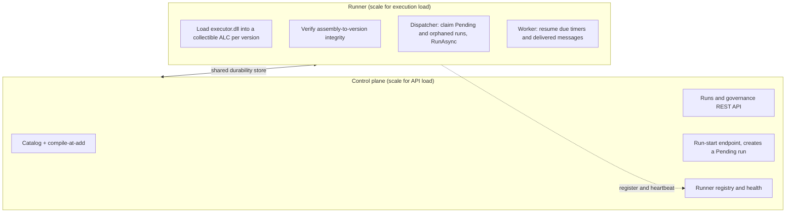

# Arazzo workflow execution host: design

How a catalogued workflow becomes a compiled assembly stored with the catalog, and how a hosting service loads
and runs it. The build side and the runner have shipped, along with the pluggable-backend seam, the governed
isolation advertise-and-match that selects an out-of-process backend (§ below), and the operator surface over
builds, deployments, and isolation (REST + CLI + console). The first such backend (serverless) is proven;
broadening the set to more targets remains in progress.

The decisions are the engine and runner ADRs, [0017](../adr/0017-code-generate-the-executor.md) (generate
the executor), [0023](../adr/0023-two-process-store-as-queue.md) (two processes sharing the store),
[0024](../adr/0024-collectible-assembly-per-version.md) (collectible assembly per version),
[0025](../adr/0025-integrity-binding-optional-signature.md) (integrity binding),
[0026](../adr/0026-triggers-async-by-default.md) (triggers async by default),
[0027](../adr/0027-runner-environment-binding.md) (runner-to-environment binding),
[0055](../adr/0055-serverless-backend-aot-from-signed-executor.md) (pluggable backends and the serverless
backend, superseding the proposed [0028](../adr/superseded/0028-pluggable-execution-backends.md)),
[0058](../adr/0058-run-isolation-governed-by-environment-matched-at-start.md) (isolation advertised and matched
at the start gate), and [0029](../adr/0029-native-heartbeat-partial-update.md) (the heartbeat). The task-oriented companions are the
[authoring, generating, and running guide](authoring-generating-running.md) and the
[running a runner guide](running-a-runner.md). This guide is the seam shapes, the packaging, the
load and isolation model, and the trigger surface.

## Topology

Two independently-scaled processes work over one durability store
([ADR 0023](../adr/0023-two-process-store-as-queue.md)): the **control plane** (catalog, the compile-at-add,
the runs and governance REST API, the run-start endpoint, the runner registry) and the **execution host, the
"runner"** (loads workflow assemblies, owns the transports and scheduler, runs workflows and resumes them,
checkpointing to the store). The queue is still the store: the control plane creates a `Pending` run, and a
runner hosting that version claims and executes it. The control plane learns what each runner hosts, and whether
it is live, only through the registry and heartbeats.

What the runner does not hold is a credential for that store. Under
[ADR 0065](../adr/0065-control-plane-owns-store-runners-encrypt-payload.md) the control plane owns it exclusively
and serves the [runner API](../reference/arazzo-runner.openapi.json), so claiming, leasing, checkpointing, and
pulling executor artifacts are requests it authorises rather than queries a runner makes for itself. A runner
authenticates with the machine principal it registered under, and every candidate set is intersected server-side
with the environments an administrator bound that principal to. The sample runners under `samples/arazzo` are
wired this way, so the two-process demo is a demonstration of the split rather than a description of it.


```mermaid
flowchart LR
  subgraph CP["Control plane (scale for API load)"]
    C1["Catalog + compile-at-add"]
    C2["Runs and governance REST API"]
    C3["Run-start endpoint, creates a Pending run"]
    C4["Runner registry and health"]
  end
  subgraph RN["Runner (scale for execution load)"]
    R1["Load executor.dll into a collectible ALC per version"]
    R2["Verify assembly-to-version integrity"]
    R3["Dispatcher: claim Pending and orphaned runs, RunAsync"]
    R4["Worker: resume due timers and delivered messages"]
  end
  CP <-->|"shared durability store"| RN
  RN -.->|"register and heartbeat"| C4
```

## Build side: compile the executor at catalog-add

At catalog-add the control plane generates the workflow's executor and clients and compiles a single release
assembly, stored in the version's package ([ADR 0017](../adr/0017-code-generate-the-executor.md),
[ADR 0033](../adr/0033-compile-at-catalog-add.md)). The seam is `IWorkflowExecutorProvider`, in the runtime
project so the catalog depends only on an abstraction and treats the output as opaque bytes:

```csharp
public interface IWorkflowExecutorProvider
{
    WorkflowExecutorArtifact? BuildExecutor(
        ReadOnlyMemory<byte> workflowUtf8,
        IReadOnlyList<KeyValuePair<string, byte[]>> sources,
        string packageHash);
}
```

`CatalogPackage.Project` calls it where it builds the schemas, and `WorkflowPackage.PackPooled` writes the
assembly and manifest into the package. From the package alone (reproducible, tied to the content-hashed
version) the provider runs the OpenAPI and AsyncAPI client generators and the executor emitter, plus a generated
non-generic adapter (the key to running a workflow without compile-time knowledge of its types), and compiles
them into one assembly whose load-time closure is just the stable Corvus runtime, no per-workflow NuGet restore.
Compilation reuses `DynamicCompiler.CompileToAssemblyBytes` (which is why a build-side host sets
`<PreserveCompilationContext>true</PreserveCompilationContext>`).

**The manifest** (`metadata/executor-manifest.json`) records the fields a runner needs:
`formatVersion`, `targetFramework`, `packageHash`, `assemblyDigest`, `entryType`, `workflowId`, `durable`, and
`sources[].{name, type}`. The integrity binding is `assemblyDigest` (SHA-256 of the DLL) plus `packageHash` (the
version's content hash) ([ADR 0025](../adr/0025-integrity-binding-optional-signature.md)); an optional
detached signature rides in a separate `metadata/executor-manifest.sig` entry, not a manifest field.

**Opt-out.** `BuildExecutor` returns `null` when generation or compilation fails (for example an unsupported
Arazzo feature); the version is still catalogued (with schema metadata) but not runnable
(`runnable: false`, `CatalogPackageProjection.HasExecutor`), with a non-fatal add-time warning. This keeps
"catalogue" and "host" decoupled.

## The hosted-workflow contract

The generated `ExecuteAsync` is static and generic over the input and output types; the host must run it without
them, so the provider emits a non-generic adapter implementing `IHostedWorkflow`
([ADR 0017](../adr/0017-code-generate-the-executor.md)):

```csharp
public interface IHostedWorkflow
{
    WorkflowDescriptor Descriptor { get; }

    ValueTask<WorkflowRunResultKind> RunAsync(
        IReadOnlyDictionary<string, IApiTransport> apiTransports,   // one per source
        IMessageTransport? messageTransport,
        JsonWorkspace workspace,
        JsonElement inputs,                                          // parsed by the adapter into the concrete type
        IWorkflowRun run,                                           // fresh trigger, or a resumed checkpoint
        CancellationToken cancellationToken);
}
```

The adapter parses `inputs`, calls the generated `ExecuteAsync`, and maps the result to the tri-state
`WorkflowRunResultKind`. `IHostedWorkflow`, `WorkflowDescriptor`, `IWorkflowRun`, and the transport interfaces
live in the runtime project, so the loaded assembly and the host share one contract, and resume, retry, rewind,
skip, and cancel all work unchanged ([ADR 0022](../adr/0022-resume-mode-taxonomy.md)) once the host can
produce an `IHostedWorkflow`.

## Run side: load, isolation, registration

A runner loads `metadata/executor.dll` into a **collectible `AssemblyLoadContext` per version**
([ADR 0024](../adr/0024-collectible-assembly-per-version.md), `WorkflowExecutorLoader`), verifying integrity
before load (the DLL hashes to `assemblyDigest`, and the manifest's `packageHash` equals the version's content
hash; refuse on mismatch, incompatible target framework, or an out-of-range runtime version). It unloads the
collectible ALC when the version is deleted or obsoleted, or on idle eviction: stop accepting new runs, let
in-flight runs drain (or checkpoint and suspend on shutdown), then dispose. Delete is the case the host honours
promptly. Which versions a runner hosts is its own policy (a configured allow-list or tag selector, intersected
with catalogued versions carrying an executor), by watching the catalog or pulling on demand.

### Runner registry and health

So the control plane can show which runners host which workflows and which are live, runners register and
heartbeat into a store-backed table with TTL liveness (the heartbeat is a single native partial update,
[ADR 0029](../adr/0029-native-heartbeat-partial-update.md)). The seam is `IRunnerRegistry`
(`RegisterAsync`, `HeartbeatAsync`, `ListAsync`, `PruneAsync`), implemented per backend; the control plane reads
it, runners write to it. A runner exposes a `GET /health` (liveness and readiness), and the read-only
`listRunners` and `listEnvironmentRunnerAuthorizations` operations surface the roster and gate triggers on a
live host. A runner missing `N` intervals is `Stale`, and past a TTL is pruned (its leases expire, so its
in-flight runs become claimable).

### Runner-to-environment binding

The bare registry is environment-agnostic; a runner executes in and for an environment and must have that
environment's credential set, so a runner is bound to exactly one environment and its administrators must
authorize it ([ADR 0027](../adr/0027-runner-environment-binding.md)). One environment per runner, many
runners per environment; a runner inherits the environment's `managementTags` at registration (so the registry
list is reach-filtered), and a runner registering for an environment enters a `Pending` authorization state and
is not dispatchable until an administrator of that environment authorizes it (the same approver-inbox pattern
that decides availability and access requests).

The residual mechanics this guide owns, beyond the decision:

- **The lifecycle.** `Pending -> Authorized`, `Authorized <-> Quarantined` (quarantine a faulted runner, which
  stops new and orphaned work but lets in-flight runs drain, then reinstate it), and
  `any -> Revoked -> Authorized` (revoke a compromised runner permanently). Only `Authorized` is dispatchable.
- **The revocation fence is in the store, not the runner.** A cooperative self-check is worthless against a
  compromised runner, so revoke expires every lease the runner holds through the store's lease administration;
  an authorized peer reclaims those runs, and the revoked runner's next checkpoint write conflicts under
  optimistic concurrency.
- **The runner is a machine principal.** It registers through an authenticated endpoint (client-credentials,
  private-key JWT, or mTLS), and the control plane binds the authorization to the trusted principal it derives
  from the token, not to a self-asserted `runnerId`; a registration presenting a principal that differs from the
  one already bound to a `runnerId` is refused (`409`). Both admission orders share the record: pre-authorization
  and register-then-approve.
- **A pre-authorization names the principal it allow-lists.** An administrator authorizing a `runnerId` that has
  not registered yet supplies `expectedPrincipal`, and the record is bound from the moment it exists. Allow-listing
  the id alone would hand the authorization to whichever principal registered first, and the id is chosen by an
  administrator rather than derived from anything secret, so it is guessable by anyone who knows how the deployment
  names its runners. An unnamed pre-authorization is refused (`400`).
- **A refused registration leaves nothing behind.** The authorization row is written before the liveness row,
  because the principal fence lives on the authorization. The other order let a foreign principal overwrite the
  victim's registration before collecting its `409`.
- **Revoke stops a runner; withdraw un-says a pre-authorization.** They are not interchangeable, and only one
  removes the record ([ADR 0027](../adr/0027-runner-environment-binding.md)). Revoking keeps the record at
  status `Revoked`, so the decision stays auditable, and expires the leases the runner holds so its in-flight
  work is fenced at once. Withdrawing (`DELETE …/runners/{runnerId}/preAuthorization`) removes the record, and
  exists only so a pre-authorization that named the wrong `expectedPrincipal` can be corrected — the principal
  never moves once bound, so otherwise the typo would make that runner id permanently unusable. Withdrawal is
  refused (`409`) once a runner has registered for the environment under that id: use revoke.
- **Run-to-environment pinning.** `startCatalogWorkflowRun` takes a required `environment`, validated against
  the version's availability and the caller's reach; the run record and the dispatch index carry it, and the
  runner resolves that environment's credentials. Dispatch then admits a run pinned to environment E only to a
  runner authorized and live for E, hosting the version, and within reach, which the environment-tag inheritance
  makes automatic.

The `RunnerRegistration`, the governed `EnvironmentRunnerAuthorization`, and the runner-authorization operations
are in the OpenAPI contract; the [runner guide](running-a-runner.md) is the operational walkthrough.

### Pluggable execution backends

The in-process collectible ALC is one execution model, not the only one. A runner is better understood as an
execution host that dispatches a run to a pluggable backend with a chosen isolation model (in-process, or
equally a per-run micro-guest, a serverless function, or a container-per-run), and wake-ups (resume) ride the
same seam, because the executor is a portable content-hashed assembly and a run is a serializable checkpoint. The
seam has landed ([ADR 0055](../adr/0055-serverless-backend-aot-from-signed-executor.md)).
`IRunExecutionBackend.AdvanceAsync` generalises the in-process resume, which the resumer already invokes through a
delegate, so a backend slots in behind it without touching dispatch, leases, timers, or message delivery. The
in-process backend and the first out-of-process backend (serverless, AOT-compiled from the signed executor) both
ship. Selection is governed, not per-runner guesswork
([ADR 0058](../adr/0058-run-isolation-governed-by-environment-matched-at-start.md)). An environment declares the
isolation its runs require (`requiredIsolation`, defaulting to in-process), a runner advertises the isolation it
provides (`isolationModel`) in its registration, and the start gate matches the two string-free when it checks
that a live runner hosts the version, so a run that requires isolation is admitted only where an isolated runner
can take it. The one-environment-per-runner, admin-authorized model is the security anchor for any out-of-process
backend. A function or guest executes with the environment's credentials, so it must be provisioned for and
authorized in exactly that environment. The operator surface over this machinery has shipped: the control plane
reports builds (`nativeBuilds`) and deployments (`deployments`, read-only — the deploy runs on the runner,
ADR 0059) per (environment, runtime target), the CLI's `runners`/`builds`/`deployments` branches list and queue
them, and the console's catalog detail and runners panel surface deploy state and isolation posture. Broadening
the backend set (micro-guest, container-per-run) remains in progress.

## The trigger surface

A run is started by a **trigger**, which owns the `trigger -> create a Pending run -> execute` path. Triggers are
async by default ([ADR 0026](../adr/0026-triggers-async-by-default.md)): a trigger creates a `Pending` run and
returns, and the run executes durably, observed through the control plane. All three trigger kinds converge on
one governed, admission-controlled, reach-checked start endpoint.

- **HTTP** (ships first, owned by the control plane): `POST /catalog/{baseWorkflowId}/versions/{versionNumber}/runs`
  (`startCatalogWorkflowRun`) takes the workflow's inputs (validated against the baked inputs schema) and a
  required `environment`, with an `Idempotency-Key` header. It checks that a live runner hosts the version
  (`409` if none), creates the `Pending` run, and returns `202 Accepted` with the run id and a `Location`.
- **Message** (owned by runners): an inbound event on a configured start channel initiates a run. Hosting is a
  dispatcher workflow (a durable `receive`, a cross-workflow `goto`, a loop) expressed in standard Arazzo, which
  fires the target through the same governed start endpoint.
- **Schedule** (owned by runners): a cron-like schedule is a durable run of a built-in scheduler workflow
  (`ScheduleHostedWorkflow`, the reserved `$schedule` id), pinned to an environment. Its inputs carry the
  cadence, and on each entry it fires every due occurrence through the governed start endpoint (carrying an
  `Idempotency-Key` of the schedule plus occurrence, so a re-fire starts the target at most once) and suspends on
  a durable timer. A million schedules is a million suspended runs at the engine's existing scale, with no new
  per-backend store.

Triggers are declared out-of-band in host configuration, keyed by `(base, version)`, so HTTP needs no
declaration (the endpoint exists for every runnable version) and message and schedule triggers are host-bound. A
package-declared `x-arazzo-triggers` extension is declined ([ADR 0026](../adr/0026-triggers-async-by-default.md)):
it has no consumer, it makes the Arazzo document non-portable, and it conflates a deployment concern with the
workflow definition, which the dispatcher-workflow pattern already expresses portably.

## Execution model and concurrency

**Dispatch is store-as-queue** ([ADR 0023](../adr/0023-two-process-store-as-queue.md)): the run record is the
durable work item, so the store is the queue, and one concurrency mechanism (CAS plus leases) serves both
dispatch and resume. `IWorkflowDispatchIndex.QueryClaimableAsync` (with the environment-scoped overload the
`WorkflowDispatcher` uses) returns the runs a runner may take for its hosted versions: `Pending` runs and
`Running` runs whose lease has expired (orphans left by a crashed runner). The `WorkflowDispatcher` mirrors the
resume worker: poll, take a per-run lease (CAS, skip if held and unexpired), resolve the `IHostedWorkflow`, build
the transports, and run. An optional doorbell (Postgres `LISTEN/NOTIFY`, or the message transport) can wake
runners to poll sooner; it is only a latency hint, so a missed notification never costs correctness.

**A runner without store credentials dispatches the same way.** Under [ADR 0065](../adr/0065-control-plane-owns-store-runners-encrypt-payload.md)
the runner holds no store handle, so `RunnerApiDispatcher` runs that cycle over the runner API instead.
`WorkflowDispatcher` and `RunnerApiDispatcher` present the same operation, `DispatchClaimableAsync`, taking the
runner's hosted versions and a `WorkflowResumer`, and a run resumes through `ArazzoRunnerClient.Checkpoints` exactly
as it would over a database-backed store. The executor cannot tell the difference.

What the API-backed dispatcher does **not** take is the interesting part, because each absent parameter is now
enforced server-side rather than dropped.

| `WorkflowDispatcher` takes | `RunnerApiDispatcher` does not, because |
| --- | --- |
| the runner's environment | the candidate set is intersected with the principal's bindings, so there is no environment for a runner to state, and none to state wrongly |
| a dispatch-authorization gate | a check the runner made about itself was only ever as good as its willingness to make it. A revoked runner now resolves to no bindings and is offered nothing |
| a claimability re-check under lease | querying an index and then leasing was two steps that could disagree. Claiming is one operation, and the server re-reads under the lease before offering the run |

Two behaviours differ deliberately. A lease lost mid-advance is caught rather than raised, because the run belongs
to whoever holds it now and this runner's writes were refused rather than applied, so it moves on to the next claim.
Release runs on an uncancelled token, because cancellation is how a runner shuts down and that is exactly when
releasing matters most. Passing the caller's token through would skip the release on every run in flight and strand
each one until its lease lapsed.

**And a runner is told what to host.** `GET /hostedVersions` resolves the versions a runner may execute from its
environment bindings and each environment's availability, and `RunnerApiArtifactSource` pulls the executor, its
manifest and the manifest signature over the API. A runner previously read the catalog itself and treated everything
in it as hostable, which needed a credential for the whole catalog and gave a runner sight of versions it had no
business executing. Being told what to host needs neither.

The runner still verifies what it pulls. The content hash is served by its own operation rather than read from inside
the package, because a manifest vouching for itself would prove nothing, and the loader checks the assembly against
both the hash and the manifest signature.

**Resume shares the path.** `WorkflowWorker` polls the wait index for due timers and delivered messages and
calls the same contract through `HostedWorkflowResumer.ResumeAsync`; one `workflowId -> IHostedWorkflow`
resolver serves new-run dispatch, orphan reclaim, and wait-resume.

**And resume goes over the API too.** `RunnerApiWorker` is the credential-free counterpart, claiming due timers and
message-awaiting runs through the runner API instead of the wait index. Three things differ from the store-backed
worker, and each is a rule the server now applies.

- **No due-time cutoff.** The server resumes against its own clock. A runner naming a cutoff would be asking for
  timers that have not fired, and a runner with a fast clock would do so without meaning to.
- **No environment.** Resolved from the principal's bindings, as everywhere else.
- **Hosted versions are intersected.** The store-backed worker never did this, so it would hand a runner a due run
  for a version the runner had not baked, which it could only fault. That is a real gap the API path closes.

**A delivered message's payload never reaches the control plane.** The API answers which runs a message can resume,
and the runner hands its own copy to each of them. What the control plane learns is that a message arrived on a
channel, not what it said.

**Correlation matching treats absence as a wildcard on either side.** A message carrying no correlation id reaches
every run awaiting the channel, and a run awaiting the channel with no particular correlation is reached by any
message on it. Only two correlations that are both present and different fail to match. This is the store's rule,
pinned by the conformance suite across every backend, and the runner API passes the correlation through unchanged
rather than reinterpreting it.

**Leases and shutdown.** A claimer holds a per-run lease (`owner`, TTL) and renews it while executing, so a long
step does not let the lease lapse; every checkpoint is a CAS write, so a slow or zombie runner whose lease was
taken over fails its next CAS and aborts (no split-brain). On a crash, orphan reclaim surfaces the `Running` run
after the TTL and another runner re-enters at the restored cursor. A graceful shutdown releases leases so peers
pick the runs up immediately rather than waiting out the TTL. Dispatcher concurrency is bounded per runner
(advertised as `maxConcurrency`), and both indexes are pull-based, so runners self-balance.

## Transport binding

The executor calls source operations through `IApiTransport`, so the host maps each version's source
descriptions to endpoints and credentials, per environment and per version. The manifest's `sources[]` lists the
bindings a version needs, so the host fails fast at load if one is missing. Credentials are resolved
runner-side from a reference at bind time ([`source-credentials-design.md`](source-credentials.md)),
and an AsyncAPI source binds to a broker through `IMessageTransport` (the same transport serves receive-steps and
message triggers).

## Failure modes and observability

A build-side compile failure leaves the version catalogued but not runnable; a load failure (integrity, target
framework, or a missing binding) marks the version unloadable and a trigger returns `409`/`422`; a run failure
takes the `Faulted` path and the resume modes ([ADR 0022](../adr/0022-resume-mode-taxonomy.md)). Runner death
expires the leases and another runner reclaims the orphans, so correctness comes from lease-plus-CAS, not the
registry (a slow registry only delays visibility and trigger gating). Reclaim re-runs the interrupted step, so
step execution is **at-least-once**: request bindings should carry idempotency keys or use replay-tolerant
success criteria (completed steps are not re-run, only their products persisted). Observability reuses the
`Corvus.Arazzo` telemetry (per-step spans, checkpoint measurements) plus load, unload, trigger, dispatch, claim,
and orphan-reclaim spans.

## Delivery status

The build side (executor provider and packaging), the loader and `IHostedWorkflow`, the HTTP trigger and
dispatcher, the message and schedule triggers, control-plane authorization, source credentials, and row security
have all shipped. The paused demo work (`samples/arazzo/.../docs/live-execution.md`) was the manual prototype
this design productionised behind the catalog. The pluggable-backend seam, the first out-of-process backend
(serverless, [ADR 0055](../adr/0055-serverless-backend-aot-from-signed-executor.md)), the governed isolation
advertise-and-match that selects it ([ADR 0058](../adr/0058-run-isolation-governed-by-environment-matched-at-start.md)),
and the operator surface (REST + CLI + console) have landed; broadening the backend set remains in progress. The
decisions themselves are recorded in ADRs 0017, 0022 to 0029, and 0055 to 0058; this guide no longer restates them.

## See also

The subsystems that were split out of this design:

- [Source credentials: storage, lifecycle, and refresh](source-credentials.md).
- [Access, identity, and entitlement design detail](identity-and-authorization.md) (authorization
  and row security, administration, the identity and entitlement lifecycle).
