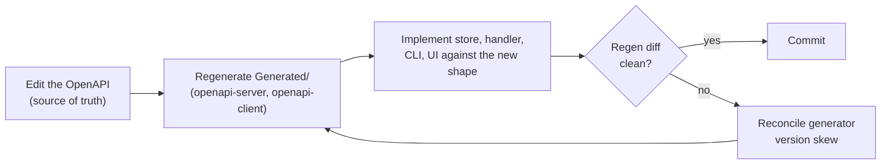

# Platform conventions

This guide collects the cross-cutting engineering conventions the control plane and its persistence layer
follow. They are not specific to one subsystem; they apply everywhere, and a contribution is expected to hold
to them. It is the how-to companion to the platform-conventions ADRs under [`../adr/`](../adr/README.md).

## High-performance JSON with CTJ

The platform builds on Corvus.Text.Json (CTJ), which works in UTF-8 bytes, builds typed documents into pooled
arenas, and reads through generated typed accessors. The governing rule is that JSON moves **bytes-native**:
a value is carried as bytes or a typed document from end to end, and a managed string is materialised only at
the genuine leaf ([ADR 0037](../adr/0037-bytes-native-seams.md)).

In practice:

- **Bridge a field, do not transcode it.** Use a value-bridge (`Models.X.From(...)`, a zero-copy element wrap)
  rather than `(string)value` and back. Wrap a whole congruent document with `T.From(...)`.
- **Build documents by typed construction.** A persisted or response shape is a generated CTJ document created
  through `Create`, `Build`, or `CreateBuilder<TContext>` (thread a context so no closure captures), not a
  hand-rolled record.
- **Own pooled documents explicitly.** A per-request `JsonWorkspace` is a pooled arena. A pooled document that
  feeds a deferred-serialised response must outlive the synchronous build, through
  `workspace.TakeOwnership(doc)` or `page.Items.TransferOwnershipTo(workspace)`. Forgetting this returns the
  document to the pool before it is read.
- **Realise at the leaf.** Produce a managed string or an owned `byte[]` only at the true sink: a database
  parameter, a searchable indexed column, or a driver whose API only accepts an array.

The anti-pattern this rules out is the record-to-document string round-trip on a warm path: bytes in, strings
out, strings in, bytes out.

## Keyset pagination

Every list that can grow is keyset-paged, at the API and at the store, across every backend
([ADR 0035](../adr/0035-keyset-pagination-everywhere.md)). An unpaged list is a latent failure. The store seeks
past an opaque cursor (`WHERE key > @after ORDER BY key LIMIT @n+1`), not `OFFSET`, so paging is stable under
concurrent change and does not degrade with depth. The continuation token carries the cursor bytes-native and
a page is a sealed disposable that owns its pooled token (never a record struct, which would double-return the
rent). The only exemptions are results bounded by construction (the administrators of one workflow, the label
orderings).

## Bounded counts

A list's total is a bounded count, not an unbounded aggregate
([ADR 0036](../adr/0036-bounded-count-contract.md)). The store seam is
`CountAsync(<the same filter as the list>, cap) -> (int Count, bool Capped)`, querying `LIMIT cap+1` so it
materialises no rows and stops at the cap. Because it reuses the list's filter, the count cannot drift from the
rows. The API exposes it as `GET …/count` returning `{ count, capped }`, and the UI renders `${count}+` when
capped. The default cap is 100.

## Governance audit

Every governed action (grant, revoke, approve, deny, publish, delete) is audited through one payload-safe
primitive, `GovernanceAudit` ([ADR 0038](../adr/0038-payload-safe-governance-audit.md)). It emits a span named
for the action plus an audit-grade structured log, carrying only controlled vocabulary and identifiers (the
action, the actor, the target kind and id, the outcome). It has no parameter that could take a payload or a
secret, so an action cannot leak its inputs through the audit, and the span is zero-cost when no listener is
attached. Add a governed action by calling the primitive, not by inventing a new audit shape.

## API-first

The control plane is API-first: the OpenAPI document (`docs/arazzo/reference/arazzo-control-plane.openapi.json`)
is the single source of truth, and the server stubs, client, and CLI are generated from it
([ADR 0039](../adr/0039-api-first-openapi-source-of-truth.md)).

A change is authored in the OpenAPI first, the `Generated/` code is regenerated (`openapi-server` for the
server stubs, `openapi-client` for the client and CLI), and only then are the store, handler, CLI, and UI
implemented against the regenerated shape. The generated handlers route, parse, and validate; a hand-written
handler implements the generated `IApi*Handler` interface. Never edit generated code by hand, and treat a
drifting regen diff as a signal to reconcile the generator version, not to hand-fix the output.

## See also

- The platform-conventions ADRs, [`../adr/README.md`](../adr/README.md), for the rationale behind each
  convention.
- The CTJ skills (`corvus-bytes-to-bytes`, `corvus-typed-model-construction`,
  `corvus-builder-context-threading`, `corvus-parsed-documents-and-memory`) for the detailed patterns behind
  the bytes-native rule.
