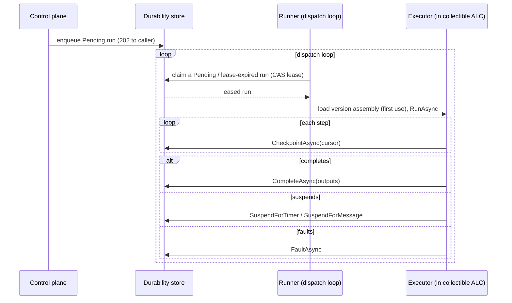

# Deploying and operating a runner

This guide covers the execution host, the runner: what it is, how it claims and executes runs, how it is
authorized for an environment, and how it stays healthy. It is the how-to companion to the runner ADRs under
[`../adr/`](../adr/README.md).

## What a runner is

A runner is a separate process from the control plane. The control plane manages and governs workflows and
enqueues runs; the runner executes them. The two share the durability store and cooperate only through it, and
never call each other on the hot path ([ADR 0023](../adr/0023-two-process-store-as-queue.md)). This keeps
execution off the control plane's request path and keeps the control plane's elevated authority away from
tenant workflow code.

The runner is a background worker. In the reference runner
(`samples/arazzo/Corvus.Text.Json.Arazzo.Runner.Demo/`) it is a `WorkflowDispatchService` (an ASP.NET
`BackgroundService`) with a minimal web surface that exists only for the health probe and telemetry.

## The claim-execute-checkpoint loop

A run is started asynchronously: the control plane's run-start endpoint enqueues a `Pending` run and returns
`202` ([ADR 0026](../adr/0026-triggers-async-by-default.md)). The runner picks it up.

The dispatch loop claims a `Pending` run (or a `Running` run whose lease expired) under a compare-and-swap
lease, drives it through `HostedWorkflowResumer`, which loads the version's assembly through
`WorkflowExecutorLoader` into a collectible load context on first use
([ADR 0024](../adr/0024-collectible-assembly-per-version.md)), and re-enters it against the runner's
transports. Because the run's state is its checkpoint ([ADR 0019](../adr/0019-products-are-the-checkpoint.md)),
a claimed run resumes from its cursor, whether it is fresh or was mid-flight when a previous lease expired.

## Trusting the executor

Before it activates an assembly, the loader verifies its integrity: the assembly digest matches the manifest,
the package hash matches the expected content hash, and the target framework matches
([ADR 0025](../adr/0025-integrity-binding-optional-signature.md)). A single-node deployment relies on this
digest binding. A deployment that separates who produces executors from who runs them configures a detached
signature: the runner is built with an `IExecutorPackageVerifier` (for example
`TrustStoreExecutorPackageVerifier`) and refuses any assembly not signed by the trusted signer.

## Authorization for an environment

A run is pinned to an environment, and a runner may only claim runs for an environment it is authorized for
([ADR 0027](../adr/0027-runner-environment-binding.md)). A runner registers as a machine principal, so the
control plane binds its trusted identity from its token rather than a self-asserted one. Authorization moves
through a lifecycle: Pending, Authorized, then Quarantined or Revoked. Revocation is enforced in the store: a
revoked runner's claim is refused at the lease path, so it stops serving runs immediately whether or not it
cooperates.

The approver-facing side of this is the runner-authorization inbox, where an administrator of an environment
authorizes or revokes the runners that may serve it.

## Health and liveness

A runner heartbeats into the runner registry (`IRunnerRegistry`) so the control plane knows which hosts are
live, and a trigger gates on a live host. The heartbeat is frequent and touches one field, so on backends that
store queryable JSON it is a single native server-side partial update rather than a read-modify-write
([ADR 0029](../adr/0029-native-heartbeat-partial-update.md)). A runner whose heartbeat lapses is treated as
stale, and its in-flight runs become claimable by another runner when their lease expires.

Every runner background loop treats a transient fault inside one iteration as survivable: it is logged as a
warning and the next tick retries, because the host's default `BackgroundServiceExceptionBehavior` is
`StopHost` and an escaped exception would terminate the whole runner. A store outage therefore costs at
worst a stale lease, and the heartbeat's unknown-to-the-registry path re-registers the runner once the store
answers again. Permanent misconfiguration (a state store missing a required index interface) still fails
fast at startup — only per-iteration faults are absorbed.

## Isolation

Today a runner executes a run in-process, in a collectible load context
([ADR 0024](../adr/0024-collectible-assembly-per-version.md)). Stronger isolation (a per-run micro-guest, a
serverless function, or a container) is a designed but not-yet-shipped pluggable backend seam
([ADR 0028](../adr/0028-pluggable-execution-backends.md)). Until it lands, a deployment that needs stronger
isolation runs runners in separately-isolated hosts at the process boundary.

## See also

- The runner and execution-host ADRs, [`../adr/README.md`](../adr/README.md), for the rationale behind each
  choice here.
- The [authoring, generating, and running guide](authoring-generating-running.md) for how a run is generated
  and what the executor does.
