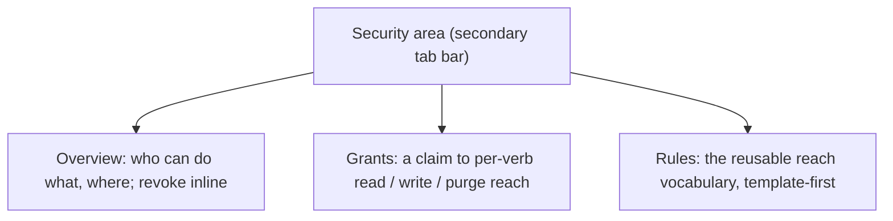

# Security UI design

The operator-facing surface for the whole access model: administrators, credential usage, row-security rules
and claim-to-rule bindings, access requests, and a who-can-do-what overview, unified around one mental model
and one identity primitive.

This guide owns the **UX design**: the jobs it serves, the information architecture, and the safety rules for
authoring a binding. The access model itself is [`auth-and-authorization.md`](auth-and-authorization.md) and its ADRs; the
enforcement detail is [`identity-and-authorization-design.md`](identity-and-authorization.md);
the concrete components (attributes, events, composition) are the
[UX component catalog](ux-component-catalog.md).

## The reframe: every access decision is WHO can do WHAT, WHERE

The model is clean (capability versus reach, [ADR 0001](../adr/0001-two-plane-access-model.md); a grant's
verbs are reach, not scopes, [ADR 0002](../adr/0002-grant-verbs-are-reach-not-scopes.md)). The challenge is a
UI that makes it answerable. Every decision has three axes:

| Axis | Meaning | Mechanism |
|------|---------|-----------|
| **WHO** | the principal | a resolved `sys:` identity (administration, credential usage), or a principal claim (a binding's `claimType`/`claimValue`) |
| **WHAT** | the capability | a scope (`catalog:read`, `runs:write`), or, for reach, a per-verb grant (read / write / purge) |
| **WHERE** | which rows | reach: a security rule over security tags, inside the deployment's mandated tenant shell ([ADR 0006](../adr/0006-deployment-access-control-shell.md)) |

Two sub-mechanisms name WHO, and reconciling them is the point:

- **Identity grants** (administration, credential usage) name a principal by their unforgeable `sys:` identity.
  That is exactly what the resolved-grantee picker produces, so the operator names a real person, team, role, or
  workflow and the server resolves it ([ADR 0008](../adr/0008-resolved-grantee-resolution.md)).
- **Claim-to-rule bindings** name a principal by an inbound claim and grant per-verb reach
  ([ADR 0002](../adr/0002-grant-verbs-are-reach-not-scopes.md)).

The overhaul makes WHO one correct-by-construction act (the grantee picker, never a raw `sys:` tag editor, a
convention in the [UX catalog's design conventions](ux-component-catalog.md#design-conventions)),
makes WHERE visible and goal-oriented, and gives one who-can-do-what overview, aggregated server-side
([ADR 0015](../adr/0015-access-overview-server-aggregated.md)).

## End-user goals

The design serves these jobs. The point is to make G1, G5, and G6 (which had no UI) and G3 (which was
error-prone) a few clicks, without making the operator learn the rule grammar for the common cases.

| # | Goal (operator's words) | Model action | Surface |
|---|-------------------------|--------------|---------|
| G1 | "Let the payments team read payments workflows" | binding: claim `team=payments`, read = rule `domain==payments` | Grants |
| G2 | "Let Ada run payments workflows" | access request, admin approves, entitlement scoped to her | Requests, or a direct grant |
| G3 | "Only nightly-reconcile runs may use this DB credential" | credential usage grant = resolved `workflow` grantee | Credential detail |
| G4 | "Who administers nightly-reconcile? add or remove" | administrators (resolved identities) | Catalog version detail |
| G5 | "What can Ada do, and where? revoke X" | read across bindings, administration, and usage; delete a grant | Overview |
| G6 | "Define a reusable reach (the finance domain)" | create or edit a rule (template or expression) | Rules |
| G7 | "Approve or deny pending access requests" | decide a request | Requests |

## The universal primitives

**The grantee is the universal WHO.** One grantee picker sits wherever a principal is named (administration,
credential usage, and the well-known binding kinds), and one shared grantee chip renders a resolved grantee
consistently: the kind icon and label foremost, the resolved identity secondary, and the opaque digest behind a
copy affordance, never the headline. This is the resolved-grantee model
([ADR 0008](../adr/0008-resolved-grantee-resolution.md)) and the identity-renders-as-a-resolved-label
convention ([UX catalog](ux-component-catalog.md#design-conventions)).

**Goal templates hide the grammar.** Rules are authored from templates for the common cases ("rows in a
domain", "rows matching the caller's tenant", "rows sharing any label with the caller"), with a single Advanced
escape hatch that exposes the raw expression grammar and a live preview. The operator picks a goal, and the UI
writes the rule.

## Information architecture: the Security area

The Grants (claim-to-rule bindings), Rules (the reach vocabulary), and the who-can-do-what Overview live under
one **Security** area with a secondary tab bar:

The request and approval inboxes are their own surfaces, not folded under Security. Administrators are
subject-scoped, so they live on the record they govern: a workflow's administrators on the Catalog version
detail, an environment's on the Environment detail (the same `arazzo-administrators-panel` serves both, keyed by
`base-workflow-id` or `environment`). The Overview cross-links to each.

For the panels themselves (`arazzo-access-overview`, `arazzo-grants-panel`, `arazzo-rules-panel`,
`arazzo-administrators-panel`, `arazzo-access-requests`, `arazzo-grantee-picker`) and their attributes, events,
and composition, see the [UX component catalog](ux-component-catalog.md#security-and-access).

## Authoring a binding: direct versus request-gated

This is the safety-critical rule of the Grants surface. The decision (split by binding type, with a
server-side self-elevation guard) is [ADR 0014](../adr/0014-direct-grant-versus-request-only.md): a standing
group or policy binding (a group or role claim, typically read reach) is authored **directly** by an
administrator, while per-person elevation (write or purge reach scoped to a `sub`) stays **request then approve**
only. The rationale is separation of duties, the audit chain, and no ambient privilege.

The residual detail this guide owns is the **picker-to-claim mapping under multiple semi-trusted identity
providers**, which is why the split above is not just policy but a correctness requirement:

- An identity grant binds on the post-shell `sys:` identity the picker resolves, which includes `sys:iss`, the
  cross-provider uniqueness key. So identity grants are issuer-safe by construction: `sub=u-1042` from two
  providers resolves to two different identities and is never conflated.
- A claim-to-rule binding keys on an inbound claim (pre-shell, before issuer resolution). A naive binding on
  `sub=u-1042` would match that subject from any issuer, which is an impersonation risk when more than one
  semi-trusted provider is trusted.
- Therefore person grantees route to the request flow, where the server, holding the full resolved identity,
  writes the issuer-qualified entitlement. Group and role bindings authored directly key on a claim the
  deployment treats as issuer-canonical, and the UI surfaces the caveat ("a claim is only as trustworthy as the
  issuer asserting it") with a raw-claim fallback for deployments whose claims already carry issuer namespacing.
  First-class person-scoped direct bindings (the issuer in the binding key) are a flagged model follow-up.

## Open question

The exact claim a `person` grantee implies for the raw-claim fallback is deployment claim-map dependent, and is
still open.

## References

- The access model: [`auth-and-authorization.md`](auth-and-authorization.md) and ADRs
  [0001](../adr/0001-two-plane-access-model.md), [0002](../adr/0002-grant-verbs-are-reach-not-scopes.md),
  [0006](../adr/0006-deployment-access-control-shell.md), [0008](../adr/0008-resolved-grantee-resolution.md),
  [0014](../adr/0014-direct-grant-versus-request-only.md),
  [0015](../adr/0015-access-overview-server-aggregated.md).
- The enforcement detail (row security, administration, the entitlement lifecycle):
  [`identity-and-authorization-design.md`](identity-and-authorization.md).
- The credential-usage grant: [`source-credentials-design.md`](source-credentials.md).
- The components: [UX component catalog](ux-component-catalog.md).
