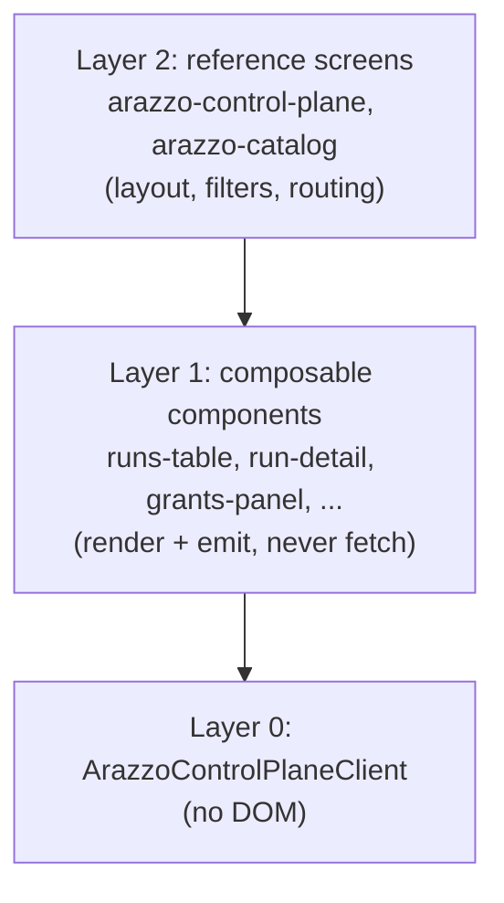

# The web UI kit: adopting, theming, and composing

This guide covers how to adopt the Arazzo control-plane web component kit: how to wire it to a backend, theme
it, authenticate it, and compose a screen. It is the how-to companion to the web-kit ADRs under
[`../adr/`](../adr/README.md). For a reference of every component, see the
[UX component catalog](ux-component-catalog.md).

## The three layers

The kit is three layers ([ADR 0040](../adr/0040-three-layer-web-kit.md)).



Layer 0 is a DOM-free client. Layer 1 is composable components that take a client, render their own loading,
empty, and error states, and emit events. Layer 1 **never calls `fetch`**. Layer 2 is reference screens that
compose Layer 1 and own layout, filters, and routing. You either drop in a Layer 2 screen or compose your own
from Layer 1.

## Adopting

Every element is a standards-only custom element with no build step
([ADR 0041](../adr/0041-standards-only-zero-build-elements.md)). Import the module for the elements you use and
place the tags. Give a component its data access by setting `.client` (a `ArazzoControlPlaneClient`) or a
`base-url` attribute from which it builds one:

```html
<arazzo-control-plane base-url="/arazzo/v1" scopes="runs:read runs:write runs:purge"></arazzo-control-plane>
```

```javascript
import '@corvus-dotnet/arazzo-control-plane-ui/src/arazzo-control-plane.js';
const panel = document.querySelector('arazzo-control-plane');
panel.client = new ArazzoControlPlaneClient({ baseUrl: '/arazzo/v1' });
```

## Authentication

The kit is auth-agnostic: the host owns the session and hands the kit credentials
([ADR 0042](../adr/0042-auth-agnostic-host-owns-session.md)). A Layer 2 screen exposes an `authProvider` that
returns the `Authorization` header, shared with its children:

```javascript
panel.authProvider = async () => `Bearer ${await app.getAccessToken()}`;
```

For a backend-for-frontend deployment, the shared `arazzo-auth-status` element provides optional sign-in and
sign-out chrome that self-discovers and stays hidden when auth is disabled. The kit never embeds an IdP flow,
so it works with any scheme.

## Theming

Styling is CSS custom properties (`--arazzo-*` tokens) that a themed ancestor supplies; a component in an open
shadow root inherits them. Set the tokens once on an ancestor (or use a Layer 2 screen's `theme` attribute,
which applies a light or dark token set) and the whole kit follows. Light and dark are token sets, not
component variants.

## Composing a screen

Layer 1 components emit rather than navigate ([ADR 0040](../adr/0040-three-layer-web-kit.md)), so a host wires
cross-surface flows by listening for events. For example, the access overview emits `open-workflow`,
`open-environment`, and `open-credential`, which a host routes to the catalog, environments, and credentials
surfaces. A Layer 2 screen already does this composition for its area; to build your own, place the Layer 1
components, share one client, and connect their events.

## Shared conventions

Every element extends `ArazzoElement` (`src/components/base.js`) and follows the same conventions:

- **Client injection.** Set `.client`, or a `base-url` attribute the element builds one from. Setting it
  re-renders.
- **Events.** `emit(type, detail)` dispatches a bubbling, composed `CustomEvent`, so a host hears it across
  shadow roots.
- **Scope gating.** A `scopes` attribute (space-separated) shows or hides mutating controls; an absent
  attribute defers to the server.
- **Dialogs.** `confirmDialog(host, {...})` shows a themed, focus-trapped confirmation inside the host's shadow
  root. The native `prompt`, `confirm`, and `alert` are not used.
- **Paging.** `arazzo-pager` is the shared Prev/Next footer over a keyset cursor
  ([ADR 0035](../adr/0035-keyset-pagination-everywhere.md)).

## See also

- The [UX component catalog](ux-component-catalog.md) for every component's attributes, events, and
  composition.
- The web-kit ADRs, [`../adr/README.md`](../adr/README.md), for the rationale behind the kit's shape.
