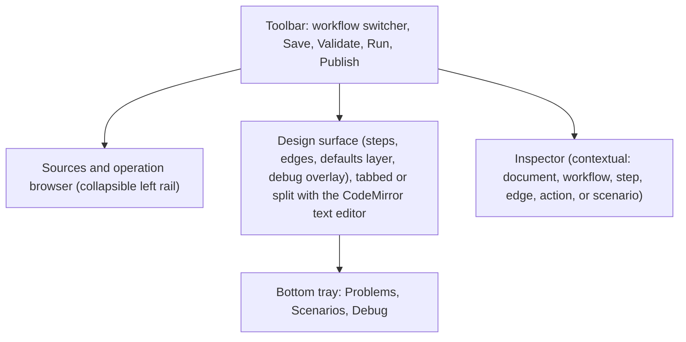

# Workflow designer

A design-test-and-validate environment for Arazzo workflows, delivered as reusable web components in the kit
(`web/arazzo-control-plane-ui`). An author finds or adds OpenAPI and AsyncAPI sources, browses their operation
surface to create steps, edits success and failure handling and criteria with editor support, manages inputs and
outputs through the schema-driven typed forms, exercises the workflow interactively against a mock transport and a
virtual clock, captures that behaviour as scenarios, and publishes to the catalog with the evidence of successful
validation. Terms are as defined in the [glossary](../reference/UBIQUITOUSLANGUAGE.md).

This guide is the designer's behaviour in depth. The decisions behind it are the designer ADRs: the first-party
SVG design surface ([ADR 0043](../adr/0043-first-party-svg-design-surface.md)), the collaboration-ready document
model ([ADR 0044](../adr/0044-collaboration-ready-document-model.md)), debug runs that never put credentials in
the browser ([ADR 0045](../adr/0045-debug-runs-never-credentials-in-browser.md)), and the vendored CodeMirror
editor ([ADR 0049](../adr/0049-codemirror-vendored-single-bundle.md)); the components themselves are the
[Designer section of the UX catalog](ux-component-catalog.md#designer). The designer has shipped, bar the open
items noted in §14.

## 1. Goals & non-goals

**Goals**

- **Cover the full Arazzo 1.1 capability surface.** Everything the schema can express is editable:
  all step binding kinds (OpenAPI operation, nested workflow, AsyncAPI channel with
  `action`/`correlationId`/`timeout`), all criterion types (`xpath` round-trips but is flagged,
  the runtime does not evaluate it), workflow-level and step-level actions, reusable components,
  payload replacements, `querystring` parameters, `dependsOn`, multiple workflows per document.
- **The design surface is an instrument, not an illustration.** The same canvas that authors the
  workflow runs it: debug sessions step the workflow live, light the taken path, expose paused
  state, and let the author inject triggers and advance the virtual clock interactively.
- **Working copies keep the catalog clean.** Iterating during development saves the document (and
  its scenarios) durably without ever minting a catalog version; *publish* is a deliberate act.
- **Test scenarios are first-class and travel with the workflow.** Scenarios are edited alongside
  the working copy, carried forward when a new version of a published workflow is edited, run as a
  suite, and their successful execution is recorded as evidence at publish.
- **Zero-build kit citizenship.** Standards-only custom elements extending `ArazzoElement`; Shadow
  DOM; `--arazzo-*` token theming; a Layer-0 client extension; events over navigation; loading /
  empty / error states; scope-gated actions; mock-API demo coverage. No framework runtime.
- **Schema-typed end to end.** Value editing uses the baked-schema TypeDescriptor forms
  (`<arazzo-value-editor>`); expression editing gets completions computed from the *actual* resolved
  types of the working copy.

**Non-goals (this epic)**

- Not a replacement for the text editor: the text mode and the design surface are peers over one
  document model; neither is a downgraded mirror of the other.
- Real-time collaboration ships later, but the document model is **collaboration-ready from day
  one** (decided 2026-07-04, this reverses an earlier non-goal): edits are identity-addressed
  operations with inverses, never snapshots, so the realtime transport is an addition, not a
  rewrite (§5.2). Working copies keep etag concurrency for whole-document saves; Git covers
  asynchronous multi-author flows.
- No arbitrary-API live calls from the designer. Simulation talks to the mock transport only;
  running against real environments stays the runs surface's job.
- No bundled IdP or GitHub credential UI beyond the control-plane-brokered flow (§12); the kit stays
  auth-agnostic.

## 2. Prior art

[Jentic's Arazzo Editor](https://jentic.com/product/arazzo-editor) (hosted product) and
[`@jentic/arazzo-ui`](https://github.com/jentic/jentic-arazzo-tools) (Apache-2.0 viewer, React +
React Flow v11 + mermaid) validate form-based editing with a live diagram. We deliberately go
beyond that model rather than copying it:

| Jentic | This design |
|--------|-------------|
| Diagram is output-only (forms in, picture out) | The surface is bidirectional and is also the debugger |
| No execution semantics in the editor | Deterministic simulation: run, step, breakpoints, time-travel |
| Untyped/JSON value entry | Baked-schema typed forms and typed expression completions |
| No testing story | Scenarios, recording, suite runs, publish-with-evidence |
| React runtime, bundler required | Zero-build custom elements in the existing kit |
| OpenAPI only, Arazzo 1.0.1 export | OpenAPI + AsyncAPI, Arazzo 1.1, catalog/governance integrated |

## 3. UX concept

### 3.1 Layout



- **Design surface ↔ Text** are tabs (or a split) over one shared document model (§5.3). Edits in
  either reflect in both; selection is synchronized (select a step on the canvas → cursor lands on
  it in text, and vice versa).
- **Inspector** (right bar) renders the editor for the current selection. Nothing is editable *only*
  on the canvas; the canvas is direct manipulation over the same properties the inspector shows.
- **Bottom tray** hosts Problems (validation diagnostics, click-to-navigate), Scenarios (the
  suite), and Debug (controls + context explorer + trace), the tray expands during a debug session.

### 3.2 Authoring on the surface

- **Steps from operations.** Drag an operation from the source browser onto the surface (or click
  "+ Step") to create a step bound to it, pre-populated with required parameters from the operation
  descriptor. Steps render as cards: method/channel badge, `stepId`, source name, a one-line
  operation summary, and status chips (breakpoint, problems, outputs count).
- **Edges are semantics, not decoration, one grammar: an action is an edge to a target.**
  **Start and end render as pseudo-nodes** (projection-only, reserved ids `#start`/`#end`, never
  written into the document): the entry edge leaves start; every `end` action *and* the implicit
  fall-off-the-last-step completion land on the end terminal, so "how can this workflow finish?"
  is always visible. Sequence flow is muted; `goto` and `end` actions are explicit directional
  edges carrying their criteria labels, success/failure distinct by colour + pattern (never colour
  alone). Retry renders as a self-badge with `retryAfter`/`retryLimit`. Dragging a port onto the
  end terminal authors an `end` action; the start node is never an action target. Workflow
  `inputs` anchor to start and `outputs` to end, selecting them opens the matching inspector.
- **Inherited vs local handling is a visible layer.** Workflow-level `successActions`/
  `failureActions` render as a "defaults" layer (a halo/lane at the surface edge). A step with no
  local handlers shows ghosted inherited markers; clicking one offers **"localize here"** (copy to
  the step for editing). A step that overrides shows solid local markers with an "overrides
  defaults" affordance. This makes the Arazzo inheritance model legible at a glance.
- **Criteria on edges.** An action's `criteria` summarize on the edge label; an explicit action
  edge with no criteria is labelled *always* (ghost style), unconditional behaviour is visible,
  not silent. Clicking the edge opens the criteria editor in the inspector.
- **Verdict vs routing, why success carries an extra layer.** `successCriteria` is the *verdict*:
  all must match for the step to succeed, and failure is defined as its complement (there is no
  `failureCriteria`, one boundary, authored once, no overlaps or gaps). `onSuccess`/`onFailure`
  are *routing* given that verdict, and at that layer the two sides are structurally identical;
  per-action criteria choose *which reaction applies*, never whether the step succeeded. The
  inspector captions each section with its role so the model is legible in-product.
- **Action order is semantics: first-match-wins.** Arazzo dispatches the *first* action in
  declaration order whose criteria all match (the runtime's `ControlFlowEmitter` emits exactly
  this; step-level actions take precedence over workflow-level defaults), so an action with no
  criteria, a **catch-all**, always matches and everything after it is dead. The designer makes
  this legible and safe: action lists reorder (▲▼) with **catch-alls pinned to the end** (no
  reorder controls, criteria'd actions cannot move below them, insertions land above them, an
  action that loses its last criterion repositions to the end); edge labels lead with their
  precedence (`1·`, `2·`) when a step has several same-kind actions; and anything that still ends
  up after a catch-all (e.g. a hand-authored document) is **flagged unreachable**, a projection
  problem, a struck-through dimmed edge, and a ⚠ row marker, never silently rewritten.
- **Drop → select → conditions.** Drawing an edge writes the action, auto-selects the new edge,
  and the inspector opens on its criteria, conditions are one keystroke away without a modal
  interrupting bulk authoring. Dropping an *identical unconditional* duplicate selects the
  existing edge instead of appending a dead action; once criteria differ, parallel edges between
  the same pair are legitimate and fan out side by side.
- **Multiple workflows** in a document appear in the toolbar switcher; a step bound to another
  workflow (`workflowId` binding) renders as a sub-workflow card that can be opened (breadcrumb
  navigation). `dependsOn` renders in a document-level overview mode.
- **Undo/redo** is document-model-level and spans both editors.

### 3.3 The debug session (the differentiator)

Deterministic simulation (compiled executor + scripted mock transport + virtual clock) makes a full
run milliseconds and exactly reproducible. The UX exploits that:

- **Run / Pause / Step / Run-to-here / Breakpoints / Stop.** Set breakpoints on steps; run a
  scenario (or an ad-hoc setup); the active step pulses; taken edges light as criteria evaluate
  (success green / failure red); untaken branches dim. While running, the run control is **Pause**
  (halts before the next step); **Stop** terminates a live session and clears the overlay. A
  *completed* run deliberately keeps its overlay for inspection, **Clear** is the explicit return
  to the clean editing surface (starting a new run also replaces it). **Step**
  executes exactly the next step and pauses again, invoked from idle it starts the session paused
  before the first step; "run to here" targets a step. *Every* pause, breakpoint, manual pause,
  or step, hands the paused context to the context explorer and expression console below for
  inspection; step and resume are both §8.2 replays, differing only in how far the stop condition
  advances (one step vs. the next breakpoint/end).
- **Virtual clock as a control.** When the run suspends on a timer, the debug controls show the
  wait and offer "advance to due" / "+1s / +1m / +1h"; retries with `retryAfter` show the same.
  Nothing waits in real time.
- **Trigger injection.** When the run suspends on a message wait (AsyncAPI receive), the debug tray
  offers an "inject message" form, typed from the channel's schema, so "what if the webhook
  arrives late / malformed / twice?" is interactive.
- **Paused-state inspection.** The context explorer shows the live execution context (`$inputs`,
  each completed step's `$steps.<id>.outputs`, the in-flight request/response) as an explorable
  tree. Hovering a completed step on the canvas shows its actual request/response and a **criterion
  truth table** (each criterion, its evaluated operands, pass/fail).
- **Expression console.** A REPL input (same highlighted editor as criteria) evaluates any runtime
  expression or JSONPath against the paused context, the fastest way to debug a criterion.
- **Time-travel.** The trace is fully recorded; a scrubber moves the canvas overlay backward and
  forward through the run. Because stepping is replay-based (§8.2), scrubbing is pure client-side
  rendering over the trace.
- **Live re-run on edit.** Editing the document (or a mock) during a session offers "re-run to the
  same point", replay is exact, so the author iterates on a criterion against the same paused
  moment repeatedly.

### 3.4 Scenario recording

A debug session *is* scenario authoring. The session's setup (inputs, mock scripts, injected
triggers, clock advances) accumulates in the Debug tray; **"Save as scenario…"** captures it.
Expectations are promoted from observed reality: right-click a step in the trace → "expect reached"
/ "expect outputs…"; the final state offers "expect outcome Completed" and per-output criteria
pre-filled from actual values. Assertions reuse the criterion language, testing teaches the same
skills as authoring. Hand-editing scenarios in the typed forms remains available.

## 4. What the server must add (API-first)

The kit consumes the control-plane OpenAPI contract; per the house rule, every feature below is
authored in `arazzo-control-plane.openapi.json` first, then stores/handlers/CLI, then the kit.

New resource groups (names use the ubiquitous language; scopes follow the existing tier pattern):

### 4.1 Workspace (working copies), `workspace:read` / `workspace:write`

| Operation | HTTP | Purpose |
|-----------|------|---------|
| `createWorkingCopy` | `POST /workspace/workflows` | From scratch, from an uploaded document, **or from a catalog version** (`fromBaseWorkflowId` + `versionNumber`, copies the document, its source attachments by reference, and the version's scenarios: the carry-over). |
| `listWorkingCopies` | `GET /workspace/workflows` | Keyset-paged, reach-scoped list (id, name, baseWorkflowId?, updatedBy/At, problem count). |
| `getWorkingCopy` / `updateWorkingCopy` / `deleteWorkingCopy` | `GET`/`PUT`/`DELETE /workspace/workflows/{id}` | Document + scenario container; `PUT` is etag-guarded (409 on concurrent change). Save as often as needed; no catalog interaction. |
| `validateWorkingCopy` | `POST /workspace/workflows/{id}/validate` | Full diagnostics: JSON-Schema conformance of the document, plus semantic checks, unresolved `operationId`/`operationPath`/`channelPath`, unknown `stepId` in `goto`, expression parse errors (via `ArazzoExpression.Parse`), criterion syntax, dangling component references, unreachable steps, and request-shape typing (`payload-typing`): payload literals and statically-typed expressions against the bound operation's request schema, step parameters against its parameter schemas, replacement values against the schema at their target pointer, and a channel step's body against the channel's one message payload schema (multi-message channels get the benefit of the doubt; expression types resolve through the workflow's inputs schema, `$response.body` response schemas, and `$message.payload` message schemas). Returns positioned diagnostics (JSON Pointer + severity) for the Problems tray and Monaco markers. |
| `getWorkingCopySchemas` | `GET /workspace/workflows/{id}/schemas` | Baked-schema TypeDescriptors recomputed for the working copy (same shape as `getCatalogWorkflowSchemas`), powering typed forms and expression completions. |
| `attachWorkingCopySource` / `listWorkingCopySources` / … | `POST`/`GET`/`DELETE /workspace/workflows/{id}/sources[/{name}]` | Attach a source per `sourceDescriptions` name: by **registry reference**, by **upload**, or by **fetch** (§4.4). The working copy resolves like a package (self-contained input to schemas/simulation). |
| `listSourceOperations` | `GET /workspace/workflows/{id}/sources/{name}/operations` and `GET /sources/{name}/operations` | The operation surface: `OperationDescriptor` / `AsyncApiChannelDescriptor` projections (id, path/channel, method/action, summary, parameters, request/response types **including documented response codes and request/message schemas**, these power the step inspector's criteria and body templates). |

Governance: a working copy is a governed resource in the environment/workflow §15 style, creating
one grants the creator administration; reach labels apply. It is deliberately *light* (no
availability, no runs, no executor persisted).

### 4.2 Scenarios, stored on the working copy; published into the package

| Operation | HTTP | Purpose |
|-----------|------|---------|
| `listScenarios` / `putScenario` / `deleteScenario` | `GET`/`PUT`/`DELETE /workspace/workflows/{id}/scenarios[/{scenarioName}]` | CRUD on the working copy's scenario set. |
| `runScenario` / `runAllScenarios` | `POST …/scenarios/{name}/run` · `POST …/scenarios/run` | Execute against the simulator; returns per-scenario `{outcome, trace, expectationResults[]}` (suite report for run-all). |

**Scenario model**, a new JSON Schema (generated types server-side; TypeDescriptors for the UI
forms; no hand-rolled records):

```jsonc
{
  "name": "payment-declined-then-retry",
  "description": "…",
  "inputs": { /* validated against the workflow's inputs schema */ },
  "mocks": [                       // per source-operation scripting (MockApiTransport surface)
    { "source": "payments", "operationId": "authorize",
      "match": { /* optional criteria over request */ },
      "responses": [               // sequence semantics; last repeats
        { "status": 402, "body": { … }, "delay": "PT0S" },
        { "status": 200, "body": { … } } ] } ],
  "triggers": [                    // message injections for AsyncAPI waits
    { "channel": "payments.events", "correlation": "$inputs.orderId",
      "payload": { … }, "at": { "afterStep": "authorize" } } ],
  "clock": { "start": "2026-01-01T00:00:00Z", "autoAdvance": true },  // advance-to-due on timer waits
  "expect": {
    "outcome": "Completed",
    "path": ["validate", "authorize", "authorize", "capture"],        // optional exact/subsequence
    "outputs": [ { "condition": "$outputs.receiptId != null" } ],     // criterion grammar
    "steps": { "authorize": { "attempts": 2 } } }
}
```

At publish, the scenario set and the evidence are written into the package as
`metadata/scenarios.json` and `metadata/evidence.json` (the `.awp` format already reserves named
metadata entries), immutable, content-addressed, and carried to the next working copy.

### 4.3 Simulation, `workspace:read` (it mutates nothing)

| Operation | HTTP | Purpose |
|-----------|------|---------|
| `simulateWorkingCopy` | `POST /workspace/workflows/{id}/simulate` | Body: `{scenarioName | inline scenario, until?: {stepId?, occurrence?, breakpoints?[]}, overrides?: {inputs?, mocks?, triggers?, clock?}}`. Returns the **trace** up to the stop condition. |
| `simulateCatalogVersion` | `POST /catalog/{base}/versions/{n}/simulate` | Same, for published versions (re-verify evidence, explore a regression). |

**Stateless stepping (§8.2):** there is no server-side debug-session resource. Every debug command
replays from the start to a new stop condition, determinism makes the replay exact and cheap, and
the control plane stays stateless. The response's trace is complete up to the stop point, so
time-travel scrubbing needs no further calls.

### 4.4 Source acquisition, `sources:read` / `sources:write`

| Operation | HTTP | Purpose |
|-----------|------|---------|
| `fetchSourceDocument` | `POST /sources/fetch` | `{url, credential?: {sourceName, environment} | inline authKind+secretRef}` → the fetched, validated document (+ detected type/version, content digest). **Server-side fetch**: avoids browser CORS entirely and reuses the §13 credential machinery (`SourceCredentials.Http`) for authenticated spec endpoints. Does not register; the caller attaches or registers the result. |

Upload (multipart) already exists on the wizard path; the working-copy attach (§4.1) accepts the
same. Registry registration at publish follows the existing wizard readiness rules.

### 4.5 Scenario runner CLI, the CI story

The control-plane CLI gains **`scenarios run`**, CI-native and wrappable as a GitHub Action:

```
arazzo scenarios run
  --workflow ./workflows/nightly-reconcile.arazzo.json     # or --working-copy <id> · --catalog <base> --version <n>
  --sources ./specs                                        # resolve sourceDescriptions against local files/URLs
  --scenarios "./scenarios/nightly-reconcile/**/*.scenario.json"   # globbable, repeatable
  --filter "payment-*"                                     # name filter within the matched set
  --report junit=out/scenarios.xml --report json=out/suite.json
  --github-annotations                                     # ::error annotations + job-summary markdown
```

Two execution modes:

- **Standalone (default).** No control plane required: the CLI hosts the simulator in-process,
  build + compile the workflow document with its source documents, run every matched scenario
  against the mock transport and virtual clock. Everything the designer does interactively,
  headless. This is the CI mode: workflows, specs, and scenarios live in a repo; the pipeline runs
  the suite on every push/PR.
- **Remote.** `--server` + host-supplied auth targets a control plane's simulate endpoints (a
  working copy or a catalog version), e.g. re-verifying a published version's evidence from a
  pipeline.

CI grade: non-zero exit on any failed expectation (or validation/compile failure); deterministic
ordering; console, JUnit XML, and JSON reports, **the JSON report is the same suite-report shape
`publish` embeds as evidence**, so a pipeline can finish with publish-with-evidence: PR merge →
suite green → publish mints the draft version.

On-disk layout: one scenario per file (`<name>.scenario.json`, schema §4.2). The Git-bound working
copy (§4.7) commits/pulls scenarios as these individual, globbable files, so the designer and the
repo/CI layout stay isomorphic.

A thin **GitHub Action** wrapper (composite action: install the dotnet tool, map inputs to flags)
ships alongside, making a versioned `uses:` reference the one-line CI story.

### 4.6 Publish & evidence, `catalog:write`

| Operation | HTTP | Purpose |
|-----------|------|---------|
| `publishWorkingCopy` | `POST /workspace/workflows/{id}/publish` | Body: `{owner, tags, requireScenarios?: true}`. The server: (1) validates the document; (2) resolves/attaches sources (registering new ones, wizard-style readiness); (3) **re-runs the full scenario suite server-side**, evidence is server-attested, never client-submitted; (4) builds the package including `metadata/scenarios.json` + `metadata/evidence.json`; (5) `AddAsync` → the new version (a **draft** until promoted). Fails 422 with the suite report if a scenario fails and `requireScenarios` is set. |

**Evidence model** (in-package + projected onto `CatalogVersion` metadata): engine + generator
versions, package content hash, per-scenario `{name, scenarioHash, outcome, pathSummary, durationVirtual,
at}`, and the suite verdict. The catalog detail renders an evidence badge ("12/12 scenarios ✓ at
publish"); `GET …/versions/{n}/evidence` serves the document.

**Promotion readiness (implemented):** an environment can require evidence, `readiness =
credentials ∧ (evidence.suiteGreen ∨ ¬environment.requireEvidence)`. The per-environment
`requireEvidence` flag (create/update, administrator-governed like the rest of the environment's
metadata) is default-off, so existing promotion behaviour is unchanged unless an environment opts
in. Suite-green means the attested suite ran at least one scenario and none failed; no evidence, or
an empty suite, is unevidenced and refused. Both promotion paths hit the same gate, a direct
make-available and an availability-request approval, refusing with a 409 `evidence-required`
problem.

### 4.7 GitHub integration, brokered; `workspace:write` + host-configured

GitHub's OAuth token exchange has no CORS support, so the browser cannot complete an auth flow
alone; the control plane brokers a classic **OAuth App** (the VS Code / `gh` CLI model — user
authorization only, no installation; ADR-noted 2026-07-24, replacing the earlier GitHub App +
installation model because sources may live in any repository the user can see, not one they
control):

| Operation | HTTP | Purpose |
|-----------|------|---------|
| `beginGitHubAuth` / `completeGitHubAuth` | `GET /github/auth` → redirect; callback exchanges the code server-side | Standard web-application flow; the control plane holds the App credentials and the user token (server-side session or encrypted at rest with a KMS ref, never in the browser). |
| `getGitHubStatus` | `GET /github/session` | Signed-in identity + a first page of accessible repos (a picker seed; any visible repo stays addressable by owner/repo). |
| `searchRepositories` | `GET /github/repos/search?query` | The repository pickers' typeahead: an owner-qualified query ('dotnet/run') searches that owner's repositories — reaching public repos the session's seed never contains. |
| `browseRepo` | `GET /github/repos/{owner}/{repo}/contents?ref&path` | Proxied browse for the open/import dialogs. |
| `bind` (on the working copy) | part of `PUT /workspace/workflows/{id}` | `gitBinding: {owner, repo, branch, path, specPaths?, scenariosDir?}`, a working copy may be **Git-bound**; `specPaths` maps sourceDescriptions names to spec file paths, and scenarios round-trip as individual `<name>.scenario.json` files under `scenariosDir` (the §4.5 CI layout). |
| `pullWorkingCopy` / `commitWorkingCopy` | `POST /workspace/workflows/{id}/git/{pull,commit}` | Pull: refresh document (+ bound source docs + scenarios) from the branch (etag/merge guard). Commit: write document (+ scenario files) to the branch with a message; optionally open a PR (`draft` → review flow for workflow development). |

Uses: version management of workflows *and* their OpenAPI/AsyncAPI specs during development
(branch-per-working-copy is the natural multi-author flow); importing specs from repos; optionally
pushing the published package inputs + evidence to a release branch/tag at publish. GitHub Enterprise
Server is configuration (base URL), not new design. The kit never sees a GitHub credential; it calls
the control plane.

**Identity rules (ratified).** Authorship is the signed-in user's GitHub-held git identity,
stamped by GitHub rather than composed by us; token custody is server-side per control-plane
principal; there are no unattended actions. Concretely:

- **Attribution, the user's.** Every user-initiated pull/commit/PR runs on that user's own
  OAuth token, so commits are authored by the human (with GitHub's web-flow signature on
  contents-endpoint commits). Never a shared service account.
- **Git identity is GitHub-held, never composed.** Commit-writing API calls **omit
  `author`/`committer`** so GitHub stamps the account's display name and configured commit email,
  respecting commit-email privacy (the `noreply` address still links to the account). The control
  plane never sets an email itself (a composed address either leaks a private one or breaks
  attribution), and the designer never offers a free-form git-identity field (self-asserted
  identity is forgeable; identity comes resolved from the authenticated principal).
- **Reach is the user's own.** The OAuth `repo` scope reaches whatever the signed-in user can
  see — which is what source browsing needs (documents live anywhere) — at the cost of scope
  coarseness. Organisations govern it through OAuth App access restrictions (org approval),
  the OAuth model's counterpart of an installation.
- **Custody, the server's, keyed by principal.** GitHub's token exchange has no CORS, so the
  exchange must happen server-side; the user token is held per control-plane principal (session,
  or encrypted at rest with a KMS ref), unreachable from any other principal's session, and never
  sent to the browser.
- **No impersonation in either direction.** Machine work never wears a human's git identity: an
  OAuth App has no app identity of its own, so any future unattended path (e.g. pushing the
  published package + evidence to a release branch) must arrive as its own deliberately-designed
  machine identity — it never rides a user's token.

## 5. Kit architecture (Layer 0 / 0.5 / 1 / 2)

### 5.1 Layer 0, client extensions

`ArazzoControlPlaneClient` gains the §4 methods (workspace, scenarios, simulate, fetch, publish,
github). Same conventions: `ProblemError`, keyset paging, host-supplied auth, conformance-tested
against the OpenAPI document.

### 5.2 Layer 0.5, `WorkflowDocumentModel` (new, DOM-free, collaboration-ready)

A shared observable model over the Arazzo document, imported by both editors and the inspector.
**Every edit is a group of identity-addressed operations, never a snapshot**, the property that
cannot be retrofitted, so it is the foundation:

- **Operations, not snapshots.** `set`/`remove`/`insert`/`move` ops address the document by its
  stable Arazzo identities (`workflows[id=…].steps[id=…].description`), not array indices,
  concurrent edits to different steps merge with no transform; indices never shear under
  concurrent insertion. Editors keep a simple API (`update(mutator)`, `applyText(text)`): an
  **identity-aware structural diff** reduces whatever they did to minimal ops, a step edited in
  text mode emits the *same* op a canvas edit would, which is also what keeps canvas positions
  and selection stable across text edits.
- **Undo/redo are local and inverse-based**: they invert *this actor's* op groups (with coalescing
  for typing bursts), never a collaborator's interleaved work, snapshot undo would revert
  everyone.
- **The transport seam, not the transport**: local groups emit as an `ops` event (actor + seq +
  label); `applyRemote(group)` applies a collaborator's ops delivered in **server total order**
  (the workspace later grows an ops relay, `POST /workspace/workflows/{id}/ops` + an SSE/WebSocket
  stream, and remains etag-guarded for whole-document saves). Same-field concurrent writes
  resolve last-writer-wins in that order; ops whose target a collaborator deleted are skipped,
  not faulted. Client-side pending-op rebasing (for latency masking) layers on later without
  changing the op shapes.
- **Layout persistence**: node positions are UI state, not document content, stored in the working
  copy's `designerState` (a sibling field, never written into the Arazzo document, never packaged,
  never part of the op stream).

### 5.3 Components

The designer's components are inventoried in the [Designer section of the UX component catalog](ux-component-catalog.md#designer)
(the design surface, the inspectors, the schema and value editors, the operation browser, the scenario panel, the
debug tray, the workflow compare, and the git dialog, connect, and tree), with their attributes, events, and
composition. They all extend `ArazzoElement`, theme through the `--arazzo-*` tokens, bubble composed events, and
render their own loading, empty, and error states.

A few authoring decisions those components encode are worth stating here:

- **Operation-derived templates with an explicit fallback.** The step inspector seeds success criteria and one
  failure action per documented response from `listWorkingCopySourceOperations`, plus a request-body skeleton
  built from the binding's schema. The templated failure fallback is an explicit `end` action, not an absent
  case: an unmatched failure would otherwise fault the run, and for a designed workflow a visible, retargetable
  fallback beats an invisible fault path. Templates fill empty sections and never overwrite.
- **`xpath` is preserved but never offered.** It is schema-valid Arazzo, but the runtime does not evaluate it, so
  the criteria editor flags an existing `xpath` criterion and never offers it for a new one.
- **The compare surface merges into one model.** `<arazzo-workflow-compare>` paints the visual diff through each
  surface's `diffState` and, with a merge target, offers Take and Keep verbs that emit change events for the host
  to apply to its single document model (§6.4).

### 5.3a The schema editor (§15 item 8, resolved 2026-07-13)

`<arazzo-schema-editor>` authors a workflow's `inputs` and the components library's input schemas
as a typed form rather than a guarded JSON textarea. It edits a **subset** of JSON Schema visually
and stays **lossless** over the rest: constructs the visual tier does not render survive untouched
and stay JSON-editable, so a round-trip never disturbs unrendered keywords or key order elsewhere.

- **Typed nodes.** Property rows carry type, format, required, enum/const, and a typed `default`
  edited by the same `<arazzo-value-editor>` machinery. Object and array nodes nest.
- **First-class combiners.** `oneOf`/`anyOf`/`allOf` are authored as combiner nodes, not dropped to
  raw JSON. The renderer (`schema-descriptor.js` `normalizeDescriptor`) and the server's baked-schema
  generator (`WorkflowSchemaMetadataGenerator`) apply the **same** normalization so both consumers
  agree: `oneOf`/`anyOf` become a union variant picker (null branch collapses to nullable, a lone
  branch unwraps, an explicit OpenAPI `discriminator` is honoured), and a **simple `allOf` merges**
  into one object descriptor. The simple-`allOf` rule: every branch is an object schema contributing
  only `properties`/`required` (plus `type: object`/`title`/`description`); the merge is the union of
  `properties` and of `required`, with a same-key overlap allowed only when the two subschemas are
  structurally equal (**order-insensitive**, so the two normalizers cannot disagree on reordered
  keys). A conflict, a non-object branch, or a branch keyword beyond that set makes it not-simple and
  falls back to a raw typeless descriptor, never a guessed last-writer-wins merge.
- **Advanced nodes.** A keyword the form does not render, `not`, `patternProperties`, `$ref` with
  siblings, and the like show as a labelled advanced row that preserves the raw subschema and opens
  the JSON tier. Nothing is destroyed.
- **JSON tier.** A Form | JSON toggle over the shared guarded editor (`wireGuardedJson`): edits apply
  only when they parse; per host, a blank commit either deletes (workflow inputs) or holds the last
  valid value (document inspector). The form tier never deletes.
- **Server validation pass.** `/workspace/workflows/{id}/validate` gains a fourth pass that
  meta-validates each embedded `inputs` schema against the JSON Schema 2020-12 meta-schema with the
  product's own validator, emitting positioned findings (`/workflows/N/inputs/…`,
  `/components/inputs/K/…`) into the Problems tray, plus a dangling-local-`$ref` finding that nothing
  else detects. This is authoritative; the client tier is authoring convenience.
- **Reference picker.** The type menu leads with the shared library: reference an existing
  `components.inputs` type, extract the current node into a new shared type, or author inline. A
  reference renders as a reference row (open in library, or detach to an inline copy); a dangling
  target is a problem row. Referencing shared types is the simple default for nested schemas. The
  client renderer does not resolve `$ref`s (no document root at its seam), so the run dialog and
  expression completions consume the server's **baked** ref-resolved schemas.
- **External schema references (#94, resolved 2026-07-15).** An inputs schema may reference an
  external JSON Schema document. The document is a `/sources` registry entry of the new `jsonschema`
  type, attached to the working copy under `<name>`, deliberately **never** a `sourceDescription`
  (the Arazzo spec pins that enum to arazzo/openapi/asyncapi), so the integrity pass exempts it from
  the declared-source cross-check and it carries no operation surface. **Reference form precedence:**
  the PREFERRED base is the document's absolute root `$id` (its canonical identity per JSON Schema
  2020-12), `<$id>#<pointer>`; the virtual relative path `schemas/<name>#<pointer>` is the fallback
  for a document that declares no `$id`. The validate pass's dangling-`$ref` walk errors on a
  `schemas/<name>` reference whose named document is not attached, and on ANY absolute http(s)
  reference matching no attached document's `$id` (the generator resolves only registered documents,
  never the network, so such a reference could not resolve at publish). Two attachments declaring
  the same root `$id` are also an error, the resolver's registration is last-wins, so every
  reference to that `$id` would be ambiguous. The type menu gains an
  "External schemas" group (one option per `$defs` entry, or the document root) authoring the
  preferred form; an external reference renders its own row, flagged when unattached, with no detach
  (the target lives outside the document). At publish, the attachment rides the package like every
  source (inside the content hash); the executor build threads the undeclared package entries to the
  generator, which registers each under its `$id` (when declared) AND the virtual sibling URI
  (`…/arazzo/schemas/<name>`), so either authored form resolves with no rewriting. The baked path
  leaves an external `$ref` node raw (same degradation as an unresolved library ref), so typed forms
  fall back to the JSON tier for that node.

### 5.4 Composition

There is no single `<arazzo-workflow-designer>` shell element. The host composes the designer (the demo does this
in `demo/designer.html`): it owns one Layer-0 client and the document model, lays out the rail, surface, text
editor, inspector, and tray (§3.1), and wires selection to the inspector and debug state to the surface overlay
and tray. Composing rather than shipping a monolith keeps the pieces reusable and the layout the host's to own.

## 6. The design surface

### 6.1 Technology decision: a first-party SVG surface (+ dagre for auto-layout)

**Decision: build the design surface ourselves**, hand-authored SVG inside the component's shadow
root, with `@dagrejs/dagre` (MIT, pure JS, vendored/lazy-loaded ESM) for layered-DAG auto-layout
(ELK.js only if edge-routing needs outgrow it). Estimated 1.5–3k LOC for the §6.2 scope.

Requirements it satisfies: runs inside an open Shadow DOM without event/measurement breakage; no
framework runtime (the kit is zero-build loose ESM); editable node-and-edge graph
(create/move/connect/delete, ports, selection, marquee, pan/zoom); debug overlays cheaply
re-styleable per frame; `--arazzo-*` CSS-token theming; permissive licensing.

Why not a library, an eleven-library comparative survey (React Flow/xyflow, Rete.js v2, JointJS,
maxGraph, Sprotty, bpmn-js/diagram-js, GoJS, Drawflow, LiteGraph.js, Cytoscape.js, @antv/x6) found
that the **only editors with positive, code-level shadow-DOM evidence and a full editing feature
set are GoJS and React Flow, both disqualified** (proprietary $4k+/dev canvas renderer that fights
CSS-token theming; React runtime):

- **@antv/x6** (the strongest MIT feature match) is a maintainer-confirmed non-goal: shadow-DOM
  support declined, event hit-testing uses bare `document.elementFromPoint` in the current bundle
  ([antvis/X6#1082](https://github.com/antvis/X6/issues/1082), closed Aug 2025 as out of scope).
- **GoJS** is the only fully shadow-DOM-safe complete editor (bundle-verified shadow-piercing
  hit-testing) but is commercial and canvas-rendered
  ([forum confirmation](https://forum.nwoods.com/t/drag-from-palette-to-diagram-is-not-showing-the-shape/16856),
  [pricing](https://nwoods.com/sales)).
- **Drawflow** is architecturally right (container-scoped events) but dormant since 2024, no
  undo/validation/layout, adopting it means owning a fork, at which point first-party code
  designed for this kit is strictly better.
- **LiteGraph.js** appends its menus/dialogs to `document.body`, outside the shadow root.
- **Cytoscape.js** has exemplary shadow-DOM stewardship
  ([cytoscape#3273](https://github.com/cytoscape/cytoscape.js/issues/3273), fixed in core) but is a
  visualization/analysis library: no ports, no undo, canvas-only theming; its edge-editing
  extension is dormant. Right choice for a read-only *viewer*, not the designer.
- **JointJS `@joint/core`** (zero-dep ESM) is the honorable library mention, spike-gated on its
  `document.elementFromPoint` touch/snap paths.

Positive reasons, beyond elimination: the kit's established ethos is first-party, zero-dependency
code (hand-rolled REST client, `.awp` container, schema-form generator); the graph is a **modest
layered DAG** (steps + success/failure/goto edges + defaults layer), not a free-form diagram; and
the debugger requirement (§3.3) inverts the usual trade, overlay states become CSS classes on SVG
elements we own (`pulse` animation, edge lighting, badges, breakpoint markers, all themed by
`--arazzo-*` tokens natively), which is exactly where third-party abstractions leak.

**Recorded fallback:** if editing scope outgrows the bespoke surface (free-form diagramming,
nested containers, exotic routing), **Rete.js v2 + `@retejs/lit-plugin`** is the best open-source
path (merged shadow-DOM fixes, shadow-native Lit rendering, no framework compiler); accept the Lit
runtime and single-maintainer risk consciously at that point.

### 6.2 Graph projection rules (library-independent)

- Node per step, in declared order, bracketed by the **start/end pseudo-nodes** (reserved ids
  `#start`/`#end`; projection artifacts only, never written into the Arazzo document). Start
  anchors the workflow `inputs`, end anchors its `outputs`.
- Implicit sequence edges (muted): start → first step, step → next step, last step → end; elided
  after a step whose unconditional success action ends or gotos.
- Explicit action edges: `goto` to a step, `end` to the end terminal, success/failure distinct by
  colour *and* line pattern, criteria summarized on the label; `retry` a self-badge. One end
  terminal, not a success/failure pair: the edge's kind already carries that context without
  inventing outcome semantics Arazzo does not define.
- The workflow-defaults layer renders inherited actions once (edge halo) + ghosted per-step markers.
- Sub-workflow steps (workflowId binding) render as openable composite nodes.
- Debug overlay states: `idle | active(pulse) | done-success | done-failure | skipped | breakpoint`;
  the end terminal lights with the run outcome.
- Selection model: node, edge, defaults-layer, start (→ inputs), end (→ outputs), or background
  (→ workflow inspector).

### 6.3 Surface architecture (why bespoke stays clean)

The discipline that keeps a first-party canvas from becoming an accidental framework: the surface
is **five small, separately testable layers with one data contract between them**, the §6.2 graph
projection. Nothing outside `<arazzo-design-surface>` knows SVG exists; nothing inside it knows
Arazzo exists.

| Layer | Nature | Notes |
|-------|--------|-------|
| **Projection** | Pure function: workflow → `{nodes, edges, defaultsLayer, diagnostics}` | DOM-free, lives with the document model (§5.2); unit-tested exhaustively against Arazzo fixtures. |
| **Layout** | Pure data: layered positions ⊕ `designerState` manual overrides, then the routing pass | The built-in dependency-free layered layout (`workflow-layout.js`) ranks by longest path and centres each rank; a dagre adapter can be injected via `layoutEngine`. Output is plain `{x,y}` per node. A second pure pass, `routeEdges(graph, positions)`, then assigns waypoints to the edges that need them, see "Edge routing" below. |
| **Renderer** | Keyed reconciliation of the projection onto SVG groups | Every visual state, selection, problems, debug overlay, is a CSS class on an owned element, themed by `--arazzo-*` tokens. No imperative styling. |
| **Interaction** | A pointer state machine: `idle → pan · drag-node · draw-edge · marquee` | `setPointerCapture` + listeners on the component's own shadow root only. Coordinate math via the surface's own viewBox transform. **`document.elementFromPoint` and document-level listeners are banned**, the two APIs behind every shadow-DOM failure in the library survey simply do not appear. |
| **Events out** | The kit contract | `selection-changed`, `operation-dropped`, `edge-created`, `breakpoint-toggled`, …, the same events a library adapter would emit, so the recorded Rete fallback (§6.1) would replace one component's internals, not ripple. |

Scope guard: the surface implements the §6.2 vocabulary and nothing else, no generic shapes, no
free-form containers, no plugin system. Precedent for this size and style already in-house: the
773-line schema-form generator (`value-editor.js`), the hand-rolled `.awp` container, and the
playground's bespoke SVG block renderer. Debug overlays are the projection re-rendered with trace
decorations, there is no second rendering path to keep in sync.

**Edge routing (the corridor/lane pass, added 2026-07-16).** Naive border-to-border cubics
coincide in exactly the cases the designer cares about: a band-skipping edge (a goto, or a diff
ghost bridging an inserted step) runs straight through the intermediate nodes and lies along the
chain edges; every edge leaves its source at bottom-centre so two departures share a start; and
concurrent back-loops all take the same fixed-width right-side bow. The §4.7 overlay made this
acute, a ghost edge over an inserted/removed step is *by construction* a skip edge lying along
the chain. The fix is a second pure pass in `workflow-layout.js`, `routeEdges(graph, positions)`,
mirroring `layoutGraph`'s doctrine (pure data, no dependency, injected-engine- and manual-move-safe
because bands are re-derived by clustering actual y positions):

- A downward edge spanning ≥2 rank bands gets one waypoint per crossed band. **Straight wins:**
  when the source→target chord already clears the band's nodes (`STRAIGHT_CLEARANCE` 18), the
  waypoint sits ON the chord, an edge that can run straight does. Only a chord that would pierce
  a node snaps to an **edge corridor**, the gap between adjacent nodes of that band (or just
  outside the row) nearest the chord. Waypoints landing together in a band (corridor-sharers,
  near-identical chords) cluster and spread into distinct **edge lanes**: deterministic slots
  `LANE_PITCH` (16) apart, ghosts sorted after solid edges so a ghost lane never coincides with a
  solid one (`buildGhostProjection` marks union ghost edges `ghost: true`).
- An upward or same-band edge picks its anchors and side **geometrically**, never by fiat. A
  horizontally disjoint pair whose inter-border box is empty takes a **direct lateral**, one
  facing-border-to-facing-border curve, no lane at all, however many bands it spans (so a source
  never wraps around to the target's far border when the facing border is reachable). A same-band
  pair whose x-ranges OVERLAP (left/right anchors degenerate) **hooks** instead: top border to top
  border over a rail above the pair (`HOOK_RISE` 40), or bottom-to-bottom under it when the space
  above is occupied, never a side lane that must wrap. Only a pair whose in-between space is
  occupied (and cannot hook) takes a vertical lane, on the CHEAPER side: each side's cost is its
  two horizontal legs (source band and target band) plus a heavy penalty per node a leg would
  cross, so a far-left target routes up the left, never right-then-all-the-way-back. Same-side
  overlapping loops separate by greedy interval colouring (`UP_LANE_PITCH` 18), replacing the
  fixed right bow.
- Departures spread along the source's bottom border (the mirror of the arrival spreading the
  renderer already did), ordered by where each edge is heading.
- The renderer threads the waypoints as cubics, vertical tangents at the ports, chord-following
  (Catmull-style) tangents at interior waypoints, so collinear waypoints render as a genuinely
  straight line and a corridor jog stays a smooth S. Arrowhead landing arithmetic mirrors the
  route's side/border choice. Adjacent-rank downward edges keep the plain single cubic, they
  never coincided. A node move recomputes the whole routing (lane groups shift), still O(edges)
  and cheap at workflow scale.
- **Labels place collision-free** (`_placeLabels`, after every render and move): each label
  prefers its edge's arc-length midpoint and slides along its OWN path (t stepping outward from
  0.5) until its box clears node cards, exit chips, the defaults card, and every label already
  placed, deterministic in edge order, midpoint as the graceful fallback. The parallel-edge +12
  order stacking survives as the tie-break seed.

### 6.4 Comparison & the diff overlay (§15-8d, resolved 2026-07-13)

`<arazzo-workflow-compare>` compares any two workflow versions. It opens from the Git pane's history
browser (working copy vs a commit), from catalog-detail's "Compare with version…" affordance (two
catalog versions, §6.4 below), and from any host that supplies a document pair. On top of the plain
side-by-side it paints a **visual diff** and, when a side is the working copy, drives an **interactive
merge**. It is Layer 1: ids in, classes and events out, and it never mutates a document.

**The diff model, `workflow-diff.js` (Layer 0.5, DOM-free).** `diffWorkflowPair(left, right, {ids})`
classifies the pair on top of the §6.2 projection and the document model's identity-aware structural
`diff()`, it never writes a second structural differ. Matching rules:

- **Steps.** Identity by `stepId` first; then binding-gated **rename** detection over the residue, two
  steps pair only when they share a binding key (`operationId` / `operationPath` / `channelPath`+action
  / `workflowId`), scored by field-group similarity, assigned greedily with deterministic tie-breaks.
  Content is read from the rename-normalized identity-list `diff`, so a **reorder is a `move`, never a
  `changed`** (its seq edges and change-list entry carry it), and a renamed step presents as one entry
  (changed + a rename note), never remove+add.
- **Edges.** Semantic keys `kind|from|to|actionName`, left endpoints mapped through the step id-map,
  duplicates paired in two passes (equal attribute tuples first). Action-order changes classify as
  `changed`, first-match-wins makes precedence semantic. Each action edge also resolves its **raw list
  index** and reusable component name from the raw document (the resolved list drops unresolvable refs,
  so a resolved index is not a raw index, merge payloads address the raw document).
- **Workflow surfaces.** `inputs`⇒`#start`, `outputs`⇒`#end`, `successActions`/`failureActions`⇒the
  defaults card, plus a **components area**: a shared `$components` action body change classifies no
  step, only its referee edges, the components entry carries it.

**The `diffState` channel on `<arazzo-design-surface>`.** A named channel parallel to `debugState`
(explicit channels, class-application without rebuilds): `{nodes:{id:'added'|'removed'|'changed'},
edges:{id:same}, defaults?:'changed', notes?:{id:text}, ghosts?:{nodes,edges}, overlay?:true} | null`.
`_applyDiff()` mirrors `_applyDebug()`, the classification classes, dynamic adornments (a ＋/−/Δ corner
badge, a rename note chip, an edge halo beneath the line, all `pointer-events:none`), and a dim on
unclassified elements. Debug wins order-independently (either setter reconciles). Adornments do not
track a node drag (readonly hosts only). `diffState` and `debugState` are independent; compare never
sets `debugState`, the designer never sets `diffState`. Compare surfaces set `readonly` and
`no-breakpoints` (2026-07-16): breakpoints are a debugger affordance, so their adornments and toggle
gesture are off wherever a comparison renders, `readonly` alone deliberately keeps them, because the
debugger's own surface is readonly too.

**Visual language, colour and a non-colour channel, never colour alone:**

| class | token (with its default chain) | non-colour channel |
|---|---|---|
| `df-added` | `--arazzo-diff-added` → `--arazzo-status-completed` → `#2a8a4a` | solid stroke + ＋ badge; solid halo |
| `df-removed` | `--arazzo-diff-removed` → `--arazzo-status-faulted` → `#d4351c` | **dashed** stroke + − badge; dashed halo |
| `df-changed` | `--arazzo-diff-changed` → `--arazzo-status-suspended` → `#b07d18` | solid stroke + Δ badge + note chip; dotted halo |

The same rule governs **edge kind** (2026-07-16): success/failure edges differ from sequence edges by
stroke colour, so every action-edge label leads with the kind glyph, `✗` failure / `✓` success, the
defaults card's glyph language, composed outermost of the precedence prefix (`✗ 2· $statusCode == 500`).
Kind is therefore always readable from the label alone (colour-blind users, greyscale output).

**The `--arazzo-diff-*` token contract.** Diff appearance gets its own custom properties, separately
stylable from the status palette but defaulting to it through a **nested fallback at every point of use**
(`var(--arazzo-diff-added, var(--arazzo-status-completed, #2a8a4a))`). We deliberately do **not** declare
`--arazzo-diff-*: var(--arazzo-status-*)` aliases in `arazzo-kit.css`: an unregistered custom property
substitutes its `var()` references at the element where it is declared and inherits the resolved value,
so a `:root` alias would freeze the root's status colours and stop tracking subtree theme overrides (the
kit deliberately supports these, `SHARED_CSS` never sets `--arazzo-*` on `:host` for exactly this
reason). With nested fallbacks a host-set `--arazzo-diff-*` up-tree wins; otherwise the status token
resolves at the consuming element (light/dark and subtree themes flow through); otherwise the hex.

**Shared union layout.** Both surfaces read one layout computed over the union of the two graphs (right
id-space, left-only nodes spliced after their matched predecessor), split per side through the id-map, so
matched steps sit level across the split. The compare host runs one fit over the union extent and assigns
the identical `view` to both equal-width columns; with union coordinates, syncing one side's pan/zoom
scrolls both (default on, with an unlock toggle).

**Three modes** (a segmented switch; legend, "Highlight changes" toggle, and change list are common
chrome across all three):

- **Side by side**, the two surfaces with the overlay painted.
- **Overlay (ghost)**, one union surface from `buildGhostProjection(result, base)`: the base version
  solid, the other side's exclusive elements appended as translucent ghosts (`df-ghost` composed with the
  classification, `svg.diff-overlay .df-ghost { opacity:~0.5 }`), in the base side's id-space with
  `ghost:`-prefixed exclusive edges. Base = the merge target when one is set, else the right side.
- **Text**, a CodeMirror **MergeView** over the two documents, serialized with the one deterministic
  `serializeDocument` the text editor uses (`highlightChanges` + `collapseUnchanged`; shadow root passed
  as `root`). Read-only without a merge target. If CM cannot load, Text is disabled with a title, there
  is no textarea fallback for a merge editor. (Vendored via `@codemirror/merge` in the single-instance
  `src/vendor/codemirror.mjs` bundle.)

**Interactive merge (§6.4 of the pack).** When a side is opened with `mergeTarget: true` (the Git panel
sets it on the working-copy side, sourced from the LIVE model via a `documentSource` callback so autosave
cannot stale the merge), the change list gains **Take / Keep**. *Take* adopts the other side's state for
that one entry; *Keep* marks it reviewed (session-scoped, keyed by a stable `group|kind|semantic-ids`
key that survives `refresh`, since the working copy IS the merge state, a change not taken is kept by
definition). The component emits, never mutating a document:

- `change-accepted { entry, apply, workflowId }` where `apply` is one of `insert-step` / `remove-step` /
  `replace-step` (rename accepts a wholesale replace, the model's identity ops handle the id change) /
  `move-step` / `insert-action` / `remove-action` / `replace-action` (action payloads carry **raw list
  indices**, freshly derived every Take) / `set-area` (`inputs`/`outputs`/`summary`/`description`/
  `defaults`) / `set-component`. **Seq-edge and component-sourced flow entries expose no Take**, a route
  hint points at their carrier (the moved step entry / the components entry).
- `merge-text-applied { text }` from the Text mode's editable merge-target pane (chunk `revertControls`
  from the other side, one **Apply** button).

The Layer-2 host (the designer, which owns the one `WorkflowDocumentModel`) applies each event via
`model.update(mutator, {label})` / `model.applyText(text, {label})`, the identity-aware differ reduces
it to minimal ops, so a merge accept is the same op a canvas edit emits: undoable, labelled, and
collaboration-safe. The host then hands the fresh document back via `compare.refresh({left})`; the diff
recomputes, resolved entries disappear, all modes repaint. Verb serialization (a Take/Apply locks every
verb until `refresh`) and text-buffer exclusivity (a dirty MergeView disables list Takes) keep indices
freshly derived and a half-finished merge from clobbering a Take. Because every accept is an ordinary
edit, the §3.1 single-model invariant holds, the canvas and text editor behind the dialog update live.

**Recorded alternatives.** (1) A git-style content-similarity rename fallback over the residue the binding
gate leaves behind (git pairs delete+add at ≥50% similarity; GumTree's bottom-up matcher uses dice ≥0.5)
started without it because every fallback pairing is harder to explain in the UI than a plain removal
plus addition. (2) A step-scoped merge popover (one step's JSON in a small MergeView from a changed node)
cheap now the merge package is vendored, but a separate increment; the `changedGroups` chips cover the
need meanwhile. (3) This delivers 8c's useful core (cherry-pick adoption into the working copy) without
three-way base tracking; divergence detection and conflict presentation remain 8c's open scope, and the
§4.2 matcher stays a pure module so that work can reuse it.

## 7. Text mode and expression editing

### 7.1 Editor technology: CodeMirror 6 for both tiers (decided)

The original ask named Monaco for the full-document text mode. The comparative research recommended
**CodeMirror 6 for both the full-document editor and the inline expression fields** for its better
shadow-DOM support, and that is the **agreed decision** (2026-07-04):

- **Shadow DOM is first-class in CM6** (`new EditorView({root: shadowRoot, …})`); Monaco has
  documented shadow-DOM gotchas requiring workarounds.
- **Zero-build fit:** CM6 is modular ESM (MIT); Monaco's only no-bundler consumption path (AMD
  loader) is deprecated, and the kit ships loose ESM with no bundle step.
  *Spike finding (2026-07-04):* CM6 must be **vendored as one bundle**
  (`src/vendor/codemirror.mjs`, `npm run build:vendor`), not CDN-imported per package, CM6
  requires a single shared instance of each core package, and per-package CDN bundles pin their
  internal dependencies independently (observed on jsDelivr: autocomplete pinned `state@6.6.0`
  while view/language/commands pinned `6.7.0`), breaking CM6's instanceof-based extension checks.
  The bundle is lazily imported only when an editor mounts; hosts can substitute import-map-managed
  modules via the `cmLoader` hook, and the component falls back to a themed plain `<input>` with
  the same value/event contract if the modules never load.
- **One grammar stack:** the same JSONPath/runtime-expression/`simple`-grammar tokenizer and the
  same schema-driven completion source serve the full document editor *and* every one-line
  criterion/expression field, consistency Monaco-plus-something-else cannot give.
- The repo already has an RFC 9535 JSONPath Monarch grammar
  (`docs/playground-jsonpath/jsonpath-language.js`) to port to a CM6 stream/Lezer grammar.

If Monaco is mandated (e.g. for consistency with the Blazor playgrounds), it remains feasible for
the *full-document* editor only (lazy-loaded from a host-configurable `monaco-base` URL, shadow-DOM
workarounds applied), with CM6 or a bespoke highlighter still needed for the inline fields, two
stacks instead of one.

### 7.2 Full-document text mode

- Lazy-loaded on first open; JSON with the Arazzo 1.1 schema wired for validation/completions;
  server diagnostics from `validateWorkingCopy` merged as positioned markers (the server checks
  semantics the schema cannot).
- Runtime expressions and JSONPath inside string literals get token highlighting, with hover
  showing the parsed expression parts.

### 7.3 Inline expression editors

Criteria conditions, `context` expressions, parameter values, outputs, and scenario expectations
are *one-line* CM6 editors (`<arazzo-expression-input>`): JSONPath + runtime-expression +
`simple`-grammar tokenization; completions from the schema context
(`$steps.<id>.outputs.<name>`, `$inputs.<name>`, operators); server-validated on debounce (parse
errors underlined with the position from `ArazzoExpression`).

## 8. Simulation architecture (server)

### 8.1 `WorkflowSimulator` (realizes the §3.2 facade)

`Corvus.Text.Json.Arazzo.Testing` carries the simulator: build/compile the working copy in
memory (the existing `IWorkflowExecutorProvider`, same path as catalog add), run the executor
against `MockApiTransport` (scenario mocks compiled to its scripting surface) and a
`ManualTimeProvider` driven by the scenario clock program, capture a structured **trace** (step
enter/exit, request/response pairs, per-criterion evaluations with operand values, retries, waits +
clock advances, output extraction, fault/outcome). Compilation caching keyed by document content
hash keeps repeated debug commands cheap (compile once per document state, replay many).

### 8.2 Stateless interactive stepping

Debug commands never hold server state: `simulate(until)` replays from the start each time.
Determinism (mock + virtual clock + fixed inputs) guarantees identical prefixes, so "step" = replay
with `until` one step further; "inject then continue" = replay with the trigger added to the
scenario delta. The trace returned is complete up to the stop point, scrubbing backward is
client-side. This keeps the control plane stateless (no session affinity, no cleanup), makes
"re-run to the same point after an edit" trivial, and the cost is milliseconds per command.

### 8.3 Safety

Simulation compiles and runs user-authored workflow code server-side, the same trust decision the
catalog already makes at add-time (compile) and run-time (execute), gated the same way: capability
scopes + reach on the working copy, a step budget, a wall-clock timeout, and the mock transport as
the *only* I/O surface (no real credentials are ever resolved in simulation).

## 9. Scenario carry-over & lifecycle

- Working copy created `fromCatalogVersion` copies that version's `metadata/scenarios.json` into
  the editable scenario set (and its document, source attachments by reference).
- Publish embeds the (possibly edited) scenarios + fresh server-attested evidence into the new
  version's package.
- Scenarios are versioned *with* the workflow they test, no separate scenario store to drift.
- A catalog version's scenarios can be simulated read-only (`simulateCatalogVersion`), regression
  triage against published behaviour without a working copy.

## 10. Validation & Problems

Three tiers, all surfaced in the Problems tray + inline:

1. **Structural (client, instant):** JSON parse, schema-shape basics via the text editor's
   schema-aware linting.
2. **Document (server, debounced):** `validateWorkingCopy`, full JSON-Schema conformance +
   semantic rules (unresolved bindings, unknown goto targets, expression/criterion syntax with
   positions, unreachable steps, missing source attachments).
3. **Behavioural (explicit):** scenario runs; failed expectations render like diagnostics
   (click → the step/criterion involved, with the truth table).

## 11. Security & governance

- Working copies are reach-scoped, administrator-governed resources; scenarios inherit the working
  copy's governance. Capability scopes: `workspace:read`/`workspace:write` tiers mirroring runs.
- Publish requires `catalog:write` (+ registry writes per wizard rules); evidence generation runs
  under the server's authority, a client cannot fabricate evidence.
- Simulation never touches real credentials or endpoints (§8.3). The credential dialog / registry
  surfaces stay the only places credentials appear, and only as references.
- GitHub tokens live server-side only (§4.7); the kit is auth-agnostic throughout.
- Scope honesty: designer actions absent unless granted (`show-forbidden` opt-in), as everywhere.

## 12. Testing strategy

- **Client conformance:** the new Layer-0 methods assert against the OpenAPI document (existing
  conformance harness).
- **Component tests** (@web/test-runner) per element against a fake client; **Playwright** smokes
  for the composed designer: author a two-step workflow from the mock operation surface, run a
  debug session, save a scenario, publish, see the evidence badge (all against the demo mock).
- **Server:** simulator unit tests over `MockApiTransport`/`ManualTimeProvider` (the Testing
  package's own suite); workspace/scenario store conformance across all durability backends
  (existing conformance-suite pattern); publish-evidence round-trip (scenarios in → evidence out →
  package entries verifiable).
- **Determinism lock:** a repeated-simulation test asserting byte-identical traces, the §8.2
  contract.

## 13. Demo & mock

`demo/mock-api.js` grows the workspace/scenario/simulate/publish surface with seeded content: a
sample OpenAPI + AsyncAPI source pair, a seeded working copy mid-edit, seeded scenarios (one green,
one failing), so the whole design-test-validate-publish loop, including a debug session, runs
with no server, persona-gated as today. The simulation mock replays canned traces (the mock cannot
compile; it serves recorded fixtures, clearly marked).

## 14. Delivery

The designer was delivered API-first (the OpenAPI surface, then the per-backend stores and their conformance
suites, the server handler, the CLI, the kit components, and the demo) in a sequence of independently-shippable
slices: the working-copy store and workspace API; the document model and design surface; the inspectors and typed
editors; the operation browser and source acquisition; scenarios, the simulator, and the scenario runner CLI;
publish-with-evidence; the diff and compare surface; the debug runs (§18); and the brokered GitHub integration.
All have shipped. The one parked item is the CLI's GitHub Action wrapper, which waits on publishing the CLI as a
dotnet tool (release engineering).

## 15. Open questions

1. **Workspace store shape**, a new `IWorkflowWorkspaceStore` across all 10 durability backends
   from slice 1, or in-memory + SQLite first while the contract settles? (Recommend: full
   conformance-suite fan-out from the start, per the pagination lesson.)
2. **YAML text mode**, the catalog/package canon is JSON; do we offer YAML as an editor-side
   convenience (round-tripped), or JSON only in v1? (Recommend: JSON only in v1.)
3. **Ad-hoc "run against real environment" from the designer**, deliberately out (§1 non-goals);
   confirm that triggering a *catalogued draft* version's run from the designer (existing
   `POST …/runs`) is the sanctioned bridge.
4. **Scenario portability**, `metadata/scenarios.json` schema is ours; do we also emit a
   human-readable scenario report entry for governance review at publish?
5. **Working-copy sharing model**, administrator-set governance per working copy (as designed), or
   simpler owner-only in slice 1 with governance added when Git flows land?
6. **CM6 instead of Monaco** (§7.1), *Resolved:* CodeMirror 6 for both tiers, for its first-class
   shadow-DOM support (agreed 2026-07-04). The bespoke-SVG design surface (§6.1) was ratified the
   same day, conditional on the §6.3 layering discipline.
7. **Step `timeout` vs the virtual clock**, a step's Arazzo `timeout` compiles to a real
   `CancellationTokenSource.CancelAfter`, not a `TimeProvider`-driven delay, so the simulator's
   virtual clock cannot deterministically fast-forward a step timeout (a mock `SetResponseDelay`
   against real time is the only trigger today). Options: teach the emitter to time out via the
   executor's `TimeProvider`, or accept wall-clock step timeouts in simulation (they still bound
   runaway steps under the §8.3 wall-clock cap). (Recommend: emitter change, scheduled with the
   engine's own backlog, it affects production runs too, where a virtual-clock-driven timeout is
   equally desirable for determinism in tests.)
8c. **Pull as merge**, pull today REPLACES the working copy from the branch (etag-guarded, and
   the UI confirms with a danger dialog). A true three-way merge needs the binding to record the
   pulled commit sha (the base), divergence detection, and a conflict presentation, design work,
   not a quick add.
8d. **Visual diff overlay on the comparison visualizer**, *Resolved 2026-07-13; see §6.4.* Shipped:
   binding-gated matching (renames paired, reorders `move`d not `changed`), the `diffState` overlay
   channel with dedicated `--arazzo-diff-*` tokens, a shared union layout, three comparison modes
   (side-by-side, overlay/ghost, CodeMirror MergeView text), a grouped change list, the catalog-detail
   compare host (§6.4), and an interactive Take/Keep merge that emits `change-accepted` /
   `merge-text-applied` for the host to apply to its one model. The Git pane's history browser
   (reworked 2026-07-16) is the kit's headered list: title + `N`/`N+` count, accumulating More…
   paging (`GET /github/repos/{owner}/{repo}/commits`, scoped to the bound branch and document),
   and click-to-select rows, MAX TWO, a third pick evicting the earliest so the gesture never
   dead-ends. The header carries the actions: a **Compare ▾** dropdown (one selection: vs the
   working copy, the merge-target compare, or vs its immediate predecessor in the path-scoped
   history, disabled with a hint when the predecessor is unloaded or nonexistent; two selections:
   older ↔ newer, read-only) and **Roll back…**, enabled only at EXACTLY one selection (a
   danger-confirmed pull carrying the commit's `ref`, the binding never changes, so the next
   commit records the rollback on the branch). Remaining out of scope: the similarity rename
   fallback, a step-scoped merge popover, and 8c's three-way base tracking / conflict presentation
   (§6.4 recorded alternatives).
8b. **Step-output overrides (engine)**, BUILT for debug runs (§18 slice 3c).
   `SimulationScenario.StepOutputOverrides` (stepId → provided outputs) is the real seam: at the
   checkpoint boundary the replay unwinds the executor, records the overridden step as skipped
   (`skipped: true`, attempt 0, no exchange, the PROVIDED outputs on the record), stages those
   outputs on the run so the re-entered executor restores them for downstream references and
   workflow outputs, and resumes past the step, the durable engine's Skip protocol (record
   outputs, move the cursor, re-enter at the cursor) replayed, with no emitter change. Only a
   criteria-less success action routes after a skipped step (no `$statusCode` exists to judge);
   end/goto are honoured; a breakpoint on the step still pauses first, and a skipped step counts
   against the budget (the mock's ordering). Debug-run resume actions ride the seam verbatim:
   Skip resolves its step from `targetCursor − 1` (else the current position, else the last
   traced step) and accumulates an override; Rewind resets the cursor (the forward replay
   re-executes, deliberate per §18); RetryFaultedStep re-advances; StatePatch applies RFC 6902
   over `{ inputs, stepOutputs }`, patched inputs replace the captured inputs, changed/added
   `stepOutputs` entries become overrides, removed entries clear theirs, untouched entries
   re-derive identically under the deterministic replay. Remaining: the ratified
   `SimulateRequest` carries no `overrides`, so the simulate endpoints deliberately do not accept
   them yet (the mock's `simulateDocument` honours them only as shared plumbing for its debug
   runs); adding that is an additive contract rev for when the what-if debugger needs server-side
   simulate overrides. The trace record's `skipped` marker was declared in `SimulationTrace` by
   8a's contract rev (pack 3 slice A, 2026-07-15), only the `overrides` half remains open.
8a. **Sub-workflow trace records (engine)**, **resolved 2026-07-15 (pack 3).** The original
   premise here ("the REAL simulator inlines sub-workflow execution without recording nested
   records") was wrong in a sharper way the pack's antagonistic review proved by executing the
   path: DURABLE sub-workflow codegen had never compiled at all (the emitted call dropped the
   cancellation token into the `IWorkflowRun?` slot at both `ControlFlowEmitter` call sites; the
   provider swallowed the CS1503 into a silent `NotExecutable`), only the straight-line
   non-durable form ran, as an untracked plain function. The pack fixed that first (repro-first),
   then built the ratified design: a workflowId-bound step executes through a CHILD RECORDER SCOPE
   (`IWorkflowRun.BeginSubWorkflow`) sharing ONE global step budget (sub-steps count against
   `MaxSteps`; an explicit nesting depth cap, `IWorkflowRun.MaxSubWorkflowDepth = 8`, exhausts
   runaway recursion predictably), ONE virtual clock (child timer waits auto-advance; suspensions
   bubble and the child replays fresh per invocation), and per-record exchange attribution against
   the one global exchange list. The child's records attach to the parent step's record as
   `subTrace`, the same trace shape recursively, `workflowId` on every sub-trace and never on the
   root (the tray's ascent depends on that), with `AnalyzeTrace` recursing against each
   sub-workflow's own compiled criteria/actions, and the §12 determinism byte-lock now pinning
   repeated nested simulations byte-identical. Stops are SCOPED (`parent/child[/…]`; a bare id
   addresses root steps only; occurrence counters are root-owned and cumulative across child
   invocations); a stop inside a child leaves each ancestor a partial `subTrace` (`paused` /
   `suspended` parent statuses, never a false green completed) with the root's `pausedBefore`
   carrying the full scoped path. Durable debug runs capture the same records AT SOURCE through a
   recording sink on the run (`WorkflowRun.Recorder`): recording-only child scopes never checkpoint
   (cursor and resume verbs stay top-level, a deliberate invariant), the assembler prefers
   captured records with per-step checkpoint merge (`skipped` derived from the Skip protocol's
   checkpoint delta, never transported), and a run without a sink is untouched by construction.
   Cross-source sub-workflows (`$sourceDescriptions.x.y` targets) are recorded but not analyzed or
   scope-validated in v1 (their shape lives in another document); child-level `$inputs` criteria
   evaluate against an undefined context (the child's built inputs document does not survive the
   invocation), both declared limits. (The §6.2 HTTP-trigger source, the Sources panel's Catalog
   mode, needs nothing: a trigger step is a plain OpenAPI operation.)
8. **Typed schema-authoring form**, **resolved 2026-07-13 (pack 2).** Built as
   `<arazzo-schema-editor>` (§5.3a), option (a): typed property rows, first-class
   `oneOf`/`anyOf`/`allOf` combiner nodes normalized identically by the client renderer and the
   server's baked-schema generator, advanced nodes that preserve unrendered constructs, a Form | JSON
   toggle over the guarded editor, a server meta-validation pass with positioned Problems findings, a
   shared-type reference picker, and a live typed preview. The original analysis: workflow `inputs`
   and the components library's input schemas edited as guarded JSON textareas (parse-gated,
   last-valid-wins), the one deliberate exception to the slice-4 "full editing parity" bar. The
   options weighed were (a) a purpose-built schema form (property rows, type/format/required toggles,
   nested objects), the full answer, but a sizeable component in its own right; (b) reuse the
   payload-editor's schema-driven form machinery pointed at the JSON-Schema *meta*-schema, cheaper,
   but meta-schema forms are clunky; (c) keep guarded JSON and invest instead in inline validation +
   completions from the CM6 tier. Option (a) was chosen, with the guarded JSON retained as the
   lossless JSON tier underneath.

## 18. Remote dev-environment debug runs (ratified 2026-07-06)

**Ruling.** "Run/debug against real endpoints" (the live-debugging ask) is answered by running the
*draft* in a development-class environment, never by credentials in the browser. The platform's
credential posture stays absolute: the control plane holds *references into a secret store*, the
environment's runner resolves secrets **as its own identity** at run time (§13.5), and no secret
ever reaches the designer, the developer, or the working copy. Browser-local credential storage was
considered and rejected (localStorage/sessionStorage are script-readable; the "developer's own
creds" case is served better by the capture below, and the no-dev-environment case is an adoption
gap, not a designer feature).

**Model.** A **debug run** is a durable run of the *working copy's stored document* (not a
published version), started from the designer against a named environment. It rides the runs
machinery, not the simulator:

- **Forward-only.** The simulation debugger's stateless replay (§8.2) re-executes from step 0 on
  every interaction, free against mocks, unthinkable against real systems. A debug run instead
  advances persisted state exactly like a production run: *step* = resume with
  `pause.afterEachStep`, *step over, provide outputs* = the runs `Skip` resume (verbatim shape),
  *breakpoints* = `pause.beforeSteps`, *retry/rewind/state-patch* = the same `ResumeRequest` union
  the runs view uses, with rewind's side-effect re-execution being the developer's deliberate act.
- **Real waits.** A message step is a genuine suspension. Trigger *injection* on a debug run delivers
  the message STRAIGHT to the suspended run, the debug stand-in for the real publisher, and it
  advances (the `inject-message` endpoint below; the runner's `DeliverMessageAsync`, matched by
  channel + optional correlation). Nothing is staged into a scenario and nothing is published to a
  broker; a production run's message arrives from its real source.
- **Capture, then time-travel.** A debug run records its exchanges in the same trace shape the
  simulator emits (`SimulationTrace`, request bodies as sent). "Save as scenario" over that trace
  yields a mock scenario carrying *real recorded reality*, and the full replay debugger (rewind,
  what-if, step-over, inject) then works against it offline, side-effect-free. Live run for truth;
  replayed capture for archaeology.

**Governance.** Three gates, all deliberate:

1. `allowsDraftRuns` on the environment (default **false**; meaningful only on development-class
   environments), today only published, availability-granted versions execute in an environment,
   and crossing that line is an explicit per-environment decision by its administrators.
2. The caller needs reach to the working copy AND entitlement to run in that environment (the same
   §17 resolution as catalog runs).
3. Every debug-run start is an audited event (who, which working copy, which document etag, which
   environment).

Credential *readiness* is surfaced before the attempt: the run dialog reuses the per-environment
credential-coverage machinery (§7.5–7.8) to show "development: payments ✓ · order-events ✗ (no
credential bound)" per source; starting with gaps is a 409 carrying that detail.

**Contract.** `Environment{Create,Update,Summary}.allowsDraftRuns`. The debug-run operations form
their own OpenAPI group, the **`debugRuns`** tag, so the surface reads unmistakably as debugging,
not part of the general workspace API. Under the working copy:
`POST …/{id}/debug-runs` (`{workflowId, environment, inputs?, pause?}` → 201, 403 on the flag or
entitlement, 409 on readiness), `GET …/debug-runs/{debugRunId}` (status
`running·paused·suspended·completed·faulted·cancelled`, cursor, `SimulationTrace`-shaped trace,
wait), `POST …/debug-runs/{debugRunId}/resume` (`{action?: ResumeRequest, pause?}`),
`POST …/debug-runs/{debugRunId}/inject-message` (`{channel, payload, correlationId?}`, debug-only:
delivers a message to a run suspended on an AsyncAPI receive; 409 when it awaits no such message),
`POST …/debug-runs/{debugRunId}/cancel`, `DELETE …/debug-runs/{debugRunId}`. Capture-to-scenario is
client-side over the trace, no endpoint.

**Staging.** (1) Contract + server lifecycle with the simulator as interim executor (validation,
gates, pause/resume semantics real; transport still mock) + mock parity, this gives the dock its
live-attach mode to build against. (2) The dock's attached mode: forward-only controls
(resume/step/skip/cancel), readiness in the run dialog, capture-to-scenario. (3) The engine seam:
the execution host runs the draft with the environment's credential bindings and real transport,
the only slice that touches the host. §15 item 3 is superseded by this section.

**Delivery (stage 3, 2026-07-07).** Slices 1–3c are built (contract + server lifecycle with the
interim simulator executor; the dock's attached mode; `allowsDraftRuns`; the real resume-action
seam, §15 item 8b). Stage 3, the engine seam, is split three ways:

- **3d (built): durable draft runs, forward-only.** A debug run is an ordinary durable run of the
  working copy's captured document, riding the runs machinery. `DraftRunManagement` writes the
  capture to a sibling `IDraftRunStore` (the catalog/run split, the audited record beside the
  packed `{document, sources}` blob, content-hash-cached on the runner) then enqueues a Pending run
  carrying the reserved `$draft` id, environment-pinned and row-scoped to its working copy
  (`sys:workingCopy`, §14.2); `DraftWorkflowResumer` compiles the captured bytes rather than a
  catalog `executor.dll` and runs it forward-only, durable waits resuming through the existing
  `WorkflowWorker`; the dispatcher claims `$draft` runs under `runnerEnvironment` pinning.
  `IDraftRunStore` fans out across every durability backend, each bind held to the #803 bytes-native
  bar, the package is streamed copy-free (`ReadOnlyMemoryStream.Rent`, native `ReadOnlyMemory`
  parameters, or base64 written straight into the item writer), never a per-put `ToArray`; the
  measured floor and the bind mandate live in `DraftRunStoreBenchmarks`. The workspace handler stays
  on the interim simulator through 3d, so nothing user-visible changes until 3e.
- **3e: the pause seam + handler swap.** `afterEachStep`/`beforeSteps` are honoured at the run's step
  boundary (3e-1, the simulator's `CheckStop` precedent, no emitter change): a durable run pauses as
  `Suspended` carrying a `WorkflowWaitKind.Pause` with no wake trigger, so a worker never resumes it,
  only an explicit step/resume does. The workspace handler then routes debug runs through the
  in-process host (3e-2): a debug run *is* a durable `$draft` run; the handler captures + enqueues it,
  drives each advance through the in-process runner's recording+tracing resumer (which produces the
  `SimulationTrace`-shaped metadata trace the dock renders, 3e-2a/b), and the interim simulator
  executor retires here. Because a paused (`Suspended`) run is **not** dispatch-claimable, interactive
  debug runs require the in-process runner; a deployment wiring none fails closed
  (`debug-runs-not-offered`). **Refinement of the §18 model.** The resume verbs on a *live* debug run
  are the durable engine's native fault-remediation (retry / skip-past-the-faulted-step / rewind /
  state-patch), which act only on a **faulted** run. "Step over, provide outputs" of a *non-faulted*
  paused step is therefore not a live-run operation: it is a **replay-debugger** action (the
  `SimulateRequest.overrides` rev, 3e-3), consistent with *live run for truth; replayed capture for
  archaeology*. So the live-run dock controls are step (`afterEachStep`), continue (breakpoints), and
  fault remediation; the dock's "step over" against a live run routes to replay.
- **3f: body-capture opt-in.** The metadata trace (no bodies) lands with the 3e-2 swap. 3f narrows to
  the per-environment body-capture opt-in (default off, development-class only, audited,
  pre-authentication recording invariant, caps + `truncated` markers, purged with the run), the
  second ruling below.

**Ruling, the simulator's role (2026-07-07).** The simulator-backed debug-run path is *interim*: it
retires at the 3e handler swap. The simulator remains permanent for the simulate/replay endpoints,
scenario suites, and failed-test debugging, deterministic, side-effect-free re-execution from step 0
is the right tool there, and a real debug-run capture saved via capture-to-scenario becomes a mock
scenario the simulator replays with full time travel. The additive `SimulateRequest.overrides` +
declared `SimulationTrace.skipped` contract rev (server-side step-over / what-if for the replay
debugger) is promoted into stage-3 scope alongside the swap.

**Ruling, trace body posture (2026-07-07).** A debug-run trace records **no request or response
bodies by default.** The baseline is metadata only: method, pre-authentication operation path,
status, byte counts, timing, step records, outputs, and wait state, with success-criteria verdicts
recorded *at source* by the runner (never re-derived post-hoc, which would need the response bodies).
Body capture is a per-environment administrative opt-in, default off, development-class only,
audited, the same shape and ceremony as `allowsDraftRuns`. Recording happens **pre-authentication**
as an invariant, so no credential material the auth provider adds can reach the trace (§13.5,
absolute). Bodies are size-capped with an explicit `truncated` marker, traces are purged with the
run, and capture-to-scenario shows the developer exactly which recorded bodies enter the
(git-reachable) working copy before they confirm. Any later expansion of body or PII persistence is a
fresh design decision, not an implementation detail.

**Built, mock runs + trigger injection wired (2026-07-10).** Both designer run modes are live.
*Mock:* the control plane wires the deterministic simulator (the simulate endpoint had been failing
closed), and the auto-mock answers each operation with a **schema-shaped** body (from the response's
JSON Schema), so `$response.body#/…` output pointers resolve and the trace shows values flowing.
*Remote debug run:* a message wait now advances via `POST …/debug-runs/{debugRunId}/inject-message`
(`{channel, payload, correlationId?}`, the `debugRuns` tag), the payload is delivered **straight to
the suspended run** (the runner's `DeliverMessageAsync`, matched by channel + optional correlation),
the debug stand-in for the real publisher; nothing is published to a broker. A guard sits under both:
an Arazzo output (or workflow output, sub-workflow argument, request-body template value) whose
expression does not resolve is now **omitted**, never added as a `None`-valued property/item, the
generator would otherwise emit a builder call that trips a `Debug.Assert` and terminates the host on
the first such run. Verified live: a debug run of `onboard-customer-async` suspends on the
`kyc.verdict` receive and an injected `{verified, score}` resumes it to completion.
