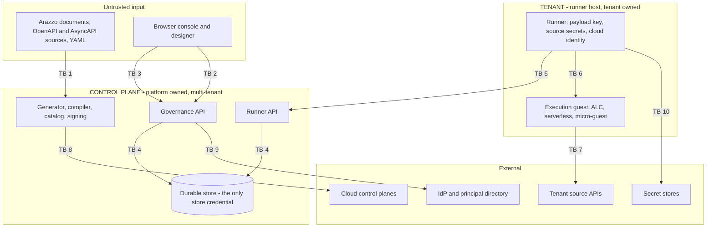

# Threat model

The assets this platform protects, the adversaries it is built against, the boundaries between them,
and at each boundary what stops an attack, what would notice one, and what limits the damage. Written
in swiss-cheese form: layered defences, assessed for whether the holes in successive layers line up.

**This is the standing model.** It defines the standard. It is amended when the system changes, on
the triggers in [§1.3](#13-what-obliges-an-update), not rewritten per review. A security audit is a
point-in-time measurement against it; the audit classifies each finding as a divergence to fix,
sequenced work to build, or a design gap to decide, and carries acceptance criteria and ordering.
[§12](#12-findings-ledger) is the summary view of the current audit result. [§7](#7-control-inventory)
and [§11](#11-accepted-risks-and-assumptions) are what an audit updates here.

**The system is assumed to be building out as designed.** [ADR 0065](../adr/0065-control-plane-owns-store-runners-encrypt-payload.md)
phases B and C, the envelope/payload split, the unified MAC, blind indexes, initiator sealing, the
[tenant anchor](UBIQUITOUSLANGUAGE.md#tenant-anchor) and the re-key sweep, are sequenced work. They
are recorded as *designed controls not yet built*, which is a different thing from a missing control,
and the risk they leave in the meantime is booked in [§11](#11-accepted-risks-and-assumptions) rather
than reported as a defect. The model therefore measures **conformance, not completeness**.

## 1. About this model

### 1.1 Scope

In scope: the control plane, the [runner API](UBIQUITOUSLANGUAGE.md#runner-api), the code generator
and catalog, all [execution backends](UBIQUITOUSLANGUAGE.md#execution-backend), all store backends,
the web kit and designer, the directory providers, and the build and deploy pipeline.

Out of scope, and unverified: runtime behaviour and deployed configuration, since this is a
source-level model; upstream `hyperlight-unikraft`, whose egress enforcement is asserted but not
verifiable here and covered by no test in this repository; runtime and dependency CVEs, which are
unknown while scanning is absent; and the cryptographic soundness of the phase-B constructions, which
have been assessed for whether they are wired rather than whether they are correct. Those deserve a
dedicated cryptographic review before they are wired.

### 1.2 Confidence

The control and finding inventory was assembled by parallel antagonistic review across separate
domains, each required to trace every ADR claim to enforcing code and to label conclusions CONFIRMED
or PLAUSIBLE. Only confirmed items appear. The most severe were independently re-verified against
source before inclusion.

Keep that verification step. One reviewer reported that two telemetry counters were declared but
never incremented, which would have made any dashboard built on them read a flat line as "no
cancellations". Both are in fact incremented (`WorkflowRun.cs:438, 463, 477`;
`SecuredWorkflowManagement.cs:535`), so the item was dropped rather than recorded.

### 1.3 What obliges an update

A threat model that nothing triggers goes stale silently. These are the triggers.

- A new ADR is accepted, or an existing one superseded. Reconcile its claims against [§7](#7-control-inventory).
- A new component, store backend, execution backend or API endpoint ships. Assign it to a boundary in [§2](#2-the-system-and-its-trust-boundaries), or add one.
- A control moves from designed to built. Re-score its row and the affected residuals.
- A phase transition. Re-score the whole of [§11](#11-accepted-risks-and-assumptions), since most of it is phase-conditioned.
- A divergence is found. Add it to [§12](#12-findings-ledger) and re-check whether its boundary still has depth.
- A new adversary becomes relevant, for example the first [deployment](UBIQUITOUSLANGUAGE.md#deployment) where the platform operator and the tenant are different legal entities.

### 1.4 Conventions

Severity is by the worst confirmed path rather than by likelihood. Control state is one of **Holds**
(traced to enforcing code and not broken by any confirmed path), **Partial**, **Absent**, or
**Designed** (specified and sequenced, not yet built, not a defect). Findings are classed **DIV**
(built, but an ADR asserts a property it lacks, so the fix is in code) or **GAP** (no ADR covers it,
so a decision comes first).

## 2. The system and its trust boundaries

The platform's defining property, from [ADR 0065](../adr/0065-control-plane-owns-store-runners-encrypt-payload.md),
is **mutual distrust** between a platform-owned control plane and tenant-owned
[runners](UBIQUITOUSLANGUAGE.md#runner). The control plane owns the durable store and governs every
[run](UBIQUITOUSLANGUAGE.md#run), while tenant data is confidential from it by key custody.
Everything below follows from that split, and from the fact that an
[Arazzo document](UBIQUITOUSLANGUAGE.md#arazzo-document) is an attacker-authored program the platform
compiles and executes.

| ID | Boundary | What crosses it | Who is trusted on each side |
|----|----------|-----------------|------------------------------|
| TB-1 | Untrusted document to control-plane process | Arazzo documents, embedded source descriptions, YAML, package containers | Neither. The document is attacker-authored and is compiled into executing code |
| TB-2 | Client to governance API | Authenticated requests from operators, designers, CLI, machine principals | Caller authenticated but not trusted for reach or capability, both checked server-side |
| TB-3 | Browser to served UI | Rendered attacker-influenced content, session cookie, privileged actions | The UI is presentation only. The server re-checks every gate |
| TB-4 | Control plane to durable store | Run rows, envelopes, security tags, indexes, audit | Store trusted for integrity, untrusted for confidentiality once phase B lands |
| TB-5 | Runner to runner API (**the mutual-distrust seam**) | Claims, leases, checkpoints, catalog artifacts, queues | Neither side trusts the other. The runner distrusts the control plane for confidentiality, the control plane distrusts the runner for integrity |
| TB-6 | Runner and listener to execution guest | Invocation, checkpoint callbacks, workflow state | Guest runs attacker-derived code. Design says no key material originates in a guest |
| TB-7 | Workflow step to external source | Outbound HTTP with tenant credentials attached, broker subscriptions | Source is untrusted. It chooses responses that steer control flow |
| TB-8 | Build and deploy pipeline to cloud | Generated code, restore, signed artifacts, cloud API calls | Build inputs attacker-influenced. The output is signed and distributed to the [runner fleet](UBIQUITOUSLANGUAGE.md#runner-fleet) |
| TB-9 | Control plane to IdP and principal directory | Claims, group memberships, resolved grantee identities | IdP trusted for identity. Group *names* may be attacker-creatable |
| TB-10 | Runner to secret stores | Secret references resolved to material | Store trusted. The reference and the destination are control-plane supplied |

## 3. Assets and security objectives

| ID | Asset | Objective | Owner |
|----|-------|-----------|-------|
| AS-1 | [Checkpoint payload](UBIQUITOUSLANGUAGE.md#checkpoint-payload), run inputs, step outputs, journal data | Confidential from the platform, other tenants, backups and operators, by key custody rather than policy code | Tenant |
| AS-2 | [Checkpoint envelope](UBIQUITOUSLANGUAGE.md#checkpoint-envelope), cursor, status, wait, fault class, timing, tags | Readable by the control plane by design, integrity-protected against it | Shared |
| AS-3 | Source [credentials](UBIQUITOUSLANGUAGE.md#credential) and secret material | Never held by the control plane, never disclosed to a browser, never sent to an unintended destination | Tenant |
| AS-4 | [Executor](UBIQUITOUSLANGUAGE.md#executor) signing key and the artifact chain | A runner executes only what the [catalog](UBIQUITOUSLANGUAGE.md#catalog) produced. Compromise reaches the whole fleet | Platform |
| AS-5 | Tenant isolation itself | No [owner group](UBIQUITOUSLANGUAGE.md#owner-group) reads, writes or infers another's runs, catalog, credentials or existence | Platform |
| AS-6 | Cloud identities of the runner [host](UBIQUITOUSLANGUAGE.md#host), function execution roles, deploy credentials | Not reachable from workflow-authored code or a fetched document | Tenant and platform |
| AS-7 | Governance state, [grant bindings](UBIQUITOUSLANGUAGE.md#grant-binding), administrators, entitlements | Only mutable through governed, audited paths with [independent decision](UBIQUITOUSLANGUAGE.md#independent-decision) | Platform |
| AS-8 | Audit trail integrity | Complete, attributable, tamper-evident, durable enough to reconstruct an incident | Platform |
| AS-9 | Availability and execution capacity, including third-party reputation | One tenant cannot exhaust another's capacity, and the platform cannot be aimed at a third party | Platform |

## 4. Adversaries

Naming these matters more here than in most systems, because ADR 0065's central claim is *mutual*
distrust, so the platform itself is a first-class adversary, and several controls only make sense
against one specific actor.

| ID | Adversary | Position and assumed capability | Primary targets |
|----|-----------|--------------------------------|-----------------|
| AD-1 | Malicious workflow author | Authenticated tenant user. Authors arbitrary Arazzo documents and source descriptions, starts runs, chooses step targets and expressions | AS-4, AS-6, AS-9 |
| AD-2 | Over-privileged insider | Holds one legitimate [capability scope](UBIQUITOUSLANGUAGE.md#capability-scope) and seeks reach beyond it | AS-3, AS-5, AS-7 |
| AD-3 | Compromised runner host | Tenant-owned host under attacker control, holding the payload key, source secrets and cloud identity, speaking the runner API as a valid [machine principal](UBIQUITOUSLANGUAGE.md#machine-principal) | AS-1, AS-2, AS-5 |
| AD-4 | Malicious control plane | The platform itself, or an attacker with code execution in it. Owns the store, the generator, the signing key and every index. **The adversary ADR 0065 exists to bound** | AS-1, AS-2, AS-4 |
| AD-5 | Passive platform operator | Read access to the store, backups or replicas. No code execution. The realistic insider, and the one encryption at rest is for | AS-1, AS-5 |
| AD-6 | Network attacker | On-path between components, or able to reach an internal listener. Cannot break correctly configured TLS | AS-3, AS-6 |
| AD-7 | Compromised browser session | Via XSS, a stolen cookie, or a framed click. Acts with the victim operator's full authority | AS-7, AS-5 |
| AD-8 | Supply-chain attacker | Controls an upstream package, the vendored bundle, or reaches the build container | AS-4, AS-6 |
| AD-9 | Unauthenticated internet | Reaches any surface exposed without authentication, deliberately or otherwise | AS-1, AS-2, AS-9 |

## 5. Undesired outcomes

| ID | Outcome | Assets | Adversaries | Blast radius |
|----|---------|--------|-------------|--------------|
| UO-1 | Cross-tenant disclosure of run data | AS-1, AS-5 | AD-2, AD-3, AD-4, AD-5, AD-9 | Deployment |
| UO-2 | Unauthorised mutation or forgery of run state | AS-2, AS-5 | AD-3, AD-4, AD-9 | Deployment |
| UO-3 | Privilege escalation to platform operator | AS-7 | AD-2, AD-7 | Deployment |
| UO-4 | Remote code execution on control plane, runner or build host | AS-4, AS-6 | AD-1, AD-8 | Host, then fleet |
| UO-5 | Credential and key theft | AS-3, AS-4, AS-6 | AD-1, AD-2, AD-6 | Deployment |
| UO-6 | Supply-chain compromise of the artifact chain | AS-4 | AD-4, AD-8 | Runner fleet |
| UO-7 | SSRF into internal networks and cloud metadata | AS-6 | AD-1, AD-2 | Host and network |
| UO-8 | Denial of service, including aiming the platform at a third party | AS-9 | AD-1, AD-3 | Fleet and third party |
| UO-9 | Undetected loss of run integrity, rollback or substitution | AS-2 | AD-4 | Per run |
| UO-10 | Undetected breach, no record and no reconstruction | AS-8 | All | Deployment |
| UO-11 | Revocation does not take effect | AS-7, AS-5 | AD-2, AD-3 | Per principal |

## 6. Threats by boundary

The systematic layer. Each boundary is enumerated for the threat classes that apply to it whether or
not anything was found, so a row with no evidence is a claim of coverage, and coverage becomes
checkable rather than a by-product of what a review happened to look at.

### TB-1 Untrusted document to control-plane process

| Threat | Control | Residual risk | Evidence |
|--------|---------|---------------|----------|
| Code injection into the generated executor | **Holds**. Every emission site routes an authored identifier through `EmitText`: `Quote` for a literal, `XmlDocText` for a doc comment | The escaping is the whole control. No identifier charset is enforced at the API ingress, so the generator is what has to be right | H3 |
| SSRF and local file read via schema `$ref` resolution | **Holds**. The JSON Schema compiler is confined to supplied documents wherever the control plane compiles, which is the sibling of the loader below and was reached from the same uploaded package | The library default remains permissive, so a future call site that does not confine reopens it | H2 |
| SSRF and local file read via `$ref` resolution | **Holds** at catalog-add. The loader resolves registered documents only, so a reference out of the package is refused rather than retrieved, and the policy is named at the call site rather than defaulted into | The developer CLI still retrieves, by design, and its retrieval is unfenced. That is a different host and a different trust position, tracked separately | H2 |
| Resource exhaustion via YAML alias expansion | **Holds**. Both limits enforced at the single point every expansion passes through, with an unset value resolving to the documented default | The size bound is on expanded bytes, which is what the growth consumes; a document under the bound still costs what it declares | H6 |
| Deserialization gadget chains | **Holds**. Tags collapse to a closed enum, no type-directed deserialization, output is always a JSON DOM | None. There is no gadget surface | |
| Deep-nesting stack exhaustion | **Holds**. Canonical depth bound 64, non-overflow recursion, YAML depth 64 | None found | |
| Identity and hash confusion between documents | **Partial**. Correct ordinal sort, duplicate-key rejection, surrogate handling, but hash and compiled bytes differ | Two documents share one version identity while being different compiler inputs | H13 |
| Malformed package container | **Partial**. Size caps and charset checks, length guard defeated by overflow | Documented clean-failure contract is false, and the exception escapes the validate catch filter | H33 |
| Unconstrained identifiers reaching downstream sinks | **Absent**. Zero pattern validators, and neither the metaschema pass nor the semantic analyzer runs on `POST /catalog` — both are reached only from the designer's validate and publish gate | An uploaded package is compiled and run without its document ever being schema-checked. Codegen escaping is therefore the only barrier, not a second one | H3, H16, H11 |

### TB-2 Client to governance API

| Threat | Control | Residual risk | Evidence |
|--------|---------|---------------|----------|
| Capability bypass, invoking an operation without the scope | **Holds**. Scopes generated from the OpenAPI contract, enforced per endpoint | An endpoint cannot ship without a declared scope | |
| Reach bypass, touching a row outside the principal's grant | **Partial**. Deny-by-default, non-disclosing 404, pre-refresh denies, wildcard cannot confer unrestricted [reach](UBIQUITOUSLANGUAGE.md#reach) | The `security:*` handlers construct no access context at all | H10 |
| Privilege escalation by self-granting | **Partial**. Self-elevation guard, access-request ceiling, independent decision on approve | Guard inspects only write and purge, ceiling pinned by rule name, `grant` and `settle` lack the own-request check | H10 |
| Unauthenticated or unscoped surface on the API host | **Holds**. The checkpoint surface requires a run-scoped token, and is not mapped at all without a secret to validate one | The token is a bearer credential, so it is replayable within its lifetime, bounded to the one run it names | H1 |
| Identity spoofing via request-derived dimensions | **Absent**. No cross-check between ambient and token-derived tenant | Tenant becomes a function of the URL, and the self-elevation guard becomes context-local | H21 |
| Existence disclosure and enumeration | **Partial**. Non-disclosing 404 by design ([ADR 0004](../adr/0004-fail-closed-non-disclosing-enforcement.md)) | Denials are unaudited, so probing is quiet by design *and* by omission | H11 |
| Resource exhaustion of the shared plane | **Partial**. Bounded counts, [keyset pagination](UBIQUITOUSLANGUAGE.md#keyset-pagination), standing capacity limits | No rate limiting on any browser-facing or governance endpoint, and capacity counts are reach-scoped so deployment-global in two postures | H41 |
| Object reference forgery | **Partial**. Random ids on the primary path, ownership checks on debug runs | The idempotent id is an unkeyed hash omitting owner group and environment | H18 |

### TB-3 Browser to served UI

| Threat | Control | Residual risk | Evidence |
|--------|---------|---------------|----------|
| Stored or reflected XSS | **Holds**. Central `escapeHtml` at 584 sites, no dangerous sinks, no user-supplied SVG rendered | Scheme validation missing on link hrefs, so `javascript:` survives escaping | H27 |
| Client-only authorization | **Holds**. Every UI gate has a verified server-side twin ([ADR 0047](../adr/0047-web-kit-permission-gating-server-authoritative.md)) | UI gates fail open when the scopes attribute is absent, deliberate but makes every 403 look like a probe | |
| Clickjacking and UI redress | **Absent**. No `frame-ancestors` or `X-Frame-Options` | A framed click on a governed action is audited with the victim as actor | H17 |
| CSRF | **Partial**. `SameSite=Lax`, a required-header check on the API prefix, and no CORS anywhere | The header check does not cover `/logout` or the runner API path, both cookie-authenticated | H17 |
| Session theft and persistence | **Partial**. `HttpOnly`, no token in web storage | Not `Secure` and no forwarded headers, so plaintext behind a TLS proxy. Logout does not revoke server-side | H17 |
| Injection amplification once script runs | **Absent**. No CSP, and inline scripts plus runtime style injection mean one added now needs `'unsafe-inline'` | Any injection runs unconstrained and can exfiltrate to any origin | H17 |
| Phishing via the authentication flow | **Absent**. No local-URL check on the login return | Lands the user on any host straight after a genuine IdP sign-in | H28 |
| Credential disclosure to the browser | **Holds**. [ADR 0045](../adr/0045-debug-runs-never-credentials-in-browser.md) verified, the trace record carries no request headers | Debug traces still carry real bodies below the payload tier | H23 |

### TB-4 Control plane to durable store

| Threat | Control | Residual risk | Evidence |
|--------|---------|---------------|----------|
| Query injection | **Holds**. Uniform parameterisation, one shared rule AST, typed Mongo filters, constant Redis and NATS prefixes | None found across nine backends | |
| Cross-tenant read via a missing predicate | **Partial**. Deny-by-default filter, one AST walk, and the pushdown answered explicitly per store with mandatory reach oracles and per-backend wire proofs ([ADR 0067](../adr/0067-reach-enforced-by-the-store-proven-on-the-wire.md)); the reach-filter limit inversion is gone | The management stores on Azure Storage still filter in process, so their lists and counts read cross-tenant rows into the control plane; every other store applies reach server-side | H12 |
| Disclosure at rest to a passive operator (AD-5) | **Designed**. Envelope encryption under tenant key custody, phase B | Interim protector is opt-in and silent when unset. Envelope metadata and the tenant label are cleartext with a dedicated index | H7 |
| Privilege abuse beneath the application | **Absent**. No row-level security, no per-tenant credential, the runtime account owns the schema with DDL rights | Nothing catches a wrong predicate, and a leaked connection string is total | |
| Continuation-cursor tampering | **Holds**. The cursor supplies position only, the reach predicate is re-derived per request | The cursor discloses a raw run id to anyone who sees it | |
| Unbounded result materialisation | **Partial**. Keyset pagination and [bounded counts](UBIQUITOUSLANGUAGE.md#keyset-pagination), server-bounded wherever reach is pushed down (ADR 0067) | The one in-process management-store backend left (Azure Storage) still materialises before filtering, and per-admission capacity counting keeps the amplifier on exactly it | H12, H41 |

### TB-5 Runner to runner API, the mutual-distrust seam

| Threat | Control | Residual risk | Evidence |
|--------|---------|---------------|----------|
| Runner impersonation or lease hijack | **Holds**. Machine principal read from the token only, lease ownership derived server-side | The in-memory store mints predictable tokens, which matters only where a principal is shared | |
| Runner-id squatting at registration | **Holds**. [Pre-authorization](UBIQUITOUSLANGUAGE.md#runner-pre-authorization) or short-TTL [enrolment token](UBIQUITOUSLANGUAGE.md#enrolment-token) required, re-checked under the store fence | None found | |
| Claiming another environment's work | **Holds**. Environment resolved from bindings at [claim](UBIQUITOUSLANGUAGE.md#claim), never from the request, and the pin is no longer rewritable by a later save | None found | H39 |
| **Integrity of what the runner returns**, the control plane's half of mutual distrust | **Partial**. The coordinator refuses a save whose index changes the run's environment, workflow id or security tags, above the store and so on every backend | Only the identity fields are compared. The rest of the runner-authored region is still taken on trust until the phase-B MAC covers it | H39 |
| Checkpoint replay or stale write | **Partial**. Single-row CAS, 409 on supersession, monotonic accepted sequence | Header and body sequence are never compared, so the rule validates a number the client wrote | H40 |
| Superseded or displaced holder writing | **Partial**. The [lease epoch](UBIQUITOUSLANGUAGE.md#lease-epoch) is minted per run by the store, persisted with the lease record, and compared on renewal and on both checkpoint operations, so a presented epoch that is not the current grant's authorises nothing | Sound within one store generation only. The epoch is not yet paired with a [store incarnation](UBIQUITOUSLANGUAGE.md#store-incarnation), so a restore takes every run's counter back and re-issues epochs already spent, and rollback by the control plane itself stays undetectable until the tenant anchor exists | H8 |
| Rollback or substitution by the control plane (AD-4) | **Designed**. Tenant anchor, phase B | Accepted for the phase-A window, booked as AR-9 | |
| Revocation of a compromised runner | **Partial**. The [revocation fence](UBIQUITOUSLANGUAGE.md#runner-revocation-fence) expires leases by the bound machine principal, and renewal and both checkpoint operations re-resolve bindings | Bounded by the resolver's cache window, and by nothing on a replica that has not refreshed its policy. The in-flight half is also backend-conditional: expiring leases needs the optional `IWorkflowLeaseAdministration`, which only the in-memory, Postgres and SQLite stores implement, so on the other seven backends revoking stops future dispatch and orphan reclaim but leaves the revoked holder's current leases to run to TTL. Booked as AR-16, which scoped it to phase B; it binds now | H5, H22 |
| Cross-tenant denial of service | **Partial**. Per-tenant and per-runner token buckets, test-before-spend, client-side `Retry-After` clamp | Buckets collapse to one counter without owner-group tags, a wholesale cache clear forgives every tenant's deficit | H41 |
| Observability of the seam | **Absent**. Zero logs, spans or counters in the entire runner API | Every threat in this table executes silently | H11 |

### TB-6 Runner and listener to execution guest

| Threat | Control | Residual risk | Evidence |
|--------|---------|---------------|----------|
| Guest escape to the host | **Partial**. Hypervisor boundary on the [micro-guest backend](UBIQUITOUSLANGUAGE.md#micro-guest-backend) only | The *default* [isolation model](UBIQUITOUSLANGUAGE.md#isolation-model) is in-process with no boundary at all, so generated-code compromise equals runner compromise | H15 |
| Unauthenticated control of a guest | **Absent**. Neither sidecar surface authenticates | Checkpoint token disclosure, outcome forgery, and arbitrary images booted on the runner host | H9 |
| Key material originating in a guest | **Holds**. Design forbids it, the listener supplies the ordering token per invocation | None. Correctly anticipated, because snapshot restore would repeat it | |
| Entropy replay across advances | **Absent**. No reseed hook after snapshot restore | Identical GUIDs and nonces on every advance, acknowledged in [ADR 0064](../adr/0064-microguest-snapshots-after-warmup-init-run-split.md) | H32 |
| Cross-run or cross-tenant state bleed | **Holds** on the micro-guest, hermetic restore per advance | Serverless backends reuse a warm process, so isolation is per environment and version rather than per run | |
| Unauthenticated invocation of a deployed guest | **Absent** on Azure Functions, **Holds** on Lambda via IAM | Anyone with the hostname drives the executor over an attacker-supplied checkpoint | H19 |

### TB-7 Workflow step to external source

| Threat | Control | Residual risk | Evidence |
|--------|---------|---------------|----------|
| SSRF by step targeting | **Holds**. The executor never names a URL. A step carries a source *name* bound by the host, and there is no per-step server override | None. A deliberate architectural property, and the strongest control at this boundary | |
| SSRF by credential-binding redirection | **Absent**. `baseUrl` is unvalidated on write and wins over the host address | A credential the caller cannot read is sent to a destination they choose | H4 |
| Credential leak across a redirect | **Absent** on the run path, **Holds** on the fetch path | Custom API-key headers and TLS client certificates follow a cross-host redirect. The mechanism is documented in-repo and fixed on one of two paths | H4 |
| Route escape past a gateway prefix | **Partial**. Percent-encoding by default | `allowReserved` parameters skip it, so `../` escapes with the credential attached | H29 |
| Egress to internal or metadata addresses | **Absent** on three of four backends, delegated to deployment by [ADR 0052](../adr/0052-source-fetch-authenticates-as-the-user.md) | Assumption ASU-3. The code cannot verify the control exists | H15 |
| Hostile source steering control flow | **Partial**. Closed expression grammar, JSON-Pointer body descent, uniform 1s regex timeouts | Dynamic criteria interpolate response values into the pattern, so a source rewrites the assertion checking it | H26 |
| Third-party denial of service | **Absent**. No step budget, run deadline or production recursion cap | The platform becomes an attack tool. Abuse and legal exposure land on the operator | H14 |
| Cross-tenant message disclosure on a shared broker | **Absent**. No subject-grammar validation on channel parameters | A wildcard subscribes across every tenant and persists into the durable [wait](UBIQUITOUSLANGUAGE.md#wait) | H25 |

### TB-8 Build and deploy pipeline to cloud

| Threat | Control | Residual risk | Evidence |
|--------|---------|---------------|----------|
| Artifact substitution or tampering | **Holds**. Digest binding on load, optional detached signature against a trust store, full [native artifact attestation](UBIQUITOUSLANGUAGE.md#native-artifact-attestation) | The chain signs whatever the generator emitted, and the IL read path does not recompute the content hash | H13 |
| Build-time code execution | **Absent**. Container is root, unconfined, network-live, with a read-write host mount | `runtimeIdentifier` is interpolated raw into MSBuild XML with no pattern in the contract | H16 |
| Dependency confusion at restore | **Absent**. No package source mapping, no lock file, private feed mixed with the public one | A poisoned first-party id yields a control-plane-signed binary | H16 |
| Cross-tenant resource collision at deploy | **Absent**. Sanitised names are non-injective and update proceeds with no ownership check | One tenant's deploy replaces another's function code | H31 |
| Over-broad cloud privilege | **Absent** in code, a people control only | Execution role is an unvalidated option, and the sample defaults to a dummy ARN | |
| Stale deployed configuration | **Partial**. Azure merges settings every deploy | Lambda passes environment only on create, so revoking a source URL has no effect on a deployed function | H30 |
| Build queue starvation | **Absent**. No build timeout, and the lease heartbeat masks a hung build | One wedged build stalls the single-threaded queue until restart | H16 |

### TB-9 Control plane to IdP and principal directory

| Threat | Control | Residual risk | Evidence |
|--------|---------|---------------|----------|
| Identity widening via group membership | **Absent** in code, IdP policy only | Membership expansion folds group *names* into the identity under subset matching, so creating a group widens what a principal matches | H42 |
| Attribute shadowing | **Absent**. First-match on one path, last-match on another | A user-writable attribute whose leaf name collides with the tenant attribute can supply the tenant | H42 |
| Directory outage degrading to a wrong answer | **Partial**. The explicit source path fails closed | The default merged path swallows failures and returns a truncated list, so an operator grants against a stale identity | H43 |
| Credential disclosure in transit | **Partial**. Safe defaults | Cleartext LDAP bind is constructible, and no HTTP adapter asserts an https base URL | H44 |
| Membership revocation latency | **Partial**. Bounded cache TTL | No invalidation API, no enforced upper bound, unbounded growth above the prune threshold | H42 |
| Issuer confusion between principals | **Partial**. Grantee resolution is issuer-pinned | The span projection path does not enforce the issuer tag, and the grant path writes a subject-only binding | H42 |

### TB-10 Runner to secret stores

| Threat | Control | Residual risk | Evidence |
|--------|---------|---------------|----------|
| Secret material held by the control plane | **Holds**. Bindings store a [secretRef](UBIQUITOUSLANGUAGE.md#secretref), there is no secret writer, and writing is a separate identity | The property is inverted in practice because the control plane owns the reference and the destination | H4 |
| Exfiltration via reference control | **Absent**. No scheme allowlist on secret references, `env://` unrestricted and `file://` unrooted by default | The runner resolves its own host's environment and filesystem on request | H4 |
| Secret recovery from process memory | **Partial**. Secret material zeroes correctly and documents the hazard | Every consumer reveals it to a string, so a heap dump recovers every bound credential | H35 |
| Secret leakage through logs and errors | **Holds**. [Governance audit](UBIQUITOUSLANGUAGE.md#governance-audit) has no payload parameter, token exceptions carry status only, telemetry tags are identifiers | [Debug runs](UBIQUITOUSLANGUAGE.md#debug-run) write raw exception text into a readable fault field | H23 |
| Undetected secret misuse | **Absent**. Every resolver is silent | No record of which principal caused which secret to be read | H11 |
| Auth-method lifecycle failure | **Partial**. Fails closed, runs fault rather than proceeding uncredentialed | No re-auth loop and no guidance, so token expiry reads as an outage. A null field yields an empty secret rather than a failure | |

## 7. Control inventory

Traced to enforcing code rather than to an ADR claim. Recording what holds matters as much as
recording what does not, because a model built only from holes mis-ranks the fixes.

### 7.1 Technology

| Control | State | Location |
|---------|-------|----------|
| Environment key registration proves possession, one pinned algorithm, freshness before signature, identifier bounds, length-framed tuple | Holds | `EnvironmentKeyPossession.cs:54+` |
| Deny-by-default reach, empty rule set admits nothing, untagged row invisible, unranked comparison denies, policy starts denying | Holds | `SecurityFilter.cs:56-105`, `PersistentRowSecurityPolicy.cs:37` |
| One security-rule AST walk, backends supply fragments only, every value bound | Holds | `ISecurityRulePredicateEmitter.cs`, `SecurityRule.ToPredicate`, `SqlSecurityRuleEmitter.cs:56` |
| Schema compilation confined to supplied documents on every control-plane path, so an authored `$ref` is refused rather than fetched | Holds | `ArazzoControlPlaneCatalogHandler.cs`, `ArazzoControlPlaneWorkspaceHandler.cs` |
| Reserved `sys:` keyspace refused independently of the policy | Holds | `ControlPlaneRowSecurity.cs:386-395` |
| Wildcard binding cannot confer unrestricted reach | Holds | `PersistentRowSecurityPolicy.cs:126, 362-366` |
| Run identity (environment, workflow id, security tags) is not runner-mutable once established, enforced above the store so every backend inherits it | Holds | `WorkflowCheckpointCoordinator.SaveAsync` |
| Machine principal from the token only, lease ownership derived server-side | Holds | `RunnerPrincipalAccessor.cs:47-62`, `MachinePrincipal.cs:52-65` |
| Revocation expires the holder's leases by bound principal, and renewal and both checkpoint operations re-resolve bindings | Partial. The control plane asks correctly, on every backend; whether the store can expire is an optional store capability three of ten implement | `ArazzoControlPlaneRunnerAuthorizationsHandler.cs` fence, `RunnerRunCoordinator.StillBoundAsync`, `IWorkflowLeaseAdministration` |
| Registration requires pre-authorization or an enrolment token, re-checked under the store fence | Holds | `ArazzoControlPlaneRunnerAuthorizationsHandler.cs:277-297, 359-366` |
| Catalog artifacts authorized by path, never bare content hash, and "not yours" answers as "not there" | Holds | `RunnerCatalogCoordinator.cs:134-147, 226-239` |
| Client-side `Retry-After` clamp, 10s single, 30s total, 4 attempts | Holds | `RunnerQuotaHoldOptions.cs:79-110` |
| Executor never names a URL, source name bound by the host | Holds | `TransportSelection.cs:14-33`, `AotHostAppAssembler.cs:34-56` |
| Runtime expressions are a fixed prefix table plus JSON Pointer, unrecognised forms degrade to literal | Holds | `ArazzoExpression.cs:89-257` |
| Document resolution is a stated policy per caller, closed by default, registry-only where the input is attacker-authored | Holds | `ArazzoDocumentResolution.cs`, `WorkflowExecutorProvider.cs` |
| Uniform 1s regex timeouts on every criterion and JSONPath | Holds | `RegexCriterionInliner.cs:121`, `CompiledCriterion.cs:108-249` |
| Authored identifiers reach generated source only through `EmitText.Quote` (literals) or `EmitText.XmlDocText` (doc comments) | Holds | `EmitText.cs`, `WorkflowExecutorEmitter.cs` |
| YAML alias expansion bounded by size and by expanded depth, charged where every expansion resolves, unset resolving to the documented default | Holds | `YamlToJsonConverter.ChargeAliasExpansion`, `YamlReaderOptions` |
| Canonicalisation, ordinal sort, duplicate-key rejection, lone surrogates throw, depth 64 | Holds | `JsonCanonicalizer.cs:122-125, 195-201, 424-439` |
| Closed signature-algorithm switch, trust root from operator config, verifier required on build and deploy | Holds | `TrustStoreExecutorPackageVerifier.cs:38-66`, `WorkflowAotBuildService.cs:36` |
| Central `escapeHtml` at 584 sites, no dangerous sinks, no user-supplied SVG | Holds | `base.js:184-191` |
| No CORS anywhere, required-header anti-forgery on the API prefix | Holds | `ControlPlaneAntiForgery.cs:45-89` |
| OAuth broker state, CSPRNG, single-use, principal and provider bound, PKCE, 10 minute TTL | Holds | `ProviderBroker.cs:38-42, 166-232` |
| [Tenancy ledger](UBIQUITOUSLANGUAGE.md#tenancy-ledger), append-only, CAS-serialised, held in the environment store | Holds | `Environments/TenancyLedger.cs` |
| Server-authoritative permission gating, every UI gate has a verified server twin | Holds | `ControlPlaneAuthorization.cs:125-185` |
| Checkpoint token primitive, HMAC, run-bound, constant-time, canonical expiry | Holds | `CheckpointToken.cs` |
| Checkpoint surface requires the run-scoped token, and is absent rather than open when no secret is configured | Holds | `WorkflowCheckpointEndpoints.cs:40-45`, `ControlPlaneEndpointExtensions.cs` |
| One checkpoint coordinator per host, so the single-flight interlock is per run rather than per component | Holds | `RunnerEndpointExtensions.cs`, `WorkflowCheckpointEndpoints.cs` |
| Envelope and payload split, unified MAC, blind indexes, tenant anchor, initiator sealing, re-key sweep | Designed | `Durability/Anchoring/*`, conformance-tested |

### 7.2 Process

| Control | State | Note |
|---------|-------|------|
| Repeated adversarial design review with residues published | Holds | Ten rounds in ADR 0065, two defects surfaced only when the spec was made executable |
| API-first, endpoint scopes generated from the contract | Holds | An endpoint cannot ship without a declared scope |
| Warning-free build, warnings as errors everywhere | Holds | Catches correctness, not security classes |
| Explicit security posture with no default ([ADR 0016](../adr/0016-control-plane-security-mode.md)) | Holds | The posture is a required leading parameter, the public unscoped overload names its own, and the demo's binding fails startup when unset. `Open` is the enum's zero value, so no parameter default could have been safe |
| Shared store-conformance suite | Holds | The reach oracles are mandatory and assert each store's declared pushdown answer outright, so a store that quietly stops pushing down fails eight suites rather than turning Inconclusive; each backend's wire tests observe the pushdown itself (ADR 0067) |
| Static analysis | Absent | No SAST in any workflow |
| Dependency vulnerability scanning | Absent | No NuGet audit, no vulnerable-package check, no npm audit |
| Dependency updates | Absent | Present but inert, Dependabot targets a directory that does not exist in this repository |
| Reproducible restore | Absent | Lock files only on the legacy v4 projects |
| Vulnerability disclosure policy | Absent | No `SECURITY.md` |
| Implementation status recorded in ADRs | Absent | A reader credits designed-but-unbuilt barriers. **The root cause of the DIV class** |
| Observability coverage reference | Partial | Claims verification against the handlers, points at an anchor that no longer exists, omits five emitted actions |

### 7.3 People

| Control | Enforced by | Risk if the human does not do it |
|---------|-------------|----------------------------------|
| Operator provisions least-privilege cloud identities | Nothing, doc comment | The blast radius for every TB-8 finding, and the sample defaults to a dummy ARN |
| Operator keeps the sidecar admin surface on loopback | Weak, default bind and comment, env-overridable | Arbitrary code in a micro-guest on the runner host with an attacker-chosen allowlist |
| Operator supplies network egress controls | Nothing, delegated by ADR 0052 | The only barrier to metadata endpoints on three of four backends, unverifiable in code |
| Operator configures the executor trust store | Nothing, silent degrade with no log | Signature verification turns off on a mistyped path and nothing reports it |
| IdP group hygiene, self-service creation disabled | Nothing, IdP policy | Creating a group strictly widens what a principal matches |
| Severity-proportional UI friction, typed challenges, usage chips, resolved-identity tuples | Built | Prevents operator error, not attack. A hostile caller uses the API directly |

## 8. Detection

The weakest layer, and weak where it matters most. The surfaces carrying the highest-value data emit
nothing.

**The audit trail is diagnostic telemetry, not evidence.** There is no audit store type in the
repository, no interface, no record type, no table. The audit is a logger call plus an activity,
self-documented as best-effort observability rather than a durable store. No append-only guarantee, no
hash chain, no retention, and no separation from the database an attacker would already hold, in a
codebase that ships an ECDSA signing stack and applies it to executor packages but not to audit
records. Three ways it evaporates unnoticed: the span rides a sampled activity source, so head
sampling discards most of it; the log is at information level, so raising the level for noise loses
everything; and the logger is null-conditional, so a host that never wires the category is a silent
no-op. Nothing asserts at startup that a sink is attached.

| Security-critical action | Audited | Consequence |
|--------------------------|---------|-------------|
| Checkpoint read or write, the full run payload | No | The exploit that voids the trust boundary produces nothing |
| Every runner API operation, claim, lease, checkpoint, catalog | No | Index rewriting, lease theft, quota trips and epoch anomalies all silent |
| Any read, list or search on the governance API | No | Cross-tenant reads and enumeration are unreconstructable |
| Authentication success and failure | No | Brute force and credential stuffing undetectable by construction |
| Authorization denial on read paths | No | ADR 0004 makes probing quiet by design, and nothing records the probe |
| Secret resolution, and decryption failure | No | The clearest tamper signal in the design is discarded |
| Outbound document fetch, by destination | No | An SSRF sweep cannot be answered for after the fact |
| Signature verification failure, verification disabled at startup | No | A tampered package looks like a disk-full build failure |
| Run start | No | `StartAsync` takes no actor, so "who started this run" is unanswerable |
| Bootstrap genesis grant | No | The most privileged binding in the deployment leaves no record |
| Runner liveness, heartbeat gap | No | The reaper has no caller, so a dead runner keeps satisfying the hosting gates |
| Governance mutations, including refusals with distinct outcome codes | Yes | Uniform and genuinely well built |
| Step-journal read, including refusals, with [disclosure tier](UBIQUITOUSLANGUAGE.md#step-output-disclosure-tier) | Yes | The one audited read surface, and a good model for the rest |

Quality of what *is* recorded:

- **No tenant dimension.** The primitive has no owner-group or environment parameter, and the decisions counter is dimensioned by action and outcome only, so the trail cannot be filtered by tenant.
- **The actor is often a display name.** Nine of thirteen handlers record the OIDC name claim, collapsing every service principal to the literal string `system`. Three incompatible derivations coexist, so one principal cannot be joined across surfaces. [ADR 0038](../adr/0038-payload-safe-governance-audit.md)'s stated property does not hold.
- **Change-blind by construction.** Payload-safety and the inability to record *what* changed are the same property from two sides. A credential base URL repointed at an attacker audits as `updated`; a secret-reference swap audits as `rotated` and increments the rotation-health counter. Any fix must be designed against ADR 0038 rather than bolted beside it.
- **Recording is not detecting.** No threshold, anomaly or alert logic exists in the repository. Everything depends on an external collector, assumption ASU-1.
- **Log injection.** User-controlled values are interpolated unescaped and unbounded, with zero pattern validators across 1,237 generated models.

## 9. Containment

| Measure | State | What it actually limits |
|---------|-------|--------------------------|
| Runners hold no store credential | Holds | ADR 0065's most successful decision. Dissolves the per-runner database-role problem, but makes the one remaining credential a total-compromise token |
| Capability scopes per verb and domain, reach orthogonal | Holds | A low-scope session cannot author policy, except via H10 |
| Access-request ceiling and TTL clamp, re-evaluated per resolution | Holds | Time-boxed grants expire even on a stale replica |
| [Eligibility](UBIQUITOUSLANGUAGE.md#eligibility) confers nothing at rest | Holds | Standing privilege does not accumulate |
| Immutable content-hashed versions, insert-only ids | Holds | Version overwrite and squatting |
| Source credentials are references | Partial | Inverted in practice by H4 |
| "The environment is the blast radius" | Partial | Closing H12 removed the cross-tenant list read on the pushdown stores; the management stores on Azure Storage still read cross-tenant rows in process. H1 used to make it the deployment and no longer does |
| Encryption at rest | Partial | Opt-in and silent when unset. Even enabled it leaves status, workflow id, environment, timings, correlation ids and the tenant label cleartext, with an index on the tag pair |
| Per-run isolation on serverless | Partial | Per environment and version. Warm containers reuse a process |
| Revocation | Partial | Fences in-flight leases and re-authorizes on renewal and checkpoint, but does not propagate across replicas |
| Rate limiting | Partial | Runner API only, nothing on governance or browser-facing endpoints |
| Per-tenant capacity | Partial | Reach-scoped, so deployment-global in two postures, and buckets collapse without owner-group tags |
| Database-level isolation | Absent | No row-level security, no per-tenant credential, runtime account owns the schema |

## 10. Layering assessment

Not whether barriers exist, but whether the holes in successive layers line up. PRV prevention, DET
detection, CON containment, REC recovery.

| Outcome | Worst path | PRV | DET | CON | REC | Layers between attacker and outcome |
|---------|-----------|-----|-----|-----|-----|--------------------------------------|
| UO-1 cross-tenant read | H10 | NONE | NONE | NONE | WEAK | **Zero.** `security:read` builds no access context, so it enumerates every tenant. Closing H1 removed the checkpoint surface from this path and closing H12 the in-process store reads behind it, but neither raised the score, because H10 reaches the same outcome with nothing in the way |
| UO-2 state forgery | H40, H9 | PART | NONE | PART | WEAK | **Two.** The run's identity is now server-checked, so a forged state cannot be re-pointed at another tenant. What remains is the sequence, which H40 shows validates a client-authored number, and the unauthenticated sidecar |
| UO-3 privilege escalation | H10 | WEAK | WEAK | PART | NONE | **One, aligned.** Four holes on one path: no reach on `security:*`, guard checks wrong verbs, ceiling pinned by a definable name, revocation does not propagate |
| UO-4 code execution | H3, H16 | PART | WEAK | NONE | WEAK | **One, accidental.** Prevention rests on an incidental property of emitted text, with no sandbox behind it on the default backend |
| UO-5 credential theft | H4 | NONE | NONE | WEAK | WEAK | **Zero.** No destination validation, no egress control, no resolution audit, secrets in unscrubbable strings. Closing H2 removed the catalog-add route to a mounted secret, not the credential-binding route |
| UO-6 supply chain | H13, H16 | GOOD | WEAK | PART | PART | **Three.** The strongest chain here. Its weakness is that it signs whatever the generator emitted |
| UO-7 SSRF | H15, ASU-3 | PART | NONE | NONE | NONE | **Zero at run time, one at catalog-add.** Closing H2 removed the control plane's own `$ref` fetch, which was the one path the platform could fence in code. What remains is a workflow step's outbound call and the source fetch, both delegated to deployment egress controls the code cannot verify exist |
| UO-8 denial of service | H14, H41 | NONE | PART | WEAK | WEAK | **One.** Runner quotas, designed for a different threat, shape but never terminate the loop. Closing H6 removed the parse-time amplifier; what remains is a run with no step budget and no wall clock, which no quota terminates |
| UO-9 integrity loss | anchor is phase B | WEAK | NONE | NONE | NONE | **Zero until phase B, accepted.** Closing H8 raised prevention off the floor — the epoch is now the run's own, persisted and compared, so phase B no longer inherits a counter it could not order by. Nothing else moved: the control plane still holds every copy of the run, so it can roll one back and no layer here would see it |
| UO-10 undetected breach | H11 | n/a | NONE | n/a | NONE | **Zero on reads and the whole runner API.** Mutation audit is good but change-blind, tenant-less and non-durable |
| UO-11 revocation fails | H22 | PART | PART | PART | NONE | **Two on three backends, one on seven.** The fence expires the holder's leases and renewal re-authorizes, so a revoked runner is stopped within the binding cache window. The first of those two layers is an optional store capability (`IWorkflowLeaseAdministration`, in-memory/Postgres/SQLite only), so on every other backend renewal is the sole barrier and work already in flight runs to lease TTL. H22 is what remains on all ten: a replica that never refreshes its policy keeps honouring the deleted binding |

### Why the holes line up

Four patterns explain nearly every straight-through path, and each predicts defects not yet found.

1. **Provenance is verified everywhere, authority almost nowhere.** The system checks exhaustively *what* an artifact is, digests, signatures, attestations, content hashes, and rarely checks *who is asking*. Both sidecar surfaces, the anonymous Azure invoke and the unauthenticated sample services all execute cryptographically verified artifacts for an unauthenticated caller. The checkpoint endpoint was the fourth until H1 was closed, and what closed it was giving that surface a credential to check rather than another artifact to verify.
2. **The mitigation was applied to one of two sibling paths.** Redirects fixed on the fetch path, not the run path. Reach pushdown real on every backend's run, catalog and observed-identity stores (the backends whose query language cannot express the grammar narrow through their label indexes); the management stores were the sibling path, first excused as a per-class documented choice, then converted backend by backend once the Cosmos "cannot push the predicate" comment was shown false ([ADR 0067](../adr/0067-reach-enforced-by-the-store-proven-on-the-wire.md)); Azure Storage remains. The lease check on the runner API, not its control-plane twin. The empty-identity guard on the explicit path, not the derived one. The disclosure tier on one of three routes to the same data. **This is the most productive pattern to sweep for.**
3. **A declared control that nothing enforces.** YAML limits declared and never read *(closed)*. The epoch published in the contract and never compared *(closed)*. Sub-workflow depth enforced only in test paths. Pushdown asserted by a default interface implementation *(closed: the default is gone — every store states its answer, the conformance reach oracles cannot be skipped, and the wire tests observe the pushdown itself)*. The heartbeat reaper implemented twelve times and called zero. Dependabot pointed at a directory that does not exist. In every case the artefact of the control exists, which is what stops anyone re-checking, and in several a document asserts it works. Closing two of them showed the pattern has a second half: both were *declared and unsound* rather than merely unenforced, so enforcing what was written would have produced a control that ran and still carried nothing. Check that the declared thing is worth enforcing before enforcing it.
4. **Detection would have caught all of the above, and is the thinnest layer.** No read audit, no runner-API telemetry, no authentication-failure signal, no egress record, and an audit primitive that is deliberately change-blind. Every finding here is currently unobservable in production.

## 11. Accepted risks and assumptions

Risks the design knowingly carries, and dependencies on things outside this system. Most are
phase-conditioned and should be re-scored at each transition. The bulk come from ADR 0065's published
residues, which is unusually good practice and the reason this register can be assembled at all.

| ID | Accepted risk | Until |
|----|---------------|-------|
| AR-1 | Confidentiality holds against passive operators, backups and other tenants, **not** against a malicious control plane, which generates and signs the executor holding the payload key | Phase C |
| AR-2 | The environment is the blast radius. A compromised runner reads and rewrites every run in its environments, including runs it never executed | Standing |
| AR-3 | Claim-with-row is itself a bulk read path, since reading is how a lease is acquired | Standing |
| AR-4 | The index projection is not authenticated. The reach gate filters on columns outside the MAC, and the control plane cannot verify a MAC under a key it does not hold | Standing |
| AR-5 | Terminal runs are never re-opened, so envelope tampering on completed runs is never detected without a periodic sweep | Standing |
| AR-6 | A listener compromise yields the environment's plaintext, because its load path decrypts | Standing |
| AR-7 | Envelope metadata is platform-visible, and for data-dependent workflows that includes the decision, not merely the shape | Standing |
| AR-8 | Blind indexes leak equality and frequency, and a wildcard wait leaks a per-channel constant | Phase B onward |
| AR-9 | Rollback is detected, not prevented, and only once the tenant anchor exists | Phase B |
| AR-10 | Forced duplicate execution remains possible without forgery. The control plane can expire a lease mid-advance, and both advances' side effects have landed | Standing |
| AR-11 | Payload-mutating [resume](UBIQUITOUSLANGUAGE.md#resume) is a custody control, not an integrity one. A runner cannot judge whether rewriting a payment amount was legitimate | Standing |
| AR-12 | Restore and migration reset every freshness mechanism, mitigated only by an out-of-band [store incarnation](UBIQUITOUSLANGUAGE.md#store-incarnation) and an audited per-run [re-anchor](UBIQUITOUSLANGUAGE.md#re-anchor) | Phase B onward |
| AR-13 | The tenant anchor is on the checkpoint hot path and is a tenant-side availability dependency | Phase B onward |
| AR-14 | Availability inverts relative to [ADR 0023](../adr/0023-two-process-store-as-queue.md). The control plane is on the hot path of every checkpoint of every tenant | Standing |
| AR-15 | SSRF fencing is delegated to deployment egress controls (ADR 0052), a deliberate decision that leaves the platform unable to express or verify the control | Until decided |
| AR-16 | Not every backend can host a sealed environment. Expiring leases by principal and atomic row-plus-index CAS become conformance requirements. The first half is **not** phase-conditioned and was mis-scoped here: only the in-memory, Postgres and SQLite stores implement `IWorkflowLeaseAdministration`, so the revocation fence has no in-flight effect on the other seven backends today, sealed environments or not. The store-conformance suite reports this as a skip per backend, which is by design and is the only place it currently shows | Phase B for the sealed-environment gate, standing for the fence |
| AR-17 | Phase A leaves the control plane the sole custodian of tenant plaintext, compensated by a write-time tenancy invariant. H1 used to bypass that invariant; with it closed the compensation is as strong in practice as in design | Phase B |

### Assumptions about the deployment

| ID | Assumption | If false |
|----|-----------|----------|
| ASU-1 | An external collector ingests the audit logger category, retains it, and has alert rules | No detection at all. Nothing in-repo alerts, and no interface contract, retention floor or required-field list is documented |
| ASU-2 | The IdP disables self-service group creation and exposes no user-writable attribute colliding with a mapped name | Identity widening and tenant spoofing via TB-9 |
| ASU-3 | Network egress controls fence private ranges and metadata endpoints | UO-7 has zero layers. This assumption does the work of a missing control |
| ASU-4 | TLS terminates in front of the host *and* forwarded headers are configured | The session cookie omits `Secure` and travels in clear |
| ASU-5 | The sidecar admin surface is bound to loopback and unreachable from tenant networks | Arbitrary code execution in a micro-guest on the runner host |
| ASU-6 | Cloud identities for runners and deployers are least-privilege | The blast radius of every TB-8 finding widens to the whole subscription or account |
| ASU-7 | The deployment names a real owner-group claim, so tenants are distinguishable | Every principal lands in one owner group, quota buckets collapse, and the tenancy invariant counts one tenant forever |

## 12. Findings ledger

Evidence that a control named above is absent or divergent, from the current audit. Ordered by
severity, not by ID. **DIV** means built but not conformant, so the design is already right and the
fix is in code. **GAP** means no ADR covers it, so a decision comes first.

| ID | Sev | Class | Finding | Boundary | Status |
|----|-----|-------|---------|----------|--------|
| H1 | Crit | DIV | Checkpoint endpoint has no scope, reach check, lease or audit. The ADR 0062 token primitive is implemented and sound but never passed | TB-2 | **Closed** |
| H2 | Crit | DIV | `$ref` loader reaches `file://` and `http://` from inside the control-plane process | TB-1 | **Closed** |
| H3 | Crit | DIV | Unescaped `workflowId` reaches the C# compiler at three sites while every other emitter escapes | TB-1 | **Closed** |
| H4 | Crit | DIV | Credential `baseUrl` is a host constraint on the fetch path and the destination on the run path, and run-path clients follow redirects with custom headers intact | TB-7, TB-10 | Open |
| H5 | Crit | DIV | Revocation fence passes the client-supplied runner id where the owner is the machine principal, so it expires zero leases | TB-5 | **Closed** |
| H6 | Crit | DIV | YAML alias-expansion limits are declared, documented as a protection, and never read | TB-1 | **Closed** |
| H8 | Crit | DIV | Lease epoch is fielded and contract-published but never compared, and unsound as minted | TB-5 | **Closed** |
| H9 | Crit | DIV | Both micro-guest sidecar surfaces are unauthenticated, and the guest surface returns the checkpoint token for a guessable sandbox id | TB-6 | Open |
| H10 | Crit | DIV | Self-elevation guard inspects only write and purge, and the `security:*` handlers build no access context | TB-2 | Open |
| H11 | Crit | DIV | Runner API emits nothing, and there is no read audit anywhere | All | Open |
| H39 | Crit | DIV | Checkpoint save is a blind write of the reach-critical index, so a runner moves its own run into another owner group's environment and reach | TB-5 | **Closed** |
| H7 | High | DIV | Interim checkpoint protector diverges from the design it stands in for, run-id-only AAD, no key id, opt-in and silent | TB-4 | Open |
| H12 | High | DIV | Reach pushdown is self-attested by a default interface implementation, and four of nine backends filter in process | TB-4 | **Closed** |
| H13 | High | DIV | Content hash is over canonical bytes while raw bytes are stored and compiled | TB-1, TB-8 | Open |
| H14 | High | GAP | No step budget, run deadline or production recursion cap, so the platform can be aimed at a third party | TB-7 | Open |
| H15 | High | GAP | No egress control on three backends, and the default isolation model has no boundary at all | TB-6, TB-7 | Open |
| H16 | High | GAP | Build container is root, unconfined and network-live, with an unpinned restore | TB-8 | Open |
| H17 | High | GAP | No security headers, session cookie not `Secure`, logout does not revoke | TB-3 | Open |
| H18 | High | DIV | Run id key and grammar do not match ADR 0065 §9, and the idempotent id is unkeyed | TB-2, TB-4 | Open |
| H19 | High | DIV | Anonymous Azure invoke, and SSRF-with-reflection behind a read scope | TB-6, TB-2 | Open |
| H40 | High | DIV | Sequence validation compares against a number the client wrote | TB-5 | Open |
| H41 | High | DIV | Quota and capacity counters collapse cross-tenant | TB-2, TB-5 | Open |
| H20 | Med | DIV | Empty administrator identity administers everything, and the first mutation persists it | TB-2 | Open |
| H21 | Med | DIV | Ambient identity makes the tenant a function of the URL | TB-2 | Open |
| H22 | Med | DIV | Policy refresh has no scheduler, so early revocation does not propagate across replicas | TB-2 | Open |
| H23 | Med | GAP | Payload disclosure has three routes and one is gated. Sensitivity is anchored to a catalog version a draft lacks | TB-2, TB-3 | Open |
| H24 | Med | DIV | Bootstrap re-run re-creates deleted grants and can append a second genesis administrator | TB-2 | Open |
| H25 | Med | GAP | Channel-address wildcard injection subscribes across every tenant on a shared broker | TB-7 | Open |
| H26 | Med | GAP | Dynamic criteria built from response data, so a source rewrites the assertion checking it | TB-7 | Open |
| H27 | Med | DIV | `javascript:` URI XSS in the catalog owner link, `escapeHtml` does not validate schemes | TB-3 | Open |
| H28 | Med | GAP | Open redirect on the login return | TB-3 | Open |
| H29 | Med | GAP | `allowReserved` path parameters skip encoding, so `../` escapes a gateway prefix | TB-7 | Open |
| H30 | Med | DIV | Lambda redeploy never refreshes function environment | TB-8 | Open |
| H31 | Med | DIV | Deploy resource names are non-injective and update has no ownership check | TB-8 | Open |
| H32 | Med | DIV | Snapshot restore replays the guest CSPRNG | TB-6 | Open |
| H35 | Med | DIV | Secrets held in unscrubbable strings throughout the provider layer | TB-10 | Open |
| H38 | Med | GAP | Sample source services have no authentication | TB-7 | Open |
| H42 | Med | GAP | Directory identity widening, attribute shadowing, and membership cache latency | TB-9 | Open |
| H43 | Med | DIV | Directory search fails open on the default merged source | TB-9 | Open |
| H44 | Med | GAP | LDAP cleartext bind constructible, and no HTTP adapter asserts an https base URL | TB-9 | Open |
| H33 | Low | DIV | TLV integer overflow defeats the length guard | TB-1 | Open |
| H34 | Low | DIV | Unbounded assembly-load-context growth, ADR 0024 promises unload-on-obsolete | TB-6 | Open |
| H36 | Low | GAP | Vendored CodeMirror has no provenance record and no CI rebuild-diff | TB-3 | Open |
| H37 | Low | GAP | `/ui` serves the whole kit directory | TB-3 | Open |

**Status** records what has since been done, so the ledger stays a live record rather than the snapshot
the audit produced. A row is **Closed** only when the control it names is enforced in code and a test
exercises it. Re-running the audit re-scores every row, including the closed ones.

**H1, closed.** The run-scoped token is now required on the surface rather than optional
(`WorkflowCheckpointEndpoints.cs`), and the control plane maps the surface only when it is given a
checkpoint secret (`ControlPlaneEndpointExtensions.cs`), so the posture is absent rather than open. The
audit's suggested reach-and-lease gate was **not** applied, and deliberately: the caller is a dispatched
function holding no principal and no lease, which is the case [ADR 0062](../adr/0062-authenticated-serverless-checkpoint-callbacks.md)
exists to solve. The token *is* this surface's reach gate. Both surfaces that author checkpoints now
share one coordinator, which is what [ADR 0065](../adr/0065-control-plane-owns-store-runners-encrypt-payload.md) decision 6
means by an interlock that is per run rather than per component.

Two notes the table cannot carry.

**H3, closed on the escaping, deliberately not on the identifier pattern.** The audit named three
unescaped sites; there are **six**. The other three write `workflowId` into generated `///` XML
documentation comments, where a line break ends the comment and everything after it is compiled as
code — a breakout in *both* emission modes, with none of the accidental protection the literal sites
had. All six now route through `EmitText`.

The second half of the remediation, an identifier charset pattern, is **not** being added, and the
reason is worth recording because it is not cost. The Arazzo 1.1 reference schema is not ours to
constrain. The semantic analyzer is ours, but it and the metaschema pass share a single production
call site (`ArazzoControlPlaneWorkspaceHandler.CollectDiagnosticsAsync`), reached only from the
designer's validate endpoint and its publish gate. `POST /catalog` runs neither. A pattern in either
place would therefore constrain documents authored in the designer and not documents uploaded to the
API, which is the surface the finding is about — a control that reads as defence in depth while
covering the wrong path is worse than a recorded gap. The gap is now recorded in
[§6](#6-threats-by-boundary) under unconstrained identifiers, and closing it means validating the
document at catalog-add, which is a compatibility decision rather than a conformance fix.

**H3 severity.** Two reviewers disagreed and the distinction is load-bearing. On the durable emission,
which every construction site uses, `workflowId` is emitted twice with an intervening newline inside a
ternary, forcing an even quote count and foreclosing the breakout, so the shipped wiring is not
currently executable. What prevents it is an incidental structural property of the emitted text, not a
control, and a refactor to single-line emission makes it live with nothing to catch that. It is ranked
Critical on that basis rather than on a working exploit against the default configuration.

**H8, closed, and the authentication came from a different direction than the audit proposed.** The
criterion asked for "an authenticated token so a client cannot assert an epoch", which reads as a MAC
over the header value. A MAC proves the server issued the token once; it does not prove the token is
*current*, so a runner replaying a previous grant's whole header would still present a validly signed
epoch. The epoch is instead persisted with the lease record and compared against what the caller
presents, which fences forgery and replay together, and needs no key. That is also why the two ADR 0065
§6 rules are one comparison here rather than two: the lease header is the epoch's only carrier in phase
A, so above-grant and below-high-water are the same mismatch. Phase B separates them, when the runner's
MAC'd region carries an epoch independently of the header.

The mint mattered more than the comparison. A per-run counter needs somewhere to live that outlives the
grant, and the release path deleted the lease record on every backend, so the run's high-water went with
it. Release now expires the record in place instead — the state a lapsed lease already reaches — and
`DeleteAsync` remains the only thing that removes it. Every lease reader already tested
`expiresAt > now`, so a lingering record reads as unheld on all ten backends, which is what made the
change safe to make uniformly rather than per backend.

**What was checked and found sound**, so it is not re-litigated: injection is absent across all nine
store backends, with uniform parameterisation, typed Mongo filters and constant Redis and NATS
prefixes. A mechanical sweep of all 86 UI components found no HTML-injection XSS. The OAuth broker
state handling is sound. ADR 0045 and ADR 0047 both hold in code. These appear as holding controls in
[§7](#7-control-inventory) rather than as silence.

## 13. Remediation order

Ordered by risk removed per unit of work, and by dependency. Detail, acceptance criteria and the full
backlog live in the audit result.

**Close divergence before building the next layer on it.** Phase B builds freshness and integrity on
top of the lease token, the store reach predicate, the run-id key and the audit primitive. The lease
token is now sound: its epoch is the run's, persisted and compared, so the anchor has an ordering key to
be built on. The other three still diverge. Sealing payloads behind a marker interface that certifies
pushdown by default, or keying a tombstone by a run id every backend stores without its environment,
carries each divergence into the layer meant to close it, where it is considerably more expensive to
find.

| # | Action | Closes | Status |
|---|--------|--------|--------|
| 1 | Require the checkpoint token on the surface, serve no surface without a secret to validate it, and share one coordinator instance | H1 | **Done** |
| 2 | Pass the machine principal to the revocation fence, re-resolve bindings on renewal and checkpoint, delete the stale comment | H5 | **Done** |
| 3 | Restrict the `$ref` loader to the package registry, or fence scheme, host, size and redirects | H2 | **Done** |
| 4 | Quote the three `workflowId` sites, add a pattern to the metaschema and analyzer | H3 | **Partly done.** Escaping closed at six sites; the identifier pattern is deliberately not added, see the H3 note in §12 |
| 5 | Enforce the YAML alias limits, and fix the default-initialisation path so the defaults apply | H6 | **Done** |
| 6 | Remove both reintroduced security-mode defaults | Posture | **Done.** Three sites, not two; the §7 control state was updated at the time and this row was missed |
| 7 | Validate the submitted index against the stored row, and compare header and body sequence | H39, H40 | **H39 done**, H40 open |
| 8 | Persist a per-run epoch, authenticate the lease token, enforce both ADR 0065 §6 rules | H8, blocks the anchor | **Done.** The epoch is authenticated by comparison against the persisted grant rather than by a MAC over the token, see the H8 note in §12 |
| 9 | Make pushdown provable in the conformance suite, non-compliant backends return false and fail closed | H12 | **Done.** The default implementation is gone, all twenty stores answer explicitly, the reach oracles are mandatory, and each backend's pushdown is flip-verified on its own wire; recorded as [ADR 0067](../adr/0067-reach-enforced-by-the-store-proven-on-the-wire.md). The management stores on Azure Storage still filter in process, tracked in the TB-4 residual |
| 10 | Validate `baseUrl` and secret references on write, disable auto-redirect on every run-path client | H4 | Open |
| 11 | Add read audit with tenant and canonical subject, instrument the runner API, give the audit a durable append-only sink | H11, UO-10 | Open |
| 12 | Extend the self-elevation guard to read reach and scopes, build an access context on `security:*`, check the rule expression, add the own-request check | H10 | Open |
| 13 | Composite environment and run-id key with the 32-hex grammar, key the idempotent derivation | H18 | Open |
| 14 | Add a per-run step budget and wall clock, enforce sub-workflow depth in production | H14 | Open |
| 15 | Authenticate both sidecar surfaces and scope the guest read to the invoking sandbox | H9 | Open |
| 16 | Fix the process layer, Dependabot path, SAST, dependency scanning, lock files, `SECURITY.md`, ADR implementation status | Process controls | Open |
| 17 | Decide and record the GAP items as ADRs, egress policy, resource governance, audit durability, security headers, rate limiting, draft disclosure tier | GAP class | Open |
