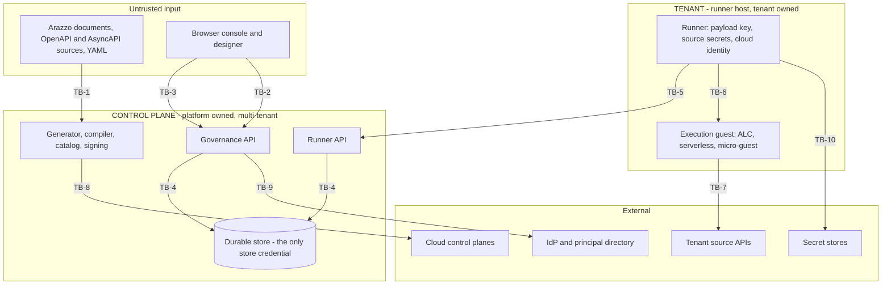

# Threat model

The assets this platform protects, the adversaries it is built against, the boundaries between them,
and at each boundary what stops an attack, what would notice one, and what limits the damage. Written
in swiss-cheese form: layered defences, assessed for whether the holes in successive layers line up.

**This is the standing model.** It defines the standard. It is amended when the system changes, on
the triggers in [§1.3](#13-what-obliges-an-update), not rewritten per review. A security audit is a
point-in-time measurement against it; the audit classifies each finding as a divergence to fix,
sequenced work to build, or a design gap to decide, and carries acceptance criteria and ordering.
[§12](#12-findings-ledger) is the summary view of the current audit result. [§7](#7-control-inventory)
and [§11](#11-accepted-risks-and-assumptions) are what an audit updates here.

**The system is assumed to be building out as designed.** [ADR 0065](../adr/0065-control-plane-owns-store-runners-encrypt-payload.md)
phases B and C, the envelope/payload split, the unified MAC, blind indexes, initiator sealing, the
[tenant anchor](UBIQUITOUSLANGUAGE.md#tenant-anchor) and the re-key sweep, are sequenced work. They
are recorded as *designed controls not yet built*, which is a different thing from a missing control,
and the risk they leave in the meantime is booked in [§11](#11-accepted-risks-and-assumptions) rather
than reported as a defect. The model therefore measures **conformance, not completeness**.

## 1. About this model

### 1.1 Scope

In scope: the control plane, the [runner API](UBIQUITOUSLANGUAGE.md#runner-api), the code generator
and catalog, all [execution backends](UBIQUITOUSLANGUAGE.md#execution-backend), all store backends,
the web kit and designer, the directory providers, and the build and deploy pipeline.

Out of scope, and unverified: runtime behaviour and deployed configuration, since this is a
source-level model; upstream `hyperlight-unikraft`, whose egress enforcement is asserted but not
verifiable here and covered by no test in this repository; runtime and dependency CVEs, which are
unknown while scanning is absent; and the cryptographic soundness of the phase-B constructions, which
have been assessed for whether they are wired rather than whether they are correct. Those deserve a
dedicated cryptographic review before they are wired.

### 1.2 Confidence

The control and finding inventory was assembled by parallel antagonistic review across separate
domains, each required to trace every ADR claim to enforcing code and to label conclusions CONFIRMED
or PLAUSIBLE. Only confirmed items appear. The most severe were independently re-verified against
source before inclusion.

Keep that verification step. One reviewer reported that two telemetry counters were declared but
never incremented, which would have made any dashboard built on them read a flat line as "no
cancellations". Both are in fact incremented (`WorkflowRun.WorkflowsSuspended.Add`;
`SecuredWorkflowManagement.WorkflowsCancelled.Add`), so the item was dropped rather than recorded.

### 1.3 What obliges an update

A threat model that nothing triggers goes stale silently. These are the triggers, and the [review checklist](review-checklist.md#1-does-the-threat-model-need-an-update) asks them of every change.

- A new ADR is accepted, or an existing one superseded. Reconcile its claims against [§7](#7-control-inventory).
- A new component, store backend, execution backend or API endpoint ships. Assign it to a boundary in [§2](#2-the-system-and-its-trust-boundaries), or add one.
- A control moves from designed to built. Re-score its row and the affected residuals.
- A phase transition. Re-score the whole of [§11](#11-accepted-risks-and-assumptions), since most of it is phase-conditioned.
- A divergence is found. Add it to [§12](#12-findings-ledger) and re-check whether its boundary still has depth.
- A new adversary becomes relevant, for example the first [deployment](UBIQUITOUSLANGUAGE.md#deployment) where the platform operator and the tenant are different legal entities.

### 1.4 Conventions

Severity is by the worst confirmed path rather than by likelihood. Control state is one of **Holds**
(traced to enforcing code and not broken by any confirmed path), **Partial**, **Absent**, or
**Designed** (specified and sequenced, not yet built, not a defect). Findings are classed **DIV**
(built, but an ADR asserts a property it lacks, so the fix is in code) or **GAP** (no ADR covers it,
so a decision comes first).

## 2. The system and its trust boundaries

The platform's defining property, from [ADR 0065](../adr/0065-control-plane-owns-store-runners-encrypt-payload.md),
is **mutual distrust** between a platform-owned control plane and tenant-owned
[runners](UBIQUITOUSLANGUAGE.md#runner). The control plane owns the durable store and governs every
[run](UBIQUITOUSLANGUAGE.md#run), while tenant data is confidential from it by key custody.
Everything below follows from that split, and from the fact that an
[Arazzo document](UBIQUITOUSLANGUAGE.md#arazzo-document) is an attacker-authored program the platform
compiles and executes.

| ID | Boundary | What crosses it | Who is trusted on each side |
|----|----------|-----------------|------------------------------|
| TB-1 | Untrusted document to control-plane process | Arazzo documents, embedded source descriptions, YAML, package containers | Neither. The document is attacker-authored and is compiled into executing code |
| TB-2 | Client to governance API | Authenticated requests from operators, designers, CLI, machine principals | Caller authenticated but not trusted for reach or capability, both checked server-side |
| TB-3 | Browser to served UI | Rendered attacker-influenced content, session cookie, privileged actions | The UI is presentation only. The server re-checks every gate |
| TB-4 | Control plane to durable store | Run rows, envelopes, security tags, indexes, audit | Store trusted for integrity, untrusted for confidentiality: a [sealed environment](UBIQUITOUSLANGUAGE.md#sealed-environment)'s payload reaches it as ciphertext |
| TB-5 | Runner to runner API (**the mutual-distrust seam**) | Claims, leases, checkpoints, catalog artifacts, queues | Neither side trusts the other. The runner distrusts the control plane for confidentiality, the control plane distrusts the runner for integrity |
| TB-6 | Runner and listener to execution guest | Invocation, checkpoint callbacks, workflow state | Guest runs attacker-derived code. Design says no key material originates in a guest |
| TB-7 | Workflow step to external source | Outbound HTTP with tenant credentials attached, broker subscriptions | Source is untrusted. It chooses responses that steer control flow |
| TB-8 | Build and deploy pipeline to cloud | Generated code, restore, signed artifacts, cloud API calls | Build inputs attacker-influenced. The output is signed and distributed to the [runner fleet](UBIQUITOUSLANGUAGE.md#runner-fleet) |
| TB-9 | Control plane to IdP and principal directory | Claims, group memberships, resolved grantee identities | IdP trusted for identity. Group *names* may be attacker-creatable |
| TB-10 | Runner to secret stores | Secret references resolved to material | Store trusted. The reference and the destination are control-plane supplied |

## 3. Assets and security objectives

| ID | Asset | Objective | Owner |
|----|-------|-----------|-------|
| AS-1 | [Checkpoint payload](UBIQUITOUSLANGUAGE.md#checkpoint-payload), run inputs, step outputs, journal data | Confidential from the platform, other tenants, backups and operators, by key custody rather than policy code | Tenant |
| AS-2 | [Checkpoint envelope](UBIQUITOUSLANGUAGE.md#checkpoint-envelope), cursor, status, wait, fault class, timing, tags | Readable by the control plane by design, integrity-protected against it | Shared |
| AS-3 | Source [credentials](UBIQUITOUSLANGUAGE.md#credential) and secret material | Never held by the control plane, never disclosed to a browser, never sent to an unintended destination | Tenant |
| AS-4 | [Executor](UBIQUITOUSLANGUAGE.md#executor) signing key and the artifact chain | A runner executes only what the [catalog](UBIQUITOUSLANGUAGE.md#catalog) produced. Compromise reaches the whole fleet | Platform |
| AS-5 | Tenant isolation itself | No [owner group](UBIQUITOUSLANGUAGE.md#owner-group) reads, writes or infers another's runs, catalog, credentials or existence | Platform |
| AS-6 | Cloud identities of the runner [host](UBIQUITOUSLANGUAGE.md#host), function execution roles, deploy credentials | Not reachable from workflow-authored code or a fetched document | Tenant and platform |
| AS-7 | Governance state, [grant bindings](UBIQUITOUSLANGUAGE.md#grant-binding), administrators, entitlements | Only mutable through governed, audited paths with [independent decision](UBIQUITOUSLANGUAGE.md#independent-decision) | Platform |
| AS-8 | Audit trail integrity | Complete, attributable, tamper-evident, durable enough to reconstruct an incident | Platform |
| AS-9 | Availability and execution capacity, including third-party reputation | One tenant cannot exhaust another's capacity, and the platform cannot be aimed at a third party | Platform |

## 4. Adversaries

Naming these matters more here than in most systems, because ADR 0065's central claim is *mutual*
distrust, so the platform itself is a first-class adversary, and several controls only make sense
against one specific actor.

| ID | Adversary | Position and assumed capability | Primary targets |
|----|-----------|--------------------------------|-----------------|
| AD-1 | Malicious workflow author | Authenticated tenant user. Authors arbitrary Arazzo documents and source descriptions, starts runs, chooses step targets and expressions | AS-4, AS-6, AS-9 |
| AD-2 | Over-privileged insider | Holds one legitimate [capability scope](UBIQUITOUSLANGUAGE.md#capability-scope) and seeks reach beyond it | AS-3, AS-5, AS-7 |
| AD-3 | Compromised runner host | Tenant-owned host under attacker control, holding the payload key, source secrets and cloud identity, speaking the runner API as a valid [machine principal](UBIQUITOUSLANGUAGE.md#machine-principal) | AS-1, AS-2, AS-5 |
| AD-4 | Malicious control plane | The platform itself, or an attacker with code execution in it. Owns the store, the generator, the signing key and every index. **The adversary ADR 0065 exists to bound** | AS-1, AS-2, AS-4 |
| AD-5 | Passive platform operator | Read access to the store, backups or replicas. No code execution. The realistic insider, and the one encryption at rest is for | AS-1, AS-5 |
| AD-6 | Network attacker | On-path between components, or able to reach an internal listener. Cannot break correctly configured TLS | AS-3, AS-6 |
| AD-7 | Compromised browser session | Via XSS, a stolen cookie, or a framed click. Acts with the victim operator's full authority | AS-7, AS-5 |
| AD-8 | Supply-chain attacker | Controls an upstream package, the vendored bundle, or reaches the build container | AS-4, AS-6 |
| AD-9 | Unauthenticated internet | Reaches any surface exposed without authentication, deliberately or otherwise | AS-1, AS-2, AS-9 |

## 5. Undesired outcomes

| ID | Outcome | Assets | Adversaries | Blast radius |
|----|---------|--------|-------------|--------------|
| UO-1 | Cross-tenant disclosure of run data | AS-1, AS-5 | AD-2, AD-3, AD-4, AD-5, AD-9 | Deployment |
| UO-2 | Unauthorised mutation or forgery of run state | AS-2, AS-5 | AD-3, AD-4, AD-9 | Deployment |
| UO-3 | Privilege escalation to platform operator | AS-7 | AD-2, AD-7 | Deployment |
| UO-4 | Remote code execution on control plane, runner or build host | AS-4, AS-6 | AD-1, AD-8 | Host, then fleet |
| UO-5 | Credential and key theft | AS-3, AS-4, AS-6 | AD-1, AD-2, AD-6 | Deployment |
| UO-6 | Supply-chain compromise of the artifact chain | AS-4 | AD-4, AD-8 | Runner fleet |
| UO-7 | SSRF into internal networks and cloud metadata | AS-6 | AD-1, AD-2 | Host and network |
| UO-8 | Denial of service, including aiming the platform at a third party | AS-9 | AD-1, AD-3 | Fleet and third party |
| UO-9 | Undetected loss of run integrity, rollback or substitution | AS-2 | AD-4 | Per run |
| UO-10 | Undetected breach, no record and no reconstruction | AS-8 | All | Deployment |
| UO-11 | Revocation does not take effect | AS-7, AS-5 | AD-2, AD-3 | Per principal |

## 6. Threats by boundary

The systematic layer. Each boundary is enumerated for the threat classes that apply to it whether or
not anything was found, so a row with no evidence is a claim of coverage, and coverage becomes
checkable rather than a by-product of what a review happened to look at.

### TB-1 Untrusted document to control-plane process

| Threat | Control | Residual risk | Evidence |
|--------|---------|---------------|----------|
| Code injection into the generated executor | **Holds**. Every emission site routes an authored identifier through `EmitText`: `Quote` for a literal, `XmlDocText` for a doc comment | The escaping is the whole control. No identifier charset is enforced at the API ingress, so the generator is what has to be right | H3 |
| SSRF and local file read via schema `$ref` resolution | **Holds**. The JSON Schema compiler is confined to supplied documents wherever the control plane compiles, which is the sibling of the loader below and was reached from the same uploaded package | The library default remains permissive, so a future call site that does not confine reopens it | H2 |
| SSRF and local file read via `$ref` resolution | **Holds** at catalog-add. The loader resolves registered documents only, so a reference out of the package is refused rather than retrieved, and the policy is named at the call site rather than defaulted into | The developer CLI still retrieves, by design, and its retrieval is unfenced. That is a different host and a different trust position, tracked separately | H2 |
| Resource exhaustion via YAML alias expansion | **Holds**. Both limits enforced at the single point every expansion passes through, with an unset value resolving to the documented default | The size bound is on expanded bytes, which is what the growth consumes; a document under the bound still costs what it declares | H6 |
| Deserialization gadget chains | **Holds**. Tags collapse to a closed enum, no type-directed deserialization, output is always a JSON DOM | None. There is no gadget surface | |
| Deep-nesting stack exhaustion | **Holds**. Canonical depth bound 64, non-overflow recursion, YAML depth 64 | None found | |
| Identity and hash confusion between documents | **Holds**. Correct ordinal sort, duplicate-key rejection, surrogate handling, and the stored/compiled bytes ARE the canonical form the hash covers (canonicalize-at-ingest) | Two submissions sharing a canonical form converge to one stored byte stream, so an identity cannot cover two compiler inputs | H13 |
| Malformed package container | **Partial**. Size caps and charset checks, length guard defeated by overflow | Documented clean-failure contract is false, and the exception escapes the validate catch filter | H33 |
| Unconstrained identifiers reaching downstream sinks | **Absent**. Zero pattern validators, and neither the metaschema pass nor the semantic analyzer runs on `POST /catalog` — both are reached only from the designer's validate and publish gate | An uploaded package is compiled and run without its document ever being schema-checked. Codegen escaping is therefore the only barrier, not a second one | H3, H16, H11 |

### TB-2 Client to governance API

| Threat | Control | Residual risk | Evidence |
|--------|---------|---------------|----------|
| Capability bypass, invoking an operation without the scope | **Holds**. Scopes generated from the OpenAPI contract, enforced per endpoint | An endpoint cannot ship without a declared scope | |
| Reach bypass, touching a row outside the principal's grant | **Holds**. Deny-by-default, non-disclosing 404, pre-refresh denies, wildcard cannot confer unrestricted [reach](UBIQUITOUSLANGUAGE.md#reach), and the security policy itself is reach-partitioned: rules and bindings carry management tags and every backend answers a `security:*` read under the caller's reach natively | Bounded by the replica refresh window (H22) | H10 |
| Privilege escalation by self-granting | **Holds**. The self-elevation guard refuses any binding that confers read, write or purge reach or any scope on the caller, a wildcard binding with any grant is refused on the API path, the access-request ceiling's rule is verified by expression under a reserved namespace, and `approve`, `grant` and `settle` all carry the independent-decision check | The guard is per binding and does not compare against what the caller already holds: a standing grant of a token-held scope is refused rather than weighed | H10 |
| Unauthenticated or unscoped surface on the API host | **Holds**. The checkpoint surface requires a run-scoped token, and is not mapped at all without a secret to validate one | The token is a bearer credential, so it is replayable within its lifetime, bounded to the one run it names | H1 |
| Identity spoofing via request-derived dimensions | **Absent**. No cross-check between ambient and token-derived tenant | Tenant becomes a function of the URL, and the self-elevation guard becomes context-local | H21 |
| Existence disclosure and enumeration | **Holds**. Non-disclosing 404 by design ([ADR 0004](../adr/0004-fail-closed-non-disclosing-enforcement.md)), and every such answer to a read is a refusal record in the audit chain, capped for each subject with the suppressed count recorded ([ADR 0070](../adr/0070-read-side-audit-three-tiers.md)) | The answer discloses nothing and the probe is evidenced. What is not yet recorded is a refused mutation on a path that does not already audit its refusals | H11 |
| Resource exhaustion of the shared plane | **Partial**. Bounded counts, [keyset pagination](UBIQUITOUSLANGUAGE.md#keyset-pagination), standing capacity limits counted by the target environment's owner group in every posture, and a version admitted only into an environment its owner group holds | No rate limiting on any browser-facing or governance endpoint, and the schedule run-now surface now starts its target through the one start admission (H45 closed) | H41, H45 |
| Object reference forgery | **Holds** for runs. The 32-hex [run-id](UBIQUITOUSLANGUAGE.md#run-id) grammar at every ingress, deterministic ids derived under the [run-derivation key](UBIQUITOUSLANGUAGE.md#run-derivation-key), and the composite [run address](UBIQUITOUSLANGUAGE.md#run-address) as the primary key in every backend | A guessed or disclosed run id resolves only within the caller's reach, and a run-id collision is evaluated only within the caller's environment, so neither branch is an existence oracle over another tenant's runs. The [schedule](UBIQUITOUSLANGUAGE.md#schedule) surface is the deliberate exception: schedule ids are a deployment-global operator namespace (the schedules routes carry no environment), so `create` returns a distinguishable `409` when an id is already registered in any environment. That is a name-taken signal over a shared global namespace, not disclosure of another tenant's run, and is accepted as AR-18 | H18 |

### TB-3 Browser to served UI

| Threat | Control | Residual risk | Evidence |
|--------|---------|---------------|----------|
| Stored or reflected XSS | **Holds**. Central `escapeHtml` at 584 sites, no dangerous sinks, no user-supplied SVG rendered | Scheme validation missing on link hrefs, so `javascript:` survives escaping | H27 |
| Client-only authorization | **Holds**. Every UI gate has a verified server-side twin ([ADR 0047](../adr/0047-web-kit-permission-gating-server-authoritative.md)) | UI gates fail open when the scopes attribute is absent, deliberate but makes every 403 look like a probe | |
| Clickjacking and UI redress | **Absent**. No `frame-ancestors` or `X-Frame-Options` | A framed click on a governed action is audited with the victim as actor | H17 |
| CSRF | **Partial**. `SameSite=Lax`, a required-header check on the API prefix, and no CORS anywhere | The header check does not cover `/logout` or the runner API path, both cookie-authenticated | H17 |
| Session theft and persistence | **Partial**. `HttpOnly`, no token in web storage | Not `Secure` and no forwarded headers, so plaintext behind a TLS proxy. Logout does not revoke server-side | H17 |
| Injection amplification once script runs | **Absent**. No CSP, and inline scripts plus runtime style injection mean one added now needs `'unsafe-inline'` | Any injection runs unconstrained and can exfiltrate to any origin | H17 |
| Phishing via the authentication flow | **Absent**. No local-URL check on the login return | Lands the user on any host straight after a genuine IdP sign-in | H28 |
| Credential disclosure to the browser | **Holds**. [ADR 0045](../adr/0045-debug-runs-never-credentials-in-browser.md) verified, the trace record carries no request headers | Debug traces still carry real bodies below the payload tier | H23 |

### TB-4 Control plane to durable store

| Threat | Control | Residual risk | Evidence |
|--------|---------|---------------|----------|
| Query injection | **Holds**. Uniform parameterisation, one shared rule AST, typed Mongo filters, constant Redis and NATS prefixes | None found across nine backends | |
| Cross-tenant read via a missing predicate | **Holds**. Deny-by-default filter, one AST walk, and the pushdown answered explicitly per store with mandatory reach oracles and per-backend wire proofs ([ADR 0067](../adr/0067-reach-enforced-by-the-store-proven-on-the-wire.md)); every store on every backend applies reach server-side or narrows through a §14.4 label index | Point reads keep a bounded in-memory reach decision over a key's few candidates, by design; a wrong predicate is caught by the mandatory oracles, not by any layer beneath the application | H12 |
| Disclosure at rest to a passive operator (AD-5) | **Holds** for a [sealed environment](UBIQUITOUSLANGUAGE.md#sealed-environment). The [checkpoint payload](UBIQUITOUSLANGUAGE.md#checkpoint-payload) is AES-256-GCM ciphertext under a [data key](UBIQUITOUSLANGUAGE.md#data-key) derived from a [payload key](UBIQUITOUSLANGUAGE.md#payload-key) the control plane never holds, bound to the run, environment, generation and sequence, and the runner API and the control plane's own checkpoint surface refuse a clear payload for such an environment | A plain start's genesis row is clear until the first runner save, a [sealed start](UBIQUITOUSLANGUAGE.md#sealed-start)'s never is, an open environment's payload is clear by choice, and envelope metadata and the tenant label are cleartext with a dedicated index. The interim protector remains opt-in and silent when unset for what stays clear | H7 |
| Privilege abuse beneath the application | **Absent**. No row-level security, no per-tenant credential, the runtime account owns the schema with DDL rights | Nothing catches a wrong predicate, and a leaked connection string is total | |
| Continuation-cursor tampering | **Holds**. The cursor supplies position only, the reach predicate is re-derived per request | The cursor discloses a raw [run address](UBIQUITOUSLANGUAGE.md#run-address) (environment name and run id) to anyone who sees it | |
| Unbounded result materialisation | **Holds** for reads. Keyset pagination and [bounded counts](UBIQUITOUSLANGUAGE.md#keyset-pagination), server-bounded or candidate-bounded everywhere reach applies (ADR 0067) | Per-admission capacity counting still issues a bounded count per run start, and the counters collapse cross-tenant (H41's open half) | H41 |

### TB-5 Runner to runner API, the mutual-distrust seam

| Threat | Control | Residual risk | Evidence |
|--------|---------|---------------|----------|
| Runner impersonation or lease hijack | **Holds**. Machine principal read from the token only, lease ownership derived server-side | The in-memory store mints predictable tokens, which matters only where a principal is shared | |
| Runner-id squatting at registration | **Holds**. [Pre-authorization](UBIQUITOUSLANGUAGE.md#runner-pre-authorization) or short-TTL [enrolment token](UBIQUITOUSLANGUAGE.md#enrolment-token) required, re-checked under the store fence | None found | |
| Claiming another environment's work | **Holds**. Environment resolved from bindings at [claim](UBIQUITOUSLANGUAGE.md#claim), never from the request, and the pin is no longer rewritable by a later save | None found | H39 |
| **Integrity of what the runner returns**, the control plane's half of mutual distrust | **Partial**. The coordinator refuses a save whose index changes the run's environment, workflow id or security tags, above the store and so on every backend; for a [sealed environment](UBIQUITOUSLANGUAGE.md#sealed-environment) the runner API and the control plane's own checkpoint surface also refuse a submission that is not encrypted and MAC'd under an active generation | Only the identity fields are compared, and the MAC is the runner's to verify, not the control plane's: what a runner writes under its own key is taken on trust by design | H39 |
| Substitution of a stored row by the control plane or the store (AD-4), the runner's half | **Holds** for a [sealed environment](UBIQUITOUSLANGUAGE.md#sealed-environment). The [checkpoint MAC](UBIQUITOUSLANGUAGE.md#checkpoint-mac) covers the header, key id, runner region and ciphertext digest, the payload's AEAD binds it to its run, environment, generation and sequence, the runner verifies and opens on every load and refuses a clear row, and the key never leaves the runner's [key ring](UBIQUITOUSLANGUAGE.md#runner-key-ring) | An open environment's rows stay unauthenticated by choice. A whole older row, MAC intact, still verifies: rollback is the anchor's to catch (AR-9) | |
| Checkpoint replay or stale write | **Holds** for the phase-A sequence rule. Single-row CAS, 409 on supersession, and the accepted sequence validated as persisted + 1 against a body sequence the ingress requires and checks against the header, so the rule no longer validates a number only the header carried. The sequence sits in the runner region, inside the [checkpoint MAC](UBIQUITOUSLANGUAGE.md#checkpoint-mac), so a control plane that rewrites it is caught by the runner on the next load. For an anchored environment the [tenant anchor](UBIQUITOUSLANGUAGE.md#tenant-anchor) catches a whole-row rollback, a substituted row at a committed sequence and a replay of a finished run's row at the runner's next open, since 2026-09-24 | Whole-row rollback to an older sequence, MAC intact, is not caught in an environment without an anchor. A rollback of the last mid-advance checkpoint whose acknowledgement the tenant recorded but did not promote reads as a lost acknowledgement | H40 |
| Superseded or displaced holder writing | **Holds** for an anchored environment. The [lease epoch](UBIQUITOUSLANGUAGE.md#lease-epoch) is minted per run by the store, persisted with the lease record, and compared on renewal and on both checkpoint operations, so a presented epoch that is not the current grant's authorises nothing; the runner writes it with the tenant-attested [store incarnation](UBIQUITOUSLANGUAGE.md#store-incarnation) into its region, and the anchor's high-water floor refuses a staged save under a lower key | A displaced holder's save landing after the new holder's staged one is a divergence fault at the next open, re-anchorable, and no runner can yet apply a re-anchor. An unanchored environment is sound within one store generation only | H8 |
| A hostile binding: the control plane creates an environment of its own, binds the tenant's runner to it and harvests plaintext from runs executed with the tenant's credentials, or re-keys a served environment under a key it holds | **Holds**. The runner serves only the environments its own allowlist names (ADR 0065 decision 10) and hands back any other claim before loading a byte; a keyed environment is served only while the seal key the runner API advertises for the generation held carries the fingerprint the tenant pinned, re-checked once a minute, and is suspended otherwise | The listener and serverless runner pin the fingerprint but hold no runner API client to check it against; a suspended environment is still claimed and released each sweep, which the dispatcher's seen-twice rule bounds | |
| Run injection: the control plane, holding the public seal key, seals inputs of its own choosing for a run in the tenant's boundary | **Holds** for a [sealed start](UBIQUITOUSLANGUAGE.md#sealed-start). A sealed start opens only under an ES256 signature one of the [initiator keys](UBIQUITOUSLANGUAGE.md#initiator-key) pinned in the runner's own configuration verifies, over the binding the runner re-derives from the address it claimed and the workflow its envelope names, so a seal made by anyone else, or moved to another run, workflow, environment or generation, faults the run at its start rather than running; a runner with a seal key and no pinned initiator does not start | A plain start into a sealed environment is admitted with clear inputs and no signature, badged only by the absence of the sealed-start mark; a stream of refused starts is counted, not quota-limited, so a control plane can make the tenant's runner fault runs at will (GAP-3) | |
| Rollback or substitution by the control plane (AD-4) | **Holds** for an anchored environment, detected not prevented. The [tenant anchor](UBIQUITOUSLANGUAGE.md#tenant-anchor) is written by the runner in its own store before every dispatch and read before every open, so the control plane's copy of the run cannot be presented at a coordinate the tenant did not commit to | An unanchored environment stays as it was (AR-9). A run the anchor refuses is left as it is until the operator cancels it envelope-only; a signed re-anchor is admitted by the store and applied by no runner yet | |
| Revocation of a compromised runner | **Holds**. The [revocation fence](UBIQUITOUSLANGUAGE.md#runner-revocation-fence) expires leases by the bound machine principal, and renewal and both checkpoint operations re-resolve bindings | Bounded by the resolver's cache window, and by nothing on a replica that has not refreshed its policy. Every backend now implements `IWorkflowLeaseAdministration`, so the in-flight half holds on all of them and AR-16's fence half is discharged; the residual is the replica-refresh window (H22) | H22 |
| Cross-tenant denial of service | **Holds**. Per-tenant and per-runner token buckets, test-before-spend, client-side `Retry-After` clamp; a principal that cannot be attributed to a tenant is bound to nothing once the [tenancy ledger](UBIQUITOUSLANGUAGE.md#tenancy-ledger) names one, and eviction is per counter and never forgives a deficit | The shipped meter counts per instance, so a multi-instance deployment admits N times each rate until it supplies a shared-state guard ([ADR 0066](../adr/0066-runner-api-rate-and-capacity-limiting.md)); a deployment that stamps no owner group has one tenant by construction (ASU-7) | H41 |
| Observability of the seam | **Partial**. Every refusal the runner API makes is a record in the audit chain and a count on the governance-decisions counter, by the runner's principal ([ADR 0071](../adr/0071-authentication-event-telemetry.md)) | A threat in this table that the API refuses is recorded. One that it accepts, which is what a stolen but valid lease or a compromised runner's own writes look like, still executes silently | H11 |

### TB-6 Runner and listener to execution guest

| Threat | Control | Residual risk | Evidence |
|--------|---------|---------------|----------|
| Guest escape to the host | **Partial**. Hypervisor boundary on the [micro-guest backend](UBIQUITOUSLANGUAGE.md#micro-guest-backend) only | The *default* [isolation model](UBIQUITOUSLANGUAGE.md#isolation-model) is in-process with no boundary at all, so generated-code compromise equals runner compromise | H15 |
| Unauthenticated control of a guest | **Holds**. The admin surface takes a shared bearer token the sidecar refuses to start without, the guest surface answers only the sandbox whose sidecar-minted token the request carries, and the sidecar boots only an initrd whose native attestation verifies under its own trust store | The sidecar cannot bind the binary to a catalog version, since it has no package; that binding stays on the runner's deploy path | H9 |
| Key material originating in a guest | **Holds**. Design forbids it, the listener supplies the ordering token per invocation | None. Correctly anticipated, because snapshot restore would repeat it | |
| Entropy replay across advances | **Absent**. No reseed hook after snapshot restore | Identical GUIDs and nonces on every advance, acknowledged in [ADR 0064](../adr/0064-microguest-snapshots-after-warmup-init-run-split.md) | H32 |
| Cross-run or cross-tenant state bleed | **Holds** on the micro-guest, hermetic restore per advance | Serverless backends reuse a warm process, so isolation is per environment and version rather than per run | |
| Unauthenticated invocation of a deployed guest | **Holds** on Azure Functions and on Lambda | The invoke authenticator is a required seam with no anonymous implementation. Azure: a `Function`-level trigger behind a key the deployer sets from the runner's secret store, with Entra as an optional second layer whose posture the deployer checks. Lambda: `AWS_IAM` with a Signature Version 4 signature, which did not exist before 2026-09-21, so the path worked on LocalStack alone. Behind the credential, the function takes a `checkpointUrl` only from an origin in its required `ARAZZO_CHECKPOINT_ORIGINS` setting, so a caller who holds the credential cannot point it at a checkpoint surface of their own. Not yet proven against a real Function App or real AWS | H19 |

### TB-7 Workflow step to external source

| Threat | Control | Residual risk | Evidence |
|--------|---------|---------------|----------|
| SSRF by step targeting | **Holds**. The executor never names a URL. A step carries a source *name* bound by the host, and there is no per-step server override | None. A deliberate architectural property, and the strongest control at this boundary | |
| SSRF by credential-binding redirection | **Holds** on the tenant API. A binding authored through the credentials handler must name a managed secret store and an absolute https `baseUrl` (http only where the deployment already permits insecure source transport) | A programmatic or bootstrap binding may still use host-local delivery, by design: the deny lives in the handler, not the store | H4 |
| Credential leak across a redirect | **Holds** on both paths. Run-path clients never auto-follow; a same-origin redirect is followed for a body-less GET or HEAD with the scheme re-checked each hop, and a cross-origin one is returned unfollowed, so no header and no client certificate reaches another origin | None found. The run path is stricter than the fetcher by design, since an mTLS certificate cannot be dropped per hop | H4 |
| Route escape past a gateway prefix | **Partial**. Percent-encoding by default | `allowReserved` parameters skip it, so `../` escapes with the credential attached | H29 |
| Egress to internal or metadata addresses | **Absent** on three of four backends, delegated to deployment by [ADR 0052](../adr/0052-source-fetch-authenticates-as-the-user.md) | Assumption ASU-3. The code cannot verify the control exists | H15 |
| Hostile source steering control flow | **Partial**. Closed expression grammar, JSON-Pointer body descent, uniform 1s regex timeouts | Dynamic criteria interpolate response values into the pattern, so a source rewrites the assertion checking it | H26 |
| Third-party denial of service | **Holds**. Every run except the scheduler's own carries an execution budget of fuel, a wall clock and a sub-workflow depth cap, with a per-step timeout, a response size cap and a `retryAfter` ceiling on the same record. A draft debug run is budgeted like any run. One deployment ceiling bounds the budget and an environment may only tighten it. The runner enforces it before every attempt and the coordinator verifies it on every save, so a runner that ignores it cannot persist the run past it ([ADR 0068](../adr/0068-execution-budget-fuel-wall-clock-depth.md)) | A host that creates runs directly through the library chooses its own budget. An outage of the store or the artifact source is retried on every poll until it heals, by decision | H14 |
| Cross-tenant message disclosure on a shared broker | **Absent**. No subject-grammar validation on channel parameters | A wildcard subscribes across every tenant and persists into the durable [wait](UBIQUITOUSLANGUAGE.md#wait) | H25 |

### TB-8 Build and deploy pipeline to cloud

| Threat | Control | Residual risk | Evidence |
|--------|---------|---------------|----------|
| Artifact substitution or tampering | **Holds**. Digest binding on load, optional detached signature against a trust store, full [native artifact attestation](UBIQUITOUSLANGUAGE.md#native-artifact-attestation), and the IL read path recomputes the content hash from the served documents and refuses a diverging stored column | The chain still signs whatever the generator emitted | H13 |
| Build-time code execution | **Absent**. Container is root, unconfined, network-live, with a read-write host mount | `runtimeIdentifier` is interpolated raw into MSBuild XML with no pattern in the contract | H16 |
| Dependency confusion at restore | **Absent**. No package source mapping, no lock file, private feed mixed with the public one | A poisoned first-party id yields a control-plane-signed binary | H16 |
| Cross-tenant resource collision at deploy | **Absent**. Sanitised names are non-injective and update proceeds with no ownership check | One tenant's deploy replaces another's function code | H31 |
| Over-broad cloud privilege | **Absent** in code, a people control only | Execution role is an unvalidated option, and the sample defaults to a dummy ARN | |
| Stale deployed configuration | **Partial**. Azure merges settings every deploy | Lambda passes environment only on create, so revoking a source URL has no effect on a deployed function | H30 |
| Build queue starvation | **Absent**. No build timeout, and the lease heartbeat masks a hung build | One wedged build stalls the single-threaded queue until restart | H16 |

### TB-9 Control plane to IdP and principal directory

| Threat | Control | Residual risk | Evidence |
|--------|---------|---------------|----------|
| Identity widening via group membership | **Absent** in code, IdP policy only | Membership expansion folds group *names* into the identity under subset matching, so creating a group widens what a principal matches | H42 |
| Attribute shadowing | **Absent**. First-match on one path, last-match on another | A user-writable attribute whose leaf name collides with the tenant attribute can supply the tenant | H42 |
| Directory outage degrading to a wrong answer | **Partial**. The explicit source path fails closed | The default merged path swallows failures and returns a truncated list, so an operator grants against a stale identity | H43 |
| Credential disclosure in transit | **Partial**. Safe defaults | Cleartext LDAP bind is constructible, and no HTTP adapter asserts an https base URL | H44 |
| Membership revocation latency | **Partial**. Bounded cache TTL | No invalidation API, no enforced upper bound, unbounded growth above the prune threshold | H42 |
| Issuer confusion between principals | **Partial**. Grantee resolution is issuer-pinned | The span projection path does not enforce the issuer tag, and the grant path writes a subject-only binding | H42 |

### TB-10 Runner to secret stores

| Threat | Control | Residual risk | Evidence |
|--------|---------|---------------|----------|
| Secret material held by the control plane | **Holds**. Bindings store a [secretRef](UBIQUITOUSLANGUAGE.md#secretref), there is no secret writer, and writing is a separate identity | A tenant-authored reference names a managed store and an https origin, so owning the reference no longer steers the runner at its own host | H4 |
| Exfiltration via reference control | **Holds** on the tenant API. `env://` and `file://` are refused on every tenant credential write | A programmatic or bootstrap binding may use them by design, so the runner host's environment and filesystem are reachable only through code the deployment itself wrote | H4 |
| Secret recovery from process memory | **Partial**. Secret material zeroes correctly and documents the hazard | Every consumer reveals it to a string, so a heap dump recovers every bound credential | H35 |
| Secret leakage through logs and errors | **Holds**. [Governance audit](UBIQUITOUSLANGUAGE.md#governance-audit) has no payload parameter, token exceptions carry status only, telemetry tags are identifiers | [Debug runs](UBIQUITOUSLANGUAGE.md#debug-run) write raw exception text into a readable fault field | H23 |
| Undetected secret misuse | **Partial**. A runner records every secret it resolves, and every resolution that fails, on an audit chain of its own ([ADR 0070](../adr/0070-read-side-audit-three-tiers.md)) | The record names the runner and the secret, not the run or the principal that caused it, since a secret is resolved for a source and an environment and then cached. The host has to wire it, and nothing asserts that it has | H11 |
| Auth-method lifecycle failure | **Partial**. Fails closed, runs fault rather than proceeding uncredentialed | No re-auth loop and no guidance, so token expiry reads as an outage. A null field yields an empty secret rather than a failure | |

## 7. Control inventory

Traced to enforcing code rather than to an ADR claim. Recording what holds matters as much as
recording what does not, because a model built only from holes mis-ranks the fixes.

### 7.1 Technology

| Control | State | Location |
|---------|-------|----------|
| Environment key registration proves possession, one pinned algorithm, freshness before signature, identifier bounds, length-framed tuple | Holds | `EnvironmentKeyPossession.cs:54+` |
| Deny-by-default reach, empty rule set admits nothing, untagged row invisible, unranked comparison denies, policy starts denying | Holds | `SecurityFilter.cs:56-105`, `PersistentRowSecurityPolicy.cs:37` |
| One security-rule AST walk, backends supply fragments only, every value bound | Holds | `ISecurityRulePredicateEmitter.cs`, `SecurityRule.ToPredicate`, `SqlSecurityRuleEmitter.cs:56` |
| Schema compilation confined to supplied documents on every control-plane path, so an authored `$ref` is refused rather than fetched | Holds | `ArazzoControlPlaneCatalogHandler.cs`, `ArazzoControlPlaneWorkspaceHandler.cs` |
| Reserved `sys:` keyspace refused independently of the policy | Holds | `ControlPlaneRowSecurity.cs:386-395` |
| Wildcard binding cannot confer unrestricted reach | Holds | `PersistentRowSecurityPolicy.cs:126, 362-366` |
| Run identity (environment, workflow id, security tags) is not runner-mutable once established, enforced above the store so every backend inherits it | Holds | `WorkflowCheckpointCoordinator.SaveAsync` |
| Machine principal from the token only, lease ownership derived server-side | Holds | `RunnerPrincipalAccessor.cs:47-62`, `MachinePrincipal.cs:52-65` |
| Revocation expires the holder's leases by bound principal, and renewal and both checkpoint operations re-resolve bindings | Holds. The control plane asks correctly on every backend, and every store now implements the expiry capability | `ArazzoControlPlaneRunnerAuthorizationsHandler.cs` fence, `RunnerRunCoordinator.BoundToAsync`, `IWorkflowLeaseAdministration` |
| Registration requires pre-authorization or an enrolment token, re-checked under the store fence | Holds | `ArazzoControlPlaneRunnerAuthorizationsHandler.cs:277-297, 359-366` |
| Catalog artifacts authorized by path, never bare content hash, and "not yours" answers as "not there" | Holds | `RunnerCatalogCoordinator.cs:134-147, 226-239` |
| Client-side `Retry-After` clamp, 10s single, 30s total, 4 attempts | Holds | `RunnerQuotaHoldOptions.cs:79-110` |
| Executor never names a URL, source name bound by the host | Holds | `TransportSelection.cs:14-33`, `AotHostAppAssembler.cs:34-56` |
| Runtime expressions are a fixed prefix table plus JSON Pointer, unrecognised forms degrade to literal | Holds | `ArazzoExpression.cs:89-257` |
| Document resolution is a stated policy per caller, closed by default, registry-only where the input is attacker-authored | Holds | `ArazzoDocumentResolution.cs`, `WorkflowExecutorProvider.cs` |
| Uniform 1s regex timeouts on every criterion and JSONPath | Holds | `RegexCriterionInliner.cs:121`, `CompiledCriterion.cs:108-249` |
| Authored identifiers reach generated source only through `EmitText.Quote` (literals) or `EmitText.XmlDocText` (doc comments) | Holds | `EmitText.cs`, `WorkflowExecutorEmitter.cs` |
| YAML alias expansion bounded by size and by expanded depth, charged where every expansion resolves, unset resolving to the documented default | Holds | `YamlToJsonConverter.ChargeAliasExpansion`, `YamlReaderOptions` |
| Canonicalisation, ordinal sort, duplicate-key rejection, lone surrogates throw, depth 64 | Holds | `JsonCanonicalizer.cs:122-125, 195-201, 424-439` |
| Closed signature-algorithm switch, trust root from operator config, verifier required on build and deploy | Holds | `TrustStoreExecutorPackageVerifier.cs:38-66`, `WorkflowAotBuildService.cs:36` |
| Central `escapeHtml` at 584 sites, no dangerous sinks, no user-supplied SVG | Holds | `base.js:184-191` |
| No CORS anywhere, required-header anti-forgery on the API prefix | Holds | `ControlPlaneAntiForgery.cs:45-89` |
| OAuth broker state, CSPRNG, single-use, principal and provider bound, PKCE, 10 minute TTL | Holds | `ProviderBroker.cs:38-42, 166-232` |
| [Tenancy ledger](UBIQUITOUSLANGUAGE.md#tenancy-ledger), append-only, CAS-serialised, held in the environment store | Holds | `Environments/TenancyLedger.cs` |
| Server-authoritative permission gating, every UI gate has a verified server twin | Holds | `ControlPlaneAuthorization.cs:125-185` |
| Checkpoint token primitive, HMAC, run-bound, constant-time, canonical expiry | Holds | `CheckpointToken.cs` |
| Checkpoint surface requires the run-scoped token, and is absent rather than open when no secret is configured | Holds | `WorkflowCheckpointEndpoints.cs:40-45`, `ControlPlaneEndpointExtensions.cs` |
| One checkpoint coordinator per host, so the single-flight interlock is per run rather than per component | Holds | `RunnerEndpointExtensions.cs`, `WorkflowCheckpointEndpoints.cs` |
| Self-elevation guard refuses any binding that confers read, write or purge reach or any scope on the caller, wildcard grants refused on the API path, own-request check on approve, grant and settle | Holds | `ArazzoControlPlaneSecurityHandler.cs` (`SelfElevates`, `ConfersAnything`), `ArazzoControlPlaneAccessRequestsHandler.cs` |
| Security policy reach-partitioned, rules and bindings carry management tags and every backend answers `security:*` reads under the caller's reach natively | Holds | `SecurityLabelQueryResolver.cs`, each backend's security-policy store, the security-policy conformance reach oracles |
| Per-workflow reach rule under a reserved namespace, reused only when its expression is exactly the workflow's | Holds | `Security/WorkflowReachRule.cs`, `AccessRequestApprovalService.cs` |
| Tenant credential writes name a managed secret store and an https origin, and run-path clients never follow a cross-origin redirect | Holds | `SourceCredentialBinding.ValidateTenantWritePolicy`, `RedirectHardeningHandler.cs` |
| Governance audit attributes one canonical subject with owner group and environment on every mutation, including run start, bootstrap seeds and approval-service writes | Holds | `Security/AuditSubject.cs`, `Security/GovernanceAuditor.cs` |
| Quota and capacity counters isolate by owner group, fail closed once the tenancy ledger names one, evict per counter, count by the target environment's owner group | Holds | `RunnerAuthorizationBindings.cs`, `TokenBucketRunnerQuotaGuard.SweepFull`, `ArazzoControlPlaneCatalogHandler.TenantScope` |
| A version is admitted only into an environment its own owner group holds, at promotion, promotion request, schedule and run start | Holds | `OwnerGroupTag.Agrees`, `TenancyAgreement.cs` |
| Execution budget: fuel, wall clock and depth per run, deployment ceiling with a tightening environment override, runner-enforced and coordinator-verified on every save, a budget fault resumable only by a control-plane-authored, audited re-budget that the ceiling and the journal cap bound | Holds | `ExecutionBudget.cs`, `WorkflowCheckpointCoordinator.SaveAsync`, `ISecuredWorkflowManagement.ResolveExecutionBudgetAsync`, [ADR 0068](../adr/0068-execution-budget-fuel-wall-clock-depth.md) |
| Audit sink: append-only, hash-chained, signed heads anchored through the collector, outside the operational store, asserted at startup and failing governance closed in the secured postures | Holds | `Audit/AuditChainWriter.cs`, `Audit/AuditChainVerifier.cs`, `Security/GovernanceAuditor.cs`, `AzureBlobAuditSink.cs`, `AuditRecordFailure.cs`, [ADR 0069](../adr/0069-audit-as-evidence-append-only-chained-signed-sink.md) |
| Read-side audit in three tiers: payload disclosures audited, reach refusals audited, bulk reads metered | Designed | [ADR 0070](../adr/0070-read-side-audit-three-tiers.md) |
| Authentication telemetry the host registers, required in the secured postures, its failure records capped for each address | Holds | `AuthenticationTelemetry.cs`, `GovernanceAuditor.AuthenticationFailedAsync`, [ADR 0071](../adr/0071-authentication-event-telemetry.md) |
| Runner-API refusals audited, capped for each principal, and required where the runner API authenticates its callers | Holds | `RunnerRefusalAudit.cs`, `GovernanceAuditor.RefusalAsync`, [ADR 0071](../adr/0071-authentication-event-telemetry.md) |
| Tenant anchor: acceptance predicate, open decision table, tenant-owned store, attested incarnation, the runner's staging before dispatch | Holds for an anchored environment | `Durability/Anchoring/*`, `SealingCheckpointStore.cs`, `Postgres/PostgresTenantAnchorStore.cs`, `Runner.Client/RunnerRunAdvance.cs`, conformance-tested |
| Blind wait index: the runner region and the index column carry the HMAC under the `wait-index` subkey in place of the channel and correlation id for every environment on the runner's key ring; index claims at the runner API; the delivery re-check | Holds for a sealed environment's wait match key | `Anchoring/WaitIndexBlinder.cs`, `WorkflowRun.cs`, `WorkflowRunIndexEntry.cs`, `Runner.Server/RunnerRunCoordinator.cs`, `Runner.Client/RunnerApiWorker.cs`, `Runner.Client/RunnerRunAdvance.cs`, conformance-tested on every backend |
| Runner allowlist: the key ring admits only the environments it names (default deny, clear or sealed), the runner client hands back every other claim, the sealing store refuses every other checkpoint on the runner, the listener and the serverless runner, and a keyed entry serves only while the seal key the runner API advertises has the pinned fingerprint | Holds; the listener and serverless runner pin without a wire check | `RunnerKeyRing.cs`, `SealingCheckpointStore.cs`, `Runner.Client/ArazzoRunnerClient.AdmitsAsync`, `RunnerRunAdvance.cs`, `Runner.Server/ArazzoRunnerEnvironmentsHandler.cs` |
| Sealed start: the HPKE seal to the registered seal key under the framed binding, the ES256 initiator signature verified against keys pinned on the runner's key ring, the sealed genesis row digested under the genesis label, the open at first claim under a binding re-derived from the run's own address, runner-side input-schema validation, and the start faults that stop a refused run being claimed again | Holds. The control-plane sealed-start endpoint stores the seal unread through the one admission chain, and the CLI initiator pins the seal key's fingerprint before sealing | `Anchoring/InputSeal.cs` (RFC 9180 vector), `Anchoring/SealedStartSignature.cs`, `Anchoring/RunStartInitiator.cs`, `SealingCheckpointStore.cs`, `Runner.Client/RunStartInputValidator.cs`, `RunnerRunAdvance.cs` |
| Re-key sweep, operator-signed re-anchor and abandon, the run-level correlation id's blinding, the runner-side trigger host for sealed schedules and message triggers | Designed | `Durability/Anchoring/*`, conformance-tested |

### 7.2 Process

| Control | State | Note |
|---------|-------|------|
| Repeated adversarial design review with residues published | Holds | Ten rounds in ADR 0065, two defects surfaced only when the spec was made executable |
| API-first, endpoint scopes generated from the contract | Holds | An endpoint cannot ship without a declared scope |
| Warning-free build, warnings as errors everywhere | Holds | Catches correctness, not security classes |
| Explicit security posture with no default ([ADR 0016](../adr/0016-control-plane-security-mode.md)) | Holds | The posture is a required leading parameter, the public unscoped overload names its own, and the demo's binding fails startup when unset. `Open` is the enum's zero value, so no parameter default could have been safe |
| Shared store-conformance suite | Holds | The reach oracles are mandatory and assert each store's declared pushdown answer outright, so a store that quietly stops pushing down fails eight suites rather than turning Inconclusive; each backend's wire tests observe the pushdown itself (ADR 0067) |
| Static analysis | Absent | No SAST in any workflow |
| Dependency vulnerability scanning | Absent | No NuGet audit, no vulnerable-package check, no npm audit |
| Dependency updates | Absent | Present but inert, Dependabot targets a directory that does not exist in this repository |
| Reproducible restore | Absent | Lock files only on the legacy v4 projects |
| Vulnerability disclosure policy | Absent | No `SECURITY.md` |
| Implementation status recorded in ADRs | Holds | Every ADR carries an implementation line verified against the code on 2026-09-21 (PROC-6). What the verification found is in [§11 of the 2026-08-07 audit](../audits/2026-08-07-security-audit.md#11-proc-6-verification-findings), findings V-1 to V-42, none remediated yet. The [review checklist](review-checklist.md) keeps the line true |
| Review checklist | Holds | [`review-checklist.md`](review-checklist.md) carries the update triggers of §1.3, the read-side question of ADR 0070 and one question for each recurring defect kind (PROC-7). It is a document a reviewer reads, and nothing mechanical enforces it |
| Observability coverage reference | Partial | Claims verification against the handlers, points at an anchor that no longer exists, omits five emitted actions |

### 7.3 People

| Control | Enforced by | Risk if the human does not do it |
|---------|-------------|----------------------------------|
| Operator provisions least-privilege cloud identities | Nothing, doc comment | The blast radius for every TB-8 finding, and the sample defaults to a dummy ARN |
| Operator keeps the sidecar admin surface on loopback | Weak, default bind and comment, env-overridable | Arbitrary code in a micro-guest on the runner host with an attacker-chosen allowlist |
| Operator supplies network egress controls | Nothing, delegated by ADR 0052 | The only barrier to metadata endpoints on three of four backends, unverifiable in code |
| Operator configures the executor trust store | Nothing, silent degrade with no log | Signature verification turns off on a mistyped path and nothing reports it |
| IdP group hygiene, self-service creation disabled | Nothing, IdP policy | Creating a group strictly widens what a principal matches |
| Severity-proportional UI friction, typed challenges, usage chips, resolved-identity tuples | Built | Prevents operator error, not attack. A hostile caller uses the API directly |

## 8. Detection

The weakest layer, and weak where it matters most. The surfaces carrying the highest-value data emit
nothing.

**The mutation audit is evidence. Everything else is still telemetry, or nothing.** Every governance mutation, a
refused one included, run start and the bootstrap's founding grants are appended, after the action commits, to an
audit chain ([ADR 0069](../adr/0069-audit-as-evidence-append-only-chained-signed-sink.md)): each record carries the hash of the
record before it, the chain's head is signed on a cadence under a key of the audit's own, and every signed head is
also published through the span and the log, so a collector holds anchors that whoever holds the sink cannot
rewrite. The sink is outside the operational database, and the Azure Storage sink refuses a container that is not
immutable. A secured control plane does not start without a sink and a head signer, and a record the sink refuses
fails the request that made it, so authoring does not proceed unrecorded. `arazzo-runs audit verify` checks the
chains from their stored bytes, against the audit's public key and the anchors, without the control plane in the
path. Four limits are stated. The record is change-blind by decision ([ADR 0038](../adr/0038-payload-safe-governance-audit.md)): it says who
did what to which resource, not what the resource changed from or to. The records after the last signed head are
vouched for by no signature yet, which is a window of 64 records or 60 seconds by default. A chain does not outlive its process, so a control
plane that starts reads its own last chain back and continues it under a head signed at once, which freezes the tail
its last process left unsigned without authenticating it: between a stop and the next start that tail is whatever
the sink holds, and the verifier goes on reporting it as unsigned. And of reads the chain holds
the disclosures only, the step journal, a debug run's trace, a credential binding's detail and the checkpoint,
each recorded before it is disclosed and refused when it cannot be
([ADR 0070](../adr/0070-read-side-audit-three-tiers.md)). Refused reads are recorded too, up to a bound for each subject and as a count past it, and every other read is metered and not recorded. The rows below marked "No" emit nothing at all.

| Security-critical action | Audited | Consequence |
|--------------------------|---------|-------------|
| Checkpoint read, the full run payload | Yes | A read record in the audit chain with the run as its subject, since the caller is a dispatched function holding a run-scoped token and no principal, and refused when it cannot be recorded ([ADR 0070](../adr/0070-read-side-audit-three-tiers.md)) |
| Checkpoint write | No | A write through the run-scoped surface or the runner API produces nothing |
| Every runner API operation, claim, lease, checkpoint, catalog | Refusals, yes | Every refusal the runner API makes is a record in the audit chain, naming the runner's principal, the operation and the run: no machine principal, a runner that is revoked, quarantined or not bound to the environment, a lease or an epoch that no longer matches, and a quota that is spent, capped for each principal with the suppressed count recorded ([ADR 0071](../adr/0071-authentication-event-telemetry.md)). So lease theft that is refused, a quota trip and an epoch anomaly are no longer silent. The outcome is as fine as the status, and an operation that succeeds still leaves nothing, so a claim, a lease renewal or a checkpoint write that the API accepts is unrecorded |
| Any read, list or search on the governance API | Yes, in three tiers | A read that discloses a payload is a record in the audit chain, made before it is answered. A read refused with a not-found is a record too, capped for each subject. Every other read, which is lists, searches, counts and index-row gets, is metered by action, tenant and outcome on `corvus.arazzo.governance.reads` and recorded nowhere, so a cross-tenant payload read is reconstructable and a bulk read shows as a rate and not as a record ([ADR 0070](../adr/0070-read-side-audit-three-tiers.md)) |
| Authentication success and failure | Yes | Every request's authentication is counted by scheme, outcome and reason, and a failure is a record in the audit chain naming the scheme, the reason and the remote address and no token material, capped for each address with the suppressed count recorded, so credential stuffing has a rate and a record ([ADR 0071](../adr/0071-authentication-event-telemetry.md)). A secured control plane does not start in a host that has not registered it. It reads the default scheme; a scheme named only on an endpoint is not seen, and behind a proxy the address is the proxy's unless the host configures forwarded headers |
| Authorization denial on read paths | Yes | Every `GET` that names a resource and answers with a not-found is a refusal record in the audit chain, by the actor, for the id it asked after, recorded for all operations by one filter. A subject's refusals are recorded up to a bound a minute and as a count past it, so an enumeration is evidenced without being able to fill the chain ([ADR 0070](../adr/0070-read-side-audit-three-tiers.md)). ADR 0004 still makes the answer itself non-disclosing |
| Secret resolution, and decryption failure | Yes, where the host wires it | Every secret a runner resolves is a read record on the runner's own audit chain, naming the runner and the secret's reference and never the material, and a resolution that fails is recorded as failed ([ADR 0070](../adr/0070-read-side-audit-three-tiers.md)). It is a decorator the host wraps its resolver in, so a host that does not wrap it records nothing, and nothing asserts that it has. A resolution is never refused for want of its record, since run execution is not gated on the sink, so an outage of the runner's sink is a window of unrecorded resolutions |
| Outbound document fetch, by destination | No | An SSRF sweep cannot be answered for after the fact |
| Signature verification failure, verification disabled at startup | No | A tampered package looks like a disk-full build failure |
| Run start | Yes | A record in the audit chain. `run.start` with the canonical subject, owner group and environment, refusals included. The schedule run-now surface records both: `run.start` against the run it starts, from the admission, and `schedule.run-now` against the schedule (H45 closed) |
| Bootstrap genesis grant | Yes | Records in the same audit chain as everything else the deployment records, since the host gives its provisioning and its control plane one auditor. Each seeded binding and rule is audited as the bootstrap actor, and the approval service audits every grant, eligibility and revocation it writes |
| Runner liveness, heartbeat gap | No | The reaper has no caller, so a dead runner keeps satisfying the hosting gates |
| Governance mutations, including refusals with distinct outcome codes | Yes | Uniform and genuinely well built, and a record in the audit chain: hash-linked, under a signed head, outside the operational store |
| Step-journal read, including refusals, with [disclosure tier](UBIQUITOUSLANGUAGE.md#step-output-disclosure-tier) | Yes | A read record in the audit chain, naming the disclosure tier, and refused undisclosed when its record cannot be appended ([ADR 0070](../adr/0070-read-side-audit-three-tiers.md)). The one audited read surface so far, and the model for the rest |

Quality of what *is* recorded:

- **Tenant and environment are first-class.** The primitive takes the audit subject, which carries the actor's owner group, and an optional environment; it tags both on the span, logs both and dimensions the decisions counter by them, so the trail filters by tenant.
- **One actor derivation.** Every record carries the canonical subject (the deployment's configured subject claim, then the authorized party or client id of a client-credentials token, then the authentication name, then anonymous), never the display name, so a principal joins across surfaces and [ADR 0038](../adr/0038-payload-safe-governance-audit.md)'s stated property holds.
- **Change-blind by construction.** Payload-safety and the inability to record *what* changed are the same property from two sides. A credential base URL repointed at an attacker audits as `updated`; a secret-reference swap audits as `rotated` and increments the rotation-health counter. Any fix must be designed against ADR 0038 rather than bolted beside it.
- **Recording is not detecting.** No threshold, anomaly or alert logic exists in the repository. Everything depends on an external collector, assumption ASU-1.
- **Log injection.** User-controlled values are interpolated unescaped and unbounded, with zero pattern validators across 1,237 generated models.

## 9. Containment

| Measure | State | What it actually limits |
|---------|-------|--------------------------|
| Runners hold no store credential | Holds | ADR 0065's most successful decision. Dissolves the per-runner database-role problem, but makes the one remaining credential a total-compromise token |
| Capability scopes per verb and domain, reach orthogonal | Holds | A low-scope session cannot author policy |
| Access-request ceiling and TTL clamp, re-evaluated per resolution | Holds | Time-boxed grants expire even on a stale replica |
| [Eligibility](UBIQUITOUSLANGUAGE.md#eligibility) confers nothing at rest | Holds | Standing privilege does not accumulate |
| Immutable content-hashed versions, insert-only ids | Holds | Version overwrite and squatting |
| Source credentials are references | Holds | A tenant binding names a managed store and an https origin, so the reference cannot steer the runner at its own host (H4 closed) |
| "The environment is the blast radius" | Partial | Closing H12 removed the cross-tenant list read on every store, management stores included. H1 used to make it the deployment and no longer does |
| Encryption at rest | Partial | Opt-in and silent when unset. Even enabled it leaves status, workflow id, environment, timings, correlation ids and the tenant label cleartext, with an index on the tag pair |
| Per-run isolation on serverless | Partial | Per environment and version. Warm containers reuse a process |
| Revocation | Holds | Fences in-flight leases and re-authorizes on renewal and checkpoint; every replica refreshes its policy within the refresh bound, 5 s by default, and a secured control plane does not start without that refresh (P1-14) |
| Rate limiting | Partial | Runner API only, nothing on governance or browser-facing endpoints |
| Per-tenant capacity | Partial | Counted by owner group in every posture and the buckets isolate (H41 closed); the shipped meters count per instance. Schedule run-now goes through the start admission (H45 closed) |
| Database-level isolation | Absent | No row-level security, no per-tenant credential, runtime account owns the schema |

## 10. Layering assessment

Not whether barriers exist, but whether the holes in successive layers line up. PRV prevention, DET
detection, CON containment, REC recovery.

| Outcome | Worst path | PRV | DET | CON | REC | Layers between attacker and outcome |
|---------|-----------|-----|-----|-----|-----|--------------------------------------|
| UO-1 cross-tenant read | H21 | PART | NONE | PART | WEAK | **One.** Reach is enforced by the store on every backend (H12) and the security plane is reach-partitioned (H10 closed), so a cross-tenant read now needs the tenant dimension itself to be wrong, which the ambient identity allows (H21). Reads remain unaudited |
| UO-2 state forgery | H9 | PART | NONE | PART | WEAK | **Two.** The run's identity is now server-checked, so a forged state cannot be re-pointed at another tenant, and the sequence is validated as persisted + 1 against a body the ingress requires and checks against the header (H40 closed). What remains is the unauthenticated sidecar (H9) and the phase-B MAC that binds acceptance to the runner region |
| UO-3 privilege escalation | H22 | PART | WEAK | PART | NONE | **One.** Three of the four aligned holes are closed: the guard refuses any self-conferral, the ceiling is verified by expression under a reserved namespace, and `security:*` is reach-partitioned. What remains is an ambient tenant dimension the guard trusts (H21); a revocation now reaches every replica within the policy refresh bound (H22 closed) |
| UO-4 code execution | H3, H16 | PART | WEAK | NONE | WEAK | **One, accidental.** Prevention rests on an incidental property of emitted text, with no sandbox behind it on the default backend |
| UO-5 credential theft | H15 | PART | NONE | WEAK | WEAK | **One.** A tenant binding names a managed store and an https origin, and run-path clients never follow a cross-origin redirect (H4 closed). What remains is egress delegated to the deployment (H15), no resolution audit (H11) and secrets in unscrubbable strings (H35) |
| UO-6 supply chain | H13, H16 | GOOD | WEAK | PART | PART | **Three.** The strongest chain here. Its weakness is that it signs whatever the generator emitted |
| UO-7 SSRF | H15, ASU-3 | PART | NONE | NONE | NONE | **Zero at run time, one at catalog-add.** Closing H2 removed the control plane's own `$ref` fetch, which was the one path the platform could fence in code. What remains is a workflow step's outbound call and the source fetch, both delegated to deployment egress controls the code cannot verify exist |
| UO-8 denial of service | H14, H45 | PART | PART | GOOD | PART | **Two.** Quota and capacity counters isolate by owner group and a version runs only where its owner group holds the environment (H41 closed), so one tenant no longer exhausts another's allowance, and the schedule run-now surface is counted like any start (H45 closed). Every run but the scheduler's own carries an execution budget the coordinator verifies on every save, so a run that loops is faulted at its fuel or its wall clock whatever the runner does, and only an audited re-budget resumes it (H14 closed). What remains is a host that creates runs directly through the library and chooses its own budget, and an outage that is retried on every poll until it heals |
| UO-9 integrity loss | tenant anchor, for an anchored environment | WEAK | STRONG for an anchored environment, NONE otherwise | NONE | NONE | **Detection only, accepted.** The control plane still holds every copy of the run and can roll one back; since 2026-09-24 an anchored environment's runner sees it at the next open and refuses to advance. Nothing is prevented, and a refused run is not recovered until a signed re-anchor can be applied |
| UO-10 undetected breach | H11 | n/a | PART | n/a | PART | **One on mutations, on the control plane's reads, on authentication and on what the runner API refuses, zero on what it accepts.** A failed authentication is a record and every authentication is counted ([ADR 0071](../adr/0071-authentication-event-telemetry.md)), and the runner API records each refusal it makes, by the runner's principal. A payload read is a record made before it is answered, a refused read is a record capped for each subject, and every other read is metered ([ADR 0070](../adr/0070-read-side-audit-three-tiers.md)), so a cross-tenant payload read and an enumeration are both reconstructable. A runner records the secrets it resolves on a chain of its own, where its host wires that. An operation the runner API accepts still leaves no record. Mutation audit is attributed to the canonical subject with owner group and environment, and is now durable evidence: a hash-linked chain under signed heads, outside the operational store, that a mutation cannot proceed without. It is still change-blind by decision, so it reconstructs who did what and not what changed |
| UO-11 revocation fails | H22 | PART | PART | PART | NONE | **Two layers on every backend.** The fence expires the holder's leases and renewal re-authorizes, so a revoked runner is stopped within the binding cache window. Both layers now hold on all backends: every store implements `IWorkflowLeaseAdministration`, so in-flight leases are expired everywhere, and renewal re-authorizes on top. H22 is closed on all of them: every replica refreshes its policy within the 5 s refresh bound, and a secured control plane does not start without that refresh |

### Why the holes line up

Four patterns explain nearly every straight-through path, and each predicts defects not yet found.

1. **Provenance is verified everywhere, authority almost nowhere.** The system checks exhaustively *what* an artifact is, digests, signatures, attestations, content hashes, and rarely checks *who is asking*. Both sidecar surfaces, the anonymous Azure invoke and the unauthenticated sample services all execute cryptographically verified artifacts for an unauthenticated caller. The checkpoint endpoint was the fourth until H1 was closed, and what closed it was giving that surface a credential to check rather than another artifact to verify.
2. **The mitigation was applied to one of two sibling paths.** Redirects fixed on the fetch path, not the run path *(closed)*. Reach pushdown real on every backend's run, catalog and observed-identity stores (the backends whose query language cannot express the grammar narrow through their label indexes); the management stores were the sibling path, first excused as a per-class documented choice, then converted backend by backend once the Cosmos "cannot push the predicate" comment was shown false, to completion ([ADR 0067](../adr/0067-reach-enforced-by-the-store-proven-on-the-wire.md)). The lease check on the runner API, not its control-plane twin. The operator start's admission on the catalog surface, not on the schedule's run-now twin (H45, found while closing H41) *(closed: one admission, `IRunStartAdmission`, that the catalog's start, a run's re-run and a schedule's run-now all call)*. The execution budget on the two management start paths, not on the draft debug run, which calls real sources too *(closed: one resolution, `ResolveExecutionBudgetAsync`, that every start freezes into its run)*. The empty-identity guard on the explicit path, not the derived one. The disclosure tier on one of three routes to the same data. **This is the most productive pattern to sweep for.**
3. **A declared control that nothing enforces.** YAML limits declared and never read *(closed)*. The epoch published in the contract and never compared *(closed)*. Sub-workflow depth enforced only in test paths *(closed: the depth cap is part of every run's budget)*. Pushdown asserted by a default interface implementation *(closed: the default is gone — every store states its answer, the conformance reach oracles cannot be skipped, and the wire tests observe the pushdown itself)*. The heartbeat reaper implemented twelve times and called zero. Dependabot pointed at a directory that does not exist. In every case the artefact of the control exists, which is what stops anyone re-checking, and in several a document asserts it works. Closing two of them showed the pattern has a second half: both were *declared and unsound* rather than merely unenforced, so enforcing what was written would have produced a control that ran and still carried nothing. Check that the declared thing is worth enforcing before enforcing it.
4. **Detection would have caught all of the above, and is the thinnest layer.** No read audit, no runner-API telemetry, no authentication-failure signal, no egress record, and an audit primitive that is deliberately change-blind. The mutation audit is now attributed by canonical subject, owner group and environment, which is the record a read audit can be built on; until it is, every finding here remains unobservable in production.

## 11. Accepted risks and assumptions

Risks the design knowingly carries, and dependencies on things outside this system. Most are
phase-conditioned and should be re-scored at each transition. The bulk come from ADR 0065's published
residues, which is unusually good practice and the reason this register can be assembled at all.

| ID | Accepted risk | Until |
|----|---------------|-------|
| AR-1 | Confidentiality holds against passive operators, backups and other tenants, **not** against a malicious control plane, which generates and signs the executor holding the payload key | Phase C |
| AR-2 | The environment is the blast radius. A compromised runner reads and rewrites every run in its environments, including runs it never executed | Standing |
| AR-3 | Claim-with-row is itself a bulk read path, since reading is how a lease is acquired | Standing |
| AR-4 | The index projection is not authenticated. The reach gate filters on columns outside the MAC, and the control plane cannot verify a MAC under a key it does not hold | Standing |
| AR-5 | Terminal runs are never re-opened, so envelope tampering on completed runs is never detected without a periodic sweep | Standing |
| AR-6 | A listener compromise yields the environment's plaintext, because its load path decrypts | Standing |
| AR-7 | Envelope metadata is platform-visible, and for data-dependent workflows that includes the decision, not merely the shape | Standing |
| AR-8 | Blind indexes leak equality and frequency, and a wildcard wait leaks a per-channel constant: since 2026-09-24 every channel-only wait on one channel in an environment shares one index the control plane can group and count | Standing |
| AR-9 | Rollback is detected, not prevented, and only for an environment the runner anchors; an unanchored environment is as it was | Standing |
| AR-10 | Forced duplicate execution remains possible without forgery. The control plane can expire a lease mid-advance, and both advances' side effects have landed | Standing |
| AR-11 | Payload-mutating [resume](UBIQUITOUSLANGUAGE.md#resume) is a custody control, not an integrity one. A runner cannot judge whether rewriting a payment amount was legitimate | Standing |
| AR-12 | Restore and migration reset every freshness mechanism, mitigated only by a tenant-attested [store incarnation](UBIQUITOUSLANGUAGE.md#store-incarnation) and an audited per-run [re-anchor](UBIQUITOUSLANGUAGE.md#re-anchor). The attestation exists; the re-anchor is admitted by the store and applied by no runner until decision 8's operator key is pinned, so a restore today leaves every anchored run refused until then | Standing |
| AR-13 | The tenant anchor is on the checkpoint hot path and is a tenant-side availability dependency: its unavailability stalls every anchored save, and its loss refuses the affected runs | Standing |
| AR-14 | Availability inverts relative to [ADR 0023](../adr/0023-two-process-store-as-queue.md). The control plane is on the hot path of every checkpoint of every tenant | Standing |
| AR-15 | SSRF fencing is delegated to deployment egress controls (ADR 0052), a deliberate decision that leaves the platform unable to express or verify the control | Until decided |
| AR-16 | Not every backend can host a sealed environment. Expiring leases by principal and atomic row-plus-index CAS become conformance requirements. The fence half is now **discharged**: every backend implements `IWorkflowLeaseAdministration`, so the revocation fence has in-flight effect everywhere and the store-conformance suite runs the three lease-administration oracles green on all ten (no skips). The atomic row-plus-index CAS remains a phase-B sealed-environment requirement | Phase B for the sealed-environment gate; fence half discharged |
| AR-17 | Phase A left the control plane the sole custodian of tenant plaintext, compensated by a write-time tenancy invariant that refuses a second owner group in every authenticating mode. Until 2026-09-22 it admitted one on a registered key nothing encrypted under (V-38). Since 2026-09-24 a sealed environment's payload is encrypted under the tenant's key from the first runner save; a plain start's genesis-row inputs stay the control plane's until the first runner save, a sealed start's are the initiator's seal since 2026-09-25 (ingress, CLI initiator and demo the same day), and the invariant stays until the runner-side trigger host seals schedules and message triggers too; the anchor landed 2026-09-24 | Phase B |
| AR-19 | A sealed start's refusal is recorded on the run and counted, not rate-limited: the start quota ADR 0065 decision 9 asks for waits on GAP-3, so a control plane can fault a tenant's runs at its start at will, though never run them. The fault records which refusal, not the schema detail, which the initiator re-derives itself | GAP-3 |
| AR-18 | The [schedule](UBIQUITOUSLANGUAGE.md#schedule) `create` surface distinguishes an id already registered in any environment (a `409`) from a free one (a `201`), a name-taken signal over the deliberately deployment-global schedule-id namespace. Accepted because schedule ids are a shared operator namespace (the schedules routes carry no environment), not run-confidential data; get/delete/run-now remain non-disclosing. Revisit only if schedule ids are ever re-scoped per environment | Standing |

### Assumptions about the deployment

| ID | Assumption | If false |
|----|-----------|----------|
| ASU-1 | An external collector ingests the audit logger category, retains it, and has alert rules | No detection at all. Nothing in-repo alerts, and no interface contract, retention floor or required-field list is documented |
| ASU-2 | The IdP disables self-service group creation and exposes no user-writable attribute colliding with a mapped name | Identity widening and tenant spoofing via TB-9 |
| ASU-3 | Network egress controls fence private ranges and metadata endpoints | UO-7 has zero layers. This assumption does the work of a missing control |
| ASU-4 | TLS terminates in front of the host *and* forwarded headers are configured | The session cookie omits `Secure` and travels in clear |
| ASU-5 | The sidecar admin surface is bound to loopback and unreachable from tenant networks | Arbitrary code execution in a micro-guest on the runner host |
| ASU-6 | Cloud identities for runners and deployers are least-privilege | The blast radius of every TB-8 finding widens to the whole subscription or account |
| ASU-7 | The deployment names a real owner-group claim, so tenants are distinguishable | Every principal lands in one owner group, the deployment counter is the aggregate by construction, and the tenancy invariant counts one tenant forever. Once a second owner group is admitted, a principal or environment carrying none fails closed rather than sharing the counter ([ADR 0066](../adr/0066-runner-api-rate-and-capacity-limiting.md)) |

## 12. Findings ledger

Evidence that a control named above is absent or divergent, from the current audit. Ordered by
severity, not by ID. **DIV** means built but not conformant, so the design is already right and the
fix is in code. **GAP** means no ADR covers it, so a decision comes first.

| ID | Sev | Class | Finding | Boundary | Status |
|----|-----|-------|---------|----------|--------|
| H1 | Crit | DIV | Checkpoint endpoint has no scope, reach check, lease or audit. The ADR 0062 token primitive is implemented and sound but never passed | TB-2 | **Closed** |
| H2 | Crit | DIV | `$ref` loader reaches `file://` and `http://` from inside the control-plane process | TB-1 | **Closed** |
| H3 | Crit | DIV | Unescaped `workflowId` reaches the C# compiler at three sites while every other emitter escapes | TB-1 | **Closed** |
| H4 | Crit | DIV | Credential `baseUrl` is a host constraint on the fetch path and the destination on the run path, and run-path clients follow redirects with custom headers intact | TB-7, TB-10 | **Closed** |
| H5 | Crit | DIV | Revocation fence passes the client-supplied runner id where the owner is the machine principal, so it expires zero leases | TB-5 | **Closed** |
| H6 | Crit | DIV | YAML alias-expansion limits are declared, documented as a protection, and never read | TB-1 | **Closed** |
| H8 | Crit | DIV | Lease epoch is fielded and contract-published but never compared, and unsound as minted | TB-5 | **Closed** |
| H9 | Crit | DIV | Both micro-guest sidecar surfaces are unauthenticated, and the guest surface returns the checkpoint token for a guessable sandbox id | TB-6 | **Closed** 2026-09-23: both surfaces authenticate, the guest read is scoped to the invoking sandbox, and the sidecar verifies the attestation of every image it boots under its own trust store |
| H10 | Crit | DIV | Self-elevation guard inspects only write and purge, and the `security:*` handlers build no access context | TB-2 | **Closed** |
| H11 | Crit | DIV | Runner API emits nothing, and there is no read audit anywhere | All | Open, narrowed to one thing: the read audit is built ([ADR 0070](../adr/0070-read-side-audit-three-tiers.md)) and the runner API records every refusal it makes ([ADR 0071](../adr/0071-authentication-event-telemetry.md)), and an operation the runner API accepts still leaves no record |
| H39 | Crit | DIV | Checkpoint save is a blind write of the reach-critical index, so a runner moves its own run into another owner group's environment and reach | TB-5 | **Closed** |
| H7 | High | DIV | Interim checkpoint protector diverges from the design it stands in for, run-id-only AAD, no key id, opt-in and silent | TB-4 | Open |
| H12 | High | DIV | Reach pushdown is self-attested by a default interface implementation, and four of nine backends filter in process | TB-4 | **Closed** |
| H13 | High | DIV | Content hash is over canonical bytes while raw bytes are stored and compiled | TB-1, TB-8 | **Closed** |
| H14 | High | GAP | No step budget, run deadline or production recursion cap, so the platform can be aimed at a third party | TB-7 | **Closed** |
| H15 | High | GAP | No egress control on three backends, and the default isolation model has no boundary at all | TB-6, TB-7 | Open |
| H16 | High | GAP | Build container is root, unconfined and network-live, with an unpinned restore | TB-8 | Open |
| H17 | High | GAP | No security headers, session cookie not `Secure`, logout does not revoke | TB-3 | Open |
| H18 | High | DIV | Run id key and grammar do not match ADR 0065 §9, and the idempotent id is unkeyed | TB-2, TB-4 | **Closed** |
| H19 | High | DIV | Anonymous Azure invoke, and SSRF-with-reflection behind a read scope | TB-6, TB-2 | Open |
| H40 | High | DIV | Sequence validation compares against a number the client wrote | TB-5 | **Closed** |
| H41 | High | DIV | Quota and capacity counters collapse cross-tenant | TB-2, TB-5 | **Closed** |
| H45 | High | DIV | Schedule run-now starts its target through management directly, bypassing the operator start's admission: capacity counting, input validation, the isolation and deploy-readiness gates, and the run-level audit | TB-2 | Closed |
| H20 | Med | DIV | Empty administrator identity administers everything, and the first mutation persists it | TB-2 | Open |
| H21 | Med | DIV | Ambient identity makes the tenant a function of the URL | TB-2 | Open |
| H22 | Med | DIV | Policy refresh has no scheduler, so early revocation does not propagate across replicas | TB-2 | **Closed** 2026-09-23: a hosted refresh on a 5 s bound, required by the mapping in a reach-enforcing posture |
| H23 | Med | GAP | Payload disclosure has three routes and one is gated. Sensitivity is anchored to a catalog version a draft lacks | TB-2, TB-3 | Open |
| H24 | Med | DIV | Bootstrap re-run re-creates deleted grants and can append a second genesis administrator | TB-2 | Open |
| H25 | Med | GAP | Channel-address wildcard injection subscribes across every tenant on a shared broker | TB-7 | Open |
| H26 | Med | GAP | Dynamic criteria built from response data, so a source rewrites the assertion checking it | TB-7 | Open |
| H27 | Med | DIV | `javascript:` URI XSS in the catalog owner link, `escapeHtml` does not validate schemes | TB-3 | Open |
| H28 | Med | GAP | Open redirect on the login return | TB-3 | Open |
| H29 | Med | GAP | `allowReserved` path parameters skip encoding, so `../` escapes a gateway prefix | TB-7 | Open |
| H30 | Med | DIV | Lambda redeploy never refreshes function environment | TB-8 | Open |
| H31 | Med | DIV | Deploy resource names are non-injective and update has no ownership check | TB-8 | Open |
| H32 | Med | DIV | Snapshot restore replays the guest CSPRNG | TB-6 | Open |
| H35 | Med | DIV | Secrets held in unscrubbable strings throughout the provider layer | TB-10 | Open |
| H38 | Med | GAP | Sample source services have no authentication | TB-7 | Open |
| H42 | Med | GAP | Directory identity widening, attribute shadowing, and membership cache latency | TB-9 | Open |
| H43 | Med | DIV | Directory search fails open on the default merged source | TB-9 | Open |
| H44 | Med | GAP | LDAP cleartext bind constructible, and no HTTP adapter asserts an https base URL | TB-9 | Open |
| H33 | Low | DIV | TLV integer overflow defeats the length guard | TB-1 | Open |
| H34 | Low | DIV | Unbounded assembly-load-context growth, ADR 0024 promises unload-on-obsolete | TB-6 | Open |
| H36 | Low | GAP | Vendored CodeMirror has no provenance record and no CI rebuild-diff | TB-3 | Open |
| H37 | Low | GAP | `/ui` serves the whole kit directory | TB-3 | Open |

**Status** records what has since been done, so the ledger stays a live record rather than the snapshot
the audit produced. A row is **Closed** only when the control it names is enforced in code and a test
exercises it. Re-running the audit re-scores every row, including the closed ones.

**H1, closed.** The run-scoped token is now required on the surface rather than optional
(`WorkflowCheckpointEndpoints.cs`), and the control plane maps the surface only when it is given a
checkpoint secret (`ControlPlaneEndpointExtensions.cs`), so the posture is absent rather than open. The
audit's suggested reach-and-lease gate was **not** applied, and deliberately: the caller is a dispatched
function holding no principal and no lease, which is the case [ADR 0062](../adr/0062-authenticated-serverless-checkpoint-callbacks.md)
exists to solve. The token *is* this surface's reach gate. Both surfaces that author checkpoints now
share one coordinator, which is what [ADR 0065](../adr/0065-control-plane-owns-store-runners-encrypt-payload.md) decision 6
means by an interlock that is per run rather than per component.

Two notes the table cannot carry.

**H3, closed on the escaping, deliberately not on the identifier pattern.** The audit named three
unescaped sites; there are **six**. The other three write `workflowId` into generated `///` XML
documentation comments, where a line break ends the comment and everything after it is compiled as
code — a breakout in *both* emission modes, with none of the accidental protection the literal sites
had. All six now route through `EmitText`.

The second half of the remediation, an identifier charset pattern, is **not** being added, and the
reason is worth recording because it is not cost. The Arazzo 1.1 reference schema is not ours to
constrain. The semantic analyzer is ours, but it and the metaschema pass share a single production
call site (`ArazzoControlPlaneWorkspaceHandler.CollectDiagnosticsAsync`), reached only from the
designer's validate endpoint and its publish gate. `POST /catalog` runs neither. A pattern in either
place would therefore constrain documents authored in the designer and not documents uploaded to the
API, which is the surface the finding is about — a control that reads as defence in depth while
covering the wrong path is worse than a recorded gap. The gap is now recorded in
[§6](#6-threats-by-boundary) under unconstrained identifiers, and closing it means validating the
document at catalog-add, which is a compatibility decision rather than a conformance fix.

**H3 severity.** Two reviewers disagreed and the distinction is load-bearing. On the durable emission,
which every construction site uses, `workflowId` is emitted twice with an intervening newline inside a
ternary, forcing an even quote count and foreclosing the breakout, so the shipped wiring is not
currently executable. What prevents it is an incidental structural property of the emitted text, not a
control, and a refactor to single-line emission makes it live with nothing to catch that. It is ranked
Critical on that basis rather than on a working exploit against the default configuration.

**H8, closed, and the authentication came from a different direction than the audit proposed.** The
criterion asked for "an authenticated token so a client cannot assert an epoch", which reads as a MAC
over the header value. A MAC proves the server issued the token once; it does not prove the token is
*current*, so a runner replaying a previous grant's whole header would still present a validly signed
epoch. The epoch is instead persisted with the lease record and compared against what the caller
presents, which fences forgery and replay together, and needs no key. That is also why the two ADR 0065
§6 rules are one comparison here rather than two: the lease header is the epoch's only carrier in phase
A, so above-grant and below-high-water are the same mismatch. Phase B separates them, when the runner's
MAC'd region carries an epoch independently of the header.

The mint mattered more than the comparison. A per-run counter needs somewhere to live that outlives the
grant, and the release path deleted the lease record on every backend, so the run's high-water went with
it. Release now expires the record in place instead — the state a lapsed lease already reaches — and
`DeleteAsync` remains the only thing that removes it. Every lease reader already tested
`expiresAt > now`, so a lingering record reads as unheld on all ten backends, which is what made the
change safe to make uniformly rather than per backend.

**H4, closed on the tenant API and by refusal.** The write-path criterion asked for validation "on
write"; it is applied on the tenant credentials API, not at the store boundary, because a programmatic
or bootstrap binding may legitimately deliver a secret from the runner host's own environment (design
§13). The run-path criterion asked for redirects followed manually with the fetcher's per-hop checks;
the run path instead refuses a cross-origin redirect outright and follows a same-origin one only for a
body-less GET or HEAD. A run-path client authenticates with a shared, host-owned client whose mTLS
certificate cannot be dropped per hop, so following without credentials is not available to it, and a
cross-origin redirect mid-run is anomalous.

**H10, closed in four pieces, and the third criterion read narrowly.** The own-request check on
`grant` and `settle` landed first. The security policy was then reach-partitioned: rules and bindings
carry management tags, and every one of the ten backends answers a `security:*` read under the caller's
reach natively, extending [ADR 0067](../adr/0067-reach-enforced-by-the-store-proven-on-the-wire.md)'s
mirror table. The guard now refuses any binding that confers anything on the caller, read, write or
purge reach or any scope, and a wildcard binding carrying any grant is refused on the API path, so the
deployment-wide shell grants are the bootstrap's alone to seed. The criterion "validate the rule
expression" was met for the rule that matters, the access-request ceiling: its namespace is reserved
and the approval service reuses an existing rule only when the expression is exactly the workflow's.
No general expression validator was added, because the ceiling was the only place a name stood in for
an expression.

**H11, narrowed to one thing, not closed.** The attribution half is done: one derivation of the
canonical subject, owner group and environment as first-class dimensions, run start, the bootstrap seeds
and the approval service's writes all audited, and self-elevation distinguished in the outcome
vocabulary. The sink is no longer the logger: it is a hash-linked chain under signed heads, outside the
operational store ([ADR 0069](../adr/0069-audit-as-evidence-append-only-chained-signed-sink.md)). There is a read
audit, in three tiers ([ADR 0070](../adr/0070-read-side-audit-three-tiers.md)). And the runner API records
every refusal it makes ([ADR 0071](../adr/0071-authentication-event-telemetry.md)). What keeps the row open
is what the runner API accepts. A claim, a lease renewal and a checkpoint write that succeed leave no
record, and that is what a stolen but valid lease, or a compromised runner writing under its own
identity, looks like. The control plane cannot tell those from honest work by their answers, so
recording them is a question of volume and of what a record of every checkpoint would be evidence of,
and it is not decided.

**H41, closed, and it took a second rule.** The three acceptance criteria landed as written: a
principal that cannot be attributed to a tenant is bound to nothing once the tenancy ledger names one,
eviction is per counter and never forgives a deficit, and a start counts under an access context whose
reach is the target environment's owner group whatever the caller can see. Closing the count exposed
that the population counted and the population charged could still differ: a run is stamped with its
version's owner group and the count matches on that stamp, while the counter is named by the
environment's. An operator with cross-owner reach could make one group's version available in
another's environment and the two bounds would each miss it. The second rule, recorded in ADR 0065, is
that a version is made available, scheduled and run only in an environment its own owner group holds,
refused at every surface with one problem type.

**H45, found while closing H41.** The sibling sweep the audit prescribes found that the schedule
run-now surface starts its target through management directly rather than through the operator
start's admission, so capacity counting, the isolation and deploy-readiness gates and the run-level
audit are all bypassed there. It is the H41 control's sibling path and is ranked with it. The tenancy
agreement was applied to run-now at once. **Closed:** the start admission is one component,
`IRunStartAdmission` ([ADR 0072](../adr/0072-rerun-a-run-server-side.md)), and run-now calls it as the
catalog's start and a run's re-run do. Its own copy of the checks is gone, and with it the missing
capacity count, the unvalidated inputs and the assumed in-process isolation (remediation row 18).

**H14, closed.** [ADR 0068](../adr/0068-execution-budget-fuel-wall-clock-depth.md)
records the budget and it is built: fuel, wall clock and the depth cap, a deployment ceiling an
environment may only tighten, enforced by the runner before every attempt and verified by the coordinator
on every save so a runner that ignores it cannot persist the run past it, and a fault per limit that
only a control-plane-authored, audited re-budget resumes. Every step kind spends fuel, a retry counts
as an attempt, and a sub-workflow is metered under its parent. Every run carries a budget, a draft
debug run included, and the scheduler's own run is the one exemption. The per-step timeout, the
response size cap and the `retryAfter` ceiling sit on the same record. Two residuals remain.
A host that creates runs directly through the library chooses its own budget, and an outage of
the store or the artifact source is retried on every poll until it heals, by decision. GAP-6, GAP-7 and GAP-8 are
decided the same day as [ADR 0069](../adr/0069-audit-as-evidence-append-only-chained-signed-sink.md),
[ADR 0070](../adr/0070-read-side-audit-three-tiers.md) and
[ADR 0071](../adr/0071-authentication-event-telemetry.md); none has a ledger row of its own, and the
detection rows they change in §8 move when the code does. GAP-6 is built and §8 says what it changed. GAP-7 is built: the control plane's three tiers, with its four payload disclosures and its refused reads on the chain and every other read metered, and a chain of the runner's own for the secrets it resolves; GAP-8 is built: every authentication is counted and a failure is a record with no token material, capped for each remote address, and the runner API records its own refusals, capped for each runner.

**What was checked and found sound**, so it is not re-litigated: injection is absent across all nine
store backends, with uniform parameterisation, typed Mongo filters and constant Redis and NATS
prefixes. A mechanical sweep of all 86 UI components found no HTML-injection XSS. The OAuth broker
state handling is sound. ADR 0045 and ADR 0047 both hold in code. These appear as holding controls in
[§7](#7-control-inventory) rather than as silence.

## 13. Remediation order

Ordered by risk removed per unit of work, and by dependency. Detail, acceptance criteria and the full
backlog live in the audit result.

**Close divergence before building the next layer on it.** Phase B builds freshness and integrity on
top of the lease token, the store reach predicate, the run-id key and the audit primitive. All four
are now sound enough to build on: the lease token's epoch is the run's, persisted and compared, so the
anchor has an ordering key to be built on; the store reach predicate is enforced per backend and proven
on the wire (H12 closed); the run key is the composite `(environment, runId)` in every backend, so a
tombstone keyed by the run's own address carries its environment with it (H18 closed); and the audit
primitive attributes one canonical subject with owner group and environment (H11 narrowed), so read
audit and a durable sink are built on an attributed record rather than on a display name. The primitive
is still change-blind, which is the property GAP-6 has to preserve rather than remove.

| # | Action | Closes | Status |
|---|--------|--------|--------|
| 1 | Require the checkpoint token on the surface, serve no surface without a secret to validate it, and share one coordinator instance | H1 | **Done** |
| 2 | Pass the machine principal to the revocation fence, re-resolve bindings on renewal and checkpoint, delete the stale comment | H5 | **Done** |
| 3 | Restrict the `$ref` loader to the package registry, or fence scheme, host, size and redirects | H2 | **Done** |
| 4 | Quote the three `workflowId` sites, add a pattern to the metaschema and analyzer | H3 | **Partly done.** Escaping closed at six sites; the identifier pattern is deliberately not added, see the H3 note in §12 |
| 5 | Enforce the YAML alias limits, and fix the default-initialisation path so the defaults apply | H6 | **Done** |
| 6 | Remove both reintroduced security-mode defaults | Posture | **Done.** Three sites, not two; the §7 control state was updated at the time and this row was missed |
| 7 | Validate the submitted index against the stored row, and compare header and body sequence | H39, H40 | **Done.** H39's identity check is the coordinator's every-save comparison; H40's sequence check is the ingress requiring the body sequence and matching it to the header |
| 8 | Persist a per-run epoch, authenticate the lease token, enforce both ADR 0065 §6 rules | H8, blocks the anchor | **Done.** The epoch is authenticated by comparison against the persisted grant rather than by a MAC over the token, see the H8 note in §12 |
| 9 | Make pushdown provable in the conformance suite, non-compliant backends return false and fail closed | H12 | **Done.** The default implementation is gone, all twenty stores answer explicitly, the reach oracles are mandatory, and each backend's pushdown is flip-verified on its own wire; recorded as [ADR 0067](../adr/0067-reach-enforced-by-the-store-proven-on-the-wire.md). The follow-on conversions then closed the management-store sibling path on every backend |
| 10 | Validate `baseUrl` and secret references on write, disable auto-redirect on every run-path client | H4 | **Done.** On the tenant credentials API, not the store boundary, and the run path refuses a cross-origin redirect rather than following it stripped, see the H4 note in §12 |
| 11 | Add read audit with tenant and canonical subject, instrument the runner API, give the audit a durable append-only sink | H11, UO-10 | **Partly done.** Canonical subject, owner group and environment on every mutation audit, run start, the bootstrap seeds and the approval service included. The durable append-only sink is built ([ADR 0069](../adr/0069-audit-as-evidence-append-only-chained-signed-sink.md)): a hash-linked chain under signed heads, outside the operational store, asserted at startup and failing governance mutations closed. The read audit is built ([ADR 0070](../adr/0070-read-side-audit-three-tiers.md)): payload disclosures recorded before they are answered, refused reads recorded and capped, every other read metered, and a runner's secret resolutions on a chain of its own. The runner API's refusals are recorded ([ADR 0071](../adr/0071-authentication-event-telemetry.md)), as is a failed authentication. What remains is a record of the operations the runner API accepts, which is undecided, and with it H11 |
| 12 | Extend the self-elevation guard to read reach and scopes, build an access context on `security:*`, check the rule expression, add the own-request check | H10 | **Done.** The guard refuses any self-conferral, the security plane is reach-partitioned natively on all ten backends, the ceiling rule's expression is verified under a reserved namespace, and `grant` and `settle` carry the own-request check, see the H10 note in §12 |
| 13 | Composite environment and run-id key with the 32-hex grammar, key the idempotent derivation | H18 | **Done.** The 32-hex grammar is validated at every ingress, deterministic ids are derived under the [run-derivation key](UBIQUITOUSLANGUAGE.md#run-derivation-key) with a distinguishable collision, the schedule registry owns schedule-id uniqueness, and every backend keys runs, leases and security tags by the composite [run address](UBIQUITOUSLANGUAGE.md#run-address), with the composite-address conformance oracles and per-backend flip evidence pinning it |
| 14 | Add a per-run step budget and wall clock, enforce sub-workflow depth in production | H14 | **Done.** Every run but the scheduler's own carries a budget of fuel, wall clock and depth, resolved once under the deployment ceiling and frozen at start, enforced by the runner and verified by the coordinator on every save, with the per-step timeout, response cap and `retryAfter` ceiling on the same record, see [ADR 0068](../adr/0068-execution-budget-fuel-wall-clock-depth.md) |
| 15 | Authenticate both sidecar surfaces and scope the guest read to the invoking sandbox | H9 | **Done** 2026-09-23 |
| 16 | Fix the process layer, Dependabot path, SAST, dependency scanning, lock files, `SECURITY.md`, ADR implementation status | Process controls | Open |
| 17 | Decide and record the GAP items as ADRs, egress policy, resource governance, audit durability, security headers, rate limiting, draft disclosure tier | GAP class | **Partly done.** Resource governance, audit durability, read audit and authentication telemetry are [ADR 0068](../adr/0068-execution-budget-fuel-wall-clock-depth.md) to [ADR 0071](../adr/0071-authentication-event-telemetry.md); GAP-1 to GAP-4 and GAP-9 onward remain to decide |
| 18 | Route schedule run-now through the operator start's admission: capacity counting, isolation, deploy-readiness and the run-level audit | H45 | Closed |
| 19 | Verify the artifact signature sidecar-side | H9 | **Done** 2026-09-23. The sidecar starts only with a trust store, and an evolve carries the attestation and its signature for it to check the staged binary against |
