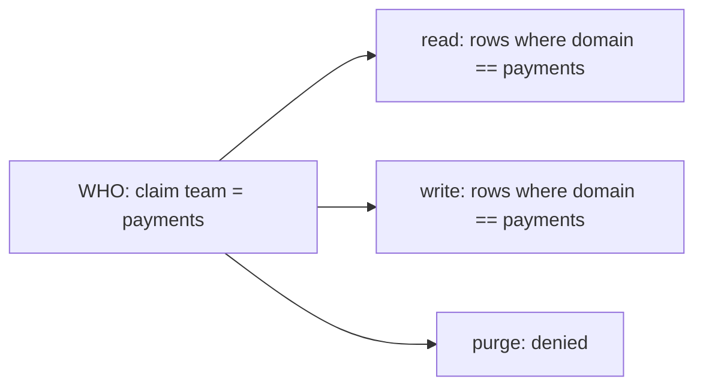
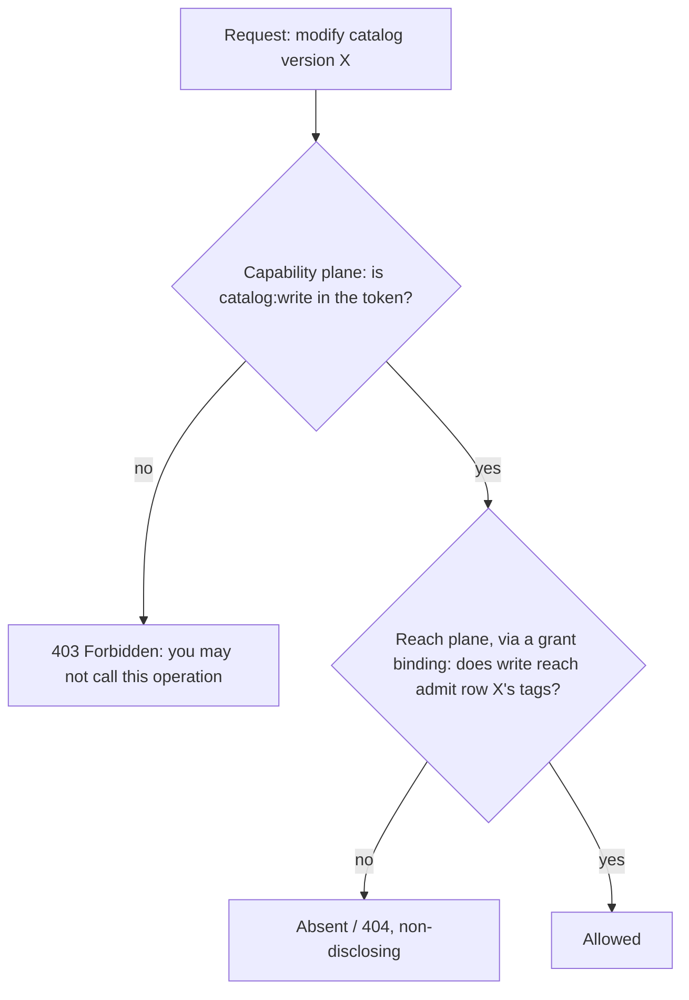

# The control-plane access model: capability versus reach

Every access decision in the control plane is **WHO can do WHAT, WHERE**. Two independent systems answer the
WHAT (capability) and the WHERE (reach), and both must pass. This spec is the overview and the operational
detail the ADRs and guides do not carry. The decisions are the access-model ADRs
([0001](../../adr/0001-two-plane-access-model.md) through
[0016](../../adr/0016-control-plane-security-mode.md)); the wiring walkthrough is the
[authentication and authorization guide](../../guides/auth-and-authorization.md); the exhaustive enforcement
detail is [`identity-and-authorization-design.md`](identity-and-authorization-design.md).

## Two planes

Capability and reach are two separate permission systems, and both must pass
([ADR 0001](../../adr/0001-two-plane-access-model.md)).

| | Capability (scopes) | Reach (grant bindings and rules) |
|---|---|---|
| Question it answers | Which operations may you call. | Which data rows may you touch. |
| Examples | `catalog:read`, `runs:write`, `security:write`. | Rows where `domain == payments`. |
| Granularity | Per resource type and operation. | Per row, matched on security tags (`domain`, `tenant`), across resource types. |
| Where it comes from | The caller's role, as token scopes. Issued by the IdP, configured by the deployment. Not authored in this UI. | Grants and rules, authored in the security UI. |
| Denied result | `403 Forbidden`. The operation exists but you may not call it (disclosing). | The row is absent (`404`). Non-disclosing: an out-of-reach row is indistinguishable from one that does not exist ([ADR 0004](../../adr/0004-fail-closed-non-disclosing-enforcement.md)). |

Capability is coarse and standing (it follows your job function); reach is finer and shifts with team membership
and per-request elevation. Keeping them separate is what lets two people who both hold `catalog:write` have
completely different row reach.

## What a grant binding is

A grant binding (the API calls it a **security binding**) is a **claim to reach** mapping: a caller carrying
claim `team = payments` gets, per verb, this much reach over the rows
([ADR 0002](../../adr/0002-grant-verbs-are-reach-not-scopes.md)).

- **WHO.** A claim (`claimType` / `claimValue`, for example `team = payments`), a group or role resolved through
  the grantee picker or a raw claim. A *person* is not granted here; per-person elevation goes through the
  access-request flow instead ([ADR 0014](../../adr/0014-direct-grant-versus-request-only.md)).
- **WHERE.** For each of `read`, `write`, and `purge`, a reach of an **empty grant** (shown as *Denied* in the
  UI, the code value `VerbGrantInfo.None`), **Unrestricted**, or scoped to one or more named **rules**. A rule is
  a reusable row-filter expression such as `domain == payments`.

The three verbs are the three levels of access to a row (read: see it; write: modify it; purge: hard-delete it),
and each gets its own row set because they genuinely vary: you might let the payments team read every payments
row, write a subset, and purge none. That is why a grant binding is three row sets, not scopes. Scopes answer a
different question ("which API may you invoke"), live in the token, and a grant binding never widens or narrows
one.

## How they compose

Both planes are checked, in order. To edit a catalog version a caller needs the scope `catalog:write` (may they
invoke the operation) **and** write reach over that specific row (does their reach admit it).

A worked example, a payments-team operator:

- **Token** (from their role): `catalog:read catalog:write runs:read runs:write`. No `environments:write`.
- **Grant**: `team = payments` gives read `domain == payments`, write `domain == payments`, purge denied.
- **Result**: they read and write catalog versions and runs, but only rows tagged `domain == payments`. They
  purge nothing, and cannot touch environments at all (a `403` decided before reach is even consulted). A
  `domain == finance` version is simply absent to them (`404`), never a `403`.

## Step outputs are a disclosure tier above run visibility

A run's recorded step **outputs** (its step journal, `GET /runs/{runId}/steps`) can carry the sensitive data the
workflow processed. Reading them is gated above reading a run's metadata
([ADR 0013](../../adr/0013-step-output-disclosure-tier.md)):

- **Baseline.** The journal demands the `runs:outputs:read` scope **in addition to** `runs:read` (ANDed). A
  reach-scoped observer who may see a run keeps its metadata but is refused the payloads (`403`), fail-closed for
  every run's outputs.
- **Per-version escalation.** A workflow administrator classifies a version `outputsSensitivity: sensitive`. A
  run of a sensitive version has its whole journal **redacted** for callers below the stronger grant (write
  reach on the run), so a read-only observer sees each step marked `redacted` while an operator reads it in full.
  The classification is read from the *current* version, so reclassifying retroactively protects existing runs.

Because the journal is a sensitive read, every read is **audited**: a `workflow.journal.read` span on the
`Corvus.Arazzo` activity source plus an audit-grade log naming who read which run's journal and the tier reached,
`full`, `redacted`, or `refused` (a refused probe is audited too). The signal is best-effort observability, zero
cost when no listener is attached ([ADR 0038](../../adr/0038-payload-safe-governance-audit.md)).

## Where scopes come from

Scopes do not live in the control plane and are not stored against an identity. They ride on the caller's
**token**, and the control plane only reads a claim. `AddArazzoControlPlaneAuthorization` registers one
authorization policy per scope; the default policy admits an authenticated principal carrying the scope value in
a `scope` claim (OAuth-style, space-delimited; the claim type is configurable via `scopeClaimType`). So the
control plane is agnostic to which identity provider authenticated the caller.

Putting the scopes into the token is the identity provider's and the deployment's job, done the standard OAuth
way, and this is where the per-provider variation lives:

- An IdP that issues OAuth scopes natively populates the `scope` claim directly.
- An IdP that issues roles or groups (EntraID app roles, Okta and Keycloak groups, LDAP groups) needs those
  mapped to control-plane scopes, either at the token layer (a claims transformation in the IdP or a gateway) or
  in the control plane's config (point `scopeClaimType` at the roles claim, or replace the per-scope policies).
  The control plane supplies the seam; the deployment fills in the provider-specific mapping.

**Not from the directory adapters.** The per-provider directory adapters (`IPrincipalDirectory`: LDAP, Keycloak,
EntraID, Okta, Google, SCIM) do not carry scopes. They resolve a grantee to its exact `sys:` identity, with
`sys:iss` for issuer-uniqueness ([ADR 0008](../../adr/0008-resolved-grantee-resolution.md)), which feeds the
*reach* plane. They answer "who is this", never "what may they do"; assuming scopes flow through them is a common
mix-up.

**The two planes and the security posture.** `ControlPlaneSecurityMode` is one required, defaultless choice of
the four meaningful postures ([ADR 0016](../../adr/0016-control-plane-security-mode.md)); it is not two
independent on/off flags (a reach-without-authentication posture is deliberately not offered):

| Mode | Capability (scopes) | Reach (row-security) |
|---|---|---|
| `Scoped` (production) | on | on |
| `ScopesOnly` | on | off (full `sys:` System reach) |
| `RowSecurityOnly` | off (any authenticated caller) | on |
| `Open` (development only) | off | off |

**One security consequence.** Because scopes arrive as a token claim, the control plane trusts the token's
issuer to assert them, so which identity providers you let assert scopes is a deployment trust decision. That is
the mirror image of the reach side, which issuer-qualifies identity (`sys:iss`) precisely because a bare `sub`
cannot be trusted across multiple semi-trusted providers.

## Authentication schemes and machine identities

Authentication is pluggable; the access model only needs the resulting principal to carry two things, a `scope`
claim (capability) and identity claims that resolve to a `sys:` identity (reach). Each operation declares one
required scope, shared across all schemes. The dividing line is whether the credential carries its own scopes.

- **Credentials that carry scopes: OAuth2 and OpenID Connect tokens, including client-credentials.** The token
  is the claims. A **service identity** is exactly this: a machine authenticates through client-credentials,
  receives a bearer token with its granted scopes and its client identity (`sub` / `client_id`), and the control
  plane reads it identically to an interactive user's token. Its `sys:` identity for reach resolves from the
  client identity through the same directory and shell path as any other principal.
- **Credentials that carry no scopes: client certificates, and by extension API keys.** The deployment maps the
  credential to scopes and identity out of band, then the same policies and reach resolution apply. Mutual TLS
  carries no scopes, so an authentication handler validates the certificate and a claims transformation attaches
  the `scope` claim and the identity. An API key is a bearer credential the deployment validates and maps to its
  `{ scopes, identity }` from a key store or config.

**Inbound authentication is not the source credentials.** The `apiKey`, `oauth2ClientCredentials`, `basic`,
`bearer`, and `mtls` kinds in the credential dialog are a different thing that shares the vocabulary: they are
how a workflow **run** authenticates outbound to the services it calls
([`source-credentials-design.md`](../credentials/source-credentials-design.md)), not how a caller authenticates
inbound to the control plane.

| | Inbound (caller to control plane) | Outbound (run to its sources) |
|---|---|---|
| What it is | How you authenticate to the management API. | How a run authenticates to the services it calls. |
| Produces | A principal: a `scope` claim and a `sys:` identity. | A secret the run presents downstream. |
| Gated by | The per-scope policies and row reach. | `usageGrantee` / `IsUsableBy` (which run identities may use the credential). |

mTLS is the odd one both directions: a connection-level identity that cannot carry fine-grained authorization,
so the deployment supplies the mapping on both sides. Outbound, an mTLS source credential authenticates at the
TLS handshake rather than per run, so it is forced Shared and cannot be usage-scoped.

## How a deployment wires it

Authentication is ordinary ASP.NET Core in the host's `Program.cs`; the deployment brings the scheme(s) and the
control plane consumes the principal. The demo host
(`samples/arazzo/Corvus.Text.Json.Arazzo.ControlPlane.Demo`) is the worked example, and the
[authentication and authorization guide](../../guides/auth-and-authorization.md) is the walkthrough. The shape:
`AddAuthentication` with one scheme per credential type behind a forwarding policy scheme; an optional
`IClaimsTransformation` mapping an IdP's roles or groups into the `scope` claim and the `sys:` identity;
`AddArazzoControlPlaneAuthorization(scopeClaimType)` (one policy per scope); and
`MapArazzoControlPlane(..., ControlPlaneSecurityMode.Scoped, policy, ...)`.

The control plane also installs `ControlPlaneEntitlementClaimsTransformer`, which unions a principal's stored
entitlement scopes (a capability grant an access-request approval wrote) into the `scope` claim at
authentication time ([ADR 0005](../../adr/0005-entitlement-scopes-union-into-claims.md)), so an approval takes
effect without the identity provider ever being mutated.

### Storing an API key (or any non-token credential) in production

The demo keeps raw keys in an in-memory dictionary and emits only a `scope` claim. A real implementation changes
only that handler and hardens it:

- **Store a hash, never the raw key.** Give each key a public **prefix** plus a random secret; store
  `prefix -> record` for an indexed lookup, then constant-time compare the hash of the presented key. Show the
  full key once, at creation. The record holds `{ prefix, keyHash, subject, issuer, scopes?, expiresAt, disabled,
  createdBy, createdAt, lastUsedAt }` in a durable store, a first-class resource with its own audit (in the same
  spirit as source credentials).
- **Prefer identity plus the entitlement store over scopes on the key.** Map the key to a service-principal
  identity (`sub` plus `sys:iss`) and emit only those identity claims; the entitlement transformer then supplies
  the scopes from the same grant and approval store every other principal uses. Scope changes flow through the
  standard grant flow rather than by editing key records, and the service principal gets a real `sys:` identity
  so reach works for it too. (A fixed scope set on the record is the simpler alternative for a single-capability
  key.)
- **Lifecycle.** Cache the lookup on the warm path with a short TTL and invalidate on revoke; rotate by issuing a
  new key, honouring both briefly, then disabling the old; record `lastUsedAt` and expire via `expiresAt` and
  `disabled`.

## Where reach is authored

Reach (grant bindings and rules) is authored in the security UI: grant bindings bind a claim to per-verb reach,
and rules are the reusable WHERE vocabulary a grant binding points at. See the
[security UI design](../web/security-ui-design.md) and the
[UX component catalog](../../guides/ux-component-catalog.md#security-and-access).
