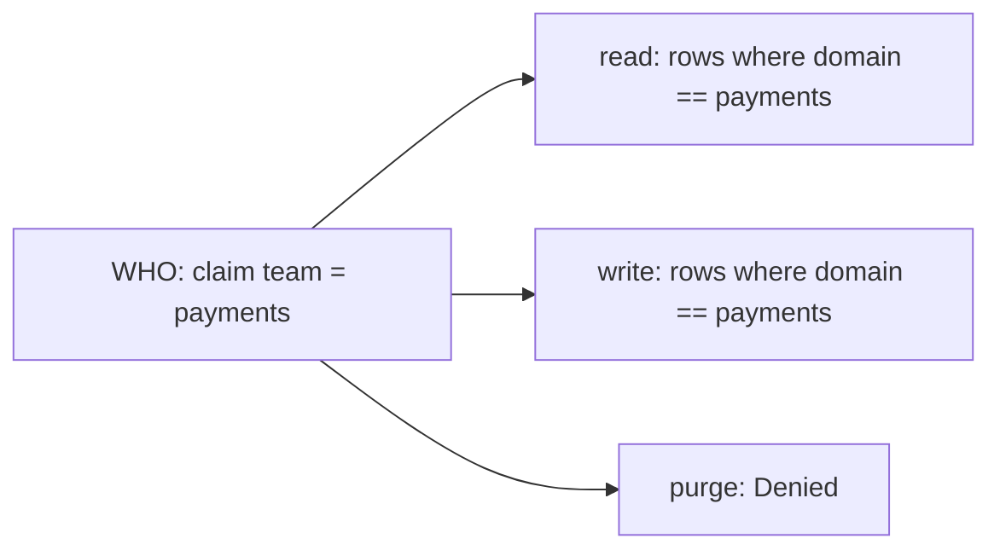
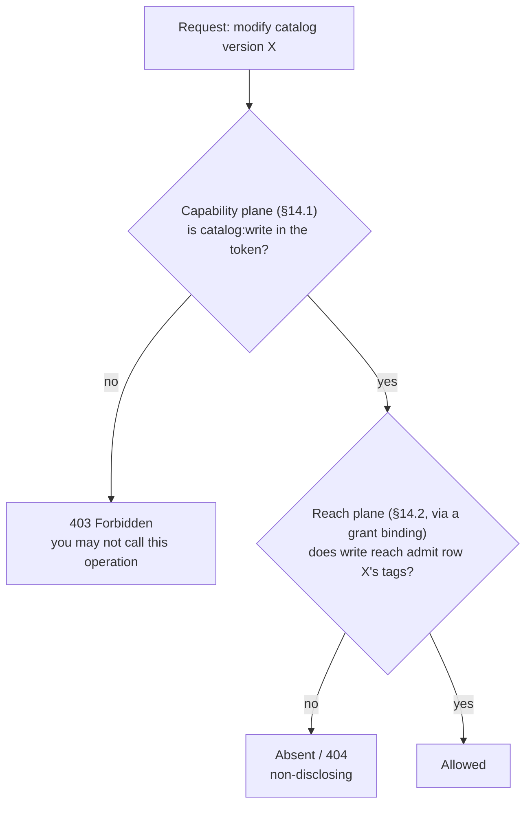

# The control-plane access model: capability vs reach

Every access decision in the control plane is **WHO can do WHAT, WHERE**. Two independent systems
answer the WHAT and the WHERE, and they are easy to conflate. A **grant binding** configures only one of
them (the WHERE). This note exists because the `read` / `write` / `purge` verbs on a grant binding are a
recurring source of confusion: they look like they should be scopes, and they are not.

## Two planes

There are two separate permission systems. Both must pass for an action to succeed.

| | Capability (scopes) | Reach (grant bindings + rules) |
|---|---|---|
| Question it answers | Which operations may you call. | Which data rows may you touch. |
| Examples | `catalog:read`, `runs:write`, `security:write`. | Rows where `domain == payments`. |
| Granularity | Per resource type and operation. | Per row, matched on security tags (`domain`, `tenant`, ...), across resource types. |
| Where it comes from | The caller's role, as token scopes (§14.1). Issued by the IdP, configured by the deployment. Not authored in this UI. | Grants and rules (§14.2). Authored in the security UI. |
| Denied result | `403 Forbidden`. The operation exists but you may not call it. Disclosing. | The row is absent (`404`). Non-disclosing: an out-of-reach row is indistinguishable from one that does not exist. |

Capability is coarse and standing. It follows your job function, such as a payments operator or a
platform administrator. Reach is finer and shifts with team membership and per-request elevation.
Keeping them separate is what lets two people who both hold `catalog:write` have completely
different row reach.

## What a grant binding is

A grant binding (the API calls it a **security binding**, §14.2) is a **claim to reach** mapping. In one
sentence: a caller carrying claim `team = payments` gets, per verb, this much reach over the rows.

Each verb's reach is one of `Denied`, `Unrestricted`, or scoped to one or more rules.

It has two parts:

- **WHO.** A claim (`claimType` / `claimValue`, for example `team = payments`). A group or role,
  resolved through the grantee picker, or a raw claim. A *person* is not granted here; per-person
  elevation goes through the access-request flow instead.
- **WHERE.** For each of `read`, `write` and `purge`, a reach setting of `Denied`, `Unrestricted`,
  or scoped to one or more named **rules**. A rule is a reusable row-filter expression such as
  `domain == payments`.

So a grant binding is `claim -> { read: <rows>, write: <rows>, purge: <rows> }`. The verb is the key; the
value is the set of rows that verb may touch.

## Why read / write / purge, and not scopes

The three verbs are the three levels of access to a data **row**.

- `read`: see the row.
- `write`: modify the row.
- `purge`: hard-delete the row.

Each gets its own row set because they genuinely vary. You might let the payments team read every
payments row, write a subset of them, and purge none. That independence is the point of reach, and
it is why a grant binding is expressed as three row sets rather than as scopes.

Scopes (`catalog:read`, `runs:write`, ...) answer a different question, "which API may you invoke",
and they live in the caller's token, not in a grant binding. A grant binding never widens or narrows a scope. If
you go looking for `catalog:write`-style entries on a grant binding you will not find them, because that
plane is configured upstream in the IdP and the role mapping, not here.

## How they compose

Both planes are checked, in order. To edit a catalog version a caller needs the scope `catalog:write`
(may they invoke the update operation at all) **and** write reach over that specific row (does their
reach admit it).

A worked example, a payments-team operator:

- **Token** (from their role): `catalog:read catalog:write runs:read runs:write`. No `environments:write`.
- **Grant**: `team = payments` gives read `domain == payments`, write `domain == payments`, purge `Denied`.
- **Result**: they read and write catalog versions and runs, but only rows tagged `domain == payments`.
  They purge nothing. They cannot touch environments at all, because they lack `environments:write`,
  which is a `403` decided before reach is even consulted. A `domain == finance` version is simply
  absent to them (`404`), never a `403`.

## Where scopes come from

Scopes do not live in the control plane, and they are not stored against an identity. They ride on the
caller's **token**, and the control plane only reads a claim. `AddArazzoControlPlaneAuthorization`
registers one authorization policy per scope; the default policy admits an authenticated principal
that carries the scope value in a `scope` claim (OAuth-style, space-delimited, and the claim type is
configurable via `scopeClaimType`). So the control plane is agnostic to which identity provider
authenticated the caller. Whatever issued the token, the token carries the scopes, and the policy
checks them.

Putting the scopes into the token is the identity provider's and the deployment's job, done the
standard OAuth way. This is where the per-provider variation lives.

- An IdP that issues OAuth scopes natively populates the `scope` claim directly.
- An IdP that issues roles or groups (EntraID app roles, Okta and Keycloak groups, LDAP groups) needs
  those mapped to control-plane scopes. The deployment does that mapping either at the token layer (a
  claims transformation in the IdP or an API gateway that emits a `scope` claim), or in the control
  plane's authorization config (point `scopeClaimType` at the roles claim, or replace the per-scope
  policies with ones that translate that provider's roles). The control plane supplies the seam; the
  deployment fills in the provider-specific mapping.

### Not from the directory adapters

The per-provider **directory adapters** (`IPrincipalDirectory`: LDAP, Keycloak, EntraID, Okta, Google,
SCIM) do not carry scopes. They resolve a grantee (person, team, role) to its exact `sys:` identity,
with `sys:iss` for issuer-uniqueness (§16.5.4). That feeds the reach plane: the grantee picker, grant
authoring, and row-security. It answers "who is this", never "what may they do". Seeing those
per-provider adapters and assuming scopes flow through them is the common mix-up; they feed the WHERE
plane, not the WHAT.

### The two planes are independent axes

`ControlPlaneSecurityMode` turns each plane on or off on its own.

| Mode | Capability (scopes) | Reach (row-security) |
|---|---|---|
| `Scoped` (production) | on | on |
| `ScopesOnly` | on | off (full `sys:` System reach) |
| `RowSecurityOnly` | off (any authenticated caller) | on |
| `Open` (development only) | off | off |

### One security consequence

Because scopes arrive as a token claim, the control plane trusts the token's issuer to assert them.
Which identity providers you let assert scopes is therefore a deployment trust decision. That is the
mirror image of the reach side, which goes to the trouble of issuer-qualifying identity (`sys:iss`)
precisely because a bare `sub` cannot be trusted across multiple semi-trusted providers.

## Authentication schemes and machine identities

Everything above assumes an authenticated caller. Authentication is pluggable, and the access model
only ever needs the resulting principal to carry two things: a `scope` claim (capability) and identity
claims that resolve to a `sys:` identity (reach). Each operation declares one required scope, shared
across all of the authentication schemes. The schemes differ only in how they produce those two things.

The dividing line is whether the credential carries its own scopes.

**Credentials that carry scopes: OAuth2 and OpenID Connect tokens, including client-credentials.** The
token is the claims. It carries the `scope` claim and the identity claims directly. A **service
identity** is exactly this. A machine authenticates through the client-credentials flow, receives a
bearer token with its granted scopes and its client identity (`sub` / `client_id`), and the control
plane reads it identically to an interactive user's token. Its `sys:` identity for reach is resolved
from that client identity through the same directory and shell path as any other principal.

**Credentials that carry no scopes: client certificates, and by extension API keys.** A certificate
proves identity but has no OAuth scope claim. The deployment maps the credential to scopes and identity
out of band, and then the same policies and reach resolution apply.

- **Certificate auth (mTLS).** Mutual TLS carries no scopes, so the host maps the certificate identity
  to a tier out of band. An authentication handler validates the certificate, then a claims
  transformation attaches the `scope` claim and the identity from the certificate's subject or
  thumbprint.
- **API keys.** A key is a bearer credential with no inherent scopes. The deployment validates the key
  and maps it to its `{ scopes, identity }` from a key store or config, producing the same claims the
  policies read.

Some credentials arrive with scopes and some do not. For the ones that do not, the deployment supplies
the mapping, exactly as it maps roles to scopes for an IdP that issues roles rather than scopes.

### Inbound authentication is not the source credentials (§13)

The `apiKey`, `oauth2ClientCredentials`, `basic`, `bearer` and `mtls` kinds in the credential dialog
are a different thing that happens to share the vocabulary. They are how a workflow **run**
authenticates outbound to the OpenAPI and AsyncAPI services it calls, not how a caller authenticates
inbound to the control plane.

| | Inbound (caller to control plane) | Outbound (run to its sources, §13) |
|---|---|---|
| What it is | How you authenticate to the management API. | How a run authenticates to the services it calls. |
| Produces | A principal, so a `scope` claim and a `sys:` identity. | A secret the run presents downstream. |
| Gated by | The per-scope policies and row reach. | `usageGrantee` / `IsUsableBy` (which run identities may use the credential). |

### mTLS is the odd one in both directions

A certificate is a connection-level identity that cannot carry fine-grained authorization, so the
deployment supplies that mapping on both sides. Inbound, an mTLS caller carries no scopes, so the host
maps the certificate to a tier. Outbound, an mTLS source credential authenticates the deployment to the
source at the TLS handshake rather than an individual run, so it is forced Shared and cannot be
usage-scoped.

## How a deployment wires it

Authentication is ordinary ASP.NET Core, in the host's `Program.cs`. The deployment brings the scheme
or schemes; the control plane consumes the resulting principal. The demo host
(`samples/arazzo/Corvus.Text.Json.Arazzo.ControlPlane.Demo`) wires all of it and is the worked example.
The shape is:

1. **Authentication.** `AddAuthentication(...)` with one scheme per credential type, and a policy
   scheme that forwards each request to the right one by what it presents (an `X-Api-Key` header to the
   API-key scheme, a `Bearer` token to JWT, otherwise the browser cookie session). A token scheme
   (`AddKeycloakJwtBearer`, `AddJwtBearer`) surfaces the token's `scope` claim automatically. A
   credential that carries no scopes maps to claims in its handler. The demo's
   `DevApiKeyAuthenticationHandler` looks the key up and emits a `scope` claim, and a certificate
   scheme (`AddCertificate`) does the same keyed on the certificate.
2. **Per-provider claim mapping (optional).** An `IClaimsTransformation` for an IdP that issues roles
   or groups rather than scopes, mapping them into the `scope` claim and the `sys:` identity.
3. **Scope authorization.** `AddArazzoControlPlaneAuthorization(scopeClaimType)` registers one policy
   per scope.
4. **Endpoint mapping.** `MapArazzoControlPlane(..., ControlPlaneSecurityMode.Scoped, policy, ...)`,
   passing the row-security or entitlement policy for reach.

The control plane also installs `ControlPlaneEntitlementClaimsTransformer`, which unions a principal's
stored entitlement scopes (a capability grant an access-request approval wrote, §16.5) into the `scope`
claim at authentication time. Capability is therefore resolved from claims union stored entitlements,
so an approval takes effect without the identity provider ever being mutated.

### Storing an API key (or any non-token credential) in production

The demo keeps raw keys in an in-memory dictionary and emits only a `scope` claim. A real
implementation changes only this handler, and hardens it in three ways.

- **Store a hash, never the raw key.** Treat the key as a secret. Give each key a public **prefix** (a
  short identifier) plus a random secret; store `prefix -> record` for an indexed lookup, then
  constant-time compare the hash of the presented key. Show the full key once, at creation. The record
  holds `{ prefix, keyHash, subject, issuer, scopes?, expiresAt, disabled, createdBy, createdAt,
  lastUsedAt }`, in a durable store (a first-class resource with its own audit, in the same spirit as
  source credentials, §13).
- **Prefer identity plus the entitlement store over scopes on the key.** Two patterns:
  - *Scopes on the key.* The record carries a fixed scope set; the handler emits `scope` from it.
    Simple, and fine for a key with one fixed capability.
  - *Identity, scopes from the store (recommended).* The record maps the key to a service-principal
    identity (`sub` plus `sys:iss`); the handler emits only those identity claims, and the built-in
    entitlement transformer supplies the scopes from the same grant and approval store every other
    principal uses. The key becomes purely an authentication credential, scope changes flow through the
    standard grant flow rather than by editing key records, and the service principal gets a real
    `sys:` identity so reach works for it too. The demo's key, which carries no identity, has no reach.
- **Lifecycle.** Cache the lookup on the per-request warm path with a short TTL and invalidate on
  revoke. Rotate by issuing a new key, honouring both briefly, then disabling the old. Record
  `lastUsedAt` for audit; expire and revoke via `expiresAt` and `disabled`.

## Where reach is authored

Reach (grant bindings and rules) is authored in the security UI. Grant bindings bind a claim to per-verb reach; rules
are the reusable WHERE vocabulary a grant binding points at. See the grants and rules panels, and the access
overview, in [`security-ui-design.md`](./security-ui-design.md).
