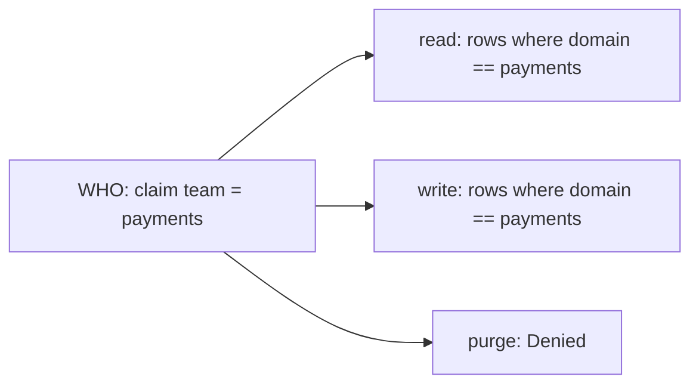

# The control-plane access model: capability vs reach

Every access decision in the control plane is **WHO can do WHAT, WHERE**. Two independent systems
answer the WHAT and the WHERE, and they are easy to conflate. A **grant** configures only one of
them (the WHERE). This note exists because the `read` / `write` / `purge` verbs on a grant are a
recurring source of confusion: they look like they should be scopes, and they are not.

## Two planes

There are two separate permission systems. Both must pass for an action to succeed.

| | Capability (scopes) | Reach (grants + rules) |
|---|---|---|
| Question it answers | Which operations may you call. | Which data rows may you touch. |
| Examples | `catalog:read`, `runs:write`, `security:write`. | Rows where `domain == payments`. |
| Granularity | Per resource type and operation. | Per row, matched on security tags (`domain`, `tenant`, ...), across resource types. |
| Where it comes from | The caller's role, as token scopes (§14.1). Issued by the IdP, configured by the deployment. Not authored in this UI. | Grants and rules (§14.2). Authored in the security UI. |
| Denied result | `403 Forbidden`. The operation exists but you may not call it. Disclosing. | The row is absent (`404`). Non-disclosing: an out-of-reach row is indistinguishable from one that does not exist. |

Capability is coarse and standing. It follows your job function, such as a payments operator or a
platform administrator. Reach is finer and shifts with team membership and per-request elevation.
Keeping them separate is what lets two people who both hold `catalog:write` have completely
different row reach.

## What a grant is

A grant (the API calls it a **security binding**, §14.2) is a **claim to reach** mapping. In one
sentence: a caller carrying claim `team = payments` gets, per verb, this much reach over the rows.

Each verb's reach is one of `Denied`, `Unrestricted`, or scoped to one or more rules.

It has two parts:

- **WHO.** A claim (`claimType` / `claimValue`, for example `team = payments`). A group or role,
  resolved through the grantee picker, or a raw claim. A *person* is not granted here; per-person
  elevation goes through the access-request flow instead.
- **WHERE.** For each of `read`, `write` and `purge`, a reach setting of `Denied`, `Unrestricted`,
  or scoped to one or more named **rules**. A rule is a reusable row-filter expression such as
  `domain == payments`.

So a grant is `claim -> { read: <rows>, write: <rows>, purge: <rows> }`. The verb is the key; the
value is the set of rows that verb may touch.

## Why read / write / purge, and not scopes

The three verbs are the three levels of access to a data **row**.

- `read`: see the row.
- `write`: modify the row.
- `purge`: hard-delete the row.

Each gets its own row set because they genuinely vary. You might let the payments team read every
payments row, write a subset of them, and purge none. That independence is the point of reach, and
it is why a grant is expressed as three row sets rather than as scopes.

Scopes (`catalog:read`, `runs:write`, ...) answer a different question, "which API may you invoke",
and they live in the caller's token, not in a grant. A grant never widens or narrows a scope. If
you go looking for `catalog:write`-style entries on a grant you will not find them, because that
plane is configured upstream in the IdP and the role mapping, not here.

## How they compose

Both planes are checked, in order. To edit a catalog version a caller needs the scope `catalog:write`
(may they invoke the update operation at all) **and** write reach over that specific row (does their
reach admit it).

A worked example, a payments-team operator:

- **Token** (from their role): `catalog:read catalog:write runs:read runs:write`. No `environments:write`.
- **Grant**: `team = payments` gives read `domain == payments`, write `domain == payments`, purge `Denied`.
- **Result**: they read and write catalog versions and runs, but only rows tagged `domain == payments`.
  They purge nothing. They cannot touch environments at all, because they lack `environments:write`,
  which is a `403` decided before reach is even consulted. A `domain == finance` version is simply
  absent to them (`404`), never a `403`.

## Where scopes come from

Scopes do not live in the control plane, and they are not stored against an identity. They ride on the
caller's **token**, and the control plane only reads a claim. `AddArazzoControlPlaneAuthorization`
registers one authorization policy per scope; the default policy admits an authenticated principal
that carries the scope value in a `scope` claim (OAuth-style, space-delimited, and the claim type is
configurable via `scopeClaimType`). So the control plane is agnostic to which identity provider
authenticated the caller. Whatever issued the token, the token carries the scopes, and the policy
checks them.

Putting the scopes into the token is the identity provider's and the deployment's job, done the
standard OAuth way. This is where the per-provider variation lives.

- An IdP that issues OAuth scopes natively populates the `scope` claim directly.
- An IdP that issues roles or groups (EntraID app roles, Okta and Keycloak groups, LDAP groups) needs
  those mapped to control-plane scopes. The deployment does that mapping either at the token layer (a
  claims transformation in the IdP or an API gateway that emits a `scope` claim), or in the control
  plane's authorization config (point `scopeClaimType` at the roles claim, or replace the per-scope
  policies with ones that translate that provider's roles). The control plane supplies the seam; the
  deployment fills in the provider-specific mapping.

### Not from the directory adapters

The per-provider **directory adapters** (`IPrincipalDirectory`: LDAP, Keycloak, EntraID, Okta, Google,
SCIM) do not carry scopes. They resolve a grantee (person, team, role) to its exact `sys:` identity,
with `sys:iss` for issuer-uniqueness (§16.5.4). That feeds the reach plane: the grantee picker, grant
authoring, and row-security. It answers "who is this", never "what may they do". Seeing those
per-provider adapters and assuming scopes flow through them is the common mix-up; they feed the WHERE
plane, not the WHAT.

### The two planes are independent axes

`ControlPlaneSecurityMode` turns each plane on or off on its own.

| Mode | Capability (scopes) | Reach (row-security) |
|---|---|---|
| `Scoped` (production) | on | on |
| `ScopesOnly` | on | off (full `sys:` System reach) |
| `RowSecurityOnly` | off (any authenticated caller) | on |
| `Open` (development only) | off | off |

### One security consequence

Because scopes arrive as a token claim, the control plane trusts the token's issuer to assert them.
Which identity providers you let assert scopes is therefore a deployment trust decision. That is the
mirror image of the reach side, which goes to the trouble of issuer-qualifying identity (`sys:iss`)
precisely because a bare `sub` cannot be trusted across multiple semi-trusted providers.

## Where reach is authored

Reach (grants and rules) is authored in the security UI. Grants bind a claim to per-verb reach; rules
are the reusable WHERE vocabulary a grant points at. See the grants and rules panels, and the access
overview, in [`security-ui-design.md`](./security-ui-design.md).
