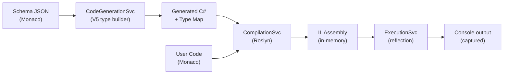

# Corvus.Text.Json Playground — Architecture Guide

A developer/copilot reference for the Blazor WebAssembly playground that lets users write JSON Schemas, generate strongly-typed C# code with Corvus.Text.Json, compile, and run — all in the browser.

## Project Structure

```
Corvus.Text.Json.Playground/
├── Components/
│   ├── MainLayout.razor        # Primary UI: toolbar, editors, console, panels
│   └── TypeMapPanel.razor      # Interactive type-map tree browser
├── Models/
│   ├── GenerationResult.cs     # Output from code generation
│   ├── SchemaFile.cs           # Schema file with dirty tracking
│   ├── TypeMapEntry.cs         # Type tree model (properties, composition, enums, tuples)
│   └── PlaygroundSample.cs     # Sample definition (schemas + user code)
├── Services/
│   ├── CodeGenerationService.cs  # JSON Schema → C# types + type map
│   ├── CompilationService.cs     # Roslyn CSharpCompilation → IL bytes
│   ├── ExecutionService.cs       # Load + run compiled assembly in WASM
│   ├── IntelliSenseService.cs    # Roslyn completions + signature help
│   ├── WorkspaceService.cs       # Assembly loading + compilation references
│   ├── SampleRegistry.cs         # Embedded sample discovery
│   ├── ProjectExporter.cs        # Save project as ZIP
│   ├── ProjectImporter.cs        # Load project from ZIP
│   └── DefaultCodeEmitter.cs     # Default user code template
├── Recipes/                      # Embedded example recipe resources
├── wwwroot/
│   ├── index.html                # Entry point (Monaco + Blazor bootstrap)
│   ├── css/app.css               # Theme system + all UI styling
│   └── js/playground-interop.js  # JS interop (completions, sig help, shortcuts)
├── Program.cs                    # Service registration
└── Corvus.Text.Json.Playground.csproj
```

## High-Level Data Flow



**Generate** parses JSON Schemas, builds `TypeDeclaration` trees, emits C# files, and builds a type map for the UI.
**Run** compiles generated + user code with Roslyn, then executes the entry point in a `CollectibleAssemblyLoadContext`.

## Service Lifetimes (Program.cs)

| Service                | Lifetime  | Why |
|------------------------|-----------|-----|
| `CodeGenerationService`| Singleton | Stateless wrapper around V5 codegen |
| `WorkspaceService`     | Scoped    | Caches loaded assembly references |
| `CompilationService`   | Scoped    | Uses `WorkspaceService` for references |
| `ExecutionService`     | Scoped    | Stateless executor |
| `IntelliSenseService`  | Scoped    | Maintains Roslyn `AdhocWorkspace` state |

---

## Code Generation Pipeline (CodeGenerationService)

The `GenerateAsync` method runs a 5-phase pipeline:

### Phase 1 — Schema Parsing & Registration

Each `SchemaFile` is parsed and registered with a `PrepopulatedDocumentResolver` under a playground URI (`schema://playground/{filename}`). If the schema has a `$id`, it's also registered under that URI, enabling `$ref` resolution across files.

### Phase 2 — Vocabulary Registration

All supported JSON Schema dialects are registered:
- Draft 2020-12, 2019-09, 7, 6, 4
- OpenAPI 3.0
- Corvus custom vocabulary

The default vocabulary is Draft 2020-12.

### Phase 3 — Type Declaration Building

`JsonSchemaTypeBuilder.AddTypeDeclarationsAsync()` builds a `TypeDeclaration` tree for each root schema. This tree represents the full type hierarchy including properties, composition (allOf/anyOf/oneOf), array items, tuples, enums, and const values.

### Phase 4 — C# Code Emission

The `CSharpLanguageProvider` generates C# source files from the type declarations. Key options:
- **Root namespace**: `"Playground"`
- **Named types**: Schema files with explicit `TypeName` get that name
- **Explicit usings**: Generated files include their own `using` statements
- **Implicit string operator**: Enabled
- **Format assertions**: Always enforced

### Phase 5 — Type Map Building

`CollectTypeMapEntries` recursively walks the `TypeDeclaration` tree and builds `TypeMapEntry` objects for the UI. It only includes types that have a corresponding `GeneratedCodeFile`. For each type it extracts:

- **Properties** via `PropertyDeclarations` — includes JSON name, .NET name, type, required/composed flags
- **Composition groups** via `AllOfCompositionTypes()`, `AnyOfCompositionTypes()`, `OneOfCompositionTypes()`
- **Array items** via `ArrayItemsType()` — the `items` schema type
- **Pure tuple items** via `TupleType()` — only when `IsTuple()` is true (no additional items allowed)
- **Prefix items** via `ExplicitTupleType() ?? ImplicitTupleType()` — when `IsTuple()` is false but prefixItems exist
- **Enum values** via `AnyOfConstantValues()` — heterogeneous enum support
- **Const values** via `ExplicitSingleConstantValue()`

**Kind inference** (`InferKind`) priority: const → enum → object → array/tuple/tensor → string → integer → number → boolean → null → unknown.

The recursion visits: property types, array item types, tuple/prefix item types, and composition member types.

---

## Compilation (CompilationService + WorkspaceService)

### Assembly Loading

`WorkspaceService.EnsureInitializedAsync()` loads .NET assemblies from the WASM `_framework/` directory via HTTP. It:

1. Fetches `_framework/asset-manifest.json` to resolve fingerprinted file paths
2. Downloads each required assembly DLL (System.Runtime, System.Text.Json, Corvus.Text.Json, NodaTime, etc.)
3. Validates PE headers (`MZ` magic bytes)
4. Creates `MetadataReference` objects for Roslyn

Loading is lazy (first compilation) and protected by a `SemaphoreSlim` against concurrent calls.

### Compilation Creation

`WorkspaceService.CreateCompilation()` builds a `CSharpCompilation` with:
- Global usings as a separate syntax tree (`System`, `System.Collections.Generic`, `System.Linq`, `Corvus.Text.Json`)
- Generated code files as individual syntax trees
- User code as `Program.cs`
- Parse options: `LanguageVersion.Latest` with preprocessor symbols (`NET`, `NET10_0`, etc.)
- Output: `ConsoleApplication`, `Release` optimization

### Compilation Flow

`CompilationService.CompileAsync()`:
1. Calls `EnsureInitializedAsync()` to load assemblies
2. Creates `CSharpCompilation` via `WorkspaceService.CreateCompilation()`
3. Calls `compilation.Emit()` to produce IL bytes in a `MemoryStream`
4. Returns `CompilationResult` with success/failure, assembly bytes, and diagnostics

---

## Execution (ExecutionService)

Runs compiled IL on a background thread:

1. **Redirect** `Console.Out` and `Console.Error` to a `StringWriter`
2. **Load** assembly into a `CollectibleAssemblyLoadContext` (allows `Unload()` for memory cleanup)
3. **Find** the entry point (`assembly.EntryPoint`)
4. **Invoke** it via reflection — handles both `void Main()` and `async Task Main()`
5. **Capture** output and restore original console writers in `finally`
6. **Unload** the assembly context to free memory

Supports `CancellationToken` for user-initiated cancellation.

---

## IntelliSense (IntelliSenseService)

### Architecture

Maintains an `AdhocWorkspace` with a Roslyn project containing:
- Generated code files as separate documents
- User code prepended with global usings as `Program.cs`

The workspace is rebuilt when `UpdateGeneratedCode()` is called (after each generation). Between rebuilds, only the user code document text is updated.

### Cursor Position Mapping

The user's Monaco editor shows only their code, but the Roslyn document includes global usings as a prefix. `GetUserCodeStartLine()` finds where user code begins in the combined document, and cursor positions are mapped: `absoluteLine = userCodeStartLine + editorLine - 1`.

### Completions

Uses Roslyn's `CompletionService.GetCompletionsAsync()`. Results are mapped to Monaco `CompletionItem` objects with kind mapping (Roslyn tags → Monaco `CompletionItemKind` integers). Capped at 100 items.

### Signature Help

Since Roslyn's `SignatureHelpService` is internal, signature help is implemented via the **semantic model**:

1. Walk the syntax tree upward from the cursor to find an `ArgumentListSyntax`
2. Count comma separators before the cursor to determine the active parameter
3. Get method symbols via `SemanticModel.GetSymbolInfo()` and `GetMemberGroup()`
4. For `new Foo(...)`, get constructors from the `INamedTypeSymbol`
5. Map `IMethodSymbol` parameters to Monaco `SignatureHelp` model

### JS Integration

Both providers are registered via `playground-interop.js`:
- `registerCSharpCompletionProvider` — triggers on `.`
- `registerCSharpSignatureHelpProvider` — triggers on `(` and `,`

Both call back to `[JSInvokable]` methods (`GetCompletionsForJs`, `GetSignatureHelpForJs`) on `MainLayout`.

---

## Live Diagnostics

User code changes trigger debounced (800ms) Roslyn compilation via a `System.Threading.Timer`. When the timer fires:

1. Read current user code from the Monaco editor
2. Compile with `CompilationService.CompileAsync()` using the last generation result
3. Map diagnostics to Monaco markers via `SetEditorMarkers()`

A `CancellationTokenSource` cancels stale compilations when new keystrokes arrive. Diagnostics only run when generated code exists.

---

## MainLayout.razor — UI Component

### Panel Layout

A CSS Grid with four panels:
- **Schema Editor** (top-left) — Monaco JSON editor with multi-tab schema files
- **User Code Editor** (top-right) — Monaco C# editor
- **Type Map** (bottom-left) — `TypeMapPanel` component
- **Console** (bottom-right) — output log with styled progress/error/success lines

Each panel has a maximize button. The toolbar sits above; the status bar below.

### Toolbar

`<h1>` | Sample dropdown | 📄 New | 💾 Save | 📂 Open | spacer | 🖥️/☀️/🌙 Theme | Generate | ▶ Run

### Key State

| Field | Purpose |
|-------|---------|
| `schemaFiles` | List of `SchemaFile` objects (content, name, isRootType, typeName) |
| `activeSchemaIndex` | Currently visible schema tab |
| `activeSampleId` | ID of loaded sample, or `null` for custom project |
| `generationResult` | Last successful `GenerationResult` (files + type map) |
| `isGenerating` / `isRunning` | Disables buttons, shows spinner |
| `consoleLines` | Log entries with CSS class |
| `themePreference` | `"auto"`, `"light"`, or `"dark"` |

### Auto-Save

State is saved to `localStorage` (`playground-state`) with a 2-second debounce after any change. Saved state includes: `activeSampleId`, `schemaFiles`, `activeSchemaIndex`, `userCode`. Restored in `OnInitializedAsync` before first render.

When the user edits schema or user code, `DetachFromSample()` sets `activeSampleId = null`, and the dropdown shows "— Custom project —".

### Dirty Tracking

`SchemaFile.IsDirty` compares current content against `CleanContent`. User code compares against `userCodeCleanContent`. `CheckDirtyAndConfirm()` shows a modal listing dirty files before destructive actions (sample switch, new project, load).

### Keyboard Shortcuts

- **F5** — Run (registered via `registerPlaygroundShortcuts` JS interop)

### Theme System

Three modes: auto (follows system), light, dark. Stored in `localStorage` (`playground-theme`). An anti-flash `<script>` in `index.html` applies the theme before Blazor loads. `applyTheme()` in JS retries Monaco `setTheme` if the editor hasn't loaded yet.

---

## Monaco Editor Initialization (index.html)

**Critical script loading order** — changing this breaks things:

1. `loader.js` — AMD module loader for Monaco
2. `require.config()` + `require(['vs/editor/editor.main'])` — loads Monaco, resolves `monacoReady` promise
3. `jsInterop.js` — **clobbers** the AMD `require` function (sets `var require = { paths: ... }`) — must load AFTER the `require()` call above
4. `playground-interop.js` — completion/signature providers, theme functions, shortcuts
5. `blazor.webassembly.js` with `autostart="false"` — Blazor start is deferred
6. `monacoReady.then(() => Blazor.start())` — ensures Monaco is fully loaded before Blazor renders editors

Without this ordering, BlazorMonaco's `create()` silently fails because `typeof monaco === 'undefined'`.

---

## Type Map Panel (TypeMapPanel.razor)

### Tree Structure

Each `TypeMapEntry` renders as a collapsible tree node. Children include:
- **Composition groups** (allOf/anyOf/oneOf) with member types and const values
- **Enum values** as individual leaf entries
- **Tuple items** (pure tuples) under "prefixItems" heading with `Item1`, `Item2` labels
- **Prefix items** (non-pure tuples) under "prefixItems" heading with `[0]`, `[1]` labels
- **Array item type** under "items" heading
- **Properties** with name, type, required badge, and composed indicator

### Interactivity

- **Click a type** → highlights in tree, navigates schema editor to its JSON Pointer location
- **Click a property/tuple item/array item** → highlights the referenced type and navigates schema
- **Expand/collapse** via chevron toggles; auto-expands on selection
- **Search filter** matches against type names, kinds, properties, composition members, enum values, tuple/prefix items

### Schema Navigation Callback

`OnSchemaPointerSelected` receives a `SchemaNavigation(Pointer, SchemaName)`. It switches to the correct schema tab if needed, then finds the line matching the JSON Pointer via `FindLineForJsonPointer()` (walks the JSON text matching pointer segments to key positions).

---

## Sample Registry (SampleRegistry)

Samples are embedded as assembly resources from the `Recipes/` directory. Each recipe has:
- A number prefix for ordering (e.g., `001`)
- A directory suffix (e.g., `DataObject`)
- A display name (e.g., `"Data Object"`)
- Optional type name overrides per schema file

`LoadAll()` discovers resources by naming convention (`Corvus.Text.Json.Playground.Recipes._001_DataObject.*`), loads schema JSON files and `Program.cs`, transforms the `using` directives (recipe namespace → `Playground`), and returns `PlaygroundSample` objects.

---

## CSS Theme System (app.css)

Three theme blocks define ~65+ CSS custom properties:
1. `[data-theme="dark"]` — dark theme (VS Code dark inspired)
2. `[data-theme="light"]` — light theme
3. `@media (prefers-color-scheme: light)` with `[data-theme="auto"]` — follows system

Key variable groups: `--bg-*`, `--fg-*`, `--border-*`, `--editor-*`, `--status-bar-*`, `--console-*`, `--type-map-*`, `--modal-*`.

Console output uses `--console-error` (red), `--console-info` (blue), `--console-success` (green). Build progress lines use `console-progress` class (italic, info color).

The status bar spinner is a CSS-only rotating border animation (`@keyframes spin`).

---

## Package References (.csproj)

| Package | Purpose |
|---------|---------|
| `BlazorMonaco` | Monaco editor Blazor wrapper |
| `Microsoft.CodeAnalysis.CSharp` | Roslyn compilation |
| `Microsoft.CodeAnalysis.CSharp.Features` | Completion service |
| `Microsoft.CodeAnalysis.Features` | Feature infrastructure |
| `Corvus.Json.CodeGeneration.*` | V5 JSON Schema type generation (multiple dialect packages) |
| `Corvus.Json.ExtendedTypes` | Runtime types for generated code |

**Special build settings:**
- `PublishTrimmed=true` — reduces WASM download size
- `TrimmerRootAssembly` entries for CodeAnalysis assemblies — prevents trimmer from removing Roslyn features
- Example recipes included via `<EmbeddedResource Include="Recipes/**/*" />`
